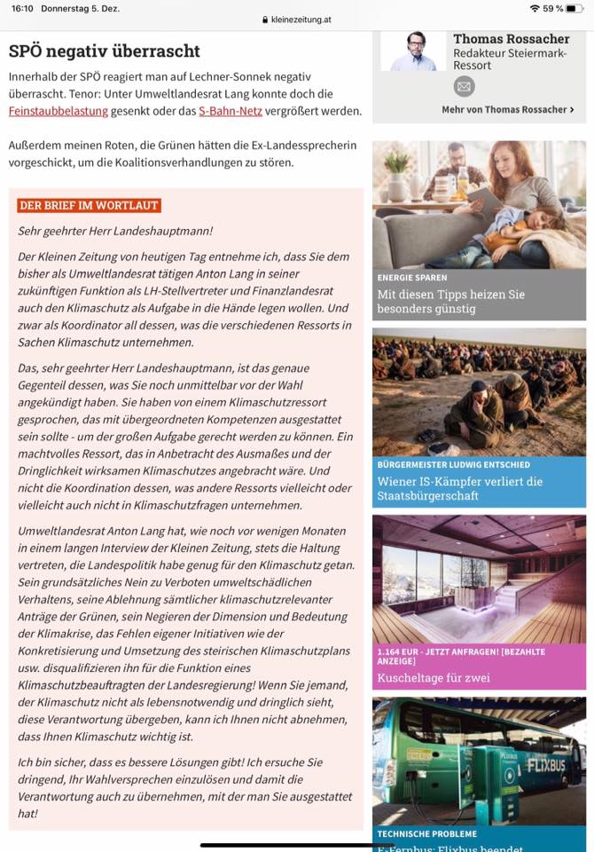
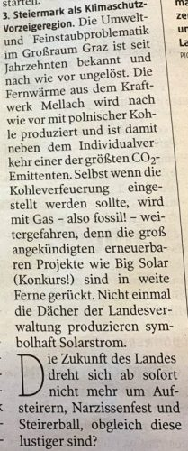

Ich sammele hier Material zu Klimakrise und Klimapolitik in der Steiermark und in Graz. Ein Schwerpunkt sind Rolle und Einfluss der fossilen Energiewirtschaft.

Form und Inhalt werden sich möglicherweise schnell verändern. Alte Versionen sind auf Github [hier](https://github.com/heinzwittenbrink/klimakrise-steiermark/blob/master/lof-page.md "Markdown-Quelltext dieser Seite") nachvollziehbar.

## Meldungen

### Offener Brief von Ingrid Lechner-Sonnek zur Wiederbestellung von Anton Lang zum Umweltlandesrat (5.1.2.2019)

\[caption id="attachment\_9959" align="alignleft" width="670"\] Offener Brief von Ingrid Lechner-Sonnek zur Wiederbestellung von Anton Lang zum Umweltlandesrat\[/caption\]

### Herbert Paierl zur Klimapolitik und zum Kohlekraftwerk Mellach, 29. November 2019

[Gastkommentar: "Budgetär ist die Steiermark ein Sanierungsfall" « kleinezeitung.at](https://www.kleinezeitung.at/steiermark/landespolitik/landtagswahl/5731783/Gastkommentar_Budgetaer-ist-die-Steiermark-ein-Sanierungsfall)

\[caption id="attachment\_9965" align="alignleft" width="209"\] Herbert Paierl zu Mellach, 29. November 2019\[/caption\]

### Stellungnahme von Herbert Paierl zum Klima-Aktionsplan der Landesregierung, 13. August 2019

[Ex-Landesrat Paierl beklagt "mutlose steirische Klimapolitik"](https://www.derstandard.at/story/2000107336083/ex-landesrat-paierl-klagt-mutlose-steirische-klimapolitik)

## Politische und administrative Dokumente

KlimawandelanpassungStrategie Steiermark 2050 [http://www.umwelt.steiermark.at/cms/dokumente/11919303\_125052026/76863340/2017-10-20%20KWA-Strategie%20Steiermark%202050%20%28Web%29.pdf](http://www.umwelt.steiermark.at/cms/dokumente/11919303_125052026/76863340/2017-10-20%20KWA-Strategie%20Steiermark%202050%20%28Web%29.pdf)

Herausgeber: Amt der Steiermärkischen Landesregierung Fachabteilung Energie und Wohnbau (FAEW)

Graz, im September 2015 Aktualisiert im Oktober 2017

## Forschung zur Klimakrise in der Steiermark

Präsentation von [Gottfried Kirchengast](https://homepage.uni-graz.at/de/gottfried.kirchengast/): **Landwirtschaft im Klimawandel – unter welchenklimatischen Voraussetzungen werden wir in Zukunft im südoststeirischen Raum produzieren?** (16.2.2018) [https://klimarisiko.at/wp-content/uploads/2018/03/Landwirtschaft\_im\_Klimawandel\_Kirchengast.pdf](https://klimarisiko.at/wp-content/uploads/2018/03/Landwirtschaft_im_Klimawandel_Kirchengast.pdf)

## Fossile Energiewirtschaft, Hochschulen und angewandte Forschung

[Montanuniversität Leoben » Petroleum Engineering](https://www.unileoben.ac.at/de/2889/)
