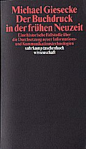

Ich lese im Augenblick Michael Gieseckes [Der Buchdruck in der frühen Neuzeit](http://www.suhrkamp.de/titel/titel.cfm?bestellnr=58171 "Der Buchdruck in der frühen Neuzeit - Suhrkamp Insel"). Giesecke beschreibt die Einführung des Drucks mit beweglichen Lettern und seine Folgen bewusst in Analogie zur Einführung der digitalen Informationstechologie in der Gegenwart.

Mich interessiert nicht so sehr der systemtheoretische Ansatz der Arbeit — ich bin mir gar nicht sicher, ob es sich bei Giesecke wirklich um Systemtheorie handelt. Mich interessieren vor allem die zahlreichen zitierten Quellen darüber, wie die Zeitgenossen den Buchdruck wahrgenommen haben. Bisher war ich immer davon ausgegangen, dass der revolutionäre Charakter des neuen Mediums in der frühen Neuzeit nicht so verstanden wurde, wie man ihn von heute her erfassen kann. Das lässt sich, wenn ich Giesecke richtig verstehe, so nicht aufrechterhalten; bereits im 15. Jahrhundert wurde Gutenberg als Wegbereiter von Wissenschaft und Bildung gefeiert.

In der Wikipedia gibt es einen ausführlichen [Artikel](http://de.wikipedia.org/wiki/Der_Buchdruck_in_der_fr%C3%BChen_Neuzeit "Buchdruck in der Frühen Neuzeit - Wikipedia") über das Buch mit Links zu Rezensionen.
