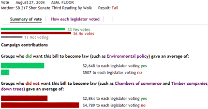

In den USA machen Watchdog-Gruppen politische Vorgänge mit Mashups transparent. Ein Beispiel zeigt, wie Lobbies mit Spenden verhindern, dass kalifornische Abgeordnete für Umweltschutz stimmen:

Für Mashups mit öffentlich zugänglichen Daten benötigt man Application Programming Interfaces (APIs): Schnittstellen, über die sich die benötigten Informationen automatisiert beschaffen lassen.

Wired hat politischen Mashups einen Artikel gewidmet: [Web Mashups Turn Citizens Into Washington's Newest Watchdogs](http://www.wired.com/politics/law/news/2007/04/maplight); er beginnt:

> Tread carefully, politicians -- concerned citizens are watching your every move on the web. Their tools? Custom data mashups that use public databases to draw correlations between every vote cast and every dollar spent in Washington.

Den Hinweis verdanke ich dem [ProgrammableWeb-Blog](http://blog.programmableweb.com/2007/04/27/mashups-and-citizen-watchdogs/ "ProgrammableWeb.com » Blog Archive » Mashups and Citizen Watchdogs"): "Can web mashups keep politicians on their toes?"

ProgrammableWeb ist ein laufend aktualisiertes Verzeichnis von APIs, die sich für Mashups nutzen lassen; es bietet außerdem viele zusätzliche Informationen zum Thema Mashups. Die Site [listet neun APIs](http://www.programmableweb.com/apitag/government "ProgrammableWeb Tag Search: government") zu Regierungsausgaben in den USA. Nachahmswerte Highlights: [OMB Watch/fedspendin.org](http://www.fedspending.org/apidoc.php) und [Follow The Money](http://www.followthemoney.org/services)
