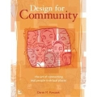

 Vor ein paar Tagen habe ich Derek Powazeks [Bericht](http://powazek.com/posts/534, "The Real Story of JPG Magazine") darüber gelesen, wie er und seine Frau Heather aus der Redaktion des Magazins [JPG](http://jpgmag.com/ "JPG Magazine: Brave New Photography") hinausgeschubst wurden \[thx [Christopher](http://log.c3o.org/post/2000873)\].  Derek und Heather Powazek hatten JPG mitgegründet; Dereks Text hat großes Aufsehen erregt. Ich bin erst durch Powazeks Trennung von JPG darauf aufmerksam geworden, dass er sich in den letzten Jahren vor allem mit Print-Publikationen und mit Fotografie beschäftigt hat. Powazek verwendet das Web, um außerhalb des Webs zu publizieren — nicht nur bei "seinem" Magazin, sondern auch bei einem Buch wie [Applesweat](http://www.lulu.com/content/387283 "Lulu.com: The 2006 Heat Wave from NYC Streets by Derek Powazek (Book) in Arts & Photography") über die Hitze, die New York im August 2006 heimgesucht hat. Hier ein paar ungeordnete Gedanken zu Powazek und zu seinem derzeitigen Arbeitsfeld:

### Web und Nicht-Web

 Powazek zeichnet die Phantasie aus, mit der er zugleich innerhalb und außerhalb des Webs agiert. Oder besser: Er ist "web-minded", aber nicht "web-blind", er erkennt als einer der ersten Möglichkeiten, die das Web für Interventionen in der alltäglichen, "analogen" Realität bietet. Diese Fähigkeit hat er in den ersten Jahren des Web als Entwickler von Community-Seiten bewiesen. Sein Buch [Design for Community](http://designforcommunity.com/ "Website: Design for Community") gehört zu den originellsten, tiefsten und lesbarsten Texten, über das Web, die ich kenne. Powazek kann Geschichten erzählen und andere dazu bringen, ihre Geschichten zu erzählen und zu veröffentlichen, Leute wie er stehen am Anfang dessen, was heute alle "Web 2.0" nennen.

### Ein neues Publikationsmodell

Vielleicht ist er mit seinen "verlegerischen" Aktivitäten wieder seiner Zeit voraus. Powazek sagt deutlich, dass JPG außer einer Zeitschrift über Fotografie auch ein Modell für webbasierte Print-Publikationen wurde:

> We used every available free web tool we could find: Flickr for community discussions, Gmail for submissions, Notifylist for the mailing list, and ultimately Lulu for printing the magazine. But once we looked at the spec for JPG 2.0, we realized that, if we built that tool, we could make a magazine on any topic. The opportunity we had before us was really "Magazine Publishing 2.0".

Die Gruppe um Powazek gründete mit [8020](http://www.8020publishing.com/ "8020 Publishing") ein eigenes Unternehmen, um das JPG-Modell des sozialen Publizierens auf andere Themen zu übertragen. Bisher gibt es aber wohl noch keine weitere Publikation dieses Verlags.

### Bücher und Magazine als soziale Medien

Solche Print-Produktionen im Web 2.0-Stil sind eine weiteres Argument dafür, eher von "sozialen Medien" als von "Online-Publishing", "Online-Journalismus", "Online-PR" oder "Internet-Medien" zu sprechen. Web und Internet sind Instrumente der sozialen Medien, sie sind mit ihnen aber nicht deckungsgleich. Vielleicht ist es eine Binsenweisheit: Soziale Medien finden nie allein im Web statt, sondern in sozialen Netzen; diese sozialen Netze können auch andere als Web-Medien verwenden. Am klarsten erkennbar amalgamiert sich der Mobilfunk mit dem Web — von [Moblogs](http://en.wikipedia.org/wiki/Moblog "Wikipedia: Moblog (engl.)") bis zu [Plazes](http://beta.plazes.com/dashboard/ "Plazes") und [Twitter](http://twitter.com "Twitter"). Es ist aber nicht einmal eine neue Tatsache, dass auch andere Medien "webifiziert" und damit zu sozialen Medien werden können; Beispiele gibt es genug — von [opinio](http://www.rp-online.de/hps/client/opinio/public/hxfront/index.hbs "Rheinische Post: Opinio") bis zu webbasierten Filmproduktionen. Auch "Unkonferenzen" wie die [Barcamps](http://barcamp.org/ "barcamp.org: Frontpage") verbinden das Web mit anderen Kommunikationsformen.

### Was gibt es schon?

Mit Web 2.0-Techniken Print-Produkte zu publizieren, bedeutet zweierlei: Einerseits, dass Publikationen von sozialen Netzen statt von hierarchischen Redaktionen editiert werden. Andererseits, dass der Druck und der Vertrieb über Unternehmen wie lulu.com und Amazon abgewickelt werden, dass man also die Infrastruktur des Web benutzt, um im Print zu publizieren. Es fallen einem — von der Lyrikanthologie über den Reiseführer bis zur Firmenzeitung — eine solche Menge von mögliche Publikationen ein, dass man sich wundert, wie wenige realisiert wurden. (Vielleicht habe ich auch nur nicht gründlich genug gesucht. Dann bitte ich um Hinweise in den Kommentaren.) Die Möglichkeiten, die das 8020-Modell für das "Verlegen" bietet, wurden allerdings sofort erkannt. [Rex Hammock](http://www.rexblog.com/2005/01/13/13477/ "rexblog.com  » JPG Magazine: this is what I'm talking about"):

> "Because I straddle the world of print magazines (my passion and career) and the online participatory-citizens-conversational world that includes blogging (my other passion and career), I'm often asked how one relates to the other... In a nutshell, magazines and blogging don't compete but complement. Blogging will profoundly affect magazines, but will not replace them."

In Deutschland hat Hugo E. Martin mehrfach auf JPG hingewiesen. Auf seine [Aufforderung](http://hemartin.blogspot.com/2006/08/print-on-demand-magazines-created-by.html "Hugo E. Martin on Media, Marketing & Internet: Print-on-demand Magazines Created by Online Communities") Is anyone reading here interested to work something out? scheint aber niemand reagiert zu haben.

### Vor dem Durchbruch?

Vielleicht müssen erst Marketing-Events dafür sorgen, dass die Initialzündung der Gruppe um Powazek das konservative Verlagsgewerbe in Brand setzt. Als ein solches Event könnte die sich die bevorstehende [O'Reilly Tools of Change for Publishing-Konferenz](http://www.oreillynet.com/pub/pr/1737 "Leading Publishers to Share Innovative Ideas at the O'Reilly Tools of Change for Publishing Conference") im Juli erweisen. Aus der Einladung:

> While many publishers can see that technology is changing the ground on which publishing rests, few have the knowledge to recognize the true challenges and opportunities presented by these changes. The O'Reilly Tools of Change for Publishing Conference will decipher the avenues for change in this industry and help cut through the hype for a more profitable future in publishing.
