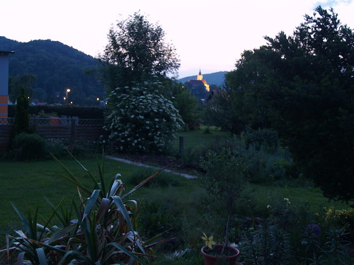

.flickr-photo { border: solid 2px #000000; }.flickr-yourcomment { }.flickr-frame { text-align: left; padding: 3px; }.flickr-caption { font-size: 0.8em; margin-top: 0px; }

  
[P5231516.JPG](http://www.flickr.com/photos/heinzwittenbrink/511885346/), originally uploaded by [Heinz Wittenbrink](http://www.flickr.com/people/heinzwittenbrink/).

Von unserer Terrasse aus sieht man auf die Strassganger Pfarrkirche Maria Elend. Bevor es ganz dunkel wurde, blieb gestern die Zeit beinahe stehen.
