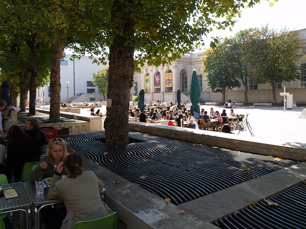

.flickr-photo { border: solid 2px #000000; }.flickr-yourcomment { }.flickr-frame { text-align: left; padding: 3px; }.flickr-caption { font-size: 0.8em; margin-top: 0px; }

  
[Kantine, Museumsquartier](http://www.flickr.com/photos/heinzwittenbrink/1468086022/), originally uploaded by [Heinz Wittenbrink](http://www.flickr.com/people/heinzwittenbrink/).

Ich sitze in der Kantine des [Museumsquartiers](http://www.mqw.at/fset.html?1123_1170.htm), meinem mobilen Büro in Wien. Ich habe zwei Tage [BarCamp](http://www.barcamp.at/BarCamp_Vienna_September_2007) hinter mir. Für heute abend hat mich [Alexandra Nussbaumer](http://www.oevp.at/oevp/index.aspx?pageid=9360) zu einem Event eingeladen, bei dem die Arbeit der [Perspektivengruppe](http://www.zukunft.at/) der ÖVP präsentiert wird; ich werde es als Blogger begleiten.

Ein lässiger Herbsttag, nach dem [Schlammassel](http://www.diepresse.com/home/panorama/oesterreich/330656/index.do?_vl_backlink=/home/panorama/index.do) der letzten Wochen an der [FH](http://www.fh-joanneum.at) genieße ich die Urbanität. Zeit zum Nachdenken, zum Nacharbeiten und hoffentlich zum Schreiben...
