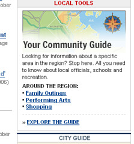

  
[community-guidewashingtonpostcom](http://www.flickr.com/photos/heinzwittenbrink/1505607568/)  
Ursprünglich hochgeladen von [Heinz Wittenbrink](http://www.flickr.com/people/heinzwittenbrink/)

Den Screenshot rechts habe ich mit zwei Firefox-Addons in diesem Blog untergebracht: [Pearl Crescent Page Saver](http://pearlcrescent.com/products/pagesaver/ "Pearl Crescent Page Saver"), um dem Screenshot zu erstellen; [Fireflix](https://addons.mozilla.org/de/firefox/addon/3453 "Fireflix :: Firefox Add-ons"), um ihn upzuloaden. Beide Addons verwende ich zum ersten Mal, beide wirken sehr brauchbar. (Gebloggt habe ich direkt von der Seite des Fotos bei flickr und das Posting nachträglich im Editor getaggt.)
