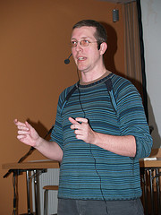

 Habe ich meine sehr allgemeinen [Vorstellungen zur Partizipation](/lostandfound/auf-dem-weg-zur/) revidiert oder konkretisiert? Mir ist wenigstens deutlich geworden, wo sie modifiziert werden müssen, und wie schwierig es sein kann, über Partizipation zu sprechen, ohne in Allgemeinplätze abzugleiten.

Durch die [Podiumsdiskussion am Freitag](http://wiki.civilmedia.eu/index.php/Panel:_From_Media_Participation_to_Active_Citizenship "Panel: From Media Participation to Active Citizenship - Civilmedia") und [seine Session am folgenden Tag](http://wiki.civilmedia.eu/index.php/Models_of_Participatory_Media_Organisations "Models of Participatory Media Organisations - Civilmedia") bin ich zum ersten Mal mit dem Ansatz [Nico Carpentier](http://nicocarpentier.net "Nico Carpentier Privé")s in Berührung gekommen, der sich auf mehreren Reflexionsstufen mit der Definition von Partizipation beschäftigt (PDF-Version von Carpentiers Präsentation [hier](http://homepages.vub.ac.be/~ncarpent/temp/ModelsParticipMedia_salzburg.pdf)). Im Vergleich zu dieser durchgeführten Reflexion sind meine eigenen Überlegungen naiv. Carpentier unterscheidet zwischen verschiedenen Formen von Partizipation. Er stellt einen Bezug zwischen diesen Formen der Partizipation — von der bloßen Anhörung bis zur gleichberechtigten Teilnahme an einer Entscheidung, die ein Kollektiv betrifft — und verschiedenen Organisationsformen partizipativer Medien her. Dabei kann man (wenn ich ihn richtig interpretiere) keine Form der Partizipation als _die_ Partizipation bezeichnen, es gibt nicht nur mehr oder weniger Partizipation, sondern unterschiedliche Typen von Partizipation (z.B. parlamentarische oder direkte Demokratie); die Wahl zwischen ihnen ist zwangsläufig ideologisch (wobei sich in der Praxis verschiedene Formen der Partizipation miteinander verbinden). Der für mich interessanteste Aspekt bei Carpentier (in dem wenigen, was ich mündlich gehört habe) ist, dass er auch die Reflexion über Partizipation, die Theorie der Partizipation, an die verschiedenen Konzepte zurückbindet. Auch der Theoretiker kann der ideologischen Wahl nicht entgehen.

Carpentier unterscheidet unter den partizipativen Medien bewusst nicht zwichen Web- und Nichtweb-Medien. Hier kann ich ihm nicht folgen, auch wenn eine Argumentation für eine andere Position nicht einfach durchzuführen ist. Einerseits sind die Webmedien nicht Massenmedien im herkömmlichen Sinn, weil sie einen Dialog mit den Benutzern erlauben und von den Benutzern weiterentwickelt werden können. Andererseits ist ihre Entwicklung nicht nur, aber auch technisch determiniert. Qualitäten der Technik (z.B. programmierte Verarbeitung von Daten, Hypertextualität) bestimmen Eigenschaften dieser Medien, die sie mit den älteren Medien nicht teilen. Carpentiers Verzicht darauf, die Technik in seine Reflexion einzubeziehen (so habe ich ihn jedenfalls in Salzburg verstanden) macht die Unterschiede zwischen Web- und Nichtweb-Medien wenigstens z.T. unsichtbar.

Sehr wichtig finde ich den Gedanken Carpentiers, dass jede Theorie der Partizipation und partizipativer Medien sich mit dem Konzept der Repräsentation beschäftigen muss. (Das ist einer der Punkte, bei denen ich mir viel von der Actor-Network-Theory erhoffe.) Repräsentation ist ein Begriff, der sich sowohl auf die Politik wie auf Medien bezieht, und der hier wie dort Macht thematisiert (wer kann wen, wer darf wen repräsentieren? Wie wird das Repräsentierte, wie werden die Repräsentierten übersetzt? Was verändert sich bei dieser Übersetzung, was geht verloren?) Hier könnte so etwas wie ein Angelpunkt für eine politische Reflexion sozialer Medien liegen, und ausgehend vom Konzept der Repräsentation lässt sich vielleicht auch am besten beschreiben, in welchem Verhältnis alte und neue partizipative Medien zueinander stehen.

**Update, 26.11.2020:** Link zur Website Nico Carpentiers aktualisiert.
