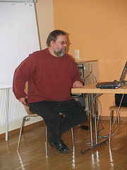

Ich komme leider erst jetzt dazu, meine Notizen von der [Veranstaltung in Salzburg](http://www.civilmedia.eu/?p=73 "Civilmedia 07: Participation 2.0") durchzugehen. Für mich war sie nicht zuletzt wegen der Hinweise auf Websites/Initiativen wichtig, die ich vorher nicht kannte. Vor allem die Bedeutung und die Geschichte der freien Radioszene war mir bis dahin völlig verborgen geblieben.

 Wegen des Themas (Literatur), des transmedialen Ansatzes (Radio und Online, Live-Sendung und Datenbank) und technisch ([StreamOnTheFly](http://www.streamonthefly.org/, "StreamOnTheFly --- StreamOnTheFly.org")) finde ich das [Literadio](http://www.literadio.org/)\-Projekt bemerkenswert, das [Christian Berger](http://campusib.fh-burgenland.at/p/1009 "ePortfolio Christian Berger") in einer leider nur sehr schwach besuchten Session vorstellte. (Ein weiteres Projekt Christians, interessant im Horizont von _media literacy_: [CoP-Social Software-Schule](http://comunitybuilding.wordpress.com/ "CoP-Social Software-Schule").) Das Projekt begann mit Live-Sendungen von der Frankfurter Buchmesse, die inzwischen seit sieben Jahren stattfinden. Während der gesamten Buchmesse werden Lesungen und Gespräche mit Autorinnen gesendet.

Literadio hat sich zu einem kooperativen Projekt entwickelt, bei dem Partner dezentral Programm machen und die Ergebnisse teilen. Die Beiträge sind im Web verfügbar und können von freien Radios ausgestrahlt werden. Der Inhalt kann als mp3 oder ogg-Stream und als Download bezogen werden. Das Archiv produziert für jede Serie (collection) Podcasts.

Literadio ist international angelegt, die Partner sind eingeladen mehrsprachig zu publizieren; zu allen Inhalten werden englische Metadaten angelegt. Verlage können die Plattform für ihre PR verwenden. Sie sind aber wohl nur selten dazu in der Lage, mit den Medien Web und freies Radio umzugehen. Schon mit der Tonaufnahmen sind sie meist überfordert, also auf Training angewiesen.

Wenn ich es richtig verstanden habe, unterscheidet sich literadio von den gängigen Web 2.0-Anwendungen wie youTube vor allem dadurch, dass die Teilnehmer Organisationen oder Gruppen sind und dass sie von literadio akzeptiert werden müssen. Bei literadio bildet Literatur den Inhalt; die Plattform ließe sich aber leicht für andere Inhalte duplizieren.

Auf der literadio-Site (Frame-Alarm!) wird nicht zu Unrecht auf die [Wikipedia Community](http://bacchus.univie.ac.at/home/literadio/index.php?id=aboutus&L=4%3E%3CDonerstag%2022.%20M%C3%A4rz%202007.%3C%2Fa%3E%3C%2Fp%3E%3Cp%20style%3D "Literadio: about us") verwiesen. Alle Elemente, die man für eine Wikipedia-artige, offene Radioproduktion braucht, sind hier unauffällig, aber konsequent erstellt worden.
