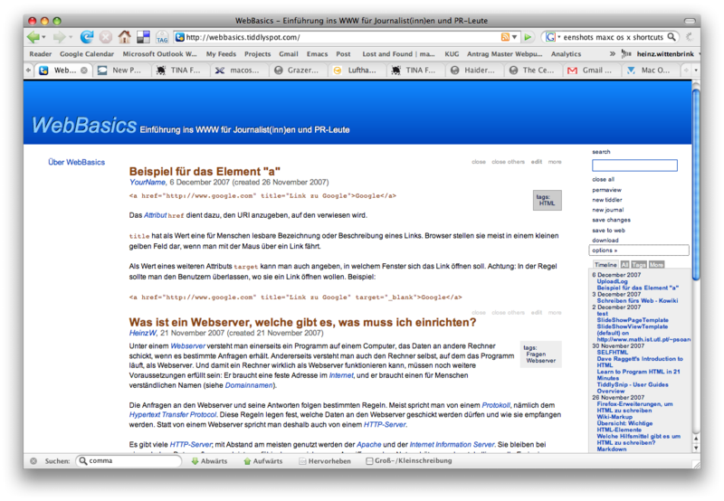

 Seit ein paar Wochen probiere ich, meinen Unterricht mit [TiddlyWikis](http://www.tiddlywiki.com/ "TiddlyWiki - a reusable non-linear personal web notebook") vorzubereiten, und benutze sie auch zum Präsentieren. Ich bin in die Feinheiten dieses Tools (es ist schon lange kein Geheimtip mehr) noch nicht sehr weit eingedrungen. Es gibt inzwischen eine Reihe von unterschiedlichen Versionen, Plugins und Addons — TiddlyWiki wird von einer großen Fan- und Entwicklergemeinde unterstützt (wie ich sie dem leider immer noch zu den Software-Rara zählenden [vanilla](http://www.vanillasite.at/space/start "created by unknown last edited by unknown") wünschen würde). TiddlyWiki ist ein interessantes und in seinem Minimalismus sehr sympathisches Werkzeug, um Texte zu schreiben, die hochgradig verlinkt sind und sich unterschiedlich präsentieren lassen. Jedes TiddlyWiki ist ein Container für Microcontent, der sich frei rekombinieren lässt.

Ein TiddlyWiki besteht aus einer einzigen HTML-Seite; alle Wiki-Funktionen werden mit JavaScript realisiert. Man braucht außer einem Browser keine weitere Software, um das Wiki zu erstellen und zu schreiben.

Anders als ein übliches Wiki besteht ein TiddlyWiki nicht aus einzelnen Seiten, sondern aus Bausteinen, den Tiddlers. Ein nicht weiter modifiziertes TiddlyWiki zeigt die Überschriften der Tiddlers in einer Liste rechts an; klickt man auf einen Titel, öffnet sich der Abschnitt auf der Seite oben. Klickt man zweimal auf den Titel, kann man der Tiddler editieren.

Ein großer Vorteil: Ein TiddlyWiki ist im Nu angelegt. Man speichert ein leeres Wiki ab und kann starten. Noch wichtiger finde ich, dass sich die Inhalte frei kombinieren lassen. Ich öffne fünf Tiddler zu einem Thema und stelle sie dann in einem anderen Zusammenhang neu zusammen. Jede Kombination von Tiddlern lässt sich über ihren URI abspeichern und als solche wieder aufrufen. Zu den vielen Plugins, die für TiddlyWiki entwickelt wurden, gehört eines, mit dem sich eine komplette Slideshow als Tiddler anlegen lässt.

Man kann eine TiddlyWiki wie jede andere Datei auf einem Server ablegen und im Browser öffnen. Änderungen lassen sich dann natürlich nur lokal speichern, und man muss die ganze Datei wieder auf den Server laden, um die aktualisierte Version zu publizieren. Es ist aber auch möglich, ein Tiddlywiki so zu konfigurieren, dass sich Änderungen direkt auf einen Webserver uploaden lassen.

Die einfachste Möglichkeit, eine TiddlyWiki auf einem Server zu installieren, ist [tiddlyspot](http://tiddlyspot.com/ "tiddlyspot"). Hier lässt sich in wenigen Minuten ein gehostetes TiddlyWiki einrichten. Wir haben an unserem Studiengang begonnen, ein [Tiddlywiki über Webbasics](http://webbasics.tiddlyspot.com) zu schreiben; noch sind wir allerdings bei einer embryonalen Vorform.
