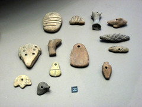

  
[Clay Tokens a la Schmandt-Besserat](http://www.flickr.com/photos/macloo/418008366/)  
Ursprünglich hochgeladen von [macloo](http://www.flickr.com/people/macloo/)

Zum Bild \[via flickr\] siehe: Denise Schmandt-Besserat, [Exzerpt und Inhaltsverzeichnis aus: How Writing Came About](http://www.utexas.edu/utpress/excerpts/exschhop.html "Table of Contents and Excerpt, Schmandt-Besserat, How Writing Came About"). Ich bin auf die Archäologin Schmandt-Besserat durch Howard Rheingold gestoßen. Sie hat erforscht, wie sich die Schrift der Sumerer aus Ton-Objekten entwickelt hat, mit denen Güter wie Tiere oder Krüge gezählt wurden. Die Objekte — sie spricht von _tokens_ — repräsentierten einzelne Gegenstände oder auch Mengen von Objekten (zu überprüfen; ich habe heute zum ersten Mal davon gelesen). Sie waren in der Jungsteinzeit über Jahrtausende in Gebrauch und sind an vielen Stellen nachgewiesen. Sie wurden offenbar selbst in Behältern aufbewahrt — zum Beispiel von jemand, der für eine Herde verantwortlich war — und um eine Übersicht über den Inhalt dieser Behälter zu bewahren, ging man irgendwann dazu über, die Zählmarken in die noch nicht getrockneten Deckel der Tonbehälter zu pressen. Mit der Entdeckung, dass diese Deckel allein zur Repräsentation von Objekten genügen und man auf die Behälter mit den Tonobjekten verzichten kann, beginnt die Geschichte der Schrift (in unserer Geschichte; die Schriftsysteme in Ostasien und Mittelamerika haben einen anderen Ursprung).

Am Beginn der Schrift stand also nicht eine Bilderschrift, sondern das Zählen und Rechnen — wenn man will: die jungsteinzeitlichen Computertechnik.

**Links**: Denise Schmandt-Besserats [Homepage](https://webspace.utexas.edu/dsbay/index.html "University of Texas at Austin: Denise Schmandt-Besserat"). Kurzdarstellung ihrer Theorie: [1, 2, 3 leads to A, B, C: Denise Schmandt-Besserat: Research Impact](http://www.utexas.edu/research/impact/rwschmandt.html "1, 2, 3 leads to A, B, C: Denise Schmandt-Besserat: Research Impact"). In der [Wikipedia](http://en.wikipedia.org/wiki/Denise_Schmandt-Besserat "Denise Schmandt-Besserat - Wikipedia, the free encyclopedia") steht über die inzwischen emeritierte Forscherin:

> Schmandt-Besserat's present interest is the cognitive aspects of the token system that functioned as an extension of the human brain to collect, manipulate, store and retrieve data. She studies how processing an increasing volume of data over thousands of years brought people to think in greater abstraction. She also continues her research on Neolithic symbolism at the site of of 'Ain Ghazal, near Amman, Jordan.
