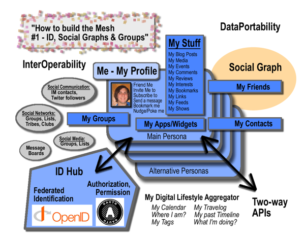

Mark Canter beschäftigt sich [in einem langen Posting](http://blog.broadbandmechanics.com/2008/03/how-to-build-the-mesh-1-id-social-graphs-and-groups "Marc’s Voice » Blog Archive » How to build the mesh - #1: ID, Social Graphs and Groups") mit dem, was er mesh nennt: einer Infrastruktur, mit der die User alle Daten, die mit der eigenen Identität und den eigenen Beziehungen zusammenhängen, aggregieren, organisieren und kontrollieren können. Canters Ziel ist ein offenes, standardisiertes, nicht proprietäres System, das es jedem User erlaubt, uneingeschränkt über die eigenen Daten und ihre Freigabe zu verfügen. Er kündigt eine Serie mit Vorschlägen zu diesem Thema an; in diesem ersten Posting gibt er einen Überblick über die aktuelle Situation, die verschiedenen Standards und (meist proprietären) APIs von Twitter bis OpenSocial. Wichtig und plausibel ist, dass die übergreifenden Fragen des Identitäts- und Beziehungsmanagements in fast allen aktuellen Web-Applikationen und Applikationstypen gemeinsam und direkt angegangen werden müssen. Eine Grafik Canters zeigt, wie das digitale Universum einer Person in diesem mesh organisiert sein könnte:

Die Grafik macht vielleicht am schnellsten deutlich, worum es Canter in seinem dichten und komplexen Posting geht, sie ersetzt die Lektüre natürlich nicht.

Ich bin sicher, dass sich ein großer Teil der Entwicklung des Web in den kommenden Jahren um die Fragen drehen wird, die Canter formuliert. Vermutlich werden dabei auch viele seiner Antworten aufgegriffen werden. Es kommt mir übrigens so vor, als würden sich diese Initiative und die [Linked Data](http://www.w3.org/DesignIssues/LinkedData.html "Linked Data - Design Issues")\-Initiative von Tim Berners-Lee in dieselbe Richtung bewegen.
