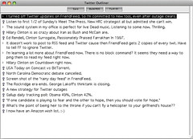

  
[Twitter Outliner Screen Shot](http://www.flickr.com/photos/scriptingnews/2432633047/)  
Ursprünglich hochgeladen von [scriptingnews](http://www.flickr.com/people/scriptingnews/)

Dave Winer postet parallel zu Twitter und zu Friendfeed, um bei Twitter-Ausfällen via Friendfeed kommunizieren zu können.  
  
Mich interessiert auch sein Schreib-Werkzeug (OPML-Editor).  
  
Er schreibt in einen mehrstimmigen Text hinein, der aus lauter Microcontent-Körnern besteht, an die fast beliebig angeschlossen werden kann. Dem "River of News" entspricht ein "River of Writing".
