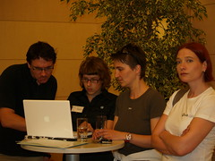
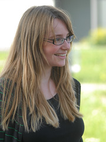
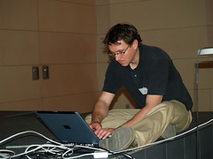
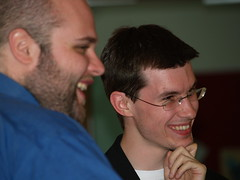

Ich will mich bei den Mitorganisatoren des [PolitCamps](http://www.barcamp.at/PolitCamp_Graz) nicht rituell bedanken. Ich möchte aber darauf hinweisen, dass viele Menschen hinter dem Event standen. Vielleicht möchten auch Leute, die ähnliche Events vorbereiten, erfahren, wer und wie viele bei uns mitgearbeitet haben. Deshalb hier eine kurze Vorstellung der Beteiligten.

Noch eine Bemerkung vorab: Die Organisation war aufwändig, und wir haben mit einem ziemlich großen Team gearbeitet. Für ein normales Barcamp wäre das wahrscheinlich Overkill.

  

Boris Böttger, Tina Fleck, Maria Reisinger und Tanja Schönbacher  
Foto: Regina Joschika

Beim Politcamp trafen aber, wie [Michael](http://www.smime.at/) das am Samstagmorgen beschrieben hat, verschiedene Systeme aufeinander, außer der Politik, den (eher abwesenden) Massenmedien und dem System Social Media (oder wie immer man es nennen will) auch noch das System Hochschule.

Entstanden ist die Idee auf anderen österreichischen Barcamps, die ich in den letzten zwei Jahren besucht habe, zum Teil mit meinen Kollegen [Boris](http://www.fh-joanneum.at/aw/home/Studienangebot/fachbereich_internationale_wirtschaft/juk/Menschen/Team/~baqn/juk_teamdetails/?perid=%2D1025000000000009375&lan=de) und [Karin](http://www.fh-joanneum.at/aw/home/Studienangebot/fachbereich_internationale_wirtschaft/juk/Menschen/Team/~baqn/juk_teamdetails/?perid=%2D1025000000000006856&lan=de). Vor allem auf den Barcamps selbst haben wir sie diskututiert. Gut erinnere mich noch an die Gespräche mit [Markus](http://www.virtualbites.com/), [Olaf](http://soso.onitz.de/), [Helmuth](http://www.campa.at/home/blog/showblog/6), [Hannes](http://www.bessergehtsimmer.at/), [Helge](http://www.helge.at/), [David](http://politik.netzkompetenz.at/) (der leider am Wochenende nicht dabei war) und anderen. Sie haben alle bei der Vorbereitung mitgemacht. Ich weiß, dass Markus viel unternommen hat, um PR-Agenturen anzusprechen. Es liegt sicher nicht an ihm, dass es in dieser Szene kaum Interesse am Thema gibt.

  
Karin Raffer  
Foto: Helge Fahrnberger

Wie wir das Treffen angelegt haben, geht zu einem großen Teil auf Karin zurück. Hauptziel: Kommunikation zwischen Leuten, die sich mit politischer Kommunikation mit two-way-Medien aktiv beschäftigen, Barcamp als Format, Beschränkung zunächst auf Österreich. \[Tina\](http://tinafleck.com/) hat sich um alles Grafische und um die Organisation des Fests im Kunsthaus gekümmert, \[Tanja\](http://www.fh-joanneum.at/aw/home/Studienangebot/fachbereich\_internationale\_wirtschaft/juk/Menschen/Team/~baqn/juk\_teamdetails/?perid=4295252287&lan=de) um das Finanzielle und das Controlling (wichtig an einer österreichischen Fachhochschule).

  
Boris Böttger

Einen guten Teil der Sponsoren verdanken wir den Kontakten von [Heinz Fischer](http://www.fh-joanneum.at/aw/home/Studienangebot/fachbereich_internationale_wirtschaft/juk/Menschen/Team/~baqn/juk_teamdetails/?perid=%2D1025000000000006832&lan=de). Boris hat die ganze technische Abwicklung gemanagt.

Seit Oktober hat sich außerdem eine Gruppe von Studenten das PolitCamp inhaltlich vorbereitet und unter anderem PR gemacht, Vertreter von Parteien und Organisationen und bloggende Politiker kontaktiert, den amerikanischen Wahlkampf beobachtet, das [blog](http://www.politcamp.at/) gestartet: Maria Stradner, Karoline Lorber, Regina Joschika, Carina Jöbstl, Margit Kubala, Stefan Hofer und Joe Puschitz (Seite ihres Jahrgangs [hier](http://www.fh-joanneum.at/aw/home/Studienangebot/fachbereich_internationale_wirtschaft/juk/Menschen/Studierende/~bcjt/Jahrgang/?lan=de)) —

  
Stefan Hofer  
Foto: Regina Joschika

alles zu einem großen Teil außerhalb von Lehrveranstaltungen und ohne Gegenleistungen in Form von Noten. Eine der angenehmsten Erfahrungen bei der Vorbereitung: Es hat sich eine Gruppe gebildet, bei der die Unterschiede zwischen Lehrenden und Studierenden eine immer geringere Rolle spielten. Schon um noch einmal mit dieser Gruppe zusammenzuarbeiten, würde ich im nächsten Jahr gerne wieder ein PolitCamp organisieren, egal ob innerhalb oder außerhalb der FH.

Es haben noch mehr Leute mitgemacht, und die Genannten haben mehr getan, als ich hier aufschreibe. Für alle bedeutete das immer wieder Stress — ich hoffe nur, dass ich davon nicht zu viel selbst verschuldet habe. Beim nächsten Mal schaffen wir es dann ganz entspannt.

(**Update**, 4. Juni: Ich ergänze noch ein paar Fotos.)
