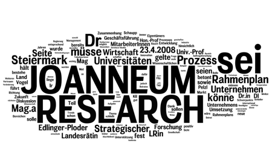

Kurz vor einer Reise nach Kroatien hat mir ein früherer Kollege das Protokoll einer Besprechung mit dem Titel "Strategischer Rahmenplan JOANNEUM RESEARCH" zugemailt. Komme jetzt nicht zum Lesen. Hab es schon mal durch [Wordle](http://wordle.net/create "Wordle - Create") gejagt und frage mich, ob ich mir das antun muss ...
