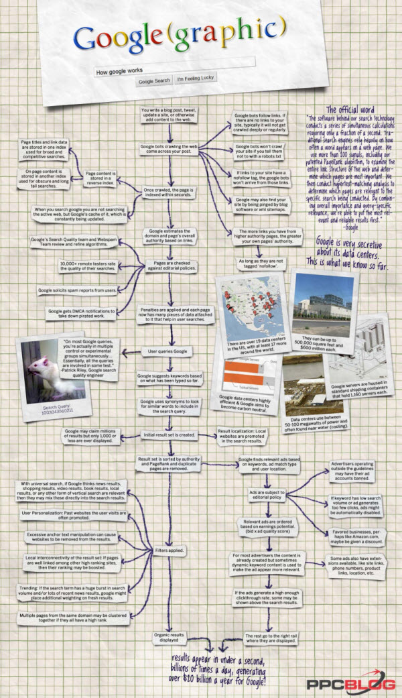

Heute habe ich eine Lehrveranstaltung in Wien über Suche und Suchmaschinen; dasselbe Thema werde ich im kommenden Semester [bei uns](http://www.fh-joanneum.at/aw/home/Studienangebot/fachbereich_internationale_wirtschaft/~czf/jpr/?lan=de "Studium "Journalismus und Public Relations (PR)) | Studium Journalismus und Public Relations (PR)| FH JOANNEUM Gesellschaft mbH :: University of applied sciences") in Graz behandeln. Um mich vorzubereiten habe ich gestern in meinen [Evernote](http://www.evernote.com/ "Remember Everything | Evernote Corporation")\-Notizbüchern nachgesehen, was ich an ungelesenem Posts und Artikeln zu diesem Thema angesammelt habe, hier das Ergebnis.

### Wie funktioniert Google?

Eine nette neue Infografik erleichtert es hoffentlich zu erklären, wie Google arbeitet: [How Does Google Work? Learn How Google Works: Search Engine + AdWords](http://www.ppcblog.com/how-google-works/ "How Does Google Work? Learn How Google Works: Search Engine + AdWords"). Die Grafik selbst habe ich an dieses Post angehängt.

### Cheat Sheet zur Google-Syntax

Vermutlich für Anfänger am wichtigsten: die Shortcuts für die _Advanced Search_ mit Google, die dieses [Cheat Sheet](http://websearch.about.com/library/cheatsheet/blgooglecheatsheet.htm "Google Advanced Search Shortcuts - Google Advanced Search Cheat Sheet") zusammenfasst. Nach meiner Erfahrung wissen auch viele Informationsprofis nicht, wie man mit Google richtig sucht—und das heisst zu einem guten Teil: wie man de Quellen so einschränkt, dass man mehr relevante Ergebnisse findet. Deshalb werden wir heute im Unterricht vor allem üben, mit diesen Shortcuts zu suchen, z.B. nach Präsentationen auf der Site einer Firma.

### Bing vs. Google

Welche Alternativen zu Google sind wichtig? Als großer Konkurrent ist nur Microsofts [Bing](http://www.bing.com/ "Bing") geblieben, das inzwischen auch die Yahoo!-Suche versorgt. Wir werden es heute ebenfalls praktisch ausprobieren. Einen Überblick zum aktuellen Konkurrenzkampf von Google und Microsoft bei der Suche gibt ein Artikel aus der New York Times: [Bing and Google in an Arms Race for Features](http://www.nytimes.com/2010/08/02/technology/02google.html?_r=3 "Bing and Google in an Arms Race for Features - NYTimes.com"). Dieser Artikel sagt schon in der Überschrift, wie der Konkurrenzkampf zwischen den beiden Firmen geführt wird: Durch immer neue Features, deren technische Basis eine weltweite Cloud-Infrastruktur ist. Nach Google hat sie auch Microsoft mit enormen Kapitaleinsatz aufgebaut. Viele der Features werden einfach in die Suchmaschine integriert, um die Suche für den Benutzer so einfach wie möglich zu halten.

### Public Data Suche bei Google

Ein journalistisch interessantes Feature bei Google ist die Suche nach öffentlichen Daten. Bei bestimmten Sucheingaben, z.B. bei einer Suche nach der Arbeitslosenrate in Deutschland, erhält man statistische Daten, die in einer Grafik dargestellt werden. Siehe dazu das Blogpost [Google Public Data Onebox](http://blogoscoped.com/archive/2009-04-28-n24.html "Google Public Data Onebox") und im Google Blog selbst: [Adding search power to public data](http://googleblog.blogspot.com/2009/04/adding-search-power-to-public-data.html "Official Google Blog: Adding search power to public data") (wichtig auch die vielen Posts zu Public Data, die in diesem Eintrag angegeben sind). Die Public-Darstellung von Daten ist eine Auswirkung von Googles Übernahme der Firma Trendalyzer. Auf der Trendalyzer-Technik basiert auch der [Google Public Data Explorer](http://www.google.com/publicdata/faq "Google Public Data Explorer"). Die Datenquellen finden sich [hier](http://www.google.com/publicdata/directory "Google Public Data Explorer"). Auch die Eurostat und World Bank-Daten sind so durchsuchbar: [Eurostat and World Bank Public Data Now Searchable On Google In 34 Languages](http://www.ditii.com/2010/10/07/eurostat-and-world-bank-public-data-now-searchable-on-google-in-34-languages/ "Eurostat and World Bank Public Data Now Searchable On Google In 34 Languages").

Heute im Unterricht ist die Public Data-Suche bei Google ein Anlass, auf die Open Data-Bewegung und ihre Bedeutung für den Journalismus einzugehen. Ich möchte auch kurz auf Hans und Ola Rosling hinweisen. Ein [Futurezone-Post](http://www.futurezone.at/stories/1633063) zur Trendalyzer-Übernahme von Google und zu Ola Rosling wurde inzwischen [depubilziert](http://blog.tagesschau.de/2010/07/20/depublizieren/ "Depublizieren | blog.tagesschau.de"). Darin hieß es:

> Der Suchmaschinenkonzern hat dabei den Vorteil, mit dem Schweden Ola Rosling einen Visionär der "offenen Daten" für sich gewonnen zu haben. Rosling hatte mit Trendalyzer eine Visualisierungssoftware entwickelt, mit der er die Daten der Weltgesundheitsbehörde (WHO) so aufbereitete, dass allgemein verbreitete Ansichten - etwa dass die Höhe der Lebenserwartung zwangsläufig von der Höhe des Bruttoinlandsprodukts abhängen muss - ins Wanken kamen ... Seit kurzem steht die Software jedem als Google-Gadget "Motion Chart" kostenlos zur Verfügung - und Rosling wartet darauf, dass Nutzer nun mit allerlei Statistiken zu spielen anfangen, um neue, spannende Erkenntnisse zu gewinnen. Die Zahlen der europäischen Statistikbehörde Eurostat hält er etwa für "wunderbar", da die Behörde sie ganz traditionell in einem schier endlosen Tabellenwerk präsentiert. Google selbst hat mit den Arbeitslosenzahlen in den USA vorgemacht, wie sich das neue Gadget nutzen lässt. Die Daten können über eine Schnittstelle zur amtlichen Statistik auf dem aktuellen Stand gehalten werden. Als die Weltbank über eine offene Programmierschnittstelle ihre Daten zu den 17 Weltentwicklungsindikatoren freigab, integrierte Google die Daten prompt in sein Suchangebot und bereitete sie für sein neues Visualisierungstool auf.

### Semantische Suche

Ich glaube, dass die Interpretation öffentlicher Daten und die Suche in ihnen schon bald zu den wichtigsten Skills von Journalistinnen gehören wird (siehe dazu die ausgezeichnete Präsentation von Robert Harm [Opendata and data-driven-journalism](http://www.slideshare.net/robertharm/opendata-data-drivenjournalism "Opendata and data-driven-journalism")) Ich möchte im Zusammenhang damit heute auch kurz auf [Linked Data](http://linkeddata.org/ "Linked Data | Linked Data - Connect Distributed Data across the Web") und ihre Bedeutung für eine semantische Suche hinweisen. Zur semantischen Suche empfehle ich Andreas Blumauers Präsentation [Auf der Suche nach der besseren Suche](http://www.slideshare.net/ABLVienna/auf-der-suche-nach-der-besseren-suche-3814499# "Auf der Suche nach der besseren Suche"). Sie stellt die verschiedenen Aspekte des Themas da und bringt sehr viele Beispiel für neue Suchmaschinen, die auf semantischen Technologien basieren. Außerdem zeigt sie in ihrer Einleitung sehr schön, worum es beim Suchen geht. Ich möchte heute auch darauf hinweisen, dass Google-Suche [inzwischen Mikroformate und RDFa versteht](http://www.semantic-web.at/index.php?id=1&subid=57&action=resource&item=2640 "Search engine optimisation for the Semantic Web era -").

### Suche nach Nachrichten und Trends

Die Suche nach Nachrichten ist für Journalisten ein zentrales Thema. Dabei sind die Grenzen zwischen Suchen, Aggregieren und Publizieren fließend. Außerder News- und Blog-Suche bei Google möchte ich _Fast Flip_ zeigen, mit dem sich Nachrichtenquellen durchblättern lassen. Eine Einführung gibt [Google Fast Flip Lets You Quickly Browse News Pages](http://blogoscoped.com/archive/2009-09-15-n20.html "Google Fast Flip Lets You Quickly Browse News Pages"). Das Angebot findet sich [hier](http://fastflip.googlelabs.com/ "Google Fast Flip"). Der Code steht Open Source zur Verfügung.

Netzwertig.com (eine meiner wichtigsten Quellen) weist auf [Trendiction](http://www.trendiction.de "Trendiction.de") hin, das Nachrichten-, Blog- und Bildersuuche kombiniert: [Neue Nachrichtensuchmaschine mit offenen Schnittstellen](http://netzwertig.com/2010/05/19/trendiction-neue-nachrichtensuchmaschine-mit-offenen-schnittstellen/ "Trendiction: Neue Nachrichtensuchmaschine mit offenen Schnittstellen » netzwertig.com"). Trendiction bietet ein eigenes [Trendiction Suchplugin](http://www.trendiction.de/w/help/searchplugin "Trendiction Suchplugin | Trendiction.de") an. Beschreibung der Such-Syntax [hier](http://www.trendiction.de/w/help/searchsyntax "Unterstützte Suchsyntax | Trendiction.de"). Zu Trendiction und dem dahinter stehenden Clustering und Memetracker-Verfahren auch [Trendiction: Deutsche Suchmaschine & Memetracker mit Schnittstelle](http://www.neunetz.com/2010/05/18/trendiction-deutsche-suchmaschine-memetracker-mit-schnittstelle/ "Trendiction: Deutsche Suchmaschine & Memetracker mit Schnittstelle"). Im Unterricht möchte ich auch darauf hinweisen, was Memetracker sind und [Rivva](rivva.de "Rivva.de, deutschsprachiger Memetracker") vorstellen. Schon bekannt sollte den Studierenden [Twingly](http://www.twingly.com/ "Twingly Channels") sein, aber der Hinweis schadet sicher nicht.

Seit ein paar Tagen bietet Google so etwas wie die historische Extension der Trend-Suche an: die vergleichende Stichwort-/Themensuche in den von der Firma digitalisierten Büchern: [Google Ngram Viewer](http://ngrams.googlelabs.com/ "Google Ngram Viewer").

### Angepasste Suche

Wenn ich es richtig sehe, gibt es bei den Suchmaschinen zwei große Trends: die Integration von Such-Objekten jenseits der statischen Text-Dokumente (die schon erwähnte Suche in strukturierten Daten; [Echtzeit-Suche](http://www.internetkapitaene.de/2010/01/20/google-real-time-search-unter-der-lupe/ "Google Real Time Search unter der Lupe - Die Internetkapitäne"), also Durchsuchen von Nachrichten-Streams, visuelle basierte Suche z.B. mit [Google Goggles](http://www.basicthinking.de/blog/2010/10/06/google-goggles-visuelle-suche-nun-auch-fuer-iphone-besitzer-verfuegbar/ "Google Goggles: Visuelle Suche nun auch für iPhone-Besitzer verfügbar | Basic Thinking")) und die Kontextualisierung der Suche, z.B. bei der mobilen Suche, der personalisierten Suche und der _Social Search_ , also der Suche in den Inhalten der Personen, denen man vertraut. Um zu zeigen, was der Sinn der Personalisierung ist, möchte ich im Unterricht die Suche im Google Reader demonstrieren, die für mich eines der wichtigsten Mittel ist, relevante aktuelle Inhalte zu den Themen zu finden, die mich interessieren.

Zur Social Search gibt es ein gutes Video von Google: [Google social search feature](http://www.youtube.com/watch?v=aYf5iSA6t6g&feature=player_embedded "YouTube - Google social search feature"). Wichtig ist in diesem Zusammenhang auch, dass inzwischen [Google wie Bing Twitter und Facebook](http://www.seomoz.org/blog/google-bing-confirm-twitter-facebook-influence-seo "Google + Bing Confirm that Twitter/Facebook Influence SEO | SEOmoz") berücksichtigen und dabei auch die Reputation von Personen in sozialen Netzen bewerten.

Ich habe leider selbst keine Erfahrung mit [Google Custom Search Engines](http://www.google.com/cse/ "Google Custom Search - Site search and more"). Einige vielversprechende Links finden sich bei [hackr.de](http://hackr.de/2010/11/04/json-atom-custom-search-api "live.hackr : JSON/Atom Custom Search API").Zum Anpassen des Layouts z.B. [Google Custom Search: Custom data rendering in results](http://googlecustomsearch.blogspot.com/2010/04/custom-data-rendering-in-results.html "Google Custom Search: Custom data rendering in results"). Als Google-basierte customized Search Engine für mein Blog benutze ich [Lijit](http://www.lijit.com/ "Lijit | Website Search Engines, Blog Search Tools and Premium Online Advertising") und bin damit sehr zufrieden. Ich möchte die Studenten auch auf die [Google Site Search - A Google Search Engine for Your Website](http://www.google.com/sitesearch/ "Google Site Search - A Google Search Engine for Your Website") hinweisen.

### SEO

Und dann ist da noch die Suchmaschinen-Optimierung. Wenigstens kurz möchte ich auf sie eingehen und ein paar Basics erklären. Zum aktuellen Stand habe ich ein paar Präsentationen gesammelt, traue mir hier aber kein Urteil zu. Zum einen [Die Suchmaschinen Landschaft 2010: Drei SEOmoz Präsentationen von der Web 2.0 Expo « c/o operative](http://cooperative.wordpress.com/2010/05/06/die-suchmaschinen-landschaft-2010-drei-seomoz-praesentationen-von-der-web-2-0-expo/ "Die Suchmaschinen Landschaft 2010: Drei SEOmoz Präsentationen von der Web 2.0 Expo « c/o operative") und dann [Das Suchergebnis beeinflussen: Finetuning für mehr Klicks](http://www.suchradar.de/magazin/archiv/2010/1-2010/suchergebnis-beeinflussen.php "Das Suchergebnis beeinflussen: Finetuning für mehr Klicks - suchradar 22 (2. März 2010)").

### Ressourcen

Ich bin kein Fachmann für Suche und Suchmaschinen-Optimierung und suche mir Informationen, wenn ich sie brauche, immer wieder neu zusammen. Die für mich interessanteste Quelle auf diesem Gebiet ist [John Battelle's Searchblog](http://battellemedia.com/ "John Battelle's Searchblog"). Leider komme ich nur selten dazu, es tatsächlich zu lesen. Eine gute deutschsprachige Ressource ist immer noch das [@-web Suchmaschinen Blog](http://www.at-web.de/blog "@-web Suchmaschinen Blog"). Vor allem durch Links stoße ich außerdem immer wieder auf [Search Engine Land](http://searchengineland.com/ "Search Engine Land: Must Read News About Search Marketing & Search Engines").

Ich selbst werde multimediales Material zum Thema Suche weiter in [meinem Posterous-Blog](http://lostandfound.posterous.com/tag/suche "Heinz's posterous - Filed under 'suche'") sammeln, andere Links bei [Diigo](http://www.diigo.com/user/heinzwittenbrink/search "My Library tagged search"). Auch in diesem Blog haben sich inzwischen [einige Posts zum Thema Suche](http://heinz.typepad.com/lostandfound/suche/ "Lost and Found: Suche") angesammelt.

Zum Abschluss die in der Einleitung erwähnte Grafik:

Infographic by the [Pay Per Click Blog](http://ppcblog.com/)
