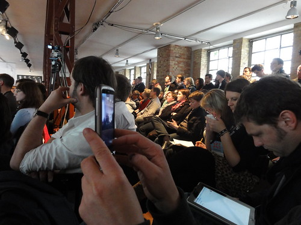
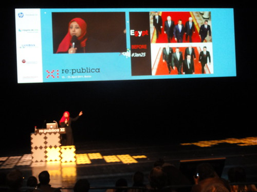
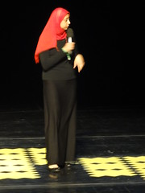
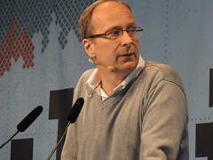
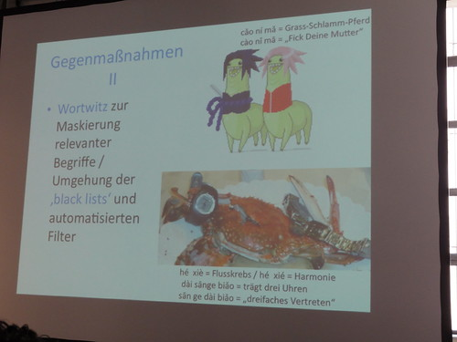
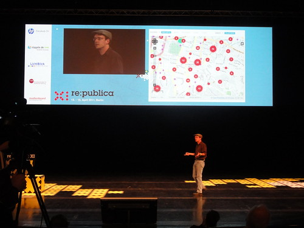
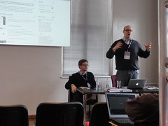
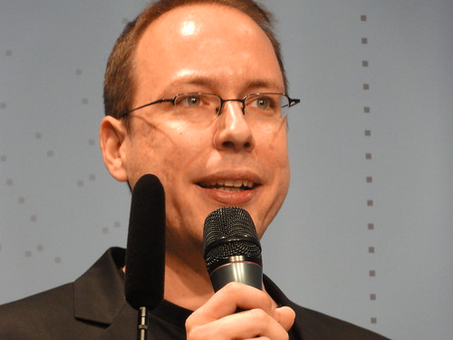
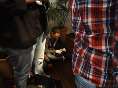

In diesem Jahr war ich zum ersten Mal in Berlin auf einer [re:publica](http://re-publica.de/11/ "re:publica 11") Bekannte von mir, die auch dort waren, waren eher weniger begeistert, ich habe auch einige enttäuschte Blogposts über das Event gelesen—allerdings auch ein paar sehr positive wie [das von Thomas Knüwer](http://www.indiskretionehrensache.de/2011/04/re-publica-11/#more-6753 "Re-Publica 11: Tschüss, Kalkscheune"). Mir hat die re:publica sehr gut gefallen, und ich glaube, dass die Unzufriedenen selbst nicht so genau wussten, was sie erwarten sollten oder konnten. Man musste sich in einem sehr umfangreichen Programm orientieren, und das heisst auch, man musste selbst abschätzen, was von welcher der Sessions zu erwarten war.

Mit [Julian Ausserhofer](http://julian.mur.at/blog/julian-ausserhofer/ "B00MBL1TZ. – Julian Ausserhofer") habe ich selbst eine [Session über Web Literacy](http://re-publica.de/11/blog/panel/web-literacy/#day14 "Web Literacy | re:publica 11") veranstaltet, und erst danach hatte ich den Kopf wirklich für Input frei. Mein klarer subjektiver Schwerpunkt—aber eben auch einer der Schwerpunkte der ganzen Veranstaltung: Soziale Medien und Politik, Veränderung der Öffentlichkeit durch Bloggen, Twittern usw.

### Noha Atef: Netzmentalität gegen Panzerhirne

Erster Höhepunkt für mich dabei: Der [Auftritt der ägytischen Aktivistin Noha Atef](http://re-publica.de/11/blog/panel/egyptian-protests-and-social-media-use-in-egypt/#day14 "Egyptian Social Media Stories | re:publica 11") (von Jillian C. York [gut dokumentiert](http://jilliancyork.com/2011/04/14/republica-11-noha-atef-on-egyptian-social-media-stories/ "Jillian C. York » re:publica 11: noha atef on egyptian social media stories")). Ich habe viel über die Revolution in den arabischen Ländern gelesen, und ich will mich weiter damit beschäftigen, aber ich habe nie vorher jemand von den unmittelbar Beteiligten persönlich erlebt.

 Für mich am bemerkenswertesten und überraschendsten: Die Haltung, der _mindset_, die sie verkörperte: eine Kombination aus Witz, Empörung, Wille, sich nichts mehr bieten zu lassen, Mut, Geschwindigkeit und—wenn man das so sagen kann—netzgeprägter Intelligenz. Am deutlichsten für mich, als Noha Atef auf die Frage antwortete, wie es ihr gelänge Polizisten zu fotografieren, damit sie über ihre Fotos im Netz von Folteropfern identifiziert werden könnten: Es sei für sie meist _very simple_:

> I smile. The policeman smiles. I take out my camera and I make the photo smiling.

Wenn man sich fragt, welche Rolle soziale Medien für die Revolution in Ägypten gespielt haben, darf man diese antiautoritäre Leichtigkeit, diesen lockeren _mindset_ nicht vergessen. Vielleicht war er das Element in der explosiven Mischung, mit dem die gravitätischen Autoritäten am wenigsten zurecht kamen. Ein Dokument der Dummheit des Regimes spielte Noha Atef als Video vor: ein paar Minuten aus dem Staatsfernsehen, ein hysterisch weinender Anrufer erzählt dem Moderator, dass der Aufstand auf dem Tahrir-Platz von lauter Englisch sprechenden jungen Leuten organisiert würde. Noha Atefs Vortrag zeigte aber auch—auch das war mir vorher nicht so klar—dass die Revolutionäre in Ägypten unter Lebensgefahr agierten, und dass ein wichtiges Motiv für sie war, wie das Regime mit ganz normalen Gleichaltrigen umging, mit denen sie sich identifizierten. Der [brutale Mord an Khaled Said](http://www.facebook.com/elshaheeed.co.uk "We are all Khaled Said") war ein Mord an jemand aus ihrer peer group und wurde so beantwortet.

### Öffentlichkeit hinter der großen Firewall

 Wenn man den Vortrag von Noha Atef gehört hat, bleibt einem das Foto des entstellten Kopfs des erschlagenen Khaled Said im Gedächtnis. An ein kaum weniger grausames Foto erinnert man sich nach dem [Vortrag von Lorenz Lorenz-Meyer über das Internet in China](http://re-publica.de/11/blog/panel/internet-social-media-und-die-r%C3%BCckkehr-des-politischen-in-china/ "Internet, Social Media und die Rückkehr des Politischen in China | re:publica 11"). Der riesige Reifen eines Lastwagens zerquetscht einen Dorfbürgermeister, der Politik für seine Leute gemacht hat. Auch in China kann Opposition tödlich sein, und auch China hat eine angeheuerte Truppen von Halbkriminellen und Kriminellen, die wie die ägyptischen Schlägerbanden unter Mubarak die Bevölkerung bei Bedarf unter Kontrolle halten.

Lorenz Lorenz-Meyers Vortrag war für mich ein weiterer Höhepunkt der re:publica. Lorenz-Meyer stellte den Sicherheitsapparat und die Politik gegen Oppositionelle dar, an der viele Instanzen mitwirken, so dass man unwillkürlich an Foucaults Sätze über die Macht denkt, die verteilt ist, nicht von einer zentralen Stellle aus Kontrolle ausübt. Lorenz-Meyer beschrieb aber auch, wie wichtig das Internet in China inzwischen ist, und auf wie unterschiedlichen Wegen Oppositionelle Freiräume ausnutzen oder sich Freiräume schaffen. Für uns Westler ist dabei sicher die Verwendung von Klangähnlichkeiten und Doppeldeutigkeiten chinesischer Wörter, die man wiederum durch Zeichen repräsentiert, am faszinierendsten.

Der China-Vortrag war für mich ein zweites wichtiges Schlaglicht auf die politische Bedeutung von Online-Medien—unter Bedingungen, die wir uns wohl kaum vorstellen können, wenn wir nicht, wie Lorenz-Meyer, die Sprache eines der Länder sprechen und tatsächlich in seine Kultur eingedrungen sind.

### Ushahidi: Krisenberichte und Crowdsourcing

Ein dritter Vortrag zu ganz anderen, aber ebenfalls globalen Themen war [Patrick Meiers Präsentation über Ushahidi](http://re-publica.de/11/blog/panel/ushahidi/#day15 "Changing the World, One Map at a Time | re:publica 11"). Vor der Bedeutung von [Ushahidi](http://www.ushahidi.com/ "Ushahidi :: Home") wusste ich zwar, aber ich habe mich nie vorher damit beschäftigt. Ushahidi ist (unter anderem) ein Mapping-Service, der bei Krisen und Katastrophen Kurznachrichten, sowohl via SMS als auch aus Web-Kanälen wie Twitter, geografisch anordnet, so dass sich eine Karte ergibt, die den aktuellen Stand der Dinge mit einer Genauigkeit zeigt, die ohne Crowdsourcing mit Mobiltelefonen und sozialen Medien nie zu erreichen wäre. Ushahidi wurde in Kenia gegründet und ist wohl die erste Web-Initiative aus Afrika mit globaler Ausstrahlung—mit Tunesien und Ägypten ist inzwischen eine weitere Gelegenheit, von Afrika zu lernen, dazu gekommen. Meier beschrieb vor allem, wie Freiwillige via Ushahidi nach dem Erdbeben vor einem Jahr Nachrichten aus Haiti in einem weltweiten Netz aus dem Kreolischen übersetzten und geokodierten; die Karte, die so entstand, war eines der wichtigsten Arbeitsmittel der Katastrophen-Helfer. Auch in Libyen ist Ushahidi aktiv, allerdings werden die Informationen dort zeitversetzt und nicht vollständig publiziert, um nicht Gaddafi beim Niedermetzeln von Aufständischen zu helfen.

 Wenn ich es richtig verstanden habe, arbeitet Ushahidi im Augenblick an Verfahren zur automatischen oder halbautomatischen Überprüfung der Glaubwürdigkeit von Äußerungen, damit würde Ushahidi einen journalistischen Angebot noch ähnlicher werden. Nur dass hier ein Ereignis nicht aus einer oder aus einigen wenigen Perspektiven gezeigt werden kann, sondern ein ganzer Ereignisraum. Ushahidi ermöglicht tatsächlich so etwas wie eine Schwarmintelligenz, das Gewinnen von Erkenntnissen durch die Zusammenarbeit von riesigen Gruppen, deren Teilnehmer sich nie persönlich kennen lernen werden.

### Lobbying für die Netzuser?

Zu Internet und Politik hier bei uns in Mitteleuropa fand ich zwei andere Sessions sehr spannend: [eine zu “Offenem Wissen” aus Linz](http://re-publica.de/11/blog/panel/freiheit-vor-ort/#day15 "Freiheit vor Ort? | re:publica 11")  und [die Vorstellung der _Digitalen Gesellschaft_ durch Markus Beckedahl](http://re-publica.de/11/blog/panel/die-digitale-gesellschaft-erkl%c3%a4ren/#day14 "Die Digitale Gesellschaft erklären | re:publica 11"). In Linz ist man bei den Themen _Open Data_ und _Open Access_ offenbar in Österreich am weitesten, dank Verständnis in der Stadt und der Ausdauer einer Gruppe von Aktiven, die das Internet vor allem als Werkzeug zur Verbreitung von offenem Wissen verstanden haben.

Die Vorstellung der [Digitalen Gesellschaft](http://digitalegesellschaft.de/ "Digitale Gesellschaft") war eines der Haupt-Events der re:publica 11, mit erheblichem Echo in der Blogospäre und wohl auch in den Mainstream-Medien. Es handelt sich um einen Verein, dem vorerst Markus Beckedahl von netzpolitik.org und die Leute um ihn herum angehören; später will man sich öffnen. Die Organisation soll vor allem dem Lobbying im Interesse der Netz-User dienen, dazu gibt es schon eine Kampagnen-Plattform. Ein Vorbild ist Greenpeace, ein anderes Avaaz.org. Man arbeitet bewusst in einer kleinen, geschlossenen Gruppe, um Initiativen nicht sofort zerreden zu lassen.

Dieser Ansatz provozierte, und es gab im Publikum viel Kritik, die Markus Beckedahl in seiner Position aber wohl eher bestätigt haben dürfte. Ich glaube, dass die Kritiker übersehen, dass die Stärke einer solchen Organisation nicht auf ihren internen Strukturen beruht, sondern darauf, ob die Kampagnen, die sie durchführt, Unterstützung finden. Es ist nicht undemokratisch, das mit einem kleinen aktionsfähigen Nukleus zu tun, denn allein kann diese Gruppe ohnehin nichts durchsetzen. Ich fand ziemlich eindrucksvoll, was Beckedahl über die Stärke des Lobbying von Konzernen z.B. bei Änderungen im Urheberrecht sagte. Industrie- und Branchenvertreter versuchen massiv, Gesetzgebung und politische Willensbildung zu beeinflussen, die User sind dagegen bisher kaum organisiert, und tatsächlich wird wohl noch am ehesten netzpolitik.org gehört, wo aber bisher die Möglichkeiten zu professionellen Aktionen fehlen.

### Kollektive Intelligenz im Betriebssystem?

Wahrscheinlich interpretiert sich jeder Teilnehmer seine Version eines Events wie der re:publica zurecht. Für mich war sie vor allem eine Bestandsaufnahme zum Thema _Web und neue politische Öffentlichkeiten_. Dazu passten auch Vorträge, die ich mehr am Rande mitbekommen haben, wie Gunter Duecks fast kabarettistische Präsentation zum [Internet als Gesellschaftsbetriebssystem](http://re-publica.de/11/blog/panel/das-internet-als-gesellschaftsbetriebssystem/#day14 "Das Internet als Gesellschaftsbetriebssystem | re:publica 11"). Ich vermute, dass dieser Vortrag viral weiterwirken wird.

<iframe title="YouTube video player" width="425" height="260" src="http://www.youtube.com/embed/MS9554ZoGu8" frameborder="0" allowfullscreen></iframe>

Ägypten, China, Ushahidi, die Kampagnen-Plattform _Digitale Gesellschaft_ und Open Government/Open Access vor Ort: Überall geht es um eine neue Beziehung von Individuum und Kollektiv, um kollektives Handeln, das mehr ist als das Handeln weniger Repräsentanten im Namen der Vielen, die selbst nicht aktiv werden. Dieses neue Agieren wird durch Technik möglich, oder: Es wird erkennbar, dass das Agieren Einzelner _für_ die Vielen, ob es sich bei den Einzelnen um Politiker, Beamte oder Journalisten handelt, zu einer veralteten Technik (Dueck würde sagen: zu einem veralteten Betriebssystem) gehört, und dass neue Formen der Vergesellschaftung jenseits der Alternative Einzelner/Masse möglich werden. Für mich ist dafür Ushahidi das zukunftsweisendste Beispiel, wenn man es als Möglichkeit versteht, tatsächlich kollektiv Nachrichten/Informationen von hoher Qualität zu produzieren. Was wäre möglich, wenn auch andere Informationen Ushahidi-artig gemappt würden, z.B. zur Arbeit von Wissenschaftlern, zur Situation an den Schulen in einem Gebiet oder auch zur Meinung der _Basis_ zu einer politischen Personalentscheidung? Das Interessante dabei ist, wenn ich es richtig verstehe, dass nicht einfach Informationen aggregiert werden, sondern dass ein verteilter redaktioneller Prozess dafür sorgt, dass die Informtionen kontextualisiert, geprüft und übersetzt werden. So ähnlich werden die Nachrichten der Zukunft vielleicht aussehen.

Julian und ich haben eine erste Version unseres Konzepts der web literacy publiziert; wir werden so bald wie möglich eine schriftliche Version veröffentlichen. Ich habe zwei andere Sessions über Medienkompetenz besucht und war eher enttäuscht. Medienkompetenz ist ein Thema, bei dem man offenbar sehr lange Binsenweisheiten ausbreiten kann. Ich bin mir nicht sicher, ob wir diesem Risiko selbst entgangen sind, bzw. ob wir nicht ins andere Extrem verfallen und ein Konzept ausarbeiten, dass mit der Alltagspraxis bei der Vermittlung von Webkompetenz noch zu wenig zu tun hat.

### Freue mich auf die re:publica 12

 Was hat mir noch gefallen? Eigentlich vor allem, dass bei der re:publica sehr unterschiedliche Gruppen der Internet-Szene zusammenkommen, außer den eher politisch Motivierten auch viele PR- bzw Social Media-Leute und viele aus der E-Learning-/Didaktik-Ecke. Vielleicht könnte man diese Interdisziplinarität noch weiter fördern und sich bewusster um die unterschiedlichen Tracks kümmern und durch Podiumsdiskussionen oder ähnliches Beziehungen zwischen den Themen hervorheben.

Vor allem ist eine solches Event natürlich auch eine Gelegenheit Leute zu treffen und mit Leuten zu reden. Das Interessante bei allen Formen des sozialen Lebens ist einfach die Konversation, und zu der gab es hier jede Menge Gelegenheit. Schon um die Gespräche fortzusetzen und um mich mit den vielen Leuten zu unterhalten, mit denen es diesmal nicht geklappt hat, möchte ich nächstes Jahr wieder zur re:publica fahren.

Für mich selbst merke ich mir noch etwas: Bei der re:publica geht es immer auch ums Bloggen, und Bloggen, das ist mir vor allem bei der [Diskussion mit Anke Gröner, Jörg Kantel, Don Dahlmann und Felix Schwenzel](http://re-publica.de/11/blog/panel/10-jahre-blogs-in-deutschland/#day15 "10 Jahre Blogs in Deutschland | re:publica 11") wieder deutlich geworden, ist improvisiertes, provisorisches Schreiben, subjektiv und ohne Angst vor Fehlern jeder Art. Ich muss selbst wieder mehr zum spontanen Schreiben finden. Bloggen ist wie Jazz, nicht wie klassische Musik, hat Dave Winer einmal gesagt, das ist bei mir etwas verloren gegangen. Ich werde versuchen, die gute Stimmung der re:publica im Gedächtnis zu behalten und schneller und lockerer zu schreiben, hoffentlich auch weniger ernsthaft und nicht hochtrabend.
