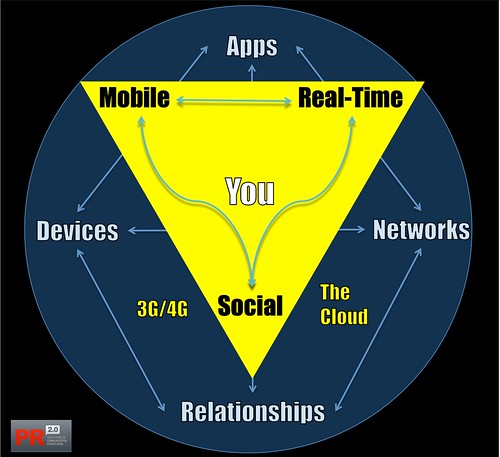

Heute findet zum letzten Mal die Veranstaltung [Webbasiertes Arbeiten](http://www.fh-joanneum.at/aw/home/Studienangebot_Uebersicht/fachbereich_internationale_wirtschaft/jpr/Studium/~urn/JPR_lvdetails/?alvid=4305288066&lan=de "Webbasiertes Arbeiten 2 |  Journalismus und Public Relations (PR) |  FH JOANNEUM Gesellschaft mbH :: University of applied sciences") mit [unserem jüngsten Bachelor-Jahrgang](http://www.fh-joanneum.at/aw/home/Studienangebot_Uebersicht/fachbereich_internationale_wirtschaft/jpr/Menschen/Studierende/~ccql/jpr_studierendeBA_2010/?lan=de "Jahrgang 2010 |  Journalismus und Public Relations (PR) |  FH JOANNEUM Gesellschaft mbH :: University of applied sciences") statt. Zum Abschluss möchte ich reflektieren, was wir besprochen haben—die Studenten haben im Lauf des Semesters selbst sechs Themen in Gruppen erarbeitet und ihrem Jahrgang präsentiert. Dann würde ich gerne überlegen, worauf es bei den digitalen Technologien für Journalisten und PR-Leute heute ankommt, was sie wissen und auf was sie achten sollten. Dazu hier ein paar Notizen:

### Die Megatrends bei der Infrastruktur: Cloud, Mobiles Computing, Echtzeit

Auf die drei Trends hinzuweisen, die in der Überschrift genannt werden, ist eigentlich trivial. Sie bestimmen aber die Landschaft, in der Medien—so wie es sich absehen lässt—in den kommenden Jahren konsumiert und produziert werden. Sie hängen zusammen, und man kann auch, wie es viele tun, einfach von _ubiquitärem Computing_ sprechen. Rechenpower und Daten sind immer und überall verfügbar, _at your fingertips_, wie es in den Marketingbroschüren heisst. Der Informationsraum kann zwar den physikalischen Raum besser als je abbilden, aber der Zugang zu ihm ist ortsunabhängig. Es gibt keine Zeitverzögerung mehr zwischem dem Senden und dem Empfangen von Informationen.

Brian Solis' [Goldenes Dreieck](http://www.flickr.com/photos/briansolis/4034100990/ "The Golden Triangle as Interpreted by Brian Solis | Flickr - Photo Sharing!") stellt gut dar, in welchem technischen (und sozialen) Kontext Medien heute produziert und konsumiert werden:

Grafik: Brian Solis

Praktisch bedeutet das, dass man die Werkzeuge der Cloud beherrschen muss, das sind neben Google Docs und anderen Dokument-Verwaltungen Tools wie [Dropbox](http://www.dropbox.com/ "Dropbox - Simplify your life") zum Speichern beliebiger Daten, oder Dienste wie [Evernote](http://www.evernote.com/ "Remember Everything | Evernote Corporation") für das persönliche Informationsmanagement sowie Services zum Archivieren und Publizieren von Bildern, Videos und anderen Medien. Es bedeutet, dass man als professionelle Kommunikatorin oder professioneller Kommunikator mobil arbeiten können muss, dass man weiss, wie man Medien mit mobilen Geräten produziert und bearbeitet und wie man dabei die Möglichkeiten der Cloud nutzt. Und es bedeutet, dass man die Möglichkeiten zur Echtzeitpublikation nutzen kann, angefangen mit Twitter oder [Audioboo](http://audioboo.fm/ "Audioboo"), bis hin zur Verknüpfung des eigenen Blogs mit Diensten wie [PubSubHubbub](http://code.google.com/p/pubsubhubbub/ "pubsubhubbub - A simple, open, web-hook-based pubsub protocol & open source reference implementation. - Google Project Hosting").

### Das offene Web, seine Ränder und seine Feinde

Die Medienabteilung des Internets ist nach wie vor das World Wide Web. Die Architektur des Webs hat die digitale Revolution im Medienbereich (und darüber hinaus) ermöglicht, und ihre Erhaltung und ihr Ausbau ist die Voraussetzung dafür, dass die Möglichkeiten der digitalen Technologien weiter ausgeschöpft werden. Das Web ist ein offenes System, das die Möglichkeiten zur losen Kopplung beliebiger Komponenten maximiert. Journalisten und PR-Leute müssen dieses System verstehen, um die Natur der Medien zu begreifen, mit denen sie arbeiten. Sie müssen wissen, dass sie sich in einem Hypermedium bewegen, in dem Informationen verlinkt und verlinkbar sind. Sie müssen wissen, dass die Medien, die sie produzieren, nicht aus Konstanten, sondern aus Variablen bestehen, die sich unterschiedliche Empfangsbedingungen anpassen (anpassen können und anpassen müssen, um z.B. von Menschen mit Behinderungen verwendet werden zu können). Sie müssen wissen, dass Medien im Web interaktiv sind, dass sie nicht nur aufgenommen, sondern von ihren Benutzern _bedient_ werden. Und sie müssen wissen, dass alles im Web weiterbearbeitet werden kann und soll, und zwar von Menschen und von Automaten wie den Rechnern von Suchmaschinen.

Das Web ist nicht etwas Naturgegebenes oder das Resultat einer unaufhaltsamen technischen Entwicklung, sondern es ist eine soziale Institution. Medienleute heute sollten die Prinzipien dieser Institution verstehen und wissen, wo sie verteidigt werden muss. Sie sollten auch genug technisches Wissen haben, um fragen zu können, ob Technologien zur offenen Architektur des Webs passen oder ob sie darauf angelegt sind, diese Offenheit einzuschränken. Sie sollten also z.B. den Unterschied zwischen einer iPhone-App und einer Web-App verstehen oder zwischen HTML5 und Flash.

### Digitale Kontrolle und digitale Emanzipation

Ich glaube nicht, dass man heute Kommunikatoren mit digitalen Technologien vertraut machen kann, ohne sich mit den Möglichkeiten zu beschäftigen, die diese Technologien für Kontrolle und Zensur bieten, und ohne andererseits das emanzipatorische Potenzial dieser Technologien zu diskutieren. Das wäre leicht, wenn beide Seiten dieser Technologien nicht miteinander verbunden wären. Begriffe wie _Informationsfreiheit_, _Öffentlichkeit_ und _Privatsphäre_, ohne die sich Journalismus und journalistische Ethik überhaupt nicht definieren lassen, müssen heute neu mit Inhalten gefüllt werden. Wer professionell mit Medien und Informationen zu tun hat, sollte wenigstens ein Grundverständnis für die technische Seite der Debatten haben, die hier stattfinden. Außerdem gehört es heute zum journalistischen Grundwissen, Zensurmaßnahmen von Staaten oder Instititutionen umgehen zu können und sicher, also durch nichts und niemand beobachtbar, mit Informanten kommunizieren zu können.

### Daten als der Arbeitsrohstoff

Wenn man im Web und für das Web arbeitet—und das tun heute schon fast alle in Journalismus und PR—arbeitet man mit digitalen Daten als Rohstoff. Das hat viele Implikationen auf verschiedenen Ebenen, ich möchte nur unsystematisch ein paar von ihnen erwähnen, die ich für wichtig für unsere Ausbildung halte:

1. Es gibt immer nur Daten in bestimmten Formaten, und diese Formate bestimmen, was man mit den Daten machen kann. Man sollte das wissen, wenn man Daten produziert, und z.B. den Unterschied zwischen einem Word- und einem HTML-Dokument verstehen, oder zwischen einer JPEG- und einer RAW-Datei. Wer andere über verschiedene Kanäle informieren will, sollte auch z.B. den Unterschied zwischen einem Twitter- und einem RSS-Stream kennen und einschätzen können, ob, wann und wie er den einen in den anderen übersetzen kann oder nicht.
    
2. Zu den wichtigsten Daten für Kommunikatorinnen gehören _Metadaten_, also Informationen über Daten. Sie bestimmen mehr von unserer medialen Umwelt als die meisten ahnen—von den [EXIF-Daten](http://digicam-experts.de/wissen/2 "Was sind EXIF-Daten?"), mit denen ein Foto auf einer Karte lokalisiert wird, bis zum Like-Button, über den Facebook ein Blog oder einen Eintrag in der Internet Movie Database mit einem Profil verbindet. Ob es zum [Semantischen Web](http://de.wikipedia.org/wiki/Semantic_Web "Semantisches Web – Wikipedia") kommt oder nicht: Metadaten werden in der absehbaren Zukunft eine noch weitere größere Rolle spielen, und Informationsprofis sollten über die Metadaten Bescheid wissen, mit denen sie ihre Produkte ausstatten können oder sollen.
    
3. Daten können mit Algorithmen weiterverarbeitet werden, und oft erschließen sie Informationen auch nur, wenn sie bearbeitet werden. Es gibt viele Diskussionen darüber, ob Journalisten heute programmieren können sollten. Meines Erachtens sollten sie wenigstens verstehen, was Programmieren ist und mit Programmierern zusammen arbeiten können.
    
4. Bestimmte Operationen, wie Speichern, Konvertieren und Editieren, sind bei beliebigen Daten möglich und nötig. Mein Kollege [Boris Böttger](http://www.fh-joanneum.at/aw/home/Studienangebot/fachbereich_internationale_wirtschaft/juk/Menschen/Team/~baqn/juk_teamdetails/?perid=-1025000000000009375&lan=de "Persönliche Details |  Journalismus und Public Relations (PR) |  FH JOANNEUM Gesellschaft mbH :: University of applied sciences") meint zu Recht, Studenten sollten heute in _allgemeines Datenhandling_ eingeführt werden. Leider findet das in den Schulen wohl kaum statt, wo man stattdessen den Umgang mit alten proprietären Programmen wie Word und Excel als Informatik unterrichtet.
    

### Informationsmanagement als permanente Aufgabe

Kommunikationsprofis müssen für sich und für andere Informationen und Medien organisieren oder _kuratieren_—beides ist im Web nicht trennbar. Dazu brauchen sie Werkzeuge wie Content Management Systeme oder Wikis; sie müssen mit Newsfeeds und Podcasts umgehen können und sie müssen wissen, wie ihre Adressaten diese Tools verwenden. Journalisten und PR-Leute müssen nicht zu Archivaren werden, aber sie müssen z.B. ein Mashup aus verschiedenen Feeds erstellen oder einen Social Media Newsroom einrichten können. Ich glaube, dass beim Informationsmanagement die Feed- und Filtertechnologien für Leute, die journalistisch im weitesten Sinne arbeiten, am wichtigsten sind. Zum Informationsmanagement gehört aber auch der Umgang mit Datenbanken und eine professionelle Arbeit mit Suchmaschinen.

### Arbeiten in sozialen Netzen

Im Web sind Daten der Rohstoff für die Modelle der Wirklichkeit, Newsfeeds der wichtigste journalistische Zugang zu diesen Daten. Produktion und Rezeption von Nachrichten werden zunehmend durch Netzwerke gesteuert. Wie man vernetzt ist, bestimmt, welche News man z.B. bei Facebook oder Twitter erhält, und immer mehr wird auch vernetzt produziert, sei es, dass Daten kollektiv geprüft und ausgewertet werden wie bei [Ushahidi](http://www.ushahidi.com/ "Ushahidi :: Home"), sei es dass die journalistische Arbeit verteilt wird und bestimmte Knoten—wie Wikileaks—für Informationsbeschaffung, andere für das Factchecking zuständig sind. Zum Arbeiten in solchen Netzwerken gehören Identitäts- und Reputationsmanagement, die auch eine technische Komponente haben. Das Arbeiten in Netzwerken—bis zu Offline-Fortsetzungen z.B. bei BarCamps—ist vielleicht die eigene Schnittstelle zwischen der technischen und der inhaltlichen Seite professioneller Medienarbeit heute. Es hat für viele schon die Arbeit in den hierarchischen Produktionsorganisationen der Industrie- und Massenproduktionsgesellschaft abgelöst

**PS nach der ersten Lektüre:** Bei weitem nicht alles von dem Genannten unterrichten wir tatsächlich. Ich habe oben eher eine Wunschliste formuliert. Vieles bleibt der Eigeninitiative der Studierenden überlassen. Am wichtigsten ist es sicher, dass alle durch das Studium befähigt werden, sich zu diesen Themen selbst auf dem Laufenden zu halten.
