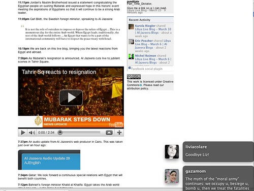

Zu Beginn dieses Semesters habe ich an der TU Graz in der Ringvorlesung [Gesellschaftliche Aspekte der Informationstechnologie](https://online.tugraz.at/tug_online/lv.detail?cperson_nr=24990&clvnr=145014 "Vorlesungsbeschreibung der TU Graz") über _Journalismus als soziale Technologie_ gesprochen. In ähnlicher Form hatte ich den Vortrag auch im Vorjahr gehalten. Danke an [Martin Ebner](http://elearningblog.tugraz.at/ "e-Learning Blog") für die Einladung! Ich bin erst jetzt dazu gekommen, den Vortrag zu verschriftlichen, dabei habe ich vieles um- und manches neu formuliert. Ich publiziere ihn hier, weil ich auf das darin formulierte Modell für Newsmedien im Web immer wieder zurückkomme und es gerne zur Diskussion stellen möchte.

Ich verwende absichtlich die Form eines Blogposts, denn der Text ist noch nicht zuende redigiert, und viele Fragen bleiben offen. Das implizite Konzept des Webs geht vor allem auf [Roy Fielding](http://www.ics.uci.edu/~fielding/pubs/dissertation/top.htm "Architectural Styles and the Design of Network-based Software Architectures") und [David Weinberger](http://www.smallpieces.com/ "Small Pieces Loosely Joined") zurück. Um eine ausdrückliche Journalismus-Definition habe ich mich ebenfalls gedrückt; ich verwende das Wort im eher alltagssprachlichen Verständnis, im Sinne von Nachrichtenproduktion für ein breiteres Publikum. Das aus dem [Model-View-Controller-Pattern](http://en.wikipedia.org/wiki/Model%E2%80%93view%E2%80%93controller "Model–view–controller - Wikipedia, the free encyclopedia") abgeleitete Modell für das "neue Nachrichtenuniversum" ist als rhetorisches Bild zu verstehen, was ihm hoffentlich nicht alle Aussagekraft nimmt.

Eine Videoaufnahme des Vortrags ist noch [online](http://curry.tugraz.at/ZID%20VL/watch/276.aspx "ePresence Präsentations Portal - Journalismus als soziale Technologie"), ebenso die [dazu gehörende Präsentation](http://prezi.com/a6y_knzsdxuv/journalismus-als-soziale-technologie-2011/ "Journalismus als Soziale Technologie 2011 by Heinz Wittenbrink on Prezi").

* * *

Ich werde in diesem Vortrag über Onlinejournalismus sprechen. Wie bei [meinem Vorredner](http://elearningblog.tugraz.at/archives/4301?utm_source=feedburner&utm_medium=feed&utm_campaign=Feed%3A+elearning_tugraz+%28e-Learning+Blog%29 "[Gadi2011] Vorträge zur Desinformation und Online Journalismus – e-Learning Blog") geht es dabei um Manipulation und Wahrheit und die Veränderungen im Herausfinden von Wahrheit durch das Netz.

### Soziale Technologien: Instrumente oder Nachfolger des Journalismus?

Ich habe den Vortrag extra mit einem Titel belegt, den viele Journalisten hassen werden, weil sie nicht gerne als Techniker bezeichnet werden. Viele Journalisten—da ich selbst welche ausbilde, weiss ich das—kommen mit Technik nicht gerne in Berührung. Ich glaube dennoch einerseits, dass sich Journalismus überhaupt und zu allen Zeiten als soziale Technologie beschreiben lässt—wie man das Soziale wahrscheinlich nie von Technologien lösen kann. Auf diesen Zusammenhang, der mir selbst vor allem durch die Lektüre Bruno Latours immer deutlicher wird, möchte ich aber hier nicht eingehen.

Unabhängig davon besteht Journalismus immer aus den unterschiedlichsten Techniken, dem, was Journalistinnen und Journalisten als "ihr Handwerk" lernen. Storytelling ist eine Technik. Journalisten verwenden investigative Techniken, Techniken der Interviewführung usw. Diese Techniken ließen sich schon in der Vergangenheit nicht von dem lösen, was auch Sie wahrscheinlich unter "Technik" verstehen, also Machinen, die menschliche Arbeiten automatisieren und irgendwie gesteuert werden. Journalismus gäbe es nicht ohne die Technik des Buchdrucks, ohne Fernsehtechnik und ähnliches. Der Journalismus besteht immer in der intelligenten Anwendungen solcher Techniken, um Nachrichten zu vermitteln.

Mir _sozialen_ Technologien meine ich das, was man auch als _Soziale Medien_ bezeichnet und oft mit dem Ausdruck _Web 2.0_ assoziiert. Durch das Web und die digitalen Technologien kommt es zu grundsätzlichen Änderungen, und zwar so weit, dass vielleicht gar nicht mehr viel von dem übrig bleibt, was wir jetzt als Journalismus bezeichnen.

Meine These ist, dass sich das, was wir als Journalismus kennen, in ein Bündel von Anwendungen sozialer Technologien auflösen wird. Mit dem älteren Journalismus gemeinsam ist diesen Technologien das Ziel, Nachrichten zu finden und zu verbreiten. Mit dem Journalismus als Institution. oder besser, mit unseren journalistischen Institutionen, dürften die [New News](http://www.technologyreview.com/communications/24175/ "The New News - Technology Review"), die News im Web, etwas soviel Ähnlichkeit haben wie jene mit dem Tagesschriftum vor der Erfindung des Buchdrucks.

Ich möchte versuchen, auf dieses Phänomen einen Blick zu gewinnen, der nicht vor allem von den journalistischen Institutionen geprägt ist, die wir kennen. Mir ist klar, dass das sehr schwierig ist. Ich verwende als Hilfsmittel ein technisches Konzept, das ich hoffentlich nicht zu sehr zweckentfremde (ich spreche an einer technischen Universität und bitte um Nachsicht, wenn ich technische Termini zu lax gebrauche): Ich meine das aus der Software bekannte **MVC-** oder **Model-View-Controller**\-Designpattern. Wie kann man Nachrichten im Web beschreiben, wenn man von diesem Pattern ausgeht? Was charakterisiert die **Modelle**, also die Repräsentationen der Realität, was die _Views_ auf diese Modelle, also die Ansichten der Modelle, und was die **Controller**, also die Mittel, um die Modelle und Views zu verändern, anzupassen und zu manipulieren? Ich versuche also zu überlegen, wie Nachrichten im Web erzeugt und verbreitet werden können—relativ unabhängig von dem, was bisher Journalismus war.

Ich glaube, dass für das Nachrichtenuniversum im Web drei Elemente charakteristisch sind:

- **Verlinkte Daten** als _Modelle_—als der _Stoff_, aus dem die Nachrichten bestehen, als das Material, mit dem alle arbeiten, die Nachrichten verbreiten, ob man sie nun Journalisten nennt oder nicht;
    
- **Streams** und **Filter** als _Views_—als Zugänge zu den Nachrichten, wenn man so will: als journalistische Basisformate;
    
- **Soziale Netze** als _Controller_—miteinander online verbundene und kooperierende Menschen, als Kontollinstanz, die sowohl die Streams und ihre Filter beeinflussen und steuern können als auch die verlinkten Daten, die die Inhalte der Nachrichtenstreams bilden.
    

Die drei Komponenten dieses Musters hängen voneinander ab, sie sind aber zugleich autonom. Die Techniken und Services, auf denen sie beruhen, werden weitgehend unabhängig voneinander entwickelt. Es lässt sich relativ einfach beschreiben, wie sie aufeinander bezogen sind und dass sie zusammen ähnliches leisten wie der ältere Journalismus. Es lassen sich aber für viele ihrer Eigenschaften nicht leicht Entsprechungen in der Welt der analogen Medien finden. Sie sind mit anderen Phänomenen des Webs verbunden, die es im analogen Journalismus nicht gibt, wie den Publikations- und Diskussionsmöglichkeiten für alle Teilnehmer oder den Suchmaschinen. Nachrichten werden dabei immer mehr in Kontexten verbreitet, die bisher vom Journalismus bewusst ausgeschlossen wurden, z.B. in der politischen Kommunikation von Parteien und NGOs oder über die [Social Media Newsrooms](http://klauseck.typepad.com/prblogger/2009/06/social-media-newsroom.html "PR Blogger: 21 Beispiele für den Social Media Newsroom") von Unternehmen.

### Beispiel: Die Revolution in Ägypten und Al Jazeera

Ich möchte Ihnen zur Einleitung einen Screenshot einer Seite von Al Jazeera zur Revolution in Ägypten zeigen:

Der Screenshot ist vom 23. März und zeigt das Al Jazeera-Blog am Tag des Rücktritts von Mubarak. Ein Bild der vollständigen Seite finden Sie [hier](http://www.flickr.com/photos/heinzwittenbrink/5570119749/ "Al Jazeera-Screenshot").

Diese Seite kommt zwar von einer journalistischen Publikation, dem Sender Al Jazeera, sie unterscheidet sich aber erheblich von herkömmlichen journalistischen Formaten. Sie ist eine Sammlung von kurzen Posts, in die Material aus unterschiedlichen Quellen eingestreut ist. Videos, die Al Jazeera selbst produziert hat, werden über YouTube integriert, aber auch Fotos, die von Beteiligten gepostet wurden. Man kann einen [Audioboo](http://audioboo.fm/ "Audioboo") abspielen, das ist ein kurzer Podcast, den man direkt vom Handy aus in Web schicken kann. Sie sehen, dass professionelle Journalisten und am Ereignis Beteiligte dieselben Formate benutzen. Zugleich wird aber auch über die Berichte diskutiert; Sie können oben rechts Kommentare zum Al Jazeera-Libyen-Blog erkennen. Darunter sieht der Benutzer über ein Facebook-Plugin, welche der eigenen Freunde Inhalte von AlJazeera empfohlen haben. Hier nimmt also meine eigenes soziales Netzwerk an der Berichterstattung teil. Während ich diesen Screenshot gemacht habe, haben mir meine Twitter-Followees Nachrichten geschickt; Sie sehen rechts unten eine Nachricht zum Tod von Liz Taylor und einen Tweet von [gazamom](https://twitter.com/#!/gazamom "Laila El-Haddad (gazamom) auf Twitter"), die übrigens über Twitter tendenziell manipulative PR für die Palästinenser macht. Interessant ist auch noch, dass das Ganze unter einer [Creative Commons](http://creativecommons.org/ "Creative Commons")\-Lizenz zur Verfügung gestellt wird. Das heisst, dass die User das Material weiterverwenden und auch bearbeiten dürfen.

Der Screenshot zeigt, wie eng journalistische Formen und Webtechnik sich durchdringen. Zugleich sieht man, wie die Rollen der Journalistinnen und Journalisten und des ganzen Mediums sich verändert haben, und wie das Publikum—das eben nicht mehr nur Publikum ist— sich an der Berichterstattung beteiligt. In nuce kann man erkennnen, was ich in diesem Vortrag weiter ausführen möchte:

1. Al Jazeera arbeitet mit unterschiedlichen digitalen Formaten (Blogpost, YouTube-Video, Audioboo). Die einzelnen Fragmente sind miteinander verknüpft können aber auch in anderen Konstellationen vorkommen, weil sie alle für sich im Web erreichbar sind.
    
2. Die Nachrichten erreichen die Benutzerinnen in verschiedenen Streams oder Feeds. In die Al Jazeera-Seite—die selbst als Live-Blog, also streamartig angelegt ist, ist Material aus Audioboo und YouTube eingestreut, das man auch für sich in Streams empfangen könnte. Hinzu kommen Streams mit den Kommentaren und Informationen von Facebook—abgesehen von den beiden Meldungen aus meiner Twitter-Timeline, die ich auf meinem Mac über [Growl](http://growl.info/ "Growl") erhalten habe.
    
3. Es berichten nicht nur Journalisten, sondern auch sogenannte Amateure, vor allem Beteiligte. Zugleich werden die Informationen von Personen, die zu meinem sozialen Netz gehören, kommentiert, bewertet und gefiltert. Es gibt so etwas wie ein kollektives Eigentum an den Nachrichten, sie werden in einem Netzwerk produziert und ausgetauscht, in dem, wenn man es näherungsweise ausdrückt, sich die Aktivitäten der Journalistinnen und Journalisten und der übrigen Beteiligten nur graduell unterscheiden.
    

Ich möchte Ihnen mit diesem Beispiel zeigen, dass sich durch das Web nicht nur einzelne Elemente des Journalismus in einem ansonsten stabilen Gefüge verändert haben, sondern dass das ganze System, der ganze Bauplan der Erzeugung und Verbreitung von News sich verändert hat. Im Universum der Online-Nachrichten treten nicht nur neue Elemente an alte Positionen, sondern es gibt neue Positionen, neue Beziehungen zwischen diesen Positionen und neue Elemente auf diesen Positionen. Und, um das Ganze noch unvertrauter zu machen: Die Dynamik dieses Systems unterscheidet sich im Tempo, im Antrieb und wohl auch in der Richtung von der Welt der Verlage und Medienhäuser, die sich noch immer mit dem Journalismus verwechselt.

### Modelle: Verlinkte Daten

Mit verlinkten Daten sind nicht nur [Linked Data](http://linkeddata.org/ "Linked Data | Linked Data - Connect Distributed Data across the Web") im technischen Sinn gemeint (vielleicht kennen Sie diese Ausdruck, der sich auf Technologien des [Semantic Web](http://de.wikipedia.org/wiki/Semantisches_Web "Semantisches Web – Wikipedia") bezieht). Allen Formen der Information im Netz ist gemeinsam, dass sie verlinkte Daten benutzen. Diese Aussage ist trivial, denn das Web wurde und wird als [Hypermedia-System](http://vcampus.uom.ac.mu/vciltproject/IT_proficiency/Site/htmlfiles/Paradigms%20161101/03-Nelson.htm "Ted Nelson and distributed hypermedia system") entwickelt. Miteinander verknüpfte Daten, in denen die Benutzer interaktiv navigieren können, bilden so etwas wie den Stoff, aus dem Information im Web gemacht ist. Selbst die einfachste Textseite im Web ist über ihren URL mit anderen verknüpfbar und tatsächlich verknüpft, sobald eine Suchergebnisliste oder auch nur ein Inhaltsverzeichnis auf einem Server auf sie verweist.

Viele Journalisten, die bisher mit anderen Medien gearbeitet haben, verstehen nicht, dass sie es im Web mit einem anderen Rohstoff für ihre Produkte oder Leistungen zu tun haben. Sie haben das Gefühl, in einer unnatürlichen Umwelt zu arbeiten. Sie erkennen nicht, dass es für ihre Arbeit relevant ist, dass sie

- mit Daten arbeiten, die algorithmisch verarbeitet werden können und schon algorithmisch verarbeitet werden müssen, um nur—z.B. in einem Browserfenster—dargestellt zu werden;
    
- diese Daten hypermedial miteinander verbunden sind oder miteinander verbunden werden können.
    

Das Web bietet damit völlig andere Möglichkeiten, über die Wirklichkeit zu berichten, als die analogen Formate. Dabei nimmt es allerdings die Formate aus der analogen Welt in sich auf. Auch die Qualitätskriterien dieser Formate—von der Meldung bis zur Videodokumentation—werden im Web nicht bedeutungslos, sie müssen nur für dessen neue Kontexte übersetzt werden.

Ich setze hier Journalismus im _Netz_ und Journalismus im _Web_ als einem globalen Hypermedia-System miteinander gleich. Die anderen Teile des Internet haben für den Journalismus allenfalls untergeordnete Funktionen.

#### Vom HTML-Link zum Mashup: Formate für verlinkte Informationen

Zur Illustration möchte ich einige webtypische, journalistisch relevante Verknüpfungsmöglichkeiten von Daten aufzählen:

- _HTML-Links_, die von einer Stelle in einem Dokument zu einem anderen führen; sie sind die einfachste Form von Links, auf der aber alle anderen aufbauen.
    
- _Tags_, Stichwörter, mit denen Informationen einerseits geordnet und andererseits gemeinsam aufgerufen werden können; Beispiele sind die Hashtags bei Twitter oder die Stichwörter, mit denen man bei YouTube oder Delicious Inhalte klassifiziert.
    
- _Geotags_ (und andere Formen der Geocodierung von Informationen), mit denen Informationen Orten zugeordnet und darüber auch mit anderen Informationen zu denselben Orten verbunden werden können.
    
- Ich kann [Mikroformate](http://de.wikipedia.org/wiki/Microformat "Mikroformate – Wikipedia") (und andere Formen der _semantischen Kodierung_) benutzen, also innerhalb von HTML-Dokumenten Daten semantisch auszeichnen, um auch da wieder spontane Verknüpfungen zu ermöglichen. Sie schaffen die Voraussetzung dafür, automatisch zu erkennen, welche Informationstypen—von der Adresse bis zur Produktbesprechung—innerhalb eines Dokuments vorkommen, so dass zusammengehörende Informationen aus unterschiedlichen Quellen gemeinsam dargestellt und verarbeitet werden können.
    
- _Mashups_, also Kombinationen unterschiedlicher Arten von Informationen; dabei werden Daten aus unterschiedlichen Quellen dynamisch kombiniert. Vielleicht kennen Sie [Yahoo Pipes](http://pipes.yahoo.com/pipes/ "Pipes: Rewire the web"). Pipes ist eine Möglichkeit, auf sehr einfache Weise, sogar nur durch Zusammenklicken, Mashups herzustellen.
    
- _Spreadsheets und Datenbanken_, in denen strukturierte Daten durchsucht, verbunden und weiterverarbeitet werden können. von Beginn an hat es zu den Zwecken des World Wide Webs gehört, Daten, die bereits vorliegen, zu erschließen.
    
- Ich kann Daten über _APIs_ (Application Programming Interfaces) ansprechen und von einer Applikation in eine andere ziehen, sie teilen usw.
    

Journalismus spielt sich also in einer ganz anderen Welt ab als der der analogen Medien. Relevanz ist dabei immer auch Relevanz der Verknüpfungen, sie hängt ab von der Kontextualisierung der Information. In vielen Fällen ist es dabei nicht möglich zu überprüfen, ob die verknüpften Informationen zuverlässig sind. Die Konsistenz der verlinkten Informationen und ihre Plausibilität angesichts des bereits vorhandenen Wissens über ein Thema spielen für die Beurteilung eine wichtige Rolle, können aber&mdash,nicht anders als herkömmlich fact checking-Praktiken, trügerisch sein.

#### Zwischen Link- und Datenjournalismus

Welche Konsequenzen ergeben sich daraus, dass ich es im Web immer mit verlinkten Daten zu tun habe:

- Kein journalistisches Produkt im Web ist abgeschlossen. Es gibt nicht **die** Story oder **die** Nachricht, sondern nur Teile von Geschichten, so etwas wie die _Takes_ in einem Gespräch, Sequenzen von Äußerungen, Fragen und Antworten. Das bedeutet nicht, dass die Elemente ohne Regeln verknüpft würden, auch nicht, dass Zusammenfassungen, Einleitungen und ähnliches überflüssig geworeden wären. Aber die Regeln entsprechen eher denen der mündlichen Kommunikation.

Daten lassen sich im Web auf die unterschiedlichsten Weisen verknüpfen, wobei immer wieder neue Verbindungsmöglichkeiten entwickelt werden, etwas die Verlinkung von Informationen mit einem Benutzerprofil über den Facebook-[Like Button](https://developers.facebook.com/docs/reference/plugins/like/ "Like Button - Facebook-Entwickler"). Ich habe als Produzent wie als Benutzer im Web nie nur das Einzeldatum, alle Daten im Web sind immer miteinander verknüpft. Für den Journalismus ist eine Konsequenz das, was Theoretiker _Linkjournalismus_ nennen. Das heisst: Ich brauche nicht mehr ein Ereignis komplett zu covern. Stattdessen habe ich, wie sie es bei Al Jazeera gesehen habe, meine Information und verlinke sie sinnvollerweise dann zu anderen Quellen, wenn diese besser sind. Das drückt der berühmte Satz von [Jeff Jarvis](http://www.buzzmachine.com/ "BuzzMachine") aus:

> Do what you do Best, and link to the rest!

Das ist _die_ Devise des Onlinejournalismus. Herkömmliche Zeitungen und Medienhäuser versuchen dagegen, alle Informationen alleine, also ein "Vollprogramm", anzubieten.

- Aktionen der Benutzer sind ein integraler Bestandteil journalistischer Produkte im Web. Zum Link gehört ja, dass man ihm folgen kann, aber nicht muss. Außerdem können die Daten immer wieder neu verarbeitet werden, es steht jedem Benutzer frei, beliebige Tools zu verwenden, um mit seinen Informationen umzugehen.

Auch dieser zweite Aspekt ist eine Konsequenz aus den Links: Auf ein Link muss man klicken, d.h. die User oder Userinnen sind aktiv, und das Angebot selbst ist _interaktiv_. Ich muss als Autor diese Aktivität mitberücksichtigen. Selbst wer das will, kann im Web nichts produzieren, was er anderen einfach vorgibt, sondern nur Angebote, bei denen andere mitarbeiten. Mit anderen Worten: Ich muss einkalkulieren, dass die Leser auf ganz verschiedene Weise mit dem umgehen, was ich ihm sage—sie werden schätzen, wenn ich das berücksichtige. Das verändert die journalistische Arbeitsweise im Kern, und es ist etwas, das für klassische Journalisten schwer zu begreifen ist.

- In journalistischen Produkten können unterschiedliche Arten von Daten miteinander kombiniert werden (_Multimedialität_). Multimedialität ist eigentlich ein zu alter, ein Vor-Web-Ausdruck für das, was im Web möglich wird. Ich kann beliebige unterschiedliche Genres, Datentypen, Visualisierungen usw. miteinander kombinieren, nicht nur die schon bekannten Medien. Ich kann nicht nur Audio und Video benutzen, sondern z.B. eine Facebook-Seite, Twitter-Streams, Widgets für Fragen an die Leser usw.

Damit verschwindet die klassische Trennung von Fernseh-, Radio- Textjournalismus usw. Zunehmend spielen auch Daten selbst, also Dinge, die von einem Programmierer kontrolliert werden, eine wichtige Rolle in journalistischen Produkten oder Diensten, etwa in interaktiven Inforgrafiken.

- Journalistische Produkte im Web können automatisch weiterverarbeitet werden; dabei hängt es vom Datenformat ab, welche Verarbeitungen möglich sind (_Verarbeitbarkeit_). Das heisst unter anderem: Ich muss mich auch darum kümmern, dass die Daten, die ich produziere, möglichst gut weiterverarbeitet werden können.

Auch diese Weiterverarbeitbarkeit verändert die Produktion. Zu ihr gehört das Suchmaschinen oder Social Media-orientierte Schreiben, aber auch das Einstellen von Medien auf Sites wie YouTube, die eine weite Verbreitung von Medien sicherstellen. Eine Konseqzenz der Weiterverabeitbarkeit ist das _Prinzip Microcontent_—Web Inhalte bestehen aus möglichst kleinen und möglichst selbständigen Bruchstücken, die von Benutzern (und Automaten) gesammelt, geteilt und kombiniert werden können.

### "A fundamental way newspaper sites need to change"

Als wichtigen und exemplarischen Text zum Datencharakter journalistischer Informationen und seinen Konsequenzen empfehle ich Ihnen \[A fundamental way newspaper sites need to change\](http://www.holovaty.com/writing/fundamental-change/ \*A fundamental way newspaper sites need to change | Holovaty.com") von Adrian Holovaty. Holovaty, selbst Journalist und Programmierer, daneben übrigens auch Musiker, ist ein Pionier des _Datenjournalismus_. Holovaty hat schon früh festgestellt, dass sich journalistische Produkte aufgrund des Datenchqrakters ihrer Inhalte verändren müssten. In diesem Artikel demonstriert er, dass sehr viele Informationen in jedem gewöhnlichen Zeitungsartikel strukturiert sind, also zu bestimmten semantischen Kategorien gehören, die man in einem digitalen Medium verwenden kann, um Informationen zueinander in Beziehung zu setzen. Die Information, dass die Person A am Ort B zum Zeitpunkt C gestorben ist, kann ich z.B. in einer Datenbank erfassen und weiterverarbeiten. Diese Informationen sind auch im Artikel der Papierzeitung vorhanden—es handelt sich hier also nicht um etwas _Unjournalistisches_, _Technisches_—nur erlaubt es das Medium Papier nicht, diese Information über ihre Verbreitung hinaus automatisch weiterzuverarbeiten. Holovaty fordert, dass Zeitungen im Web die Informationsschätze heben, die in ihnen verborgen sind. Wie man das machen kann, hat er in wichtigen Projekten selbst vorgemacht; wir werden gleich ein Beispiel dafür sehen.

#### Beispiele: Daten im Journalismus

Datenjournalismus ist inzwischen zu einer eigenen journalistischen Gattung geworden&,dash;als ich diesen Vortrag vor einem Jahr gehalten habe, habe ich das Wort gar nicht verwendet. Ich möchte sie auf ein paar Beispiele für Datenjournalismus hinweisen. Was ich mit _verlinkten Daten_ meine, geht aber über den Datenjournalismus hinaus und bezieht sich alle Typen von im weitesten Sinne journalistischen Informationen, die überhaupt auf die Besonderheiten des Mediums Rücksicht nehmen.

[EveryBlock](http://www.everyblock.com/ "EveryBlock") ist ein Projekt Adrian Holovatys. Wir haben ihn eben schon als Autor eines Artikels kennen gelernt. Ein Vorgänger-Projekt Holovatys war [chicagocrime.org](http://www.holovaty.com/writing/chicagocrime.org-tribute/ "In memory of chicagocrime.org | Holovaty.com"). Auf dieses Site konnte man erfahren, welche Verbrechen in Chicago in welcher "neighbourhood" begangen worden waren. Das ist möglich, weil in den USA sehr viel mehr Polizeiinformationen als hier in Europa veröffentlicht werden. Dieses Projekt wurde dann im Rahmen eines Forschungsprojekts verallgemeinert, und daraus ist die Site everyblock.com geworden. Dort werden bundesstatistische Informationen, Polizeiberichte uns so weiter heruntergebrochen auf die Ebene von Stadtvierteln. Ich sage also, wo ich gerade bin bzw. wofür ich mich interessiere, z.B. den South Loop in Chicago, und dann erhalte ich Polizeiberichte, Reviews und andere Berichte aus dem Gebiet und gleichzeitig Informationen von den Leuten, die dort wohnen—das ist der soziale Netzwerk- und der Controller-Aspekt, auf den ich später eingehe. EveryBlock der ersten und der interessantesten Projekte des Datenjournalismus, der jezt beinahe Mode geworden ist.

Die Technik von [Many Eyes](http://www-958.ibm.com/software/data/cognos/manyeyes/ "Many Eyes") wurde von IBM entwickelt. Sehr viele Leute können statistische Daten liefern, die werden dann auf einer Site zusammengefasst und visualisiert werden. So etwas lässt sich zum Beispiel verwenden, um [die Einkünfte von Parlamentariern mit denen von Angestellten des öffentlichen Dienste zu vergleichen](http://www-958.ibm.com/software/data/cognos/manyeyes/visualizations/tax-funded-salaries-canadian-parliam "Many Eyes : Tax-funded salaries Canadian parliamentarians vs. public sector").

<iframe src="http://player.vimeo.com/video/14777910?title=0&amp;byline=0&amp;portrait=0" width="480" height="270" frameborder="0"></iframe>

[Journalism in the Age of Data](http://vimeo.com/14777910) from [Geoff McGhee](http://vimeo.com/geoffmcghee) on [Vimeo](http://vimeo.com).

Zu den besten Darstellungen des Data Journalism gehört diees lange Video der Stanford University. Auf der [dazugehörenden Website](http://datajournalism.stanford.edu/ "Journalism in the Age of Data: A Video Report on Data Visualization by Geoff McGhee"), die ich ebenfalls empfehle, finden Sie Zusatzinformationen.

Der Guardian profiliert sich als einer der wichtigsten Vorreitern des neuen Journalismus. Er bietet seine Inhalte auf einer eigenen [Open Platform](http://www.guardian.co.uk/open-platform "The Guardian Open Platform | Open Platform | guardian.co.uk") über Application Programming Interfaces an. Sie können damit nicht nur rechtlich, sondern auch technisch für andere Webangebote verwendet werden. Als Erlösmodell ist bisher wohl an die Teilung von Werbeeinnahmen gedacht. Der Guardian verfährt also mit seinen Inhalten ähnlich, wie z.B. Twitter mit seinen Daten: Die Möglichkeiten, sie weiterzuverarbeiten, werden nicht eingeschränkt sondern erweitert. Die eigene Website zeigt nur einige der Möglichkeiten, mit den vorhandenen Inhalten zu arbeiten.

### Views: Streams und Filter

Verlinkte Daten sind die erste Komponente eines Modells des neuen Nachrichtenuniversums. Für die zweite Komponente, Streams und Filter, sorgen die Technologien, mit deren Hilfe die Benutzer Zugang zu diesen Daten erhalten.

Formate, die mit verlinkten Daten arbeiten, sind nichts spezifisch Journalistisches, jede Art von Darstellung im Web arbeitet mit ihnen. Mit den journalistischen Formaten außerhalb des Webs haben vor allem Views auf diese Informationen am meisten Ähnlichkeit, die zeitlich geordnet sind und laufend aktualisiert werden und damit Nachrichten anbieten. Seit den ersten Jahren des Webs wurden und werden dafür unterschiedliche Formen entwickelt, die man oft als _Newsfeeds_ bezeichnet. Newsfeeds verbinden die Benutzer mit Nachrichtenquellen. Die Nachrichten erreichen den Benutzer als Sequenzen, deren Granularität er variieren kann; sie stellen Nachrichten dar und filtern sie zugleich.

Außerhalb des Webs erreichen Nachrichten den Benutzer als Pakete mit einem festgelegten Umfang und zu einer fesgelegten Zeit oder in einer festgelegten Zeitspanne. Bei den Nachrichtenstreams im Web sind die Eindringtiefen und die Filter beliebig; die Rezeptionszeit ist nicht festgelegt, dafür besteht die Möglichkeit, dass die Verbindung mit den Nachrichtenquellen in Echtzeit stattfindet.

Charakteristisch sind

- die Abonnierbarkeit beliebiger Quellen,
    
- die Tendenz zur Echtzeitinformation und
    
- die algorithmische Filterbarkeit.
    

Individualisierte Newsfeeds und generell die Views auf die Informationen unterscheiden das Web am deutlichsten von den alten Massenmedien—jedenfalls aus der Perspektive der Verlagshäuser und Medienanstalten.

Bei den Printmedien, aber auch bei Rundfunk und Fernsehen, ist sehr viel Kapital nötig, um Inhalte zum Verbraucher, also z.B. eine Zeitung zum Leser zu bringen. Es erreicht überhaupt nur derjenige die Benutzer, der diese Distributionskanäle kontrolliert bzw. das Kapital organisieren kann, um sie wenigstens im Einzelfall zu nutzen (z.B. indem man selbst die Druckkosten für eine Dissertation bezahlt). Durch das Internet und das World Wide Web steht dagegen jedem, der Inhalte produziert, fast gratis eine Infrastruktur zur Produktion und Verteilung von Nachrichten zur Verfügung. An die Stelle der Distributionskanäle sind technische Services getreten, die Informationen organisieren, und zwar unabhängig von den Produzenten der Informationen. Den wichtigsten dieser Services bilden Suchmaschinen. Es ist kein Zufall, dass Verleger mit der Parole des _Leistungsschutzrechtes_ gegen Google Sturm laufen. Tatsächlich sind aber Verlage und Distributoren im Web schlicht überflüssig, zumal sie die Aufgaben des Informationsmanagements für die User, die Suchmaschinen und andere Services übernommen haben, nicht wahrnehmen.

Newsfeeds sind zeitlich geordnete Folgen von Informationen, die der Benutzer abonnieren, organisieren und filtern kann. Sie erlauben einen Umgang mit Informationen, der dem Lesen von Zeitungen oder Verfolgen von Nachrichtensendungen außerhalb des Webs mehr ähnelt als die Verwendung anderer webtypischer Views, etwa durch eine Suchmaschine oder die Organisation der Informationen in einer Website. Newsfeeds basieren auf unterschiedlichen Formaten und Technologien. Da sie Nachrichten, also aktuelle Informationen vermitteln sollen, ist es nicht verwunderlich, dass sie immer mehr dazu tendieren, Informationen in Echtzeit zu vermitteln. Der Inhalt, den der Newsfeed vermittelt, muss dabei nicht als Nachricht formuliert sein; es kann sich auch einfach um eine Information über eine aktuelle Situation oder eine Veränderung handeln, z.B. die Aufnahme eines Themas in ein Wiki. Umgekehrt existiert die Nachricht oder der journalistische Artikel im Web weiter und kann immer wieder verlinkt und aktualisiert werden, während Rundfunk- und Fernsehsendungen und auch die meisten gedruckten Meldungen ihre Veröffentlichung nicht lange überleben.

#### Von RSS zu PubSubHubbub: Formate für Newsfeeds

- **RSS**: Die älteste oder die klassische Technik für Newsfeeds ist [RSS](http://cyber.law.harvard.edu/rss/rss.html "RSS 2.0 Specification (RSS 2.0 at Harvard Law)"), **R**ich **S**ite **S**ummary oder **R**eally **S**imple **S**yndication. Sie kennen sie hoffentlich alle als Technik, um Blogs und anderen Newsfeeds zu abonnieren, z.B. im [Google Reader](http://www.google.com/reader/view/ "Google Reader (1000+)"), der sich unter den RSS Readern am meisten durchgesetzt hat.
    
- **Atom**: [Atom](http://www.ietf.org/rfc/rfc4287.txt "www.ietf.org/rfc/rfc4287.txt") ist ein Format, das ähnliches leistet wie RSS, aber in einer technisch wohl überlegenen, aber auch komplizierteren Weise. Vor allem kann man mit Atom auch Daten unterschiedlichster Art publizieren.
    
- **Podcasts** bauen auf beiden auf. Podcasts sind technisch nichts anderes als RSS Feeds mit Links zu Mediendateien.
    
- **Twitter** kann man zwar auch seinerseits via RSS beziehen, aber Twitter unterscheidet sich von RSS und Atom dadurch, außer dass man twittern kann, dass es eine Newsfeeds in Echtzeit anbietet. Im Twitterstream sieht man eine Nachricht, unmittelbar nachdem sie geschrieben ist. Dasselbe gilt für die Newsfeeds-Technik von **Facebook** und von **Friendfeed**, einer Firma die von Facebook übernommen wurde.
    
- **PubSubHubbub** und **rssCloud**. [PubSubHubbub](http://code.google.com/p/pubsubhubbub/ "pubsubhubbub - A simple, open, web-hook-based pubsub protocol & open source reference implementation. - Google Project Hosting") und [rssCloud](http://rsscloud.org/walkthrough.html "HowTo: Implementor's guide to rssCloud") sind wiederum Technologien, über die man auch Nachrichten aus RSS- und Atomfeeds in Echtzeit bekommen kann, und zwar indem man sie über einen Server abonniert, der _angepingt_, also sofort informiert wird, sobald ein neuer Inhalt publiziert wurde. Wenn ich ein Blogpost schreibe und Friendfeed verwende, das wiederum auf PubSubHubbub zurückgreift, dann wird in dem Moment, indem ich auf den Knopf zum Publizieren drücke, schon eine Meldung an die Leute generiert, die meinen Friendfeed abonniert haben.
    

In diesem Bereich finden laufend technische Innovationen statt, auch in der Weise, die News dann darzustellen. Das, was journalistische Verlagsprodukte bisher ausmacht, ist zum Teil in diese Techniken eingewandert. Sie sorgen dafür, dass Nachrichten ähnlich geordnet und dargestellt werden, wie sie mir bisher in den Nachrichtenformaten von Zeitung, Fernsehen und Radio angeboten wurden.

Die Nachrichten erreichen die Benutzer als zeitlich geordnete Streams. Ich bin durch viele diese Streams mit den Nachrichtenquellen unmittelbar verbunden, etwa wie Twitter mit dem deutschen Regierungssprecher [Steffen Seibert (regsprecher) auf Twitter](https://twitter.com/#!/regsprecher "Steffen Seibert (regsprecher) auf Twitter"). Ich erhalte dabei zunehmend Echtzeitinformationen. Die Streams können dann beliebig gefiltert werden, und zwar automatisch. Zum Beispiel danach, wo Sie sich aufhalten, nach sozialen Kriterien, oder auch abhängig von einem individuellen Profil.

#### "The Pushbutton Web"

Exemplarisch möchte ich auch hier auf einen wichtigen Artikel hinweisen. Er stammt von Anil Dash. In [The Pushbutton Web: Realtime Becomes Real - Anil Dash](http://dashes.com/anil/2009/07/the-pushbutton-web-realtime-becomes-real.html "The Pushbutton Web: Realtime Becomes Real - Anil Dash") reflektiert er über PubSubHubbub und ähnliche Technologien und über den Übergang zurEchtzeit-Information im Web.

#### Informationsmanagement statt Zeitung: Newsfeed-Applikationen

Ein Beispiel ist die Smartphone-Applikation [My6Sense](http://www.my6sense.com/ "My6Sense | Your Digital Intuition"). In my6sense abonniere ich die verschiedenen Streams, die ich habe, also eine RSS-Reader, Twitter, Facebook, die Applikation analysiert dann mein Verhalten—das ganze läuft auf den Servern einer israelischen Firma—es wird permanent getrackt und dabei werden meine Vorlieben herausgefunden. Das geschieht so gut, dass man auch bei eher entlegenen Interessen ziemlich sicher Informationen bekommt, die einen interessieren. Zugrunde liegen nicht simple Suchen nach bestimmten Schlüsselwörtern, sondern ein lernendes System—wobei nicht leicht herauszufinden ist, was für eine Technolkgie hinter dem Service steht. Das System bietet mir personalisiert meine Nachrichten, und lernt mit, wenn mich etwas neues interessiert. Das ist nur ein Beispiel für eine aktuelle Feed-Applikation.

Ein zweites Beispiel, am Rande dessen, was man als Nachrichten oder Journalismus bezeichnen würde:

<iframe width="480" height="303" src="http://www.youtube.com/embed/NH3iVOEk5j0" frameborder="0" allowfullscreen></iframe>

Ich zeige es, weil sich vielleicht auch andere Nachrichten-Anwendungen in dieser Richtung entwickeln werden. Es handelt sich um eine Applikation der Zeitschrift Vogue bei der journalistische Informationen mit Dingen verbunden werden, die die User fotografieren. Beides lässt sich mit Werbung und zunehmend mit personalisierten und lokalisierten Informationen über points of sale verbinden. Sicher handelt es sich um eine primär kommerzielle Applikation. Man sich aber gut vorstellen, dass ähnliche Services in vielen journalistischen Bereichen, wie dem Sport, entwickelt werden.

[feedly](http://www.feedly.com/home#cover "f | Weekend Edition") ist ein Plugin für Firefox, Safari und Chrome; inzwischen gibt es auch eine mobile Version. Es handelt sich um einen Aufsatz auf den Google Reader. feedly stellt die Nachrichten, die der Reader liefer, magazinartig dar, und zwar gefiltert durch meine Vorlieben und durch die Vorlieben meines sozialen Netzwerks, also durch ein Empfehlungssystem. Es erfüllte ähnliche Funktionen wie eine Zeitung, ist algorithmisch generiert und tut das Ganze in einem ansprechenden Layout. Auch ein Beleg und ein Beispiel dafür, wie solche Feed- oder Streambasierten Applikationen aussehen können.

Ein letztes Beispiel ist [Lazyfeed](http://lazyfeed.com/ "Scheduled Maintenance"). Ich abonniere einzelne Begriffe, und Lazyfeed sucht zu diesen Begriffen aus einer ziemlich großen Zahl von Quellen Meldungen, wobei wohl auch mit semantischen Technologien passende Nachrichten ausgewählt werden. Lazyfeed ist vielleicht zwei Jahre, my6sense noch jünger, es handelt sich also um ganz neue Entwicklungen auf diesem Gebiet.

### Controller: Soziale Netze

Die dritte Kompnente des Modells könnte man auch als die der sozialen Kontrolle von Nachrichten bezeichnen. Hier geht es darum, die Nachrichten zu _machen_, darüber zu entscheiden, was publiziert wird, aber auch was rezipiert wird. Auf der einen Seite handeln die Beteiligten aus, was und wie hergestellt wird, und auf der anderen Seite, was wen erreicht. Bisher haben darüber zum einen Institutionen entschieden, und zum anderen der Markt. Die Institutionen, z.B. Verlage, Sender oder Medienhäuser haben eine klare Gatekeeperfunktion, sie sind mehr oder weniger unabhängig von anderen gesellschaftlichen Bereichen, und sie haben eine gewisse Exklusivität in Zusammenhang mit der Macht, die sie ausüben können oder die über sie ausgeübt werden kann. Produktion hier und Konsumption da sind strikt getrennt, es findet nur selten (und ritualisiert), etwa bei Leserbriefen und ihrer Beantwortung, ein gemeinsamer Diskurs statt.

Die Vielfalt der verschiedenen kollaborativen Formen, in denen im Web Nachrichten produziert und ausgetauscht werden, ist nicht überblickbar. Es bilden sich _shared spaces_ für Produzenten und Konsumenten von Nachrichten, während in den alten Massenmedien beide Gruppen im realen wie im metaphorischen Raum streng voneinander getrennt waren. In diesen miteinander geteilten Räumen ist Kommunikation und es sind unterschiedliche Formen der gemeinsamen Autorschaft, der _joined ownership_ an Produkten möglich. Ganz generell gilt wohl, dass es im Web eine gemeinsame Verantwortung für die Nachrichten und ihre Verbreitung gibt.

Auf der einen Seite kann man hier von einer Deprofessionalisierung wenigstens in dem Sinn sprechen, dass _Journalisten_ und _Publikum_ nicht mehr voneinander getrennt sind. Auf der anderen sind neue Formen der Arbeitsteilung möglich, weil man jeden Teil der Arbeit in Netzwerken an Spezialisten oder aus anderen Gründen Geeignete auslagern kann, z.B. indem User gebeten werden, Informationen zur Verfügung zu stellen, oder indem man, wie bei WikiLeaks, das Whistleblowing institutionalisiert. WikiLeaks ist auch ein Beispiel für die Auslagerung bestimmter journalistischer Funktionen an eine im Netz entstandene Organisation, über die dann auch wieder verschiedene ältere Medien in verschiedenen Ländern vernetzt werden.

Eine Konsequenz dieser Formen besteht darin, dass Nachrichten _Prozesscharakter_ bekommen, dass an die Stelle der einmal produzierten und publizierten Meldung ein Diskussions- und öffentlicher kollektiver Rechercheprozess tritt. Nachrichten werden in Netzwerken produziert, man kann vielleicht auch sagen, Netzwerke werden über Nachrichten zusammengehalten. Diese Netzwerke ersetzen nicht andere soziale Strukturen wie Hierarchien oder den Markt, aber sie gewinnen immer mehr an Bedeutung und sich können sich auch mit diesen sozialen Strukturen verbinden.

Professionelle Journalisten verknüpfen sich über soziale Medien mit ihren Adressaten und werden so auch wieder zu normalen Usern. Hier in Österreich ist dafür auf Twitter [Armin Wolf](https://twitter.com/#!/arminwolf "Armin Wolf (arminwolf) auf Twitter") das beste Beispiel. Er ist hier mit Abstand der beliebteste Twitterer und beherrscht dieses Medium tatsächlich virtuos. Vor jedem Interview kündigt er auf Twitter an, wer kommt und bittet um Fragen. Umgekehr stellt es nachher die Sendung zur Diskussion und ist tatsächlich ansprechbar. Man merkt wie gerade hier in Österreich zunehmend professionelle Journalisten, z.B. [Florian Klenk](https://twitter.com/#!/florianklenk "Florian Klenk (florianklenk) auf Twitter") vom Falter und sogar [Claus Pándi](https://twitter.com/#!/claus_pandi "Claus Pándi (claus_pandi) auf Twitter") von der Kronenzeitung, über Twitter erreichbar sind und sich dadurch auf eine Ebene mit ihrem Publikum begeben.

Nur nebenbei: Armin Wolf hat im vergangenen Jahr eine Auszeit genommen und einen MBA gemacht. Seine Arbeit hat er über den Nachrichtenkonsum von Jugendlichen geschrieben. Die Arbeit ist im Netz [als PDF zugänglich](http://www.berlin-school.com/uploads/tx_lfpeople/THESIS_WOLF_Political_Information.pdf). Sie ist eine der interessantesten Publikationen zu den aktuellen Veränderungen auf diesem Gebiet. Eines der Ergebnisse ist: Die Jugendlichen werden nie wieder zurückkommen zu den klassischen News-Formaten. Auch das ist wohl ein Grund, warum er mit diesen Mitteln arbeitet.

Die Konversation über Nachrichten verbindet sich im Netz mit den Nachrichten selbst. Es gibt nicht mehr die Trennung zwischen dem öffentlichen Medium und der privaten Unterhaltung darüber. Wenn Leute über Twitter eine Fernsehsendung diskutieren, vielleicht sogar, wie bei Armin Wolf, mit dem Moderator selbst, dann wird die Unterhaltung über das Medium zum Teil des Mediums. Es gibt inzwischen viele Beispiele dafür, wie diese Arten von Konversation in das Medium selbst hineingezogen werden, etwa bei den letzten amerikanischen Präidentenwahlen.

Generell ist der herkömmliche Begriff von Öffentlichkeit von den Medien nicht zu trennen, vielleicht kommt es über diese erst zustande. Im Web und ganz speziell in den sozialen Netzen funktioniert dieser Begriff nicht mehr, was im Augenblick leider nur unter dem Gesichtspunkt von Privacy-Verletzungen diskutiert wird. Tatsächlich könnte man sagen, dass Nachrichten zunehmend mit einer Vielzahl von Formen der Vernetzung verbunden sind. Nachrichten entstehen in Communities—wichtige sind geschlossen oder relativ geschlossen wie Facebook. Aber es gibt auch viele offene. Jede journalistische Aufgabe kann da verteilt werden.

#### Vernetzte Zusammenarbeit statt hierarchische Redaktion

Zu den kollaborativen Formen, die die Möglichkeiten vernetzter Zusammenarbeit jenseits der bisherigen Grenzen zwischen Journalisten und Publikum zeigen, gehören

- klassische **Blogs**;
- **magazinartige Blogs**—Blogs, die man auch als Blogazines bezeichnet;
- **Social Networks** wie Facebook, die wahrscheinlich wichtigste Verbreitungsform sind (die Ägypter selbst haben ihre Revolution in der ersten Phase weitgehend über Facebook organisiert, zumindest kam die Initialzündung durch Vernetzung darüber zustande);
- **Crowdfunding**—eine Reihe von Sites vor allem in den USA, ermöglichen es, dass User sich zusammentun und Journalisten bezahlen: eine Reportage wird gemacht, wenn genug zahlende Interessierte zusammenkommen;
- **Crowdsourcing**—auf unterschiedliche Weise werden User als Quellen angezapft, von Frage eines Journalisten an seine Twitter-Follower bis zur Ushahidi-Taskforce, bei der Hunderte von Freiwilligen Informationen ordnen und auch prüfen;
- **Nachrichten-Communities**, in denen Benutzer untereinander Informationen zu Gebieten tauschen, auf denen sich kompetent sind,
- **Bürgerjournalismus**, bei dem Berichte aus der Bevölkerung aggregiert werden.

#### Maximen des Neuen Journalismus

Der New Yorker Journalismus-Professor Jay Rosen hat begleitend zu dem Podcast "Rebooting the News" eine [Liste mit kurzen Thesen zum neuen Journalismus](http://jayrosen.tumblr.com/post/234143570/rebooting-the-news-system-in-the-age-of-social-media "Quote and Comment") zusammengestellt. Sie stammen zu Teil von ihm selbst. Ich möchte die ersten zitieren, um die Konsequenzen des Gesagten zusammenzufassen. Der erste, wichtige Satz ist:

> Audience atomization has been overcome.

Das heißt: Journalisten haben es nicht mehr mit isolierten Leuten zu tun, die einzeln vor dem Fernseher sitzen oder Zeitung lesen, sondern die Leute, an die ich mich wende als Journalist, kommunizieren parallel mit mir, aber auch untereinander. Sie sind nicht mehr atomisiert und sie verhalten sich deshalb ganz anders. Es gibt [ein berühmtes Beispiel](http://www.hypergene.net/wemedia/weblog.php?id=P2 "We Media » Foreword by Dan Gillmor"). Während einer Branchenkonferenz 2002 verfolgten mehrere prominente Blogger den Auftritt des Chefs eines Telekommunikations-Unternehmens. Sie posteten ihre Kritik, diese wurde noch während der Sitzung beantwortet und weiterdiskutiert, und während der arme Manager vorne redete, entspann sich eine lebhafte Diskussion, die die meisten viel mehr interessiert hat—so wie Sie das jetzt vielleicht mit ihrer Twitter Wall gerade machen können, während ich rede. Es war klar: Ich kann mein Publikum nicht mehr so belügen, wie das vorher mit den klassischen Medien möglich war.

Der zweite Satz:

> Open systems don't work like closed systems.

Das heißt: alles, was da arbeitet, sind Technologien, die wiederum an andere Technologien andocken. Und je mehr Möglichkeiten es zum Andocken gibt, desto leistungsfähiger werden die Systeme. Das erfordert ein Umdenken gegenüber Idealen wie dem des proprietären Inhalts oder dem "alles aus einer Hand" des klassischen Verlags.

Dann:

> The sources go direct.

Wir sind mit den verschiedensten Quellen direkt verbunden, wie man das bei dem Beispiel zu Ägypten auch sieht. Ich kann auch jede Information korrigieren anhand der Quelle.

Der viert Satz:

> When the People formerly known as the audience use the press tools they have to inform each other—that's citizen journalism.

Das heißt: Bürger können selbst Journalismus machen und sind nicht mehr darauf angewiesen, dass ihnen entweder die Obrigkeit oder Profis Informationen weitergeben.

Und der fünfte—auf die weiteren werde ich nicht mehr einzeln eingehen. Der Satz ist gut, wenn er auch nicht immer wahr ist:

> There is no such thing as information overload, there is only filter failure."

Also: Es gibt keinen Informationsüberschuss, es gibt nur schlechte Filter. Das ist zumindest insofern richtig, als die Filter eine ganz entscheidende Funktion haben, und die Filter sind in dieser Welt natürlich oft soziale Filter.

#### Zwei Beispiele für vernetzte journalistische Arbeit

[TechCrunch](http://techcrunch.com/ "TechCrunch") ist ein klassisches Technologieblog. Es ist relativ nah am herkömmlichen Journalismus. Interessant ist, dass diese Site, die von einer kleinen Gruppe von Bloggern gemacht wird, aufwändige und seriöse journalistische Sites auf diesem Gebiet überholt hat. In diesem—natürlich nicht für den ganzen Journalismus repräsentativen—Bereich der Technik lösen Blogger klassische Journalisten schon weitgehend ab. Was auch damit verbunden ist: Das sind oft Leute, die zu den Firmen, über die sie berichten, sehr enge Beziehungen haben. Zum Teil haben sie Aktien bei ihnen. Das heißt: Da berichtet eine Branche über sich selbst, und Journalismus und PR gehen dabei ineinander über.

Ein Beispiel für Crowdfunding ist [Spot.us](http://spot.us/ "Spot.us - Home"). Auf dieser Site können Interessierte Projekte vorstellen. Wenn sich genug Interessierte finden, werden Reportagen oder andere journalistische Projekte realisiert. Projekte von spot.us haben es [schon 2009 in die New York Times geschafft](http://blog.spot.us/2009/03/26/new-york-times-covers-a-spotus-story/ "New York Times Covers a Spot.Us Story | Spot Us - "Community Funded Reporting""). Spot.us probiert eines der Modelle aus, über die Journalismus in der Zukunft vielleicht finanziert wird.

### They never come back: Das Web sprengt den alten Journalismus

Durch das Web kommt es zu völlig neuen Möglichkeiten, Dinge darzustellen, Informationen zu verbreiten und Nachrichten zu produzieren und zu diskutieren. In jedem dieser drei Bereiche allein vollziehen sich schnelle, disruptive Entwicklungen, die die bisherigen journalistischen Formate radkal verändern bzw. sprengen. (Das bedeutet nicht, dass gutes Storytelling, photographische Qualität, nicht korrumpierte Recherche im Web an Wert verlieren würden—im Gegenteil!) Diese Möglichkeiten lassen sich vielfach nicht in die bestehenden journalistischen Formate und auch nicht in die bestehenden journalistischen Institutionen integrieren.

Was bedeuten all diese Dinge? Ich möchte mit vier Thesen schließen:

1. Die Möglichkeiten des Webs sprengen die bestehenden Formate und Institutionen.
2. Das Web entkoppelt Elemente des Journalismus und der Massenmedien.
3. Es gibt kein Zurück in die Zeit vor dem Systembruch.
4. Klassische journalistische Funktionen werden im Web rekombiniert.

#### Die Möglichkeiten des Webs sprengen die bestehenden Formate und Institutionen

Zunächst gibt es in allen diesen Bereichen Entwicklungen, die rasend schnell sind, und die man als disruptiv bezeichnen muss: das, was da passiert, ist nicht vorhersehbar und kann die gesamte Szene wieder sehr schnell verändern. Im klassischen Verlagsgewerbe rechnet man dagegen mit Jahrzehnten oder Jahrhunderten, die Veränderungen brauchen. Dabei kommt zusammmen, dass die Veränderungen zum Teil durch die schnelle Software-Entwicklung getrieben sind, dann durch die schnelle Hardware-Entwicklung, und dass die Leute global vernetzt sind und sich Innovationen schnell und viral verbreiten. Wenn ein Dienst Erfolg hat, kann er in wenigen Jahren zu einem weltweiten Massenphänomen werden.

#### Das Web entkoppelt Elemente des bisherigen Journalismus

Die drei Bereiche, die ich mit dem Model-View-Controller-Pattern darzustellen versuche, entwickeln sich weitgehend unabhängig voneinander. Sie sind voneinander entkoppelt. Dagegen lassen sie sich im klassischen Journalismus nur schwer voneinander trennen. Dort ist ein Verlag oder ein Medienhaus für die Erstellung von Medlungen und Stories, für die Produktion der entsprechenden Formate (Zeitungen, Magazine, Sendungen usw.) und ihre Distribution und für die redaktionelle Kontrolle zuständig. Dieses Modell des Verlags oder Medienhauses wird im Internet obsolet. Die Entkoppelung von Funktionen oder Leistungen, die bei den Massenmedien zusammengehören, sehe ich als den eigentlichen Grund dafür an, dass sich das bisherige _mediale Universum_ radikal verändert. (Ein Symptom dafür ist übrigens der Kampf vieler Verlage gegen Google.)

#### Es gibt kein Zurück in die Zeit vor dem Systembruch.

Es wird kein Zurück zu den Verhältnissen vor dem Web geben. Das wäre möglich, wenn es darum ginge, isolierte Prozesse zu stoppen, z.B. die Tendent zu Gratisinhalten. Tatsächlich entstehen aber ganz neue, komplexe Systeme des Austauschs von Informationen, die die bisherigen Systeme als ganze ersetzen. Das gilt auch für die Geschäftsmodelle.

#### Klassische journalistische Funktionen werden im Web rekombiniert.

Die Funktionen oder Leistungen dessen, was wir bisher Journalismus nennen, werden in den webbasierten Informationssystemen rekombiniert. Sie tauchen an ganz unterschiedlichen Stellen wieder auf. Dazu gehören die politische Kommunikation, Information über Personen in sozialen Medien und sozialen Netzen, Wissensaustausch, Marketing und PR und nicht zuletzt die Entwicklung von Web-Applikationen. Es ist eine offene Frage, ob man in einer solchen Umwelt noch von _dem Journalismus_ sprechen wird, oder ob sich der Journalismus auflöst—womit er nicht stirbt.

Sicher ist aber, dass Kompetenzen, die heute die journalistische Professionalität ausmachen, immer mehr außerhalb des Journalismus im heutigen, engen Sinne gefragt sind. Dave Winer, einer der Erfinder des Bloggens, und auch einer der Erfinder von RSS, hat deshalb [eine einsemestrige Journalismus-Ausbildung für jeden Studenten gefordert](http://rebootnews.com/2009/12/02/what-does-the-j-school-of-the-future-look-like/ "What does the J-school of the Future look like? « Rebooting The News"), sozusagen eine zeitgenössische Version des mittelalterlichen Triviums. Zur journalistischen Professionalität könnte es dann immer mehr gehören, journalistische Kompetenzen zu vermitteln, sie in verschiedene Kontexte einzuspeisen, in denen durch das Web journalistische Funktionen übernommen werden.

Man kann das als Untergang des Journalismus ansehen. Man kann aber auch sagen: Der Journalismus verbreitet sich. Es gab auch beim Schreiben eine Zeit, da haben nur Profis geschrieben, und dann hat sich das Schreiben allgemein verbreitet. Der Beruf des Schreibers ist verloren gegangen, aber dadurch der Beruf des Lehrers in gewisser Weise entstanden. So ähnlich könnte es dem Journalismus auch gehen.
