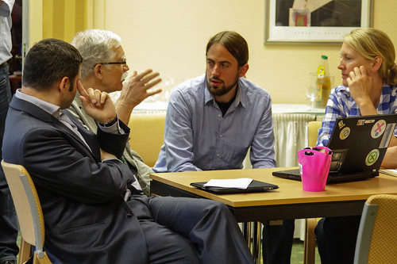
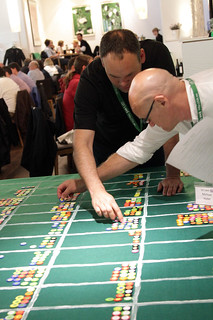
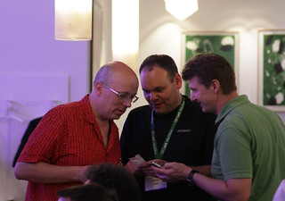
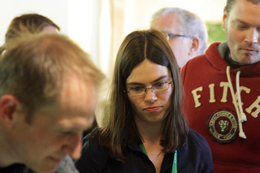

Vergangene Woche war ich drei Tage in Bad Reichenhall, bei [L3T’s work](http://l3t.eu/zukunft/?page_id=6 "L3T’s work | Zukunft von Lern- und Lehrmaterialien"). Viele haben mich gefragt: _Wo warst du eigentlich?_. Und ich muss mir auch selbst darüber klar werden, was bei dem Treffen eigentlich passiert ist. Deshalb hier ein Bericht.

<iframe src="http://www.youtube.com/embed/awledeigcxo" allowfullscreen height="270" frameborder="0" width="480"></iframe>

### Zukunft spielen

Wir haben versucht, die Zukunft von Lehr- und Lernmaterialien zu beschreiben. Dabei haben wir, unwillkürlich oder ausdrücklich, den Grundsatz beherzigt: ["The future cannot be predicted, but futures can be invented"](http://en.wikiquote.org/wiki/Alan_Kay "Alan Kay - Wikiquote"). Wir haben uns erinnert, phantasiert, gespielt, Projekte entworfen und Beziehungen geknüpft. [Sandra Schön](http://sansch.wordpress.com/ "Sandra Schön (aka Sandra Schaffert)"), [Martin Ebner](http://www.martinebner.at/ "www.martinebner.at") und [Martin Schön](https://twitter.com/#!/thinktank "Martin Schön, BIMS (thinktank) on Twitter") haben dafür ein Format erfunden, in dem wir offen über die Zukunft nachdenken und zugleich für die Impulse der anderen offen sein konnten. (Ein paar Hinweise zu den Überlegungen hinter diesem Format habe ich in Sandras [GADI-Vortrag](http://l3t.eu/zukunft/?p=539 "Einladung: Vortrag zur Zukunftsforschung (Schwerpunkt Technologien in der Lehre – Livestream) | Zukunft von Lern- und Lehrmaterialien") gefunden.)

 Die Weise, in der wir uns mit der Zukunft beschäftigt haben, hat sich von jedem Abschnitt zu jedem neuen geändert. Zu Beginn sammelten ein paar Teilnehmer Statements der anderen über ihre Erwartungen und verdichteten sie dann in einem komischen kurzen Improvisationsstück. Daraufhin haben wir uns Jahrzehnt für Jahrzehnt an die letzten 50 Jahre der Entwicklung von Lehrmaterialien zu erinnert und gemeinsam aufgeschrieben, was wir behalten haben und was wir behalten wollen.

Der Vormittag des zweiten Tags verlief etwas weniger spielerisch. Wir haben in kleinen Gruppen wahrscheinliche Entwicklungen der kommenden Jahre aus den Perspektiven der verschiedenen Stakeholder skizziert, von den Geräteherstellern über Lehrende und Lernende bis zur Bildungsbürokratie.  Auch hier folgte auf ein Brainstorming die Priorisierung und Bewertung. Nachmittags haben wir—in anderen Gruppen—eigene Visionen formuliert, überlegt, was diese Visionen für die verschiedenen Bezugsgruppen bedeuten und schließlich in einer Timeline festgehalten, in welchen Schritten sich diese Visionen realisieren lassen und welche Hindernisse dabei zu überwinden sind. In einer Auflockerungsphase zwischen diesen beiden Blöcken haben wir uns der Zukunft eher spielerisch genähert, z.B. durch Improvisationstheater—dabei habe ich mitgemacht—oder durch Interviews mit Kindern zu ihren Erwartungen. Abends, während des ausgezeichneten Abendessens in der alten Saline Bad Reichenhalls, wurden dann auch noch Jetons auf verschiedene konkrete und mit Daten versehene Prognosen gewettet (z.B. dass es in jedem DACH-Land mindestens fünf Tablet-Klassen geben wird).

Inhalt des abschließenden Vormittags war vor allem die Zusammenfassung der Ergebnisse und ein Rückblick auf die beiden vergangenen Tage mithilfe einiger noch in der Nacht geschnittener Videos. Vorher wurden in einem Open Space konkrete Projekte präsentiert, z.B. eine Editor für freie Lernmaterialien auf HTML5-Basis ([Eva Poxleitner](http://www.academy.fraunhofer.de/de/kontakt/Eva_Poxleitner.html "Eva Poxleitner - Fraunhofer Academy") von der Fraunhofer-Gesellschaft) oder ein vorlesungsbegleitendes Feedback-, Crowdsourcing- und Benotungs-System ([Peter Purgathofer](https://twitter.com/#!/peterpur "peter purgathofer (peterpur) on Twitter") von der TU Wien).

Die Ergebnisse werden noch detailliert publiziert; auf einiges gehe ich lieber in einem eigenen Post ein. Überrascht und gefreut hat mich, dass fast alle Teilnehmer die Forderung nach offenen Lernmaterialien teilen und auch für realistisch halten. Konsens bestand wohl auch darüber, dass die Lernenden Lehrmaterialien schon bald zu einem erheblichen Teil mitgestalten werden. Sehr interessant finde ich die von vielen unterstützte Aussage, dass das Design von Lehr- und Lernmaterialien in der Zukunft darüber entscheiden wird, ob sie angenommen werden oder nicht; dann werden wohl endlich die Tage von Moodle und Co. gezählt sein.

### Zukunft machen

 Wie bei einer guten Party hatten die Organisatoren Menschen eingeladen, die sich miteinander verstanden, aber einen unterschiedlichen Hintergrund haben und sich nur zum Teil kannten. Die meisten verbindet, dass sie zur Bildungsfraktion der [Maker-Subkultur](http://en.wikipedia.org/wiki/Maker_subculture "Maker subculture - Wikipedia, the free encyclopedia") gehören: Sie wenden nicht Regeln und Rezepte an und sie theoretisieren nicht nur über Bildung, sondern sie basteln daran herum, probieren aus und verändern Lernen und Lehren praktisch. Mir ist zum ersten Mal klargeworden, was mit [Edupunk](http://en.wikipedia.org/wiki/Edupunk "Edupunk - Wikipedia, the free encyclopedia") gemeint war.

Ich habe einige sehr ungewöhnliche Leute kennengelernt, von denen sich einige in einer sehr persönlichen und sehr durchdachten Weise für das engagieren, was ich provisorisch als _Geist des Web_ bezeichnen würde: der Bibliothekar und Open Access-Fachmann [Lambert Heller](http://biblionik.de/about-me/ "About me"), [Christoph Derndorfer](http://christoph-d.blogspot.co.at/ "ChristophD's Random Musings"), Aktivist in der OLPC-Bewegung, oder [Ellen Trude](http://trainingkonzepte.blogspot.co.at/ "Open Thinking"), die enorm viel für offene Lernmethoden in der betrieblichen Bildung getan hat. Ich hoffe, dass ich von Peter Purgathofer bald noch mehr über Design und Didaktik lernen kann, und dass ich mit [Michael Huter](http://www.huterundroth.at/huterundroth/ueber-uns/michael-huter.html "HUTER & ROTH: Michael Huter") ausführlich über Bildung und das Web diskutieren kann.  Eva Poxleitner hat mich durch ihren kreativen und intelligenten Umgang mit Ebooks und Lerntools fasziniert, [Anja Lorenz](https://plus.google.com/101889696578499789127/posts "Anja Lorenz - Google+") durch ihren reflektierten Zugang zum Lernen im Web. Mit [Michaela Rückl](http://www.uni-salzburg.at/portal/page?_pageid=425,407511&_dad=portal&_schema=PORTAL "Rückl - Universität Salzburg"), [Peter Baumgartner](http://www.peter.baumgartner.name/ "Nachrichten — Gedankensplitter") und [Conrad Lienhardt](https://plus.google.com/u/0/105719229210982380479/posts "Conrad Lienhardt - About - Google+") habe ich über Zukunftsprojekte gesprochen. [Guido Hornig](http://guido-hornig.de/ "Guido Hornig") hat mich dadurch beeindruckt, wie er Spiel und Theater als Veränderungswerkzeuge benutzt. Leid tut mir, dass ich mich nicht länger mit [Joachim Wedekind](http://joachim-wedekind.de/ "Joachim Wedekinds Website - Startseite") und [Heiko Idensen](https://plus.google.com/109328617248263692343/about "Heiko Idensen - About - Google+") unterhalten konnte—aber beide werde ich jetzt wenigstens lesen. Leider war die Zeit zu kurz um alle Teilnehmer persönlich kennenzulernen—schon deshalb hoffe ich auf ein _L3T's work II_.

### Zukunft haben

<iframe src="http://www.youtube.com/embed/TK4W5d9qtbE" allowfullscreen height="270" frameborder="0" width="480"></iframe>

_L3t's Work_ ist ein Teil des [L3T](http://l3t.eu/homepage/ "Übersicht - L3T")\-Projekts, das sich nicht in eine der alten Kategorien wie Lehrbuch, Initiative, Organisation oder Unternehmen pressen lässt. Wir haben uns als Teilnehmer mit diesem Projekt und untereinander verlinkt oder neuverlinkt. Wir sind selbst Akteure und Material in einem hypermedialen Lernprozess, zu dem unsere Blogs, Tweets und Profile gehören. Vielleicht bietet die Akteur-Netzwerk-Theorie, mit der sich auch Peter Baumgartner beschäftigt, ein Instrumentarium, mit dem sich die narrativen Strukturen eines solchen Events beschreiben lassen. Die Ergebnisse werden im [L3T-Blog](http://l3t.eu/zukunft/ "Zukunft von Lern- und Lehrmaterialien | Veranstaltungen, Beiträge und Publikationen") publiziert oder verlinkt, dort finden sich auch [Hinweise auf Blogposts von Teilnehmerinnen](http://l3t.eu/zukunft/?p=535 "Teilnehmerstimmen über L3T’s WORK | Zukunft von Lern- und Lehrmaterialien"). Den besten Eindruck von der Atmosphäre der drei Tage vermitteln wohl die Videos (die ersten beiden habe ich hier eingebettet) und die [Fotos](http://www.flickr.com/photos/79948824@N07/sets/72157630031844136/ "L3T's Work – un set su Flickr"). Ausführlich und kritisch haben [Peter Baumgartner](http://www.peter.baumgartner.name/Members/baumgartner/news/l3t-expertinnen-zur-zukunft-der-bildungsmedien "L3T-ExpertInnen zur Zukunft von Bildungsmedien — Gedankensplitter") (dem ich den Ausdruck "Zukunftswerkstatt" verdanke) und [Joachim Wedekind](http://konzeptblog.joachim-wedekind.de/?p=652 "konzeptblog » L3T’s WORK - Visionen zur Zukunft von Lern- und Lehrmaterialien") das Event beschrieben. Die Stimmung der drei Tage hat [Ellen Trude sehr gut ausgedrückt](http://trainingkonzepte.blogspot.co.at/2012/06/l3t-s-work-meine-inspiration.html "Open Thinking: #L3T 's Work - Meine Inspiration"); ich kann mich ihren Sätzen zu anschließen:

> L3T war von Freitag bis Sonntag ein einziges Pausengespräch. Anstrengend zwar, aber bereichernd und daher mit dem Wunsch verbunden, es möge dann doch nicht so bald enden.

\[**Bildquelle:** [L3T's Work – Set auf Flickr](http://www.flickr.com/photos/79948824@N07/sets/72157630031844136/)\]
