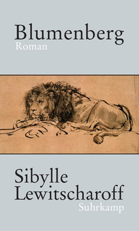

Seit gestern mache ich Urlaub in Cres—und es werden wohl Leseferien werden. Gestern gleich nach der Ankunft habe ich [Blumenberg](http://www.suhrkamp.de/buecher/blumenberg-sibylle_lewitscharoff_42244.html "Blumenberg: Roman von Sibylle Lewitscharoff - Suhrkamp Insel Bücher Buchdetail") von [Sibylle Lewitscharoff](http://www.suhrkamp.de/autoren/sibylle_lewitscharoff_7665.html "Sibylle Lewitscharoff - Suhrkamp Insel Autoren Autorendetail") ausgelesen, das ich schon in Graz begonnen hatte. Meine Schwester hat mir den Roman über den Philosophen [Hans Blumenberg](http://www.information-philosophie.de/?a=1&t=857&n=2&y=1&c=63 "Information Philosophie - Ferdinand Fellmann: Blumenberg, Hans") zum Geburtstag geschenkt. Ich habe in den ersten Semestern in Münster bei Blumenberg studiert. Er hat mich von allen Philosophen, die ich gehört habe, am meisten beeindruckt. Ich würde mich heute vielleicht nicht für Ethnomethodologie und Akteur-Netzwerk-Theorie interessieren, hätten mich Blumenbergs Vorlesungen damals nicht auf Husserl und die Phänomenologie gestoßen.  
  
Ich kann den Roman von Sibylle Lewitscharoff also nicht unbefangen lesen, sondern verstehe ihn zwangsläufig als einen Schlüsselroman und versuche zu dekodieren, was er über einen Menschen enthält, den ich, wenn auch nur aus der Entfernung, selbst kennengelernt habe. Das würde ich wohl nicht tun, wenn mich Blumenberg damals nicht enorm beeindruckt hätte—ganz ähnlich wie er in dem Roman vier Studenten in seinen Bann zieht, die übrigens am Ende der Geschichte, wie Blumenberg selbst, nicht mehr am Leben sind. Ich hatte damals das Gefühl, Blumenberg würde wie aus einer anderen Welt sprechen, weit entfernt von der intellektuellen Alltagswirklichkeit mit ihren Streitigkeiten über Probleme wie _Hermeneutik und Ideologiekritik_. Ich habe damals viel unternommen, um ihn zu verstehen. Ich habe mich sogar im fünften Semester in sein Oberseminar getraut, und ich habe später in Köln ein Referat über ihn gehalten. Aber wirklich verstanden—verstanden in dem Sinne, dass ich seine Fragen und die Gründe für die Antworten, die er darauf gibt, klar darstellen könnte—habe ich ihn bis heute nicht.  
Sibylle Lewitscharoff versucht das Rätsel Blumenberg nicht zu lösen. Sie geht eher so vor, wie sie es Blumenberg selbst an einer Stelle zuschreibt: Er habe seine Studenten gelehrt etwas zu verstehen, indem man auf etwas ganz anderes blickt. So etwas ganz anderes sind die Biographien der Studenten, die sich wie ihr Lehrer auf eigene Wege oder eher Abwege begeben. Sie entfernen sich von jemand, dem sie sich nicht nähern können, aber sie bleiben in einer verqueren Weise auf ihn bezogen, selbst wenn sie auf einer Hängematte liegend den Amazonas entlang fahren.  
Am meisten hat mich an Sibylle Lewitscharoffs Roman erstaunt, wie genau sie die Atmosphäre um Blumenberg herum wiedergibt. Ich habe mich in den Hörsaal im Münsteraner Schloss zurückversetzt gefühlt. Die Autorin tritt Blumenberg nie zu nahe, dichtet ihm nichts an, sondern zeichnet einige seiner Eigenschaften nach. Dabei hat sie sich offenbar auf viele Zeugen, darunter Blumenbergs Tochter Bettina, gestützt.  
Trotzdem ist _Blumenberg_ ein fiktionaler Text. Der wichtigste Akteur außer dem Philosophen selbst ist ein Löwe, der ihn nachts in seinem Arbeitszimmer besucht und ihm gelegentlich auch folgt, etwa in den Hörsaal. Dieser Löwe ist—mit einer Ausnahme—nur für Blumenberg selbst sichtbar, und er ist kein Gegner des Helden, sondern ein Unterstützer. Er erleichtert ihm die theoretische Ausnahmeexistenz, indem er der Wirklichkeit etwas von ihrer Absolutheit nimmt—auch wenn er mit dem Tod, dem eigentlichen Gegner des Philosophen, verbunden ist. Mich erinnert der Löwe in Lewitscharoffs Roman an [Paul Valéry](http://de.wikipedia.org/wiki/Paul_Val%C3%A9ry "Paul Valéry - Wikipedia")s _objet ambigu_ (das ich durch Blumenberg kennengelernt habe). Er bleibt ein Rätsel, an dem alle fixen Zuschreibungen scheitern.  
Mir hat der Roman wieder vor Augen geführt, wie sehr Blumenberg auf den indirekten Zugängen zur Wirklichkeit, den Umwegen und Vermittlungen bestanden hat. In einer der für mich eindrucksvollsten Passagen schildert Lewitscharoff Blumenberg als einen Gegner jedes einfachen moralischen Urteils—der allerdings selbst das absolut Böse kennengelernt hat. An dieses Insistieren auf der Indirektheit werde ich mich hoffentlich erinnern, wenn ich das nächste Mal versucht bin, ein einfaches Urteil zu fällen. Blumenbergs Schattierungen wären ein hilfreiches Mittel gegen die Schwarzweiß-Malerei unserer Social Media-Diskurse.
