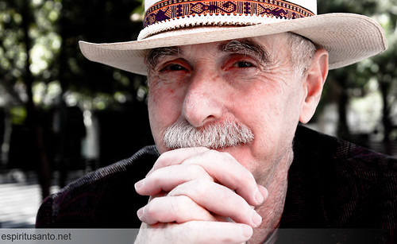

Im Oktober werde ich beim [2\. AAL-Forum Styria](http://www.fh-joanneum.at/aw/home/Studienangebot_Uebersicht/fachbereich_gesundheitswissenschaften/ehb/News_Events/ehb_news/~ckwr/2_AALFORST2012/?lan=de "2. AAL-FORUM STYRIA 2012") einen Vortrag über Senioren und Social Media halten. Hier Überlegungen zu diesem Thema, die ich in dem Vortrag zur Diskussion stellen möchte. Ich bin selbst über 55. Damit gehöre ich schon in eine Altersgruppe, die meist mitbehandelt wird, wenn wieder ein Artikel oder eine Studie feststellt, dass nun auch Ältere ins Netz und in die sozialen Medien drängen. Die begleitenden Fotos oder Videos zeigen nette und etwas hilflose Oldies, die ängstlich aber zuversichtlich einen Computer bedienen. Oft weisen die Autoren darauf hin, wie schwierig und wichtig es ist, die [digitale Kluft](http://de.wikipedia.org/wiki/Informationstechnik "Digitale Kluft – Wikipedia") zu schließen. Ich bin noch nie auf die Idee gekommen, dass ein Computer für mich jetzt etwas anderes ist als vor zehn oder fünfzehn Jahren. Dass ältere Menschen neue Technologien später nutzen als jüngere, liegt nahe. Es ist eigentlich eine Binsenweisheit. Warum wird dann bei allem, was mit Computern, dem Internet und sozialen Medien zusammenhängt, extra hervorgehoben, dass nun auch Ältere damit umgehen? War das bei Stereoanlagen, Farbfernsehern oder Faxgeräten auch der Fall? Es dürfte damit zusammenhängen, dass Computer und Internet in einer besonderen Weise zu Jugendkulturen gehören. Sie waren immer wieder etwas Nichtetabliertes, Revolutionäres. Wer eine Devise wie [Move fast and break things!](http://blog.sfgate.com/techchron/2012/02/01/facebooks-hacker-way-move-fast-and-break-things/ "Facebook’s Hacker Way – “Move fast and break things” | The Technology Chronicles | an SFGate.com blog") unterschreibt, will das Alte abschaffen und nicht nur verbessern. Es ist kein Zufall, dass fast alle wirklich neuen Entwicklungen im Netz aus den USA kommen, einem Land, dass sich bis heute gern als jung im Vergleich zur Alten Welt ansieht. Apple hat ein klinisch reines Jugend-Outfit zur Uniform seiner Präsentatoren und Verkäufer erklärt.  In unserer Wahrnehmung sind das Internet und soziale Medien mit der Jugendkultur verbunden. [Marc Prensky](http://www.marcprensky.com/ "Marc Prensky") und seine Nachfolger haben das Meme von den _digital natives_ in die Welt gesetzt, einer neuen Generation, die sich im Netz mit einer Selbstverständlichkeit bewegt, die für ältere, die _digital immigrants_ schwer oder gar nicht zu erreichen sei. Eine vermeintliche Folge dieses Memes ist es, dass die digitale Kluft auf absehbare Zeit auch und vielleicht sogar vor allem eine Kluft der Generationen ist. Die mangelnde Kompetenz der älteren Generationen wird dann zum gesellschaftlichen Problem, das man mit technokratischen und bürokratischen Mitteln lösen muss. Ich möchte heute ein paar Hypothesen formulieren, die in eine andere Richtung gehen. Das Thema _Ältere Menschen und das Internet_ ist dabei für mich neu; ich kann mich nicht auf ein umfangreiches Literaturstudium oder gar auf eigene Forschungen berufen. Ich bin sicher stark durch meine eigenen Erfahrungen mit dem neuen Medien geprägt, die ich in den ersten Abschnitten schon erwähnt habe. Ich stütze mich bei meinen Hypothesen auf statistisches Material, das sich schnell finden lässt, und das relativ eindeutig ist. Außerdem interpretiere ich Forschungen zur Netzwerkgesellschaft. Ältere Menschen werden darin zwar kaum zum Thema. Aber es lassen sich aus ihnen Konsequenzen dafür ableiten, wie ältere Menschen mit sozialen Medien leben und leben werden. Meine Hypothesen:

1. Die Entgegensetzung von _Digital Natives_ und _Digital Immigrants_ ist ein Mythos.
2. Ältere Menschen werden das Netz in absehbarer Zeit genauso nutzen wie jüngere Menschen.
3. Auch für ältere Menschen gehören soziale Medien zu einer Lebensform, die man als _vernetzten Individualismus_ (Barry Wellman) beschreiben kann.
4. Wie befriedigend das Leben älterer Menschen in der Netzwerkgesellschaft ist, hängt von ihren Netzwerkfähigkeiten und von der Inklusivität der sozialen Strukturen ab.

### Mythos Digital Natives

Der Begriff der Digital Natives ist vielfach kritiert worden. Suw Charman-Anderson hat in einem [ausführlichen und gut belegten Blogpost](http://charman-anderson.com/2009/07/01/myths-of-age-and-digital-capability/ "Myths of age and digital capability") wichtige Gegenargumente zusammengefasst.

> It is predicated on the idea that there is a clear divide between generations, and that these new characteristics, ascribed to the young, are so new that not only are their elders incapable of developing those skills, they can’t even comprehend them.

Sie zitiert Neil Seilwyn Paper [The Digital Native — Myth and Reality](https://comminfo.rutgers.edu/~tefko/Courses/Zadar/Readings/Selwyn%20dig%20natives,%20Aslib%20Proceedings%202009.pdf "The digital native – myth and reality - (PDF)"):

> \[T\]here is mounting evidence that many young people’s actual uses of digital technologies remain rather more limited in scope than the digital native rhetoric would suggest. Surveys of adolescents’ technology use, for example, show a predominance of game playing, text messaging and retrieval of online content (as evidenced in the popularity of viewing content on YouTube, Bebo and MySpace).”

Meine eigenen Beobachtungen beim Unterrichten von sozialen Medien bestätigen diese Ansicht. Digitale Medien sind bei jungen Leuten (und zunehmende auch bei älteren) in Lebenszusammenhänge eingebettet, die letztlich darüber entscheiden, welche Kompetenzen die Nutzerinnen und Nutzer haben. Sie werden dabei meist kaum als Techniken begriffen, und die eher technischen Aspekte sind den meisten jüngeren Leuten genauso fremd wie älteren. Ein weiterer wichtiger Gewährsmann von Suw Charman-Anderson ist [John Palfrey](http://cyber.law.harvard.edu/people/jpalfrey "John Palfrey | Berkman Center") vom Berkman-Center in Harvard, der das Buch [Born Digital](http://www.amazon.de/Born-Digital-Understanding-Generation-Natives/dp/0465018564/ref=sr_1_1?ie=UTF8&qid=1347879360&sr=8-1 "Born Digital: Understanding the First Generation of Digital Natives: Amazon.de: John Palfrey,Urs Gasser: Englische Bücher"") mitgeschrieben hat. Er wendet sich dagegen, eine bestimmte Generation mit dem Ausdruck _digital native_ zu charakterisieren:

> Not all people born during a certain period of history \[…\] are Digital Natives. Not everyone born today lives a life that is digital in every, or indeed any, way.”

Aus meiner Sicht kann die Ideologie des _digital native_ besonders dann fatal werden, wenn sie Ursachen für die digitale Kluft verschleiert, die tiefer liegen: Soziale Ungleichheiten, darunter ungleiche Bildungschancen. Digitale Kompetenzen lassen sich nicht von den anderen Komponenten der Bildung trennen. Bildung kann zwar den Zugang zu sozialen Medien ideologisch blockieren, aber sie ist die Voraussetzung dafür, diese Medien erfolgreich zu verwenden. Leider kann ich auf diesen Zusammenhang bei einem kurzen Vortrag kaum eingehen.

### Soziale Medien werden in allen Altersgruppen selbstverständlich

Eine ganze Serie neuerer Studien zeigt, dass auch die sogenannte ältere Generation massiv in die sozialen Medien drängt. Vor allem Facebook ist längst kein Jugendmedium mehr. Die Präsenz der Elterngeneration bei Facebook vertreibt offenbar Teenager und Twens sogar und trägt zum Boom von Diensten wir [Tumblr](http://www.tumblr.com/dashboard "Tumblr") bei. Eine [Pew-Studie von 2010](http://pewresearch.org/pubs/1711/older-adults-social-networking-facebook-twitter) enthält viel Zahlenmaterial zu dem fast dramatischen Anstieg der Social Media-Nutzung bei Älteren. Die Zahl der Facebook-Nutzer über 55 war 2010 bereits genauso hoch wie bei den 25-34-Jährigen. Wie jüngere Leute sind die Pensionisten intensiv auf altersspezifischen Angeboten wie [Saga Zone](http://www.sagazone.co.uk/ "Saga Zone | Social Networking | Over 50's") unterwegs. Die Pew-Studie ergibt, dass vor allem Inhalte dafür relevant sind, mit welchen Online-Angeboten sich ältere Nutzer beschäftigen. Ob und wie sich Nutzer in sozialen Medien bewegen, hänge nicht vom Alter, sondern von der Haltung und dem Mindset ab:

> However, it must be emphasised that with social media, it is mindset not skill set that is important. The right people will be curious about technology, eager to experiment, will understand how interpersonal relationships develop, will be good communicators and will have a solid understanding of their community’s culture. Such skills can be found in people of any age.

Eine aktuelle internationale [Studie der Beratungsgesellschaft Deloitte](http://www.deloitte.com/view/de_DE/de/presse/pressemitteilungen/015abb86cf7e5310VgnVCM3000001c56f00aRCRD.htm) zeigt, dass sich auch ältere Nutzerinnen intensiv bei sozialen Medien engagieren. Wenn sie sich dabei zurückhalten, persönliche Informationen zu veröffentlichen, hängt das eher mit mangelndem Vertrauen als mit der technischen Kompetenz zu tun hat

> Rund 27 Prozent der 65- bis 75-Jährigen sind aktiv auf den Plattformen unterwegs. Deutsche Nutzer schätzen überdies zielgruppenorientierte Onlinewerbung – 34 Prozent der Befragten klicken diese Angebote an. Allerdings würden hierfür nur 18 Prozent weitere Informationen zur eigenen Person im Netz preisgeben, was das große Sicherheitsbewusstsein der Deutschen demonstriert.

Auch [Nielsen-Zahlen für Großbritannien 2011](http://www.nielsen.com/uk/en/insights/press-room/2011-news/older-web-surfers-drive-record-month-for-social-media-sites.html) ergeben, dass sich die demographische Struktur der Nutzer von sozialen Netzwerken immer mehr der der Gesamtbevölkerung annähert.  Online-Medien und speziell soziale Medien setzen sich also allmählich, aber sicher im Mainstream durch. Sie verbreiten sich offensicht nicht anders als andere Innovationen und werden, wenn auch langsam, in allen Altersgruppen selbstverständlich.

### Soziale Medien als Teil des neuen Betriebssystems der Gesellschaft

Um zu fragen, wie ältere Menschen mit sozialen Medien umgehen oder umgehen werden, möchte ich mich in meinem Vortrag vor allem auf das umfangreiche Werk [Networked](http://www.amazon.de/Networked-ebook/dp/B007Z6GW0Y/ref=sr_1_fkmr0_2?ie=UTF8&qid=1347863541&sr=8-2-fkmr0 "Networked eBook: Lee Rainie, Barry Wellman: Amazon.de: Kindle-Shop") von Lee Rainie und Barry Wellman beziehen. Es ist im Frühjahr erschienen. Wellman ist ein Soziologe, der sich seit Jahrzehnten mit dem Thema Netzwerkgesellschaft beschäftigt, und zwar sowohl durch empirische Forschungen wie durch die Arbeit an einer Theorie der Netzwerkgesellschaft. [Wellman und seine Mitarbeiter](http://homes.chass.utoronto.ca/~wellman/ "N E T L A B _ at the University of Toronto") haben vor allem Langzeitstudien und Studien zu Biographien unternommen. Sie untersuchen dabei, wie Menschen sich vernetzen, wie sie mit Vernetzung umgehen, wodurch sie dabei Erfolg haben und wie sich ihr Leben durch Vernetzung ändert. Das wohl wichtigste Ergebnis dieser Studien ist, dass soziale Medien nicht isoliert verstanden werden können. Sie sind Teil eines _neuen Betriebssystems_ der Gesellschaft, die sich insgesamt schon seit Jahrzehnten in eine Netzwerkgesellschaft verwandelt. [Lee Rainie](http://pewinternet.org/experts/Lee-Rainie.aspx?typeFilter=0 "Lee Rainie | Pew Research Center's Internet & American Life Project") leitet beim Pew Research Center das [Internet & American Life Project](http://pewinternet.org/ "Pew Research Center's Internet & American Life Project"), das in einer Vielzahl von Studien erforscht hat, wie sich die amerikanische Gesellschaft durch und mit dem Internet verändert. Wellman und Rainee fassen in ihrem Buch die Forschungen ihrer Teams zusammen und interpretieren sie. Damit legen sie eine empirisch belegte, umfassende soziologische Darstellung der Netzwerkgesellschaft vor, zu der es, soweit ich weiss, noch kein Gegenstück gibt. Ein Schlüsselbegriff in dem Buch von Rainee und Wellman ist _networked individualism_, also _vernetzter Individualismus_. Dieser Begriff bezeichnet die persönliche oder subjektive Seite einer Lebensform, die schon lange vor dem Internet damit begonnen hat, die zentralisierten sozialen Organisationen der Industriegesellschaft abzulösen. In der Netzwerkgesellschaft haben die Individuen ein sehr hohes Maß an Freiheit gegenüber den verschiedenen sozialen Strukturen oder Verbünden, zu denen sie gehören. Sie sind viel weniger abhängig von der Familie, dem Betrieb, in dem sie arbeiten, einer Religionsgemeinschaft oder anderen weltanschaulichen Gruppierung. Sie organisieren sich ihre Beziehungen selbst und jonglieren dabei mit ihren Zugehörigkeiten zu verschiedenen sozialen Netzen. Sie sind aber nicht isoliert oder atomisiert, sondern durch _strong ties_ und durch eine große Zahl von _weak ties_ mit vielen Menschen im Austausch. Ein Beispiel, mit dem sich Wellman und Rainee intensiv beschädigt haben, ist die Familie. Einerseits kann in der vernetzten Familie der Gegenwart jedes Familienmitglied seiner eigenen Wege gehen. Es kommuniziert via Internet und Mobiltelefon ununterbrochen mit den Mitgliedern seiner eigenen sozialen Netze, und die sind bei jedem Familienmitglied unterschiedlich. Andererseits sind die Familienmitglieder aber untereinander auch vernetzt, so dass die Kommunikation innerhalb der Familie nicht weniger intensiv, vielleicht sogar intensiver ist als früher. Wer, wie ich, einerseits gewohnt ist, dass die eigenen Kinder mehr oder weniger permanent via SMS und Facebook mit ihren Freundinnen und Freunden kommunizieren und andererseits selbst mit ihnen über eine Web-App verbunden ist, kennt diese neue Form des Familienlebens. Wellman und Rainee beschreiben das Ende der traditionellen Zugehörigkeiten ähnlich, wie es Ulrich Beck seinerzeit in der [Risikogesellschaft](http://www.amazon.de/Risikogesellschaft-Auf-eine-andere-Moderne/dp/3518113658 "Risikogesellschaft. Auf dem Weg in eine andere Moderne: Amazon.de: Ulrich Beck: Bücher") getan hat. Zugleich thematisieren sie soziale Strukturen, die die alten Organisationsformen ablösen, und die sich als Netzwerke erfassen und analysieren lassen. Wenn man davon ausgeht, dass ältere Menschen nicht grundsätzlich anders mit sozialen Medien umgehen als jüngere, und wenn man andererseits Wellmans und Rainees Analyse des vernetzten Individualismus als Ausgangspunkt nimmt, kommt man zu dem Ergebnis, dass auch Senioren in Zukunft als vernetzte Indivdualisten agieren werden. Das bedeutet, dass die Zugehörigkeit zu festen sozialen Gruppen gegenüber der Beteiligung an unterschiedlichen, selbst gewählten sozialen Netzen an Bedeutung verlieren wird. Senioren benutzen zunehmend Online-Medien, um mit denen zu kommunizieren, zu denen sie _strong ties_ unterhalten. Außerdem werden sie eine große Zahl von _weak ties_ mit ganz unterschiedlichen Personengruppen unterhalten. Vor allem die weak ties, die schwachen Bindungen, sind dafür wichtig, Hilfe in unterschiedlichen Lebenssituationen zu erhalten, also z.B. Bildungsangebote zu finden und wahrzunehmen, Reisen zu unternehmen oder sich über Gesundheitsprobleme zu verständigen. Auch Senioren werden diese weak ties bewusster pflegen, und wahrscheinlich werden sich auch ihrerseits die Organisationen, die mit Senioren kommunizieren, wenigstens teilweise in Netzwerke verwandeln, die punktuell mit ihren Zielpersonen kommunizieren und mit den Mitgliedern anderer Netzwerke verbunden sind. Auch für Senioren bedeutet das, dass sie an ihren Profilen, ihrer Erscheinung in den Netzwerken, arbeiten werden. Sie werden lernen sich online so zu verhalten, dass andere ihnen trauen, also soziales Kapital aufbauen. Denn der Austausch in sozialen Netzen ist immer zweiseitig. Man erhält so viel zurück, wie man in das Netz hineingibt. Als _dark node_ wird man vereinsamen. Ein wichtiger Aspekt des neuen Betriebssystems der Gesellschaft ist es, dass traditionelle Grenzen durchlässiger werden; so lassen sich berufliche und private Existenz in den sozialen Medien nicht mehr so deutlich voneinander trennen, wie es lange der Fall war. Dieses Durchlässigwerden traditioneller Grenzen könnte die Lebensqualität von Senioren verbessern—jedenfalls ist es interessant darüber nachzudenken, was hier möglich wäre. In Verbindung damit spielt auch eine Aspekt von sozialen Medien eine Rolle, mit denen sich vor allem der amerikanische Theoretiker [Yochai Benkler](http://benkler.org/ "Yochai Benkler") beschäftigt hat: Im Netz ist es leicht, selbst sinnvolle Aufgaben zu finden und sie gemeinsam mit anderen zu bewältigen. Die Wikipedia ist dafür ein spektakuläres Beispiel.

### Netzwerk-Kompetenz und Inklusion

Erfolgreich in Netzwerken zu agieren verlangt Kompetenzen, die in englischsprachigen Veröffentlichungen oft als _network literacies_ bezeichnet werden. Es handelt sich bei ihnen nur zu einem ganz geringen Teil um technische Fähigkeiten, also die Fähigkeiten, die die anfangs erwähnten freundlichen Senioren in VHS-Kursen erwerben. Es geht um soziale Fähigkeiten, die z.B. eng damit verbunden sind, wie man sich in vernetzten Umgebungen präsentiert, wie man Grenzen zieht und wie man gemeinsam mit anderen Informationen organisiert. Wellman und Rainee schreiben:

> networked individuals who thrive have a combination of talent, energy, altruism, social acuity, and tech-savviness that allows them to build big, diverse networks and tap into these networks when they have needs.

Ich hoffe, dass wir bei der Diskussion auf diese Kompetenzen eingehen können, die ja unser Thema im [Web Literacy Lab](http://wll.fh-joanneum.at/ "Web Literacy Lab") sind. Für ein Modell dieser Kompetenzen kann ich auf andere Blogposts verweisen, z.B. auf [dieses](http://wittenbrink.net/lostandfound/2012/04/web-literacy-data-literacies-content-literacies-network-literacies/ "Web Literacy = Data Literacies + Content Literacies + Network Literacies - Lost and Found"). Mir wird zunehmend klar, dass es sich dabei um soziale, nicht um technische Kompetenzen handelt. Ein Vorbild für die Vermittlung dieser Kompetenzen ist für mich wie für Wellman und Rainee [Howard Rheingold](http://rheingold.com/ "Howard Rheingold | Exploring mind amplifiers since 1964"), der gerade das Buch [NetSmart](http://rheingold.com/books/net-smart/ "Net Smart | Howard Rheingold") herausgebracht hat.  Ich möchte mit einem Aspekt schließen, auf den ich am Wochenende bei den Vorträgen des [Paraflows-Symposium](http://www.paraflows.at/index.php?id=376 "Paraflows 2012: Symposium") gekommen bin. Netwerk-Fähigkeit kann man nur erwerben, wenn man daran nicht in einem _meritokratischen_ System durch wirklich oder vermeintlich Bessere gehindert wird. Kleine oder große Social Media-Gurus erreichen genau das Gegenteil dessen, was sie versprechen: Sie kommunizieren so, dass sie diejenigen ausschließen, die sie vorgeblich einschließen. Network literacies setzen Inklusion voraus, und es ist eine Kunst, diese Voraussetzungen zu schaffen.
