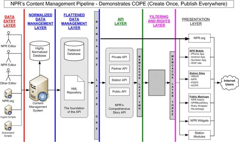

Karen McGrane begründet in einem Vortrag genau, warum Inhalte heute unabhängig von Publikationsformen produziert werden müssen. Eine Überlegung im Anschluss daran: Zu einem vollständigen Modell für digitales Publizieren gehören neben den Inhalten auch die Views auf die Inhalte und die Kontrolle der Inhalte. In welchen Beziehungen stehen die drei Komponenten zueinander? Gestern habe ich [Karen McGrane](http://karenmcgrane.com/ "Karen McGrane")s Vortrag [Adapting Ourselves to Adaptive Content](http://vimeo.com/45965788 "Karen McGrane - Adapting Ourselves to Adaptive Content, BDConf, April 2012 on Vimeo") bei Vimeo angeschaut: \[vimeo http://vimeo.com/45965788\] Die Präsentation gibt es bei [Slideshare](http://de.slideshare.net/KMcGrane/adapting-ourselves-to-adaptive-content-12133365?ref=http://karenmcgrane.com/ "Adapting Ourselves to Adaptive Content"). In einem Blogpost hat Karen McGrane auch [ein Transkript des Vortrags](http://karenmcgrane.com/2012/09/04/adapting-ourselves-to-adaptive-content-video-slides-and-transcript-oh-my/ "Adapting Ourselves to Adaptive Content (video, slides, and transcript, oh my!) « Karen McGrane") publiziert. Karen McGrane geht es vor allem darum, dass und wie man Content Management Systeme auf die Anforderungen von adaptiven Inhalten einstellen muss. Inhalte sind adaptiv, wenn sie sich unterschiedlichen Publikationsformen und -plattformen von sich aus anpassen, also nicht mühsam dafür zugeschnitten werden müssen. Spätestens durch die mobilen Plattformen müsste jedem deutlich werden, dass sich nicht mehr beim Erstellen des Inhalts vorwegnehmen lässt, in welcher Weise er präsentiert wird. Inhalte, die sich unterschiedlichen Publikationsbedingungen anpassen, müssen gut strukturiert, gut mit Metadaten beschrieben und möglichst auch in unterschiedlichen Versionen vorliegen. Karen McGrane bringt viele Beispiele für Adaptive Content und für Workflows, die damit umgehen. Am ausführlichsten geht sie auf das amerikanische National Public Radio ein, das schon lange nach der Devise COPE vorgeht. COPE heisst: **Create Once, Publish Everywhere!** Daniel Jacobson hat die Content-Architektur von NPR in [einem Blogpost](http://blog.programmableweb.com/2009/10/13/cope-create-once-publish-everywhere/ "COPE: Create Once, Publish Everywhere") beschrieben. Ein Diagramm zeigt, wie das System funktioniert: 

> _Das Diagramm oben zeigt die NPR Content Management Pipeline und wie sie diese Prinzipien von CORE umsetzt. Das Grundprinzip besteht darin, dass Inhaltsproduzenten und Übernahmeskripte Inhalt in ein einziges System (bzw. eine Reihe eng verbundener Systeme) einfließen lassen. Wenn er einmal dort ist, kann die Verteilung des gesamten Inhalts einheitlich gehandhabt werden, unabhängig vom Inhaltstyp oder den Zielplattformen ([für ein größeres Diagramm hier klicken](http://blog.programmableweb.com/wp-content/npr_architecture_diagram.jpg))._

\[Grafik und Original der hier übersetzen Bildunterschrift: [programmableweb.com/NPR, Daniel Jacobson](http://blog.programmableweb.com/2009/10/13/cope-create-once-publish-everywhere/ "COPE: Create Once, Publish Everywhere")\] Dieses Prinzip ist nicht neu. Bei meinem früheren Arbeitgeber, dem damaligen [Bertelsmann Lexikon Verlag](http://www.wissenmedia.de/verlag/ "wissenmedia Verlag"), wurde seit den 80er Jahren versucht, Nachschlagewerke als _Substanzen_ zu verstehen, aus denen sich unterschiedliche Produkte ableiten lassen. Damals habe ich zum ersten Mal etwas von der Auszeichnungssprache SGML gehört, der Vorgängerin von XML und HTML. Die SGML-Community hat schon lange vor dem Web über, wie es damals hieß, _medienneutrales_ Publizieren nachgedacht. Obwohl es sich dabei um eine einleuchtendes und eigentlich simples Prinzip handelt, hat es sich in Verlagen noch immer nicht durchgesetzt. Ich versuche immer wieder, das Publizieren im Web [nach dem Model-View-Controller-Muster](http://wittenbrink.net/lostandfound/2011/07/journalismus-als-soziale-technologie/ "Journalismus als soziale Technologie - Lost and Found") zu verstehen. Die Inhalte, also die _Modelle_, die Publikationsformen für die Inhalte, also die _Views_, und die Veränderung, Erstellung und Kuratierung der Inhalte und der Publikationen, also die _Controller_, treten im Web auseinander, während sie bei analogen Publikationen eng aneinander geknüpft waren. _Adaptive Content_ oder _COPE_ sind Formeln für einen Teil des ganzen Musters, nämlich für den Inhalt oder die Modelle. Die zweite wichtige Komponente sind die Views, die Blicke auf den Inhalt. In der digitalen Welt sind diese Views immer Queries, also Abfragen. Letztlich ist zum Beispiel der Aufruf eines Webangebots immer eine Abfrage. Auch das verstehen Verlage meist nicht, vielleicht können sie es gar nicht verstehen, weil es ihnen die Existenzberechtigung nimmt. (In diesem Zusammenhang eine Verbeugung vor Michael Seemanns Konzept der [Queryology](http://www.ctrl-verlust.net/queryology-i-das-ende-der-medien/ "Queryology I – Das Ende der Medien | ctrl+verlust")!) Ich frage mich, ob man diese Metaphorik überzieht, wenn man sagt, dass heute soziale Netzwerke die dritte Komponente, also die Controller-Komponente bilden. Sie übernehmen Aufgaben, die früher einerseits hierarchische Organisationen und andererseits der Markt hatten (damit beschäftigt sich [Yochai Benkler](http://benkler.org/ "Yochai Benkler") in seinen Arbeiten). In Netzwerken wird organisiert, wie Inhalte produziert und wie sie konsumiert werden. Ich bin mir nicht sicher, ob ich bei diesen Überlegungen meinem eigenen Systemzwang zum Opfer falle. Es gibt sicher viele alternative Möglichkeiten um zu beschreiben, was Publizieren in einer digitalen Welt ist (wobei der Begriff _Publizieren_ selbst in Frage gestellt werden muss). Am wichtigsten ist dabei vielleicht, dass sich Komponenten oder Ebenen verselbständigen, die im früheren Verlagsgeschäft gar nicht als solche vorhanden waren oder organisiert wurden. Karen McGrane beschreibt sehr gut eine dieser Ebene, die der Inhalte, und sie kann sich dabei auf viele Vorgängerinnen beziehen. Bei den anderen Ebenen tappen wir noch im Dunkeln.
