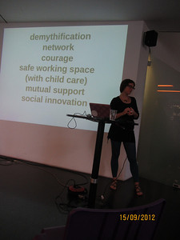

Die Vorträge beim Wiener [Paraflows 2012](http://www.paraflows.at/index.php?id=376&L=1 "Paraflows 2012: Symposium")\-Symposium behandelten Aspekte der digitalen Gesellschaft, die in den üblichen Social Media-Diskursen ignoriert werden. Ein Thema von [Stefanie Wuschitz](http://grenzartikel.com/ "STEFANIE WUSCHITZ") war, wie sich in einer Kultur der Offenheit patriarchalische Machtstrukturen durchsetzen.  Der Titel des Vortrags (Abstract [hier; nach unten scrollen!](http://www.paraflows.at/index.php?id=384 "Paraflows 2012: Abstracts"), mp3 [hier](http://www.paraflows.at/fileadmin/user_upload/paraflows_wuschitz.mp3 "www.paraflows.at/fileadmin/user_upload/paraflows_wuschitz.mp3")), war missverständlich. Stefanie Wuschitz beschrieb ihre Erfahrungen beim Einrichten von Hackspaces für Frauen, vor allem von [miss baltazar's laboratory](http://www.mzbaltazarslaboratory.org/ "miss baltazar's laboratory") in Wien. Am Schluss hat sie zusammengefasst, um was es ihr geht:

> Let's dissect things and give them new names and use them in new ways and not feel totally overwhelmed by all this tech that is transforming us all our lives all the time. My goal is now that people don't continue to see technology as not something secret and above everything and powerful but they try to subvert it an demythify it and build networks and build structures of collaboration and trust and then in this kind of environments I hope that people will act in different ways …

Stefanie Wuschitz hat auch über ihre Erfahrungen mit einer Gewalt- oder Ausschlusskultur in den bestehenden männlich dominierten Hackspaces gesprochen. Dabei meint sie nicht nur, aber auch, sexuelle Belästigungen von Frauen. Stefanie Wuschitz und in der Diskussion auch [Johannnes Grenzfurthner](http://www.monochrom.at/grz/ "grenzfurthner") haben darauf hingewiesen, dass das meritokratische Prinzip der open culture selbst, in der der Erfolgreichste oder die Erfolgreichste bestimmt, auch ein Aussschluss-Prinzip ist. Dieser Gedanke ist für mich neu, und er wäre eine Session bei einem [Opencamp](http://www.barcamp.at/Opencamp_2012 "Opencamp 2012 – barcamp.at") wert. Das meritokratische Prinzip ist sicher effizient, wenn es um normative und administrierbare Lösungen geht wie bei der Wikipedia. Wenn es darum geht zu lernen oder Dinge zu machen, die nicht einfach als besser oder schlechter eingestuft werden können, dann kann sich das offene Prinzip selbst durchkreuzen. Man kann überall im Web diese Dialektik von Offenheit und diskursiver Machtkonzentration beobachten. Twitter ist ein gutes Beispiel. Twitter hat das Publizieren auf der einen Seite noch leichter gemacht als die älteren Blogsysteme. Aber gerade Twitter ist eine Plattform für _Influencer_ geworden, die andere auch daran hindern, sich zu äußern. Im Anschluss an die [Twitterpolitik](http://www.univie.ac.at/twitterpolitik/ "Twitterpolitik | Netzwerke und Themen der politischen Twittersphäre in Österreich")\-Studie gab es eine Diskussion darüber, ob die Studie die Bedeutung von Frauen in der österreichischen Twittersphäre richtig darstellt. Frauen machen wahrscheinlich dort oft ähnliche Erfahrungen wie Stefanie Wuschitz in einem Hackspace: In einer männlich dominierten Diskurskultur werden sie durch das offene Prinzip selbst schnell marginalisiert. Twitter versucht gerade, [zu einem werbefinanzierten Mainstram-Medium zu werden](http://gigaom.com/2012/07/11/twitter-is-building-a-media-business-using-other-peoples-content/ "Twitter is building a media business using other people’s content — Tech News and Analysis"). Die Twitter-Gründer haben sich aus dem operativen Geschäft zurückgezogen und arbeiten an Projekten, die das Publizieren noch niederschwelliger machen sollen als Blogs oder Microblogs: [Medium](https://medium.com/ "Medium") und [Branch](http://branch.com/featured "Featured Conversations – Branch"). Vielleicht machen es solche Plattformen leichter als die vorhandenen sozialen Medien, nicht nur zu Wort, sondern auch zu Gehör kommen. Ich ziehe aus dem Vortrag von Stefanie Wuschitz zwei Konsequenzen: Wenn ich Social Media unterrichte, muss ich versuchen, die [Power Laws](http://www.shirky.com/writings/powerlaw_weblog.html "Shirky: Power Laws, Weblogs, and Inequality") zu unterlaufen, die dazu führen, dass sich einige viel und erfolgreich äußern (auch nach meiner Erfahrung meist Männer) und die übrigen meist kaum etwas schreiben oder bald verstummen. Ich habe das bisher als individuelle Problematik und nicht als Macht-Probematik verstanden. Bei Projekten, in denen Social Media und Content Strategien in Organisationen eingeführt werden, muss eine inklusive Kultur ein ausdrückliches Ziel sein, damit sich nicht nur die äußern, die auch ohne Social Media nach innen und außen das Wort führen. Ich weiss, dass das keine originellen Schlussfolgerungen sind. Es gibt eine riesige Literatur zu diesen Themen. Mir selbst ist aber die Dialektik von Offenheit und Marginalisierung erst durch den Vortrag von Stefanie Wuschitz und die anschließende Diskussion aufgegangen.
