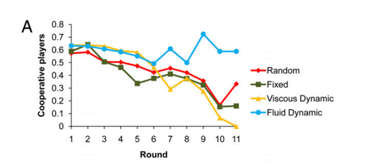

Wann funktioniert Kooperation in Netzwerken dauerhaft, wann funktioniert sie nicht? [Nicholas A. Christakis](http://christakis.med.harvard.edu/ "Nicholas A. Christakis | Welcome to The Christakis Lab") von der Harvard-Universität hat in [einer experimentellen Studie](http://www.pnas.org/content/108/48/19193 "Dynamic social networks promote cooperation in experiments with humans") (PDF [hier](http://christakis.med.harvard.edu/pdf/publications/articles/126.pdf "Dynamic social networks promote cooperation in experiments with humans; PDF")) gezeigt, dass kooperatives Handeln sich in Netzwerken durchsetzt, wenn die Mitglieder ihre Bindungen zu anderen frei knüpfen und lösen können. Wenn sie nicht oder nur selten entscheiden können, mit welchen Partnern sie kooperieren, versandet die Kooperation. Für das Lernen und die Zusammenarbeit mit sozialen Medien legt die Studie nahe: Sie werden immer dann scheitern, wenn die Partner nicht laufend selbst entscheiden können, mit wem sie sich austauschen wollen. Die Studie, die Christakis und seine Kollegen unternommen haben, versucht eines der alten Probleme der Sozialwissenschaften zu lösen: Wann handeln die Mitglieder einer Gruppe (oder auch nur eines Paares) uneigennützig, obwohl sie nicht sicher sein können, dass sich dieses Verhalten für sie lohnt? Wenn die Mitglieder einer Gruppe ihr Handeln nur nach sicheren Vorteilen für sich selbst ausrichten, kommt es zur _tragedy of the commons_: Gemeinsame Güter oder gemeinsame Ressourcen werden aufgeteilt oder zerstört. Das individuell rationale Handeln der Einzelnen kann für Gruppen katastrophale Konsequenzen haben, wenn alle auf die gemeinsamen Güter angewiesen sind. Der Klimawandel führt uns täglich eine _tragedy of the commons_ vor Augen. Christakis hat ein Online-Experiment durchgeführt: Die über Amazons [Mechanical Turk](https://www.mturk.com/mturk/welcome "Amazon Mechanical Turk - Welcome") rekrutierten Teilnehmer sollten direkten Partnern in einem Netzwerk Spielgeld zahlen und konnten dann umgekehrt von diesen wieder eine Summe erhalten. Sie konnten sich aber auch entscheiden, nichts zu zahlen. Das Spiel wurde mit vier verschiedenen Gruppen gespielt; sie unterschieden sich dadurch, wie die Beziehungen nach jeder Runde im Spiel neugeordnet wurden. Bei einer Gruppe wurden neue Partner nach dem Zufallsprinzip zusammengestellt, bei einer Gruppe waren die Beziehungen fix, bei einer durften die Teilnehmer jeweils 10% ihrer Partner neu wählen, bei einer 30%. Das Ergebnis: Nur in der letzten Gruppe, in der die Teilnehmer ihr Netzwerk am leichtesten rekonfigurieren konnten, handelte ein großer Teil der Spieler auf Dauer kooperativ. In allen anderen sank die Bereitschaft zur Zusammenarbeit sehr schnell. Die folgende Grafik aus der verlinkten Studie zeigt diese Entwicklung:  Christakis und seine Kollegen erläutern sie so:

> Dynamic social networks prevent the tragedy of the commons. The fraction of players choosing to cooperate is stable in fluid dynamic networks (blue) but declines over time in random networks (red), fixednetworks (green), and viscous dynamic networks (yellow). Game length is stochastic and varies across sessions, with a constant 80% chance of a subsequent round. Although one might expect to see more cooperation in the viscous condition than in the static condition and more cooperation in the static condition than in the random condition, any differences in cooperation across these conditions are far from statistical significance (considering either all rounds or only rounds 7–11; P > 0.45 for all comparisons).

Die Studie, die ich hier sehr oberflächlich zusammenfasse, enthält auch einen Erklärungsversuch: Nur in dem rekonfigurierbaren Netzwerk wird unkooperatives Verhalten relativ schnell bestraft. Es lohnt sich auf Dauer nicht; die unkooperativ Agierenden werden isoliert. Wer kooperativ handelt, baut sich dagegen ein Netzwerk aus ebenfalls kooperativen Partnern auf. Die Studie ist ein Beispiel für die sozialwissenschaftliche Methodik, die Christakis in den Video [A New Kind Of Social Science For The  21st century](http://edge.org/conversation/a-21st-century-change-to-social-science "A New Kind Of Social Science For The  21st century | Conversation | Edge") bei [Edge](http://www.edge.org/ "Edge : Conversations on the edge of human knowledge") erläutert. In Christakis' Forschung fließen Evolutionsbiologie, Netzwerkanalyse- und Theorie und Spieltheorie zusammen. Ich bin erst jetzt auf sie gestoßen. Ich glaube, dass sie sehr viele Impulse für die Erforschung sozialer Medien enthält. Eine, vielleicht zu simple, Idee im Anschluss an die Studie von Christakis: Lernen mit Social Media und das Erlernen des Umgangs mit Social Media funktionieren offenbar nur in einem Setting, in dem die Teilnehmer sich frei entscheiden, mit wem sie sich austauschen. In einer Art Klasse (wie wir sie zum Beispiel bei uns an der FH meist haben) lässt sich viel schwerer gemeinsam lernen als in offenen Formaten, z.B. bei einem BarCamp. Vielleicht hängt das damit zusammen, dass eine Klasse eine fixes Setting ist, in dem kooperatives Verhalten zu wenig bestätigt wird. Netzwerke, Lernnetzwerke, so kann man vielleicht sagen, sind dann effizient, wenn sie auf Freiwilligkeit beruhen und jederzeit neu konfiguriert werden können.
