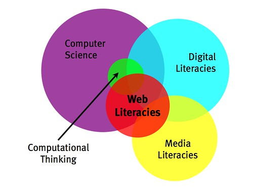

Das Web als Instrument des Lernens wird langsam populär—spätestens durch Online-Universitätskurse wie die von [Udacity](http://www.udacity.com/ "Udacity | Free Online Courses. Advance your College Education & Career") und [Coursera](https://www.coursera.org/ "Coursera.org"). Dass das Web auch Gegenstand der Bildung ist, und zwar nicht nur ein peripherer, ist weit weniger durchgedrungen. In einem [Whitepaper](https://wiki.mozilla.org/Learning/WebLiteraciesWhitePaper "Learning/WebLiteraciesWhitePaper - MozillaWiki") der [Mozilla Foundation](http://www.mozilla.org/foundation/ "The Mozilla Foundation") werden jetzt die _Web Literacies_, die Fähigkeiten zum aktiven Umgang mit dem Web, sehr schlüssig beschrieben.

Mich hat erst dieser Tweet von [Giulio Quaggiotto](https://blogs.worldbank.org/psd/team/giulio-quaggiotto "Giulio Quaggiotto") darauf aufmerksam gemacht:

> Useful digital literacy skills chart and report from Mozilla [flpbd.it/ke0h8](http://t.co/YJ8dzHHP "http://flpbd.it/ke0h8") ht @[danmcquillan](https://twitter.com/danmcquillan) cc @[heinz](https://twitter.com/heinz)
> 
> — giulio quaggiotto (@gquaggiotto) [November 11, 2012](https://twitter.com/gquaggiotto/status/267632051463786497)

In der Mozilla Foundation sind _Digital Literacies_ schon lange ein Thema, und inzwischen spricht man dort von _Web Literacies_. Mich freut das auch, weil wir an der FH ein [Web Literacy Lab](http://wll.fh-joanneum.at/ "Web Literacy Lab") eingerichtet haben und jetzt etwas sicherer sind, dass dieser Name die Sache trifft. Wichtiger ist aber, was dort inhaltlich entwickelt wird: ein systematisches und begründetes Konzept für das Wissen, das man braucht, um aktiv am Web teilzuhaben, und für die Vermittlung dieses Wissens. Das in dem Tweet zitierte _Learning/WebLiteraciesWhitePaper_ enthält die letzte Version dieses Konzepts. [Doug Belshaw](http://about.me/dajbelshaw "Doug Belshaw (dajbelshaw) on about.me") ist der Hauptautor; u.a. greift er auf viele Arbeiten von [Michelle Levesque](http://rwxweb.wordpress.com/about/ "Michelle Levesque « rwxweb") zurück. Belshaw befasst sich seit Jahren intensiv mit _Digital Literacies_, [bloggt darüber](http://dougbelshaw.com/blog/ "dougbelshaw.com/blog") und hat [darüber promoviert](http://neverendingthesis.com/ "Wiki-Version der Dissertation von Doug Belshaw").

In dem Papier ist von _Web Literacies_ im Plural die Rede, weil es sich bei Webkompetenz oder Webbildung um ein Bündel um Fähigkeiten und ihrer Reflexion handelt, das Elemente aus verschiedenen Bereichen enthält. In einer Grafik erscheinen _web literacies_ als Schnittmenge aus _media literacies_, _digital literacies_ und Informatik; sie überlappen sich mit dem _computational thinking_:

(Aus dem Mozilla Web Literacies white paper: [mzl.la/weblit](https://wiki.mozilla.org/Learning/WebLiteraciesWhitePaper "Learning/WebLiteraciesWhitePaper - MozillaWiki"), inspired by Connected Learning and Carla Casilli)

_Web litercies_ sind eine eigene, spezifische Form oder Gruppe von Literacies. Aus der Natur und der Wichtigkeit des Web ergibt sich, woraus die Web Literacies bestehen und warum sie so wichtig sind. Das Papier nennt das Web

> die größte öffentliche Ressource der Welt, das Betriebssystem der Zukunft und (glauben wir) einen der größten Treiber des Glücks und der menschlichen Blüte \[one of the greatest drivers of happiness and human flourishing\], den die Welt je gesehen hat.

_Web literacies_, also eine auf das Web bezogene Bildung, sind nötig, um an den Möglichkeiten des Web teilhaben zu können.

> Das offene Web hat wachsenden Zugang zur Information und zueinander ermöglicht und zugleich eine Plattform für viele neue Weisen zu lernen und zum Erwerben neuer Fähigkeiten bereitgestellt. Es ist bedeutsam für Entwickler, Lehre, Ärzte, Bauarbeiter und viele andere, darunter Lernende jeder Art. Deshalb glauben wir, dass es eine neue Gruppe von Fähigkeiten \[_literacies_\] für moderne Bürger—web literacies—gibt, die sie darauf vorbereiten, das Web effektiv zu nutzen um Informationen zu erhalten, sich mit anderen zu verbinden und sich auszudrücken.

Kernbereiche der _Web Literacies_ sind das Finden von Informationen, das Schaffen von Inhalten und der Austausch mit anderen Teilnehmerinnen. Hinzu kommen als vierte Gruppe von Literacies das Wissen und die Fähigkeiten, die nötig sind, um das Web zu schützen und seine Besonderheiten zu verteidigen.

_Web Literacies_ lassen sich auf verschiedenen Ebenen erfassen. Das Whitepaper versucht ein Framework zu entwickeln, um die

> Fähigkeiten (_skills_), Kompetenzen (_competencies_) und die Bildung (_literacies_) zu verstehen, die nötig sind, um ein Webmacher (_Webmaker_) zu sein.

Entscheidend ist, dass _Web Literacies_ dazu befähigen, das Web zu gestalten, nicht nur es zu konsumieren.

> Für das Web gebildet zu sein \[_Being web literate_\] bedeutet nicht nur dazu fähig zu sein, das Web zu lesen, sondern auch dazu in der Lage zu sein, es zu ´schreiben´.

Für das Framework, das in dem Papier entwickelt wird, ist vor allem die Dreiteilung in _skills_, _competencies_ und _literacies_ wichtig. _Skills_ bezieht sich auf erlernte Fähigkeiten, bestimmte Handlungen durchzuführen, _competencies_ auf Sammlungen von _skills_ für bestimmte Zwecke. Zur _literacy_ gehört Reflexivität und Kommunikation mit anderen Gebildeten; das Papier ist gerade hier noch nicht abgeschlossen. Im Original heisst es:

> For someone to be ‘literate’ they have to be aware that they are literate and be accepted within a wider community of literate peers.

Ich würde gerne in einem späteren Post das Konzept des Papers mit dem vergleichen, dass ich in [Zwei Ebenen der Web Literacy](http://wittenbrink.net/lostandfound/2011/02/zwei-ebenen-der-web-literacy/ "Zwei Ebenen der Web Literacy - Lost and Found") beschrieben habe. Ton Zijlstra sagt es in [Lernen in der Netzwerkgesellschaft](http://de.slideshare.net/TonZijlstra/lernen-in-der-netzwerkgesellschaft "Lernen in der Netzwerkgesellschaft") ganz einfach:

> Literacy = Skill + Community

Die Stoßrichtung bei Mozilla ist Webentwicklung, also auch das Coden. Dabei geht es um das Niveau zwischen den ganz allgemeinen Fähigkeiten zum Umgang mit dem Web (z.B. einen URL eingeben zu können oder etwas zu suchen) und der eigentlichen Entwicklung. Die Tabelle zu den Webkompetenzen sieht derzeit so aus:

<table style="border-collapse: collapse; width: 100%; border: 1px solid black; color: white;"><tbody><tr><td style="background-color: rgb(225, 61, 59); border: 1px solid black; text-align: center; padding: 20px 0pt; font-size: 1.2em;"><strong>EXPLORING</strong></td><td style="background-color: rgb(59, 140, 195); border: 1px solid black; text-align: center; padding: 20px 0pt; font-size: 1.2em;"><strong>CREATING</strong></td><td style="background-color: rgb(241, 165, 30); border: 1px solid black; text-align: center; padding: 20px 0pt; font-size: 1.2em;"><strong>CONNECTING</strong></td><td style="background-color: rgb(78, 164, 153); border: 1px solid black; text-align: center; padding: 20px 0pt; font-size: 1.2em;"><strong>PROTECTING</strong></td></tr><tr><td style="background-color: rgb(7, 44, 60); text-align: center; padding: 20px 0pt; font-size: 1.5em;" colspan="4"><strong>BEGINNER</strong></td></tr><tr><td style="background-color: rgb(225, 61, 59); border: 1px solid black; text-align: center; padding: 10px 20px;"><strong>Browser basics</strong> <em>(e.g. URLs, copy/paste)</em></td><td style="background-color: rgb(59, 140, 195); border: 1px solid black; text-align: center; padding: 10px 20px;"><strong>HTML basics</strong> <em>(e.g. adding images, linking)</em></td><td style="background-color: rgb(241, 165, 30); border: 1px solid black; text-align: center; padding: 10px 20px;"><strong>Participation</strong> <em>(e.g. etiquette, curation)</em></td><td style="background-color: rgb(78, 164, 153); border: 1px solid black; text-align: center; padding: 10px 20px;"><strong>Privacy</strong> <em>(e.g. cookies, privacy controls)</em></td></tr><tr><td style="background-color: rgb(225, 61, 59); border: 1px solid black; text-align: center; padding: 10px 20px;"><strong>Search engine basics</strong> <em>(e.g. keyword search, filtering)</em></td><td style="background-color: rgb(59, 140, 195); border: 1px solid black; text-align: center; padding: 10px 20px;"><strong>CSS basics</strong> <em>(e.g. fonts, positioning)</em></td><td style="background-color: rgb(241, 165, 30); border: 1px solid black; text-align: center; padding: 10px 20px;"><strong>Collaboration</strong> <em>(e.g. co-creation, wikis)</em></td><td style="background-color: rgb(78, 164, 153); border: 1px solid black; text-align: center; padding: 10px 20px;"><strong>Security basics</strong> <em>(e.g. HTTPS, password management)</em></td></tr><tr><td style="background-color: rgb(225, 61, 59); border: 1px solid black; text-align: center; padding: 10px 20px;"><strong>Web mechanics</strong> <em>(e.g. view source, hyperlinks)</em></td><td style="background-color: rgb(59, 140, 195); border: 1px solid black; text-align: center; padding: 10px 20px;"><strong>Web design basics</strong> <em>(e.g. affordances of the web, designing for audiences)</em></td><td style="background-color: rgb(241, 165, 30); border: 1px solid black; text-align: center; padding: 10px 20px;"><strong>Sharing</strong> <em>(e.g. social networks, embedding)</em></td><td style="background-color: rgb(78, 164, 153); border: 1px solid black; text-align: center; padding: 10px 20px;"><strong>Rights online</strong> <em>(e.g. copyright, open licensing)</em></td></tr><tr><td style="background-color: rgb(7, 44, 60); text-align: center; color: white; padding: 20px 0pt; font-size: 1.5em;" colspan="4"><strong>INTERMEDIATE</strong></td></tr><tr><td style="background-color: rgb(225, 61, 59); border: 1px solid black; text-align: center; padding: 10px 20px;"><strong>Browser skills</strong> <em>(e.g. cookie management, add-ons)</em></td><td style="background-color: rgb(59, 140, 195); border: 1px solid black; text-align: center; padding: 10px 20px;"><strong>Javascript basics</strong> <em>(e.g. programming basics, javascript syntax)</em></td><td style="background-color: rgb(241, 165, 30); border: 1px solid black; text-align: center; padding: 10px 20px;"><strong>Contributing to web communities</strong> <em>(e.g. distributed working, collaborative curation)</em></td><td style="background-color: rgb(78, 164, 153); border: 1px solid black; text-align: center; padding: 10px 20px;"><strong>Identity</strong> <em>(e.g. personal information curation, tracking management)</em></td></tr><tr><td style="background-color: rgb(225, 61, 59); border: 1px solid black; text-align: center; padding: 10px 20px;"><strong>Credibility</strong> <em>(e.g. trustworthiness of websites, evaluating information)</em></td><td style="background-color: rgb(59, 140, 195); border: 1px solid black; text-align: center; padding: 10px 20px;"><strong>Advanced web design</strong> <em>(e.g. responsive design, accessibility)</em></td><td style="background-color: rgb(241, 165, 30); border: 1px solid black; text-align: center; padding: 10px 20px;"><strong>Storytelling</strong> <em>(e.g. multimedia, augmentation)</em></td><td style="background-color: rgb(78, 164, 153); border: 1px solid black; text-align: center; padding: 10px 20px;"><strong>Security &amp; encryption</strong> <em>(e.g. data protection, basic encryption)</em></td></tr><tr><td style="background-color: rgb(225, 61, 59); border: 1px solid black; text-align: center; padding: 10px 20px;"><strong>Remixing</strong> <em>(e.g. mashups, hackable games)</em></td><td style="background-color: rgb(59, 140, 195); border: 1px solid black; text-align: center; padding: 10px 20px;"><strong>Infrastructure</strong> <em>(e.g. hosting, domains)</em></td><td style="background-color: rgb(241, 165, 30); border: 1px solid black; text-align: center; padding: 10px 20px;"><strong>Open practices</strong> <em>(e.g. open standards, open source)</em></td><td style="background-color: rgb(78, 164, 153); border: 1px solid black; text-align: center; padding: 10px 20px;"><strong>Legalese on the web</strong> <em>(e.g. privacy policies, terms of service agreements)</em></td></tr></tbody></table>

In diesem Post wollte ich nur auf dieses Konzept hinweisen, das mir in vielem richtungsweisend erscheint. Auf die Überlegungen zur Didaktik, auf die [Webmaker badges](http://mozillafestival.org/blog/webmaker-badges/ "Mozilla Festival 2012 » Introducing Mozilla Webmaker badges") und auf die konkreten Mozilla-Projekte zu den _Web Literacies_ möchte ich getrennt eingehen.

Das Mozilla-Whitepaper ist eines der durchdachtesten Konzepte zu einer webbezogenen Bildung, das ich kenne—ein großer Schritt.

(Auch gepostet im [Blog des Web Literacy Lab](http://wll.fh-joanneum.at/2012/11/web-literacies-mozilla-version/ "Web Literacies, Mozilla-Version – Web Literacy Lab").)
