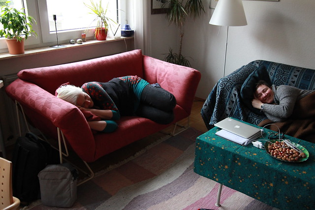

Du bist gewohnt, zwischen Arbeit und Freizeit zu unterscheiden, du wolltest darauf sogar mehr Wert legen als in den letzten Jahren. Du wolltest in diesem Urlaub nicht arbeiten. Und dann triffst du dich Anfang Januar mit [Monika](http://lernspielwiese.wordpress.com/ "Lernspielwiese | Hauptsache was gelernt!") und [Dörte](http://diegoerelebt.wordpress.com/ "dieGoerelebt – Dörtes Zettelkasten | prä-literarisch | post-feministisch | pri-vat 2.0").

Du trinkst mit ihnen Wein, hörst viel über ihr Leben und ihre Beziehungen, du erzählst mehr über dich, als viele alte Freunde wissen. Sie erlauben dir, mit ihnen zu flirten, während ihr den [#MMC13](http://howtomooc.org/ "#MMC13 - der Open MOOC-Maker Course 2013 - Offene Online-Kurse konzipieren, planen und durchführen - gewusst wie!") vorbereitet, einen Kurs über das Lernen im Netz. Ihr besetzt mit euren MacBooks und iPads für zwei Tage das Wohnzimmer eurer Gastgeberin, deiner Schwester. Du frühstückst mit Monika und Dörte in dem kleinen Hotel, in dem du übernachtest, wenn deine Eltern runde Geburtstage feiern. Ihr geht durch das nachweihnachtlich graue Bad Vilbel, und ihr sucht dort spätabends eine offene Kneipe. Sie erzählen dir von ihren Partnern, von ihren Kolleginnen und ihren Chefs. Ihr diskutiert darüber, wo ihr leben möchtet. Du fotografierst sie vor den Bücherregalen deiner Schwester und du drückst sie an dich, während dein Neffe euch fotografiert.

Du lernst von ihnen viel über andere offene Online-Kurse, über Fernlehre und Fernstudien und über ihre Netzwerke. Ihr plant Woche für Woche des Kurses, schreibt alle Beteiligten an und konzipiert Blogposts. Ihr bereitet eine Umfrage mit GoogleDocs und Hangouts on Air vor. Ihr schreibt eine Einreichung für die [re:publica 13](http://re-publica.de/ "breaking / news | re-publica.de") und lasst euren Kurs auf die [die MOOC-Liste von Siemens/Downes](http://www.mooc.ca/courses.htm "Find Courses ~ MOOC") aufnehmen.

Du hoffst, dass du wenigstens etwas selbst zu dem MOOC und seinen Inhalten beitragen kannst, denn du verstehst nicht viel von MOOCs. Dich beeindruckt Dörtes Fähigkeit, strategisch zu planen und Punkt für Punkt umzusetzen, und Monikas Sensibilität.

Du kennst Monika schon lange gut, Dörte fast nur vom Arbeiten. Du hast dich manchmal gefragt, ob sie nicht so spontan und unmittelbar an ein solches Projekt herangehen, dass du nicht zu ihnen passt. Du hast auch Angst gehabt, dich mit diesem Projekt zu verzetteln. Jetzt merkst du, dass dich etwas mit ihnen verbindest, was du nur von ganz wenigen Leuten kennst: dass Online- und Offline-Beziehung, Leben und Arbeiten ineinander übergehen, sich gegenseitig erweitern.

Beim letzten Bier, das du mit Dörte trinkst, kommt ihr darauf, dass ihr im Netz vor allem schreiben wollt und dass Freundschaften und Schreiben für euch zusammengehören. Ihr nehmt euch nicht mehr vor, als den Kurs, der vor euch liegt, aber ihr sprecht darüber, wie es wäre zusammen zu schreiben und andere Formen auszuprobieren als Blogposts.

Jetzt sitzt du im Zug zurück nach Graz. Die beiden MOOC-Gastgeberinnen sind zu weit weg. Du bist gespannt auf das Projekt, zu dem sie dich eingeladen haben. Du bist ihnen dankbar für die Energie, die du wieder hast.
