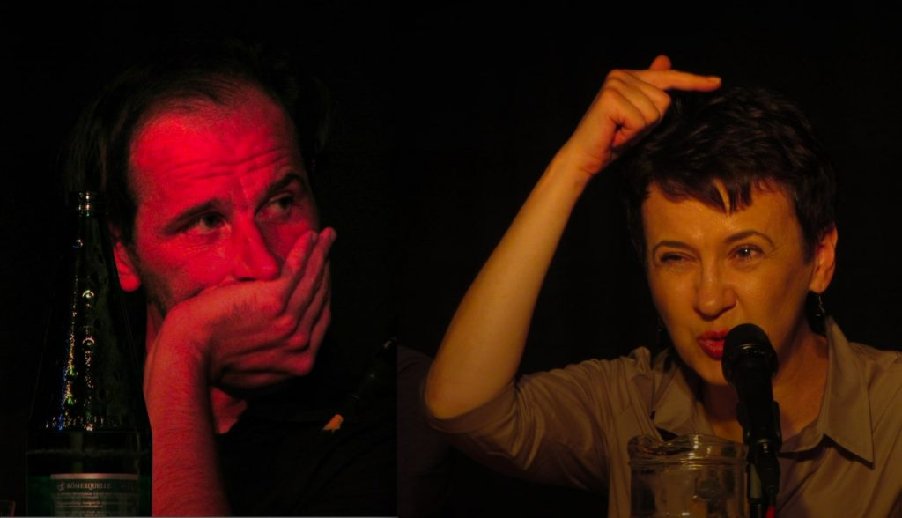

\[caption id="attachment\_11036" align="aligncenter" width="700"\] Mirsad Sijarić und Oksana Sabuschko in Graz, 11. Juni 2014\[/caption\]

Der zweite [FreiSchreiben](http://www.isop.at/2014/freischreiben-literatur-und-widerstand-oksana-sabuschko-und-mirsad-sijaric)\-Abend am Mittwoch war eine Gelegenheit, zwei sehr unterschiedliche Autoren kennenzulernen: den Bosnier [Mirsad Sijarić](http://www.literatur-aus-bosnien.org/index.php/autoreninnen-aus-bih/n-s/68-mirsad-sijari.html) und die Ukrainerin [Oksana Sabuschko](http://www.perlentaucher.de/autor/oksana-sabuschko.html). Beide sind gerade als Gäste des [Internationalen Hauses der AutorInnen](http://www.ihag.org/primcell.php?ses=6905y3675q&lang=dt&bas=iha) in Graz. Ich kannte beide nicht. Beide schreiben sehr sehr gut.

Ihre Selbstinterpretationen waren vielleicht noch unterschiedlicher als ihre Schreibweisen: Sijarić arbeitet ohne Rücksicht auf ein Publikum und sieht sich selbst nicht zum Kommentator seines Werks berufen. Sabuschko erläutert ihren Text nicht nur, sie bewirbt ihn mit großer rhetorischer Geste und ordnet ihn und sich historisch ein. Der Text von Sijarić—ein einziger Satz, der nur ein Teil eines viel längeren Satzes ist—drehte sich aus einer schwer zuzuordnenden Perspektive um Radovan Karadžić und seinen Präsidentenpalast. Er stammt aus [Jos jedna pjesma o ljubavi i ratu](http://www.interliber.com/catlistdetail.asp?ISBN=9789958590597&ml=b) (Noch eine Weise von Liebe und Krieg; deutsche Version des Abschnitts [hier](http://www.literatur-aus-bosnien.org/index.php/autoreninnen-aus-bih/n-s/68-mirsad-sijari.html)). Sabuschko las den Beginn von [Museum der vergessenen Geheimnisse](http://www.droschl.com/programm/buch.php?book_id=728): eine Liebesszene, in der Fotos aus den sowjetischen 60er Jahren angesehen und Präsenz und Entferntheit der Vergangenheit reflektiert werden. Sijarić lehnt jeden Anspruch zu unterhalten ab, Sabuschko zieht die Leser dramaturgisch geschickt mit einer erotischen Szene ins Geschehen. Die Haltung von Sijarić hat mich an [Claude Simon](http://www.faz.net/aktuell/feuilleton/bilder-und-zeiten/zum-100-geburtstag-von-claude-simon-in-der-gegenwart-des-schreibens-12601930.html) erinnert, der auch darauf verzichtet hat, die Geschichten, die er schrieb, zu beherrschen. Bei Sabuschko fielen mir plakative Thesen Marcel Reich-Ranickis ein. Es ist nicht schwer sich auszumalen, wie er ihren Text gelobt hätte. [Ninja Reichert](http://www.ninjareichert.com/) hat beide Texte sehr nachdrücklich, vielleicht gelegentlich zu dramatisch gelesen. Mein Kollege [Thomas Wolkinger](https://twitter.com/Wolkinger) hat die Autoren im Gespräch herausarbeiten lassen, wie sie ihre Schreibsituationen verstehen.

\[caption id="attachment\_11037" align="aligncenter" width="700"\] Nina Reicher liest Mirsad Sijarić, Graz 11. Juni 2014\[/caption\]

So verschieden Sijarić und Sabuschko schreiben: ein Motiv war beiden gemeinsam: die sich wiederholende und trotzdem nur indirekt greifbare Geschichte: eine grauenhafte Vergangenheit, die zugleich Zukunft ist. Sijarić schrieb während des Kriegs in Sarajevo und erfuhr diese Situation als identisch mit der eines [Zbigniew Herbert](http://www.lyrik.ch/lyrik/spur4/zbigniew/herbert.htm) oder [Czesław Miłosz](http://de.wikipedia.org/wiki/Czes%C5%82aw_Mi%C5%82osz) im letzten Weltkrieg. Für Sabuschko erweisen sich die Fotografien des Lebens in der untergegangenen Sowjetunion jetzt, nach der Veröffentlichung ihres Buchs, als Bilder der von Putins Imperium bedrohten ukrainischen Gegenwart.

Hier in der Grazer Innenstadt wird die Vergangenheit liebevoll und kleinteilig präpariert und ausgestellt, dachte ich beim Heimgehen. In den Ländern an der Peripherie des alten Kakanien ist sie ein Alptraum, verkörpert sie sich in Gespenstern.

**Anmerkung:** Zuerst publiziert am 13. Juni 2014 in Medium.
