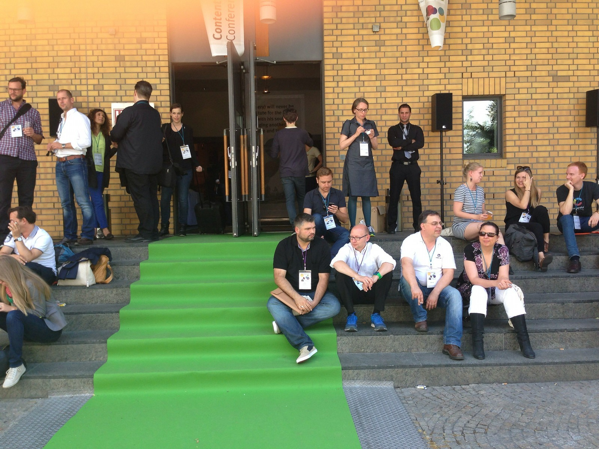

Das [Content Strategy Forum 2014](http://www.csforum2014.com/ "Content Strategy Forum Conference 2014 is happening in Frankfurt, Germany on July 1-3") in Frankfurt war das erste größere Event zur Contentstrategie im deutschen Sprachraum, das sich an die internationale Community richtete.

<blockquote class="twitter-tweet" lang="de">
Heute erster Konferenztag beim <a href="https://twitter.com/hashtag/csforum14?src=hash">#csforum14</a>. Großartig, wen und was <a href="https://twitter.com/BendlerBlogger">@bendlerblogger</a> zusammengebracht hat
— Heinz Wittenbrink (@heinz) <a href="https://twitter.com/heinz/statuses/484316307014582273">2. Juli 2014</a></blockquote>

Für mich bot das Forum vor allem eine Gelegenheit, Kontakte aufzufrischen und neue zu knüpfen. Ich gebe hier dem Hang zum Namedropping nach, um mich an die vielen Gespräche zu erinnern. Zu den Vorträgen und Präsentationen gibt es [Storifies](https://storify.com/CSF_Frankfurt "CSF_Frankfurt's social stories · Storify"); das Hashtag war [#csforum14](https://twitter.com/hashtag/csforum14 "Twitter / Suche - #csforum14").

Am ersten Tag im Frankfurter Presse Club präsentierten meine Kollegin [Brigitte](https://brigittealice.wordpress.com/author/brigittealice/ "Brigitte Alice Radl | b.a.r blog") und ich, wie wir die Contentstrategie für die FH Joanneum entwickeln. Brigitte hat die Präsentation allein vorbereitet, ich war bei dem Workshop als Assistenzfigur dabei. Ich glaube, dass die Teilnehmerinnen zufrieden waren, obwohl der Workshop fast ausschließlich aus unserem Vortrag bestand und sehr wenig Interaktion stattfand.

<blockquote class="twitter-tweet" lang="de">
<a href="https://twitter.com/brigitte_alice">@brigitte_alice</a> <a href="https://twitter.com/heinz">@heinz</a> haben für die FH Joanneum tolle Onlineideen entwickelt. Gespannt auf das Ergebnis! <a href="https://twitter.com/hashtag/csforum14?src=hash">#csforum14</a> <a href="http://t.co/gduAeKPgTq">pic.twitter.com/gduAeKPgTq</a>
— Granaton (@Granat_On) <a href="https://twitter.com/Granat_On/statuses/483928288507998209">1. Juli 2014</a></blockquote>

<blockquote class="twitter-tweet" lang="de">
<a href="https://twitter.com/heinz">@heinz</a> erklärt de Herausforderungen für Hochschulwebsites. <a href="https://twitter.com/hashtag/csforum14?src=hash">#csforum14</a> <a href="http://t.co/kotvBolEMz">pic.twitter.com/kotvBolEMz</a>
— Naya Cliché (@nayacliche) <a href="https://twitter.com/nayacliche/statuses/483893670903820288">1. Juli 2014</a></blockquote>

Die eigentliche Konferenz fand am zweiten und dritten Tag in der Union Halle im Viertel um den Neubau der Europäischen Zentralbank statt. Dieser Neubau ist für mich ein Symbol der Contentstrategie hier auf dem Kontinent: ambitioniert und unfertig, mutig und schwer einzuordnen, dynamisch und ein Solitär in einem Gebiet, in dem es Gebäude dieses Typs noch nie gab.

Die deutschsprachigen Vortragenden tasteten sich von verschiedenen Ausgangspunkten an dieses neue Territorium heran. Sie führten dabei gerne die Ausrüstung vor, die sie mitgebracht hatten, und die mit Contentstrategie gelegentlich nur dem Namen nach zu tun hatte. Brücken zur Disziplin der Contentstrategie, wie sie vor allem in den angelsächsischen Ländern verstanden wird, schlugen die internationalen Teilnehmerinnen. Wie oft, wenn es in Deutschland, Österreich oder der Schweiz um Contentstrategie geht, berühren sich zwei Welten: die der inhaltlichen orientierten Online-Kommunikatoren hier—und die der Leute, die Contentstrategie als eigenen Beruf mit engem Bezug zur Web-Entwicklung vorantreiben, dort.

Wir versuchen in Graz, Contentstrategie an einer Hochschule zu lehren, und wir sind mit der deutschsprachigen Community, deren Mitglieder sich in Frankfurt getroffen haben, gut vernetzt. Eine ganze Reihe der Leute, die ich persönlich schätze und unseren Studenten immer wieder empfehle, waren in Frankfurt, und ich habe mich gefreut, sie zu treffen: neben [Sascha Stoltenow](https://twitter.com/BendlerBlogger "Sascha Stoltenow (BendlerBlogger) auf Twitter"), dem Organisator des Forums, vor allem [Thomas Pleil](http://thomaspleil.wordpress.com/ "Das Textdepot | Thomas Pleils Bruchstücke aus PR, Medien und Marketing"), [Judith Denkmayr](https://twitter.com/linzerschnitte "Judith Denkmayr (linzerschnitte) auf Twitter"), [Klaus Eck](https://twitter.com/klauseck "Klaus Eck (klauseck) auf Twitter") und [Doris Eichmeier](http://www.eichmeier.de/ "Doris Eichmeier"). Bei der Entwicklung unseres Master-Studiengangs (dessen Akkreditierung sich leider als schwierig erweist), haben sie uns alle geholfen, und ich bin ihnen dafür sehr dankbar.

Mit der englischsprachigen Community, an der wir uns in Graz vor allem orientieren, müssen wir uns erst noch intensiver verknüpfen. Ich habe immer noch Hemmungen, den AutorInnen der Bücher über Contentstrategie, deren Methoden wir uns gerade aneignen, zu sagen, dass wir einen Studiengang zu diesem Thema aufmachen wollen. Um so erleichterter bin ich, dass alle, die ich in Frankfurt angesprochen habe, positiv reagiert haben. Ich habe mit [Margot Bloomstein](https://twitter.com/mbloomstein "Margot Bloomstein (mbloomstein) auf Twitter"), [Hilary Marsh](http://www.hilarymarsh.com/ "Hilary Marsh, Content Company | digital strategy, content strategy, social media, e-communications"), [Kerry-Anne Gilowey](https://twitter.com/kerry_anne "Kerry-Anne Gilowey (kerry_anne) auf Twitter"), [Rahel Anne Bailie](http://intentionaldesign.ca/profile/ "Profile of Rahel Anne Bailie | Intentional Design Inc.") und [Destry Wion](https://twitter.com/wion "Destry Wion (wion) auf Twitter") über unseren neuen Studiengang gesprochen, und sie werden, wie es aussieht, lehrend oder beratend mitmachen. Jetzt müssen wir nur noch hinbekommen, dass der Studiengang in absehbarer Zeit auch tatsächlich akkreditiert wird.

Mir ist klar, dass auch die englischsprachige Contentstrategie-Community alles andere als monolithisch ist. Es gibt in ihr sehr unterschiedliche Positionen und Methoden und natürlich auch interne Konkurrenz. Ich halte diese Vielfalt aber—wie Margot Bloomstein es in ihrer Eingangspräsentation erklärt hat—für eine Chance und nicht für eine Bedrohung, weil ihr ein ähnliches Verständnis der Aufgaben von Content-Strategen zugrundeliegt.

Zu der Gruppe, die in Frankfurt zusammenkam, gehören viele jüngere Leute. Die unter oder knapp über 30jährigen werden bestimmen, wie sich die deutschsprachige Contentstrategie-Community entwickelt. Aus Graz waren außer Brigitte auch [Cornelia Schuss](http://www.radwerk15.at/wer-sind-wir/team/team_schuss "Cornelia Schuss | radwerk15") und [Kathrin Podbrecnik](https://www.facebook.com/kathrin.podbrecnik "Kathrin Podbrecnik") dabei, die an der Website für unsere Hochschule arbeiten. Von der Gruppe um Thomas Pleil an der Hochschule Darmstadt habe ich [Pia Sue Helferich](https://twitter.com/pshelferich "Pia Sue Helferich (pshelferich) auf Twitter"), [Matthias Bastian](http://ebusiness-info.de/profile/matthias-bastian "Matthias Bastian | e-Business-Lotse Darmstadt Dieburg") und [Katja Eisert](https://www.xing.com/profile/Katja_Eisert "Katja Eisert | XING") wiedergetroffen. [Udo Butschinek](http://www.content-driven-ecommerce.de/content-strategie-im-ecommerce/ "Content-Strategie im E-Commerce") hat mich mit [Christian Blomberg](https://twitter.com/C_Blomberg "Christian Blomberg (C_Blomberg) auf Twitter") von dem Berliner Startup [Contentful](https://www.contentful.com/ "Content Management API and CMS") bekannt gemacht. Contentful bietet eine webbasierte Lösung für die Erstellung und Administration von präsentationsunabhängigen Inhalten an.

Das Content Strategy Forum war kein BarCamp, aber es fand in einer ähnlichen Atmosphäre statt. Sie war konzentriert, offen und entspannt. Sascha Stoltenow und sein Team haben das Event zurückhaltend, präzise und ganz ohne aufdringliches Eigenmarketing organisiert. Wie bei jedem guten Event bin ich mit mehr Fragen als Antworten nach Hause gefahren, und auch deshalb werde ich mich gerne an die strahlenden Tage in Frankfurt erinnern.
