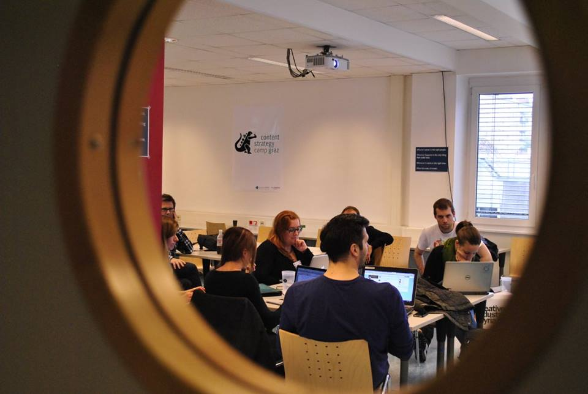

Ich war noch nie so aufgeregt vor einem BarCamp wie vor dem [Content Strategy Camp Graz](http://www.barcamp.at/Content_Strategy_Camp_Graz "Content Strategy Camp Graz – barcamp.at") am Wochenende. Mit dem Camp haben wir die erste Präsenzwoche des neuen [Studiengangs Content-Strategie](http://www.fh-joanneum.at/aw/home/Studienangebot_Uebersicht/department_medien_design/~cqdz/cos/?lan=de "Studium "Content-Strategie / Content Strategy" |  FH JOANNEUM Gesellschaft mbH :: University of applied sciences") abgeschlossen.

Ich wollte auf den Studiengang durch ein öffentliches Ereignis aufmerksam machen, das zu ihm passt und nicht zu teuer ist. Ich hatte also nicht nur didaktische Motive für diese Veranstaltung. Ich war unsicher, ob den Studenten eine solche Veranstaltung tatsächlich genug bringt, und ob ihnen das Format nicht vielleicht etwas unseriös vorkommt. (Ich bin manchmal kleinmütig.) Im Rückblick hat sich das Format bewährt—ein thematisches BarCamp kann eine Vorlesung sicher ersetzen. Und die Fähigkeiten und die Offenheit der neuen Studenten habe ich, bevor ich sie persönlich kennengelernt habe, etwas unterschätzt. Sorry!

Wir haben zu diesem Camp sehr kurzfristig eingeladen. Es haben sich 70 Leute angemeldet, und es sind—über die beiden Tage verteilt—auch 70 Leute gekommen. Darunter waren Studenten aus anderen Studiengängen und einige Unternehmer.

Wir haben in sechs Tracks ganz unterschiedliche Aspekt von Content-Strategie und Produktion von Webinhalten besprochen. Es waren einige SEOler dabei. Das Verhältnis von SEO und Inhalt war sicher ein Schwerpunktthema des Camps. Wir haben viel voneinander gelernt. Viele Teilnehmerinnen drückten, passend zum Start des Studium, Aufbruchsstimmung aus: Die Inhalte müssen in den Mittelpunkt der professionellen Beschäftigung mit Webkommunikation— sonst zertreten Content-Monster aufwändige und langwierige Online- und Social Media-Projekte.

Die Sessions sind [hier](http://www.barcamp.at/Coscamp_Graz_2014_Day1_Pads "Coscamp Graz 2014 Day1 Pads – barcamp.at") und [hier](http://www.barcamp.at/Coscamp_Graz_2014_Day2_Pads "Coscamp Graz 2014 Day2 Pads – barcamp.at") dokumentiert.

Wenn ich es richtig sehe, hat die Veranstaltung allen Studenten getaugt—ich hoffe, dass sich alle trauen würden, auch Kritik zu äußern.

Es gibt tatsächlich einige Gründe, aus denen BarCamps ein gutes Format für Lehrveranstaltungen sind:

1. Die Lernenden bekommen nicht einfach etwas geboten, sondern sie werden selbst aktiv—jedenfalls, wenn sie sich an die BarCamp-Regeln halten.
2. Es lernt nicht jeder dasselbe, sondern man sucht sich aktiv aus, was wichtig ist.
3. Durch die Dokumentation, durch die Gespräche und durch die gemeinsamen Runden zur Begrüßung und zum Ende bekommt man trotzdem mit, was die anderen lernen.
4. Man kann von Fachleuten etwas lernen, die aus ihrer Arbeit berichten, also sich nicht künstlich einen Lehrenden-Hut aufsetzen müssen.
5. Dadurch, dass Leute aus der Wirtschaft teilnehmen, wird klarer, warum man etwas lernt und wo der praktische Wert des Gelernten liegt.
6. Durch die Leichtigkeit und Offenheit eines BarCamps, seinen spielerischen Charakter, entsteht eine kreative Atmosphäre, die dazu anregt, weiter zu denken und etwas auszuprobieren.
7. Der zufällige, aleatorische Charakter eines BarCamps ermöglicht das Lernen vom Unerwartetem (_Serendipity_).

Wir werden BarCamps weiter verwenden und—wenn alles klappt—im nächsten Jahr wieder ein CosCamp durchführen. Dazwischen wird es wahrscheinlich ein paar kleine _Minicamps_ zu einzelnen Themen, geben, z.B. zu Video oder zum Monitoring.

Wir sind nicht die ersten, die BarCamps im Unterricht nutzen. Die [Kollegen in Darmstadt](http://mediencampus.h-da.de/ "Mediencampus der Hochschule Darmstadt") sind dabei Vorreiter; in dem neuen [Studiengang Onlinekommunikation](http://mediencampus.h-da.de/ok/ "Studiengang Onlinekommunikation (B.Sc.)") ist eine große Lehrveranstaltung zu Web Literacy als BarCamp organisiert. Ich freue mich darauf, mit [Sabine Hueber](http://about.me/sabinehueber "Sabine Hueber - Darmstadt, Dieburg, h_da, designeon, Institut-Kreativlernen, Dipl.-Des.(FH) | about.me"), [Martin Wessner](http://mediencampus.h-da.de/blog/2014/07/17/martin-wessner-wird-professor-fuer-web-literacies/ "Martin Wessner wird Professor für Web Literacies | Mediencampus der Hochschule Darmstadt"), [Thomas Pleil](http://thomaspleil.wordpress.com/ "Das Textdepot | Thomas Pleils Bruchstücke aus PR, Medien und Marketing") und den anderen Kollegen dort Erfahrungen auszutauschen.

Das CosCamp war ein erster Versuch. Vielleicht müssen wir noch genauer überlegen, wie man ein solches Format in das Curriculum einbettet. Ich frage mich auch, ob es zu den BarCamp-Regeln passt, gezielt ein paar Experten einzuladen—ich glaube: ja.

Noch ein letzter Gedanke: Auf dem CosCamp entstand die Idee, eine solche Präsenzwoche auch an anderen Orten durchzuführen als hier in Graz, z.B. in London. Vielleicht können wir dabei so etwas wie reisende BarCamps veranstalten und uns dabei mit Leuten aus der lokalen Szene treffen. To be continued …
