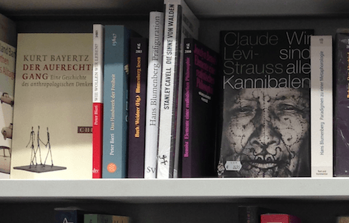

Seit ein paar Tagen versuche ich, über ein Buch zu bloggen, das ich in der Woche vor Weihnachten gründlich gelesen habe: Michael Seemanns [Das neue Spiel](http://www.ctrl-verlust.net/buch/ "Das Buch zum Kontrollverlust - Seite zum Buch in Seemanns Blog"). Da mir das gerade nicht gelingt, beginne ich das neue Jahr mit einem Post zu einem Buch, das ich nicht gelesen und gerade zum ersten Mal gesehen habe: dem stw-Taschenbuch [Blumenberg lesen](http://www.suhrkamp.de/buecher/blumenberg_lesen-_29703.html "Daniel Weidner, Robert Buch - Blumenberg lesen: Ein Glossar"). Ich habe es heute Nachmittag in der Buchhandlung im Frankfurter Hauptbahnhof entdeckt, bevor ich in einen Zug in Richtung Gelsenkirchen gestiegen bin. Von Frankfurt aus ist das wenigstens die Richtung nach Münster, wo Blumenberg gelehrt hat (und wo ich ihn in meinen ersten Semestern gehört habe). Zur Ehre der Altäre wird es Blumenberg wohl nicht bringen. Vielleicht hätte er die Ehre dieser Bahnhofsbuchhandlung vorgezogen. Ich weiss nicht, ob er sich in seinen metaphorologischen Schriften irgendwo mit Bahnhöfen beschäftigt. Aber als Metapher für Blumenbergs Werk eignet sich der Frankfurter Hauptbahnhof nicht schlecht. Er ist vielgleisig. Er ist einer der urbansten und einer der prachtvollsten Bahnhöfe in Deutschland. Er ist eine riesige offene Halle, aus dem 19. Jahrhundert stammend, aber schon damals so modern, dass ihm die Trivialmodernisierungen anderer Bahnhöfe erspart geblieben sind. Er liegt nahe an der Frankfurter Buchmesse und er ist keine halbe Stunde von einem der größten Flughäfen Europas entfernt. Wirklichkeiten und Lebenswelten werden an wenigen Orten in ihrer Bedingtheit, Vorläufigkeit und Unterschiedlichkeit so anschaulich wie an einem solchen Bahnhof. Ich habe nie geglaubt, dass ich Blumenberg verstanden habe, weder im Studium noch danach. Vielleicht fasziniert mich ein Buch wie _Blumenberg lesen_, weil es verspricht , endlich ein Rätsel zu lösen, das mich immer wieder beschäftigt hat. Aber wahrscheinlich lässt sich die Vieldeutigkeit der Texte Blumenbergs gar nicht durch eine zusammenfassende Lektüre auflösen. Auch für ihn selbst waren die Metaphern und die Begriffe, deren Geschichten er erzählte, nicht etwas Auflösbares. Jetzt jedenfalls erinnert mich der Titel des Buchs im Frankfurter Bahnhof daran, dass es beim Schreiben und bei der Theorie nicht um Ergebnisse geht, sondern um das, was man unterwegs sieht. Auch ein Bahnhof ist vor allem durch die Strecken interessant, die ihn mit anderen Bahnhöfen verbinden. Das passt vielleicht zum 1. Januar, dem Tag der guten Vorsätze.
