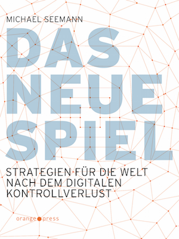

Vor Weihnachten habe ich Michael Seemanns [Das Neue Spiel](http://www.ctrl-verlust.net/buch/ "Website zu 'Das neue Spiel' - Das Buch zum CTRL-Verlust | ctrl+verlust") gelesen. Ich denke jetzt darüber nach, welche Konsequenzen der _Kontrollverlust_, der im Fokus von Seemanns Buch steht, für die Content-Strategie haben könnte. Eine erste Überlegung: Seemann versucht zu neuen Konzepten zu kommen, um die Öffentlichkeiten im Netz nicht mit Modellen zu verstehen, die aus der Zeit der Massenmedien und der Industriegesellschaft des 20. Jahrhunderts stammen. Ausgangspunkt ist dabei die Einsicht oder These, dass sich Daten nach der digitalen Revolution grundsätzlich nie vollständig kontrollieren lassen. Weder Individuen noch Firmen und Organisationen noch Staaten und staatliche Einrichtungen können dauerhaft darüber verfügen,

- welche Daten erhoben und gespeichert werden;
- ob und wie Daten kopiert und publiziert werden;
- wie die Daten weiterverarbeitet werden und welche positiven und negativen Möglichkeiten sich dadurch ergeben.

Persönliche und politische Strategien, die diesen Kontrollverlust nicht anerkennen, verhindern, dass Möglichkeiten wahrgenommen werden, die durch die digitalen Technologien entstehen. Sie schränken, wenigstens kurzfristig, die individuelle Freiheit ein. Langfristig sind sie zum Scheitern verurteilt, denn sie versuchen, eine irreversible Entwicklung, die Freisetzung von Daten und Informationen, rückgängig zu machen. Dies gilt für die Urheberrechtsindustrie, die letztlich eine totalitäre Kontrolle des Netzes fordert, um ihre überholten Geschäftsmodelle zu bewahren. Es gilt aber auch für Datenschützer, die mit staatlicher Hilfe die Fiktion der _informationellen Selbstbestimmung_ in einer datenbasierten Wirtschaft und Gesellschaft bewahren wollen.

### Filtersouveränität als neue Form der Selbstbestimmung

Angesichts des Kontrollverlusts sucht Seemann nach Strategien, die—anders als Festhalten an der Kontrolle über die Verbreitung und Verarbeitung von Daten—_antifragil_ sind. Eine solche Strategie bezeichnet der Begriff oder die Maxime der _Filtersouveränität_, die Seemann als "neue Form der Selbstbestimmung" bezeichnet:

> Filtersouveränität ist das Right to Query oder das Recht auf die Filterblase – das Recht, öffentliche Daten zu nutzen und das Recht, sich gegen eintreffende Daten abschirmen zu dürfen.(2570)[1](#fn-5619-1)

Filtersouveränität ermächtigt den Einzelnen zu bestimmen, welche Informationen ihn wie erreichen. Die Filter, die der Endnutzer der Informationen, der Konsument, verwendet, treten an die Stelle der Filterung durch die Sender von Informationen oder durch Mittler zwischen Sender und Empfänger. Filtersouveränität wird möglich und nötig, wenn Öffentlichkeit der Normalzustand von Informationen ist. Als Sender von Informationen vergrößere ich die Filtersouveränität der Empfänger, wenn ich ihnen die Möglichkeit gebe zu entscheiden, was und wie sie von mir erhalten.

### Filtersouveränität als mentales Exoskelett

Filtersouveränität wird vom Kontrollverlust nicht bedroht, sondern sogar gestärkt. Sie wächst, je mehr Daten verfügbar sind:

> Auf Filtersouveränität zu setzen, bedeutet das sinkende Boot der Privatsphäre zu verlassen und eine Gesellschaft auf Basis einer Selbstbestimmung zu schaffen, die durch den Kontrollverlust gestärkt wird.(2578)

Filtersouveränität erweitert die Möglichkeiten der Einzelnen. Nicht die Sender, sondern die Empfänger kontrollieren, welche Informationen sie erhalten:

> Positive Filtersouveränität ist die Möglichkeit, sich mit allem und jeder zu vernetzen und zu koordinieren, wozu auch immer.(2669)

Sie macht es den Einzelnen möglich, die Ressourcen, die in einer vernetzten Gesellschaft zur Verfügung stehen, so vollständig wie möglich zu nutzen. Das

> Netz kann als erweitertes Bewusstsein fungieren. Es erschließt mir gedankliche, kreative, politische Ressourcen, es kritisiert meine Ideen, verstärkt sie, reichert sie an und vernetzt sie mit weiterem Wissen. Ich bin im Internet mehr als ich, sondern nutze eine kaum aufrechenbare Anzahl weiterer Hirn‑, Prozessor- und Speicherkapazitäten, die so unmittelbar abrufbar sind, dass ich mit ihrer stetigen Verfügbarkeit rechne. Positive Filtersouveränität ist mein mentales Exoskelett.(2680)

Umgekehrt erlaubt es den Einzelnen die "negative Filtersouveränität" (2708) zu kontrollieren, welche Informationen sie überhaupt an sich heranlassen. Negative Filtersouveränität ist an technische Werkzeuge gebunden, durch man sich vor unerwünschten Informationen schützen kann.

> Langfristig müssen dezentrale Lösungen her, die direkt auf den Geräten der Empfänger installiert sind und so noch effektiver vor unerwünschter Kommunikation schützen.(2713)

### Filtersouveränität und die Ethik des Anderen

Letztlich ist Filtersouveränität eine ethische Maxime. Seemann beruft sich explizit auf die Ethik des Anderen, wie sie [Emmanuel Lévinas](http://www.philosophie-woerterbuch.de/online-woerterbuch/?tx_gbwbphilosophie_main%5Bentry%5D=30&tx_gbwbphilosophie_main%5Baction%5D=show&tx_gbwbphilosophie_main%5Bcontroller%5D=Lexicon&no_cache=1 "Artikel über E. Levinas im Online-Wörterbuch Philosophie") formuliert hat. Filtersouveränität bedeutet, den Anderen statt mich selbst entscheiden zu lassen, welche meiner Daten und Informationen für ihn wichtig sind.

> Die beste Strategie der Ende-zu-Ende-Kommunikation ist die Ethik des Anderen. Denn die Filtersouveränität des Anderen fängt beim Sender an.(2766) Die Filtersouveränität wird mit zunehmender Macht der Query zum „radikalen Recht der Anderen“.(3196)

Die Strategie der Filtersouveränität steht im klaren Gegensatz zu jeder Forderung nach zentraler Kontrolle über den Zugang zu Informationen. Seemann begründet sie deshalb auch mit dem [End-to-end-Prinzip](http://en.wikipedia.org/wiki/End-to-end_principle "Wikipedia-Artikel über das End-to-end-Prinzip"), nach dem das Internet als dezentrales Netzwerk funktioniert:

> Darum brauchen wir eine Strategie, die im Gegensatz zur zentralen Durchsetzungsmacht der Plattformbetreiber Ende-zu-Ende funktioniert, also dezentral umsetzbar ist: die Filtersouveränität.(3191)

Filtersouveränität ist auf der Ebene der Daten und der Information ein Gegenstück zum [Vendor Relationship Management](http://cyber.law.harvard.edu/projectvrm/Main_Page "Projekt  Vendor Relationship Management der Harvard-Universität"), das die Kontrolle über die Beziehungen zwischen Anbietern und Kunden zur Sache der Kunden, nicht der Anbieter macht.

### Souveränität der User in der Content-Strategie

Aus der Perspektive der Disziplin der Content-Strategie scheint es zuerst wenig Brücken zu diesem Konzept der Filtersouveränität zu geben—jedenfalls dann, wenn man Content-Strategie als eine Fortsetzung einer senderorientierten Unternehmenskommunikation mit anderen Mitteln versteht. Nimmt man es aber als Ziel der Content-Strategie ernst, [nützlichen, nutzbaren Inhalt](http://bussolati.com/contentstrategy-definition/ "10 Definitions of Content Strategy | Bussolati") zur Verfügung zu stellen, dann orientiert man auch dort die Kommunikation am Anderen, mit dem man kommuniziert—man überlässt die Souveränität über die Inhalte den Nutzern. Es stellt sich die Frage, welche Folgen es für Content-Strategien hat, die Filtersouveränität der User zu einer Maxime der Entwicklung von Inhalten zu machen. Auf einer ersten, sehr allgemeinen Ebene sollte das Konzept der Filtersouveränität die Content-Strategen daran erinnern, dass nicht sie oder die Sender von Informationen darüber entscheiden können, welche Inhalte genutzt werden und wie die Inhalte genutzt werden. Content-Strategen bespielen nicht Kanäle, die weitgehend unabhängig von einzelnen Entscheidungen der Nutzer existieren—so wie etwa ein Fernsehsender oder eine Zeitung lange davon ausgehen konnten, dass die Nutzer wenig Alternativen hatten, so dass es relativ wahrscheinlich war, dass einmal gesendete Inhalte tatsächlich wahrgenommen wurden. Online-Inhalte müssen viel aktiver und viel spezifischer gesucht werden, als es bei Inhalten in den herkömmlichen Offline-Medien der Fall ist. Sie werden in der Regel wahrgenommen, wenn eine _Query_ die User zu ihnen geführt hat. Filtersouveränität bedeutet damit, Inhalte auf die Queries der Nutzer abzustimmen.

### Die eigenen Inhalte als Ressourcen der Anderen

Um zu wissen, dass sich Online-Inhalte an den Queries der Nutzer orientieren müssen, braucht man allerdings nicht das sehr voraussetzungsvolle Konzept der Filtersouveränität. Seriöse Suchmaschinenoptimierung ist schon immer davon ausgegangen, dass Wissen um die Fragen der User die Voraussetzung für die Erzeugung erfolgreicher Inhalte ist. Filtersouveränität bedeutet, dass man den Usern die Entscheidung darüber überlässt, welche Inhalte für sie relevant sind. Sie setzt also voraus, dass man die eigenen Inhalte öffnet und als Ressource für andere versteht. Darin könnte die eigentliche Bedeutung dieses Konzepts für die Content-Strategie bestehen. Als jemand, der publiziert, öffne ich mich anderen als Ressource. Wie sie mit dieser Ressource umgehen, ist nicht meine Sache. Ich muss ihnen nur die Möglichkeit geben, diese Ressource so nutzen, wie sie es möchten—so wie ich auch umgekehrt die Ressourcen der Anderen so nutzen möchte, wie es meine Queries erfordern, wie also ich Inhalte organisieren möchte. Die Content-Strategie muss dann die Aufgabe lösen, wie man die eigenen Inhalte besonders gut und breit nutzbar macht. Filtersouveränität würde es dann fordern, mit den eigenen Inhalten so umzugehen, wie es die Konzepte der [Open Government Data](http://de.wikipedia.org/wiki/Open_Government_Data "Wikipedia-Artikel über Open Government Data") für die Publikation von Regierungsdaten fordern. Die Inhalte müssen möglichst viele Nutzungsmöglichkeiten zulassen. Das bedeutet nicht unbedingt, dass möglichst viel publiziert wird, sondern dass alles was publiziert wird, so aufbereitet ist, dass es unterschiedlich nutzbar ist. Daraus ergeben sich viele Konsequenzen, von den Formaten der Inhalte bis zu den Plattformen, auf denen sie veröffentlicht werden. Formate, die eine Weiterverwendung erschweren, sind mit der Maxime der Filtersouveränität so wenig vereinbar wie die Beschränkung auf wenige oder gar nur eine Plattform, etwa die eigene Website. Filtersouveränität gibt es immer mehr oder weniger. Je offener ich Informationen zur Verfügung stelle, und je weniger die Formate dieser Informationen bestimmen, wie sie genutzt werden können, desto größer die Filtersouveränität meiner Nutzer.

* * *

1. Ich gebe bei wörtlichen Zitaten die Location in der Kindle-Ausgabe von _Das Neue Spiel_ in Klammern an. [↩](#fnref-5619-1)
