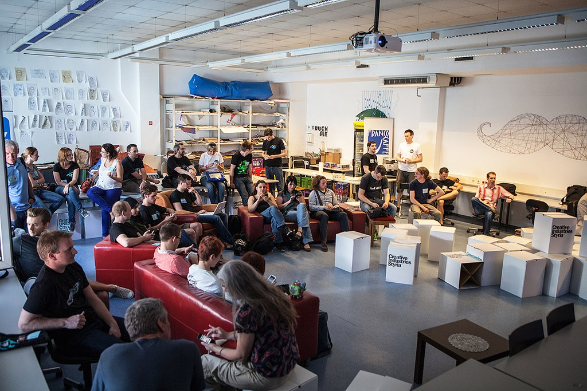

 An diesem Wochenende treffen sich die Organisatoren des [BarCamp Graz 2015](http://barcamp-graz.at/ "BarCamp Graz 2015") zu einem Mini-Camp zur Ausrichtung der nächsten Camps. Ich habe mich an der Organisation der letzten Grazer BarCamps nicht beteiligen können, aber ich war involviert, weil sie bei uns an der [FH](http://www.fh-joanneum.at/aw/~a/home/?lan=de "Studieren an der FH JOANNEUM |  FH JOANNEUM Gesellschaft mbH :: University of applied sciences") stattfanden - so wie auch das nächste Camp vom 17. bis zum 19. April. Ich will den Leuten, die die eigentliche Arbeit machen, nicht hineinreden. Hier nur eine Idee, die mir schon länger durch den Kopf geht, und die sich weniger an die Organisatoren richtet als an die Grazer BarCamp-Szene insgesamt. Ich bin an diesem Wochenende in Berlin, sonst hätte ich sie bei dem Minicamp heute auch präsentiert. Besonders ist am Grazer BarCamp, dass es aus mehreren Einzelcamps besteht, die jeweils ein Thema haben, zum Beispiel einem PolitCamp und einem DesignCamp. In den letzten Jahren ist es immer gut gelungen, die Besonderheiten der einzelnen Camps aufrechtzuerhalten und trotzdem eine Veranstaltung zu organisieren, die als gemeinsames Event erlebt wurde. Die Aufteilung in einzelne Camps passt für mich gut zum Charakter der - wenn man sie so nennen kann - Web- und unabhängigen Innovationsszene in Graz. Diese Szene ist lebendig, und zugleich haben die verschiedenen Gruppen und Initiativen oft wenig miteinander zu tun. Vielleicht hängt das zum Teil damit zusammen, dass es starke Bindungen zu unterschiedlichen Hochschulen und Instituten gibt, z.B. zur [Informatik an der TU](http://portal.tugraz.at/portal/page/portal/TU_Graz/Einrichtungen/Fakultaeten/FakInformatik/ "Fakultät für Informatik und Biomedizinische Technik"), zum [Know Center](http://www.know-center.tugraz.at/ "Know Center") und zur FH Joanneum. Die akademischen Institute achten traditionell auf ihre Stallgeruch - und der kann ausgeprägt und sehr unterschiedlich sein, auch wenn sie zur gleichen Hochschule gehören. Mir ist in den letzten Jahren aufgefallen, dass es an den Grazer Hochschulen, aber nicht nur dort, viele Initiativen und Themen gibt, die gut zu einem offenen Event wie dem BarCamp passen würden, aber dort nie erscheinen oder genannt werden. An der KFU beschäftigt sich z.b das [Institut von Prof. Benedek](http://voelkerrecht.uni-graz.at/ "Institut für Völkerrecht und Internationale Beziehungen") mit Fragen der Internet-Governance. Mit [Christoph Kratky](http://strubi.uni-graz.at/staff/christoph.html "o.Univ.Prof. Dr. Christoph Kratky") ist einer der wichtigsten österreichischen Open Access-Unterstützer in Graz tätig. Das [Institut für Elektronische Musik](http://iem.kug.ac.at/ "Institut für Elektronische Musik und Akustik - IEM") hat einen großen Anteil an der Entwicklung der offenen Musik- und Design-Programmiersprache [Pure Data](http://puredata.info/ "Pure Data — PD Community Site"). An [TU und KF](http://www.inside-graz.at/bildung/gratis-online-kurse-tu-universitaet-graz.html "Gratis Online Kurse der TU und Universität Graz - Inside Graz") und [bei uns an der FH Joanneum](https://www.fh-joanneum.at/aw/home/leitbild/organisation/Zentrale_Services/zml/Projekte/Training_lebenslanges_Lernen/~crud/MOOC_Competences_for_Global_Collaborati/?key=zml&lan=de "MOOC: Competences for Global Collaboration - cope14 |  ZML - Innovative Lernszenarien | FH JOANNEUM Gesellschaft mbH :: University of applied sciences") werden offene Online-Kurse entwickeln. In allen diesen Projekten geht es um offenes, freies Wissen. Ich fände es gut, diese Szene oder diese Szenen ausdrücklich zum BarCamp einzuladen. Das Camp würde dann noch deutlicher zu einem Vernetzungsevent. Davon würden die bestehenden Camps profitieren und hoffentlich auch die Eingeladenen. Der besondere Charakter des Grazer BarCamps bliebe erhalten. Vielleicht bin ich zu sehr auf die akademische Perspektive fixiert, weil ich an einer Fachhochschule arbeite. Mir geht es aber nicht um das Akademische, sondern um die Idee des offenen Wissens, die ich als die Basis der BarCamp Bewegung ansehe. Übrigens findet am Freitag und Samstag auch ein Präsenzwochenende des [Studiengangs Content-Strategie](http://www.fh-joanneum.at/cos") statt, an dem ich arbeite. Ich hoffe, dass wir einen Weg finden, um beide Ereignisse miteinander zu verbinden. Im Herbst haben wir als Studiengang selbst ein [kleines BarCamp](http://www.barcamp.at/Content_Strategy_Camp_Graz "Content Strategy Camp Graz – barcamp.at") organisiert. Diesmal können wir uns vielleicht in das große Grazer Camp einklinken.
