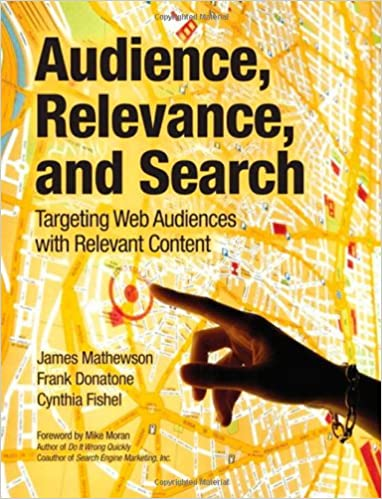

**Gastvortrag zur Verleihung der E-Learning Champions 2015 an der Karl-Franzens-Universität Graz**[1](#fn-5922-1) Wir verleihen heute einen [Preis für die Benutzung von sozialen Medien in der Lehre](http://elch.uni-graz.at/ "ELCH ist eine Auszeichnung für Projekte und Initiativen mit besonderem Vorzeigecharakter im Bereich der Neuen Medien an der Universität Graz"). Ich selbst bin kein Spezialist für Didaktik und auch keiner für E-Learning. Ich möchte trotzdem eine Antwort auf die Frage versuchen, warum soziale Medien überhaupt etwas Wichtiges für die Lehre darstellen. Dabei gehe ich nicht von der Didaktik aus, sondern ich versuche eine Antwort ausgehend von der Disziplin, die wir an [einem Studiengang der FH Joanneum](http://fh-joanneum.at/cos "Studiengang Content-Strategie der FH Joanneum") gerade zu lehren beginnen, der Content-Strategie. Es gibt viele Definitionen von Content-Strategie. Alle Vertreter dieser Disziplin stimmen aber darin über ein, dass die Nutzererfahrung (_User Experience_) in ihr eine entscheidende Rolle spielt. Content-Strategie beschäftigt sich mit Inhalten als einem zentralen Faktor, vielleicht sogar _dem_ zentralen Faktor für die Erfahrung von digitalen Angeboten. Warum ist die Nutzererfahrung so wichtig? Weil Online-Inhalte in einem noch viel höheren Maße als die Inhalte in anderen Kanälen nur dann erfolgreich sind, wenn sie von den Nutzern sofort als befriedigend und sinnvoll verstanden werden.  _Folie 7 der Präsentation „Purposes, Personas, Conversations“ von Ginny Redish[2](#fn-5922-2). Sie zeigt, dass User im Web Inhalte nur wahrnehmen, wenn sie sie brauchen und finden_ Bei allen herkömmlichen Formaten für die Verteilung von Inhalten, zum Beispiel bei Büchern oder Zeitschriften, entscheidet der Nutzer, bevor er etwas liest oder rezipiert, ob er sich überhaupt mit einer Publikation beschäftigt. Bei Inhalten im Web springt der Nutzer sofort zum einzelnen Inhalt, entweder weil er ihn über eine Suchmaschine gefunden hat oder weil er von einem anderen Nutzer, z.B. über soziale Medien darauf hingewiesen wurde. Digitale Medien, vor allem das Web, gehen den Benutzern viel mehr Macht als es die alten, analogen Medien taten. Eine Nutzer-Erfahrung, die unbefriedigend ist, führt dazu, dass etwas erst gar nicht angeschaut wird.  _Umschlag des Buches „Audience, Relevance and Search“ von James Mathewson, Frank Donatone, Cynthia Fishel[3](#fn-5922-3). Dieses Buch stellt exzellent dar, welche Folgen die Situation der Benutzer im Web für das Schreiben hat_ In der Content-Strategie geht es zu einem großen Teil um Inhalte, die direkten oder indirekten kommerziellen Zwecken dienen. Man spricht dann auch von Content Marketing. In solchen Fällen ist leicht zu verstehen, warum es sinnvoll ist, auf eine optimale Nutzererfahrung zu achten. Auch bei Service-Inhalten, zum Beispiel bei Gebrauchsanweisungen, muss man nicht lange begründen, warum die Nutzererfahrung eine entscheidende Rolle spielt. Wenn diese Inhalte nicht verständlich sind, wird das Produkt nicht gekauft, oder man kehrt weniger gerne zu einem Anbieter zurück. Auch Inhalte von politischen Körperschaften werden zunehmend auf die Benutzererfahrung hin optimiert, weil man auf diesem Wege die Wähler zufrieden stellt und auch natürlich, weil man so dem Auftrag den solche Institutionen haben, besser gerecht wird. Ein Beispiel ist die [Website der englischen Regierung](https://www.gov.uk/ "Welcome to GOV.UK"), die professionell zusammen mit Experten für User Experience entwickelt wird und ein internationales Vorbild ist. Im Bereich des Lernens, jedenfalls was digitale Inhalte angeht, spielt die Nutzer-Erfahrung noch eine geringere Rolle – jedenfalls kommt es mir als einen Nichtfachmann so vor. Das dürfte damit zusammen hängen, dass die Anbieter von Lerninhalten oft noch die Kanäle kontrollieren, über die die Inhalte zu den Nutzern gelangen, dass sie also ihre Inhalte den Nutzern noch aufzwingen können. Dies gilt für Lehrbücher und Schulbücher, und es gilt natürlich oft auch für die Lehrenden an Hochschulen, die Präsentationen und anderes Material für die Studierenden erstellen. Die anbietende Institution hat eine Hoheit über die Kanäle für Inhalte, die zum Beispiel den Anbietern kommerzieller Medien inzwischen weitgehend verloren gegangen ist. Deshalb mutet man den Lernenden oft eine ganz und gar nicht zufrieden stellende Nutzer-Erfahrung zu, ganz besonders bei digitalen Inhalten, für derem Erstellung schlicht oft die nötige Professionalität fehlt. Es ist aber deutlich zu erkennen, dass Lernende, die den Umgang mit dem Netz gewöhnt sind, zunehmend andere Ansprüche an die Gestaltung von Lerninhalten stellen. Wir erleben das alle täglich in der Lehre, und wir erleben es insbesondere bei Studierenden, die berufstätig sind, beziehungsweise Interessenten, die für Angebote auch oder ganz aus eigener Tasche bezahlen. Dass Mittelschullehrer, die selbst noch Schwierigkeiten damit haben, mit einem veralteten Computer umzugehen, zwölfjährige Schüler, die in ihrer Freizeit Videos editieren, nicht mit Inhalten begeistern können, wird niemand verwundern. Je mehr Möglichkeiten die Lernenden haben, sich selbst mit Lern-Ressourcen zu versorgen, desto wichtiger wird es, auf eine befriedigende Nutzererfahrung zu achten, wenn man mit seinen Inhalten Erfolg haben möchte. Nutzererfahrung wird oft vor allem ausgehend vom grafischen und vom Interaktionsdesign verstanden, und es ist klar, dass grafisches Design und Interaktionsdesign auch bei der User Experience mit Lernmaterialien eine wichtige Rolle spielen. Eine Vielzahl von Büchern und anderen Materialien erlaubt es, sich damit vertraut zu machen, wie man die Nutzer Erfahrung in diesen Aspekten angenehm gestaltet. Inzwischen gibt es auch eine ausgebildete Methodik dafür wie Inhalte nutzerbezogene gestaltet werden können. Das beginnt mit der Überprüfung der Lesbarkeit durch standardisierte Tests, und es endet noch nicht mit der Entwicklung von Inhalten in agilen Verfahren zusammen mit Experten für Design und Coding. Ich möchte auf diese Verfahren hier nicht im einzelnen eingehen. Ich möchte aber im Hinblick auf die sozialen Medien, die ja bei dieser Preisverleihung das eigentliche Thema bilden, auf eine Anforderung an Inhalte angehen, die sich bei der Entwicklung von Inhalten in kommerziellem Zusammenhängen immer wieder herausstellt: die _Nutzerbestimmtheit_. Unter Nutzerbestimmtheit verstehe ich mehr als nur nur Nutzer-Orientierung. Nutzerbestimmtheit bedeutet, dass die Inhalte so gestaltet werden, dass

1. die Nutzer jederzeit Kontrolle darüber haben, was sie mit den Inhalten aktiv machen können und wie sie sich zwischen den Inhalten bewegen,
2. Nutzer und ihre Geschichten selbst thematisch im Mittelpunkt der Inhalte stehen, die Inhalte also von der Erfahrung der Nutzer ausgehend gestaltet werden, und
3. sie Nutzer darüber hinaus auch an der Gestaltung der Inhalte mitwirken, die Inhalte also partizipativ entstehen.

Diese drei Eigenschaften von Inhalten werden im Content Marketing immer wieder gefordert. Eine berühmte Vertreterin des Content Marketing fordert dazu auf die [Kunden zum Zentrum der Geschichten zu machen](http://www.annhandley.com/2014/06/09/make-your-customer-the-hero-of-your-story/ "Make Your Customer the Hero of Your Story: 'The Fault in Our Stars' Video"). Coca-Cola, das beim Content Marketing eine Vorreiterrolle hat, entwickelt viele Geschichten, bei denen Kunden im Mittelpunkt stehen, und lässt auch die Kunden selbst zunehmend solche Geschichten erzählen. Der Lehre etwas näher steht vielleicht eine Firma wie Lego, die ihr Programm-Angebot inzwischen von Clubs von Benutzern mitgestalten lässt. Die Nutzer-Bestimmtheit ist im Content Marketing eines der wichtigsten Mittel, um Nutzer in einer mit Botschaften übersättigten Medienwelt überhaupt noch zu erreichen. Sie stellt nicht nur sicher, dass die Botschaften genau auf die Rezipienten abgestimmt werden, sie involviert die Rezipienten auch, sie setzt auf deren Aktivität und bringt die Rezipienten dadurch dazu, sich selbst mit einer Marke und ihren Produkten zu identifizieren und sich für sie zu engagieren. Wie sieht es nun im Bereich der Lehre aus, genauer gesagt bei der Gestaltung von Lern-Ressourcen, wenn man sich an diesem Prinzip der Nutzer-Bestimmtheit orientiert? Eine erste Grundregel besteht darin, die Nutzer nicht in Gefängnisse von Inhalten einzusperren, sondern ihnen die Möglichkeit zu geben, die Inhalte selbst frei zu verknüpfen, sie auszutauschen, sie mit anderen Inhalten zu verbinden. Ein zweites Regel besteht darin, thematisch auf Situationen der Lernenden Bezug zu nehmen, also deren Geschichten zu erzählen. Das bedeutet auch dass man sich mit der Lebenswelt der Benutzer jenseits der immer auch künstlichen Lernsituationen zum Beispiel in Schulen und Hochschulen intensiv beschäftigt Als dritte Richtlinie kann man fordern, die Lernenden selbst die Inhalte mit- und weiter entwickeln zu lassen. Ressourcen sollten also wenigstens zu einem Teil partizipativ designt werden. Plakativ gesagt: Studierende können sich ihre Lehrbücher während des Lernens selbst schreiben oder zumindest daran weiter schreiben. Diese drei Design-Prinzipien – Kontrolle der Verwendung der einzelnen Inhalte durch die Nutzer, thematische Orientierung an der Lebenswelt der Nutzer und Gestaltung von Inhalten durch die Nutzer – sind Prinzipien der sozialen Medien. Sie machen meiner Ansicht nach und sicher auch nach Ansicht der Stifter dieses Preises hier soziale Medien zu einem nutzerfreundlichen Werkzeug der Lehre. Ich würde diese Trias gerne noch durch ein viertes Prinzip ergänzen, dass zum Beispiel aus der Entwicklung von Lern-Portfolios schon lange bekannt ist: Lernmaterialien, die von den Nutzern erstellt werden, dienen auch der Kontrolle der Lernergebnisse, und zwar vor allem durch die Lernenden selbst. Lernmaterialien sind nicht nur Ausgangspunkt für das Lernen, sondern sie sind zugleich sein Ergebnis.[4](#fn-5922-4) Das ist in gewisser Weise schon längst bekannt, denn man schließt ja sein Studium zum Beispiel mit einer wissenschaftlichen Arbeit ab. Bisher werden diese Arbeiten aber nur im Ausnahmefall, vor allem bei Dissertationen, wieder für die Lehre genutzt. Soziale Medien machen es möglich, dass bei jedem Lernschritt, ja auch bei Teil-Schritten wiederum Lernmaterialien produziert und mit anderen Lernenden ausgetauscht werden. Soziale Medien dienen quasi von sich aus dazu, Lernergebnisse zu dokumentieren und das Lernen für andere zu ermöglichen. Das macht soziale Medien zu fast natürlichen Lernumgebungen.  _Graphische Darstellung des ersten MOOCs von Siemens und Downes[5](#fn-5922-5)_. MOOCs im ursprünglichen Sinn setzen die Prinzipien nutzerbestimmten Lernens konsequent um. Alle Prinzipien, die ich eben erwähnt habe, werden von offenen Online-Kursen, den cMOOCs, umgesetzt. Bei diesen Kursen hat man mit kleinen Bruchstücken zu tun, die aus unterschiedlichen Quellen stammen können, und über deren weitere Verwendung die Lernenden jederzeit frei entscheiden. Als Lernender gestaltet man in einer solchen Umgebung mit, und man erzählt dabei den anderen Lernenden seine eigene Geschichte und auch seine Erfahrungen mit dem Lern-Materialien. Und schließlich, vielleicht ist das sogar das eigentlich Entscheidende, wird die Dokumentation des eigentlichen Lernfortschritts wieder zum Lernmaterial für andere. So gesehen, sind offene Online-Kurse sehr nah an dem Prinzip, den Lernenden – in diesem Fall also nicht dem Kunden – zum Zentrum der Geschichte zu machen. Eine aus meiner Sicht immer noch fortgeschrittene Form der Didaktik entspricht hier einer Forderung des Content Marketing und der Content-Strategie. Ich möchte damit schließen. Diese Überlegungen sind natürlich sehr vage, und es ist mir klar, dass sie spekulativ sind. Eigentlich müsste man empirisch untersuchen, welchen Effekt von den Lernenden selbst erstelltes Lernmaterial für die Lehre hat, und wie die Lernenden ihre eigene Lernerfahrung mit solchen Materialien beurteilen. Ich hoffe, dass in der Zukunft bei der Entwicklung von Lernmaterialien beziehungsweise bei der Gestaltung von Richtlinien für Lernmaterialien und besonders für Open Educational Resources Didaktiker, UX-Experten und Content-Strategen mehr als in der Vergangenheit zusammenarbeiten.

* * *

1. Dieser Text ist das leicht redigierte Manuskript zur Vorbereitung des Vortrags. Der mündliche Vortrag wich davon stark ab. Danke an die [Akademie für Neue Medien und Wissenstransfer](https://akademie.uni-graz.at/ "Akademie für Neue Medien und Wissenstransfer") der Karl-Franzens-Universität Graz und vor allem an [Michael Kopp](https://twitter.com/koanmi "Michael Kopp (@koanmi) | Twitter") für die Einladung! [↩](#fnref-5922-1)
2. [Purposes, Personas, Conversations -- Practical Techniques for Everyth…](http://de.slideshare.net/GinnyRedish/redish-stc-seattle-2013 "Purposes, Personas, Conversations -- Practical Techniques for Everyth…") [↩](#fnref-5922-2)
3. Mathewson, J., Donatone, F., & Fishel, C. (2010). Audience, relevance, and search: targeting Web audiences with relevant content. Upper Saddle River, NJ: IBM Press/Pearson. [↩](#fnref-5922-3)
4. Auf diesen Gedanken bin ich bei der Vorbereitung dieses Vortrags vor allem durch die Präsentation [Open Education and Personal Learning](http://www.downes.ca/presentation/360 "Open Education and Personal Learning ~ Stephen Downes") von Stephen Downes gestoßen. [↩](#fnref-5922-4)
5. [03\. CCK08 - The Distributed Course - The MOOC Guide](https://sites.google.com/site/themoocguide/3-cck08---the-distributed-course "03. CCK08 - The Distributed Course - The MOOC Guide") [↩](#fnref-5922-5)
