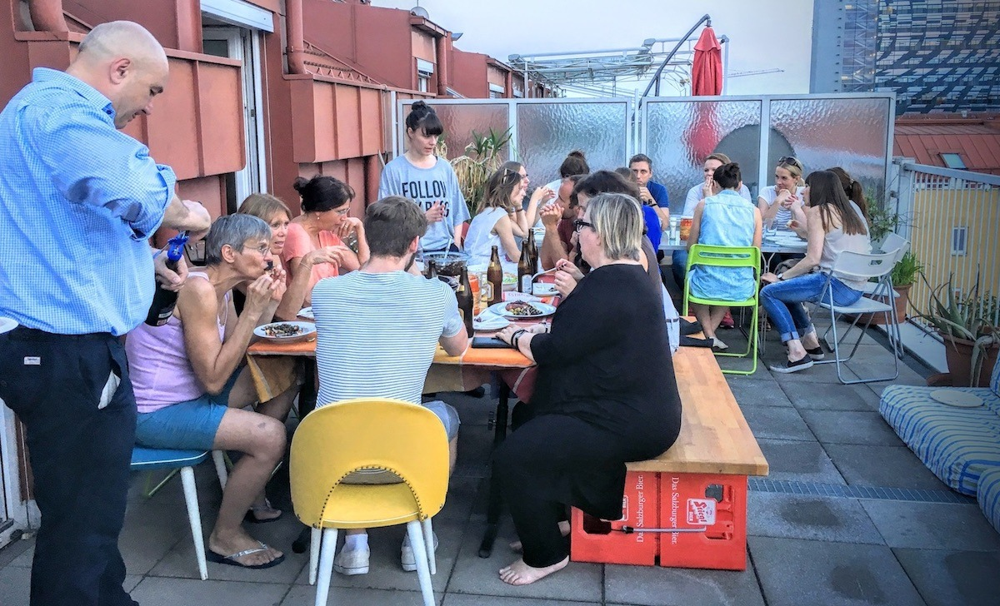

Ich schaue auf die Terrasse der Wohnung in der [Feuerbachgasse](http://graz.stadtplanoesterreich.at/feuerbachgasse/ "Feuerbachgasse Straße, Graz"), in die ich in den letzten Wochen mit [Ana](https://www.instagram.com/anastasija.georgi/ "Between the lines") gezogen bin. Man merkt Anas Kindern an, dass das Schuljahr zuende geht und der Sommer kommt. Der Himmel ist hellblau. Die Luft ist noch kühl. Am Wochenende haben die ersten Studenten des [Contentstrategie-Studiengangs](https://fh-joanneum.at/cos/ "Content-Strategie / Content Strategy") ihre Masterarbeiten abgegeben. Ich fühle mich zum ersten Mal seit langer Zeit entspannt, auch wenn meine alte Wohnung noch nicht ganz leergeräumt ist, und auch wenn noch viel zu tun ist, bis das Studium für den ersten Jahrgang abgeschlossen ist. Letzten Freitagabend haben wir die Terrasse beim Grillen mit den Studenten und ihren Betreuern eingeweiht.

\[caption id="attachment\_5892" align="alignleft" width="1200"\] Grillabend mit #cos14\[/caption\]

Ich kann meinen Berufsweg, wie es altmodisch heißt, und das, was ich privat erlebe, oft nicht auseinanderhalten. Beide Wege haben mich in den letzten drei Jahren—mit viel Anstrengung für andere und für mich—ungefähr dahin geführt, wohin ich kommen wollte. Aber wie es dort aussieht, habe ich mir damals, wenn überhaupt, ganz anders vorgestellt.

Ich habe nicht das Gefühl, dass ich an ein Ziel gelangt bin. Aber ich sehe auch nicht einen Weg vor mir wie vor zwei oder drei Jahren. Ich glaube eher, dass ich mich dort, wo ich jetzt bin, hin und her bewegen werde, dass Gänge auf einer Ebene vor mir liegen. Jedenfalls wünsche ich mir das. Vielleicht hängt das mehr mit meinem Alter zusammen als mit dem, was ich in den letzten Jahren getan habe. Ich werde in zwei Monaten 60. Da rückt in den Vordergrund [to celebrate the seasons](https://en.wikipedia.org/wiki/The_Enigma_of_Arrival "The Enigma of Arrival - Wikipedia, the free encyclopedia"), wie es Naipaul genannt hat.

Die Terrasse unserer neuen Wohnung symbolisiert für mich diesen entspannteren Zustand. Nicht nur, weil man weit schaut, über einen Teil der Innenstadt und Eggenberg mit der FH hinaus auf die Hügel in der Nähe, sondern auch, weil man hier, vor allem morgens und abends, nur wenige Geräusche hört. Trotzdem wohnen wir mitten in der Stadt, zwischen dem Griesplatz, wo Menschen leben, deren Alltag _struggle_ bedeutet, und dem lebendigen, schicken und gelegentlich kitschigen Viertel um das Grazer Kunsthaus herum.

Vor gut zwei Jahren bin ich mit [David](https://twitter.com/d_wittenbrink "David Wittenbrink (@D_Wittenbrink) | Twitter") in die Villefortgasse gezogen. Um diese Zeit begann auch mein neuer Job als Leiter des Contentstrategie-Studiengangs an der FH. Ich habe mich in der Villefortgasse wohl gefühlt. Ich fand die bürgerliche Behäbigkeit und auch das etwas übertrieben Repräsentative, vor allem die Geräumigkeit, dort angenehm. Mein schlechtes Gewissen darüber, [auch einen sozialen Status zu genießen](https://medium.com/am-glacis/sprawl-city-und-pensionopolis-c68c9e284f6b#.dq2vhwvw2 "Sprawl City und Pensionopolis — Am Glacis — Medium"), hielt sich in Grenzen. Vor zwei Jahren habe ich mir manchmal vorgestellt, in dieser Wohnung langsam in ein Rentnerdasein hinüberzugleiten. Zugleich habe ich aber auch versucht, mich selbst neu zu finden: Meine Kinder waren erwachsen und vor mir lag ein neuer Job. Ganz eingerichtet habe ich die Wohnung nicht, mit meinem Sohn habe ich wie in einer Studenten-WG zusammengewohnt. Wenn ich jetzt an die Räume dort zurückdenke, kommen sie mir vor wie die etwas zu großen, aber bequemen Zimmer des [Studentenheims](http://www.breul23.de/ "Breul 23 - Studentenheim seit 1928 - Breul23"), in dem ich die ersten Semester in Münster gelebt habe.

Jetzt wohnen wir ganz anders, unter dem Dach mit schrägen Decken. Wir schauen aus den Fenstern in die Wolken, und den größten freien Raum haben wir auf der Terrasse. Mehr als vor drei Jahren habe ich das Gefühl unterwegs zu sein, fast wie auf einem Schiff. Es freut mich, dass David in der Nähe wohnt, und dass wir oft zusammen essen. Es freut mich auch, dass ich wieder mit jüngeren Kindern zusammenlebe. Ich bin nicht in einen neuen Lebensabschnitt geraten, sondern in einen neuen Zustand. Ich möchte, dass er anhält.
