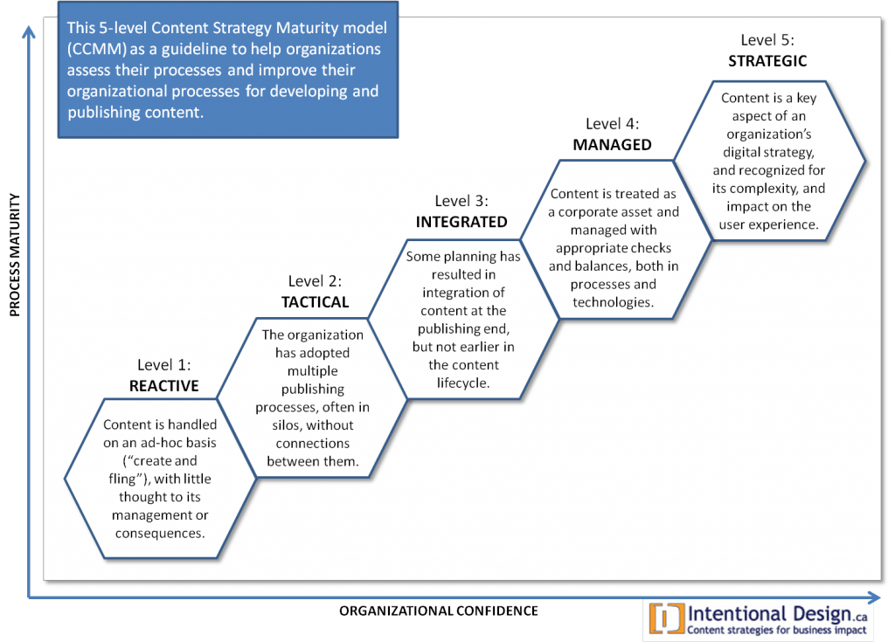

Content-Strategen stehen immer wieder vor dem Problem, dass sie für Firmen oder Organisationen arbeiten, die das Handeln in einer digital bestimmten Umwelt nicht oder nur sehr unvollkommen beherrschen. Reifegradmodelle erscheinen mir immer mehr als praktische Instrumente, um solche Situationen zu erfassen und zu beschreiben, und ich möchte mich gerne intensiver mit ihnen beschäftigen. Hier Vorüberlegungen—noch nicht durch Lektüre gefiltert oder verfeinert. Anregungen und Hinweise sind willkommen!

Rahel Bailie: Content Strategy Maturity Model

  
Es gibt je nach Perspektive sehr viele Modelle dafür, einer Firma oder Organisation einen Reifegrad zuzuordnen. Für das Content-Marketing hat Robert Rose ein solches Modell entworfen, das ich im Unterricht schon öfter verwendet habe (Grafiken dazu, leider ohne Angaben von Rechten, [hier](http://kiobuzz.com/2016/03/31/where-are-you-on-your-content-marketing-journey/ "KioBuzz | Where are you on your Content Marketing Journey?")). Rahel Bailie hat ein differenziertes [Content Strategy Maturity Model vorgestellt](http://intentionaldesign.ca/2011/11/14/time-for-a-maturity-model-for-content-strategy/ "Content Strategy Maturity Model | Intentional Design Inc.").  

  
Vor allem aufgrund der Master-Arbeiten, die gerade am [Content-Strategie-Studiengang der FH Joanneum](https://fh-joanneum.at/content-strategie-und-digitale-kommunikation/master/ "Content-Strategie / Content Strategy") geschrieben werden, aber auch angeregt durch [unseren letzten Besuch in London](http://wittenbrink.net/lostandfound/london-notizen-content-als-service-und-agiles-arbeiten/ "London-Notizen: Content als Service und agiles Arbeiten") stelle ich mir die Frage, ob man nicht bei jeder Contentstrategie explizit auf den Reifegrad der Organisation Bezug nehmen muss, für die man sie entwickelt. (Wie nützlich Rahel Bailies Modell ist, hat mir erst [Kerstin Strohmeiers](https://twitter.com/strohmeierk "Kerstin Strohmeier (@StrohmeierK) | Twitter") Masterarbeit klar gemacht.)  
Die Hauptaufgabe eines Contentstrategen bestehen darin, die Erstellung von Inhalten zu designen, also nicht die konkreten Inhalte selbst. Die Umstände, unter denen die Inhalte entstehen, sind die Konstanten und Variablen, mit denen man bei der Lösung dieser Aufgabe arbeiten muss. Deshalb ist es sinnvoll, die Bewertung des digitalen Reifegrads in die Analysephase, also den ersten und vielleicht für das Ergebnis wichtigsten Teil der Erstellung einer Contentstrategie, aufzunehmen. Reifegradmodelle können darüber hinaus das Change Management in einer Firma erleichtern. (Wir sollten sie vielleicht ausdrücklich in unser [Template](https://docs.google.com/document/d/1XwUh174CTKIW3BbSBIXidmunb1aXa5ounsAv-2nowqE) für die Master-Arbeiten am Studiengang integrieren).

## Contentstrategie auf der Nullstufe der digitalen Reife

In einem konkreten Fall, an den ich jetzt denke, geht es um die Entwicklung eines Newsletters für eine Organisation, die noch über keinerlei digitale Strategie verfügt und eigentlich noch gar nicht erkannt hat, dass sie eine solche digitale Strategie braucht. Trotzdem ist die Bereitschaft da, einen Newsletter zu entwickeln, so wie man auch—wenn auch auf bescheidenem Niveau—eine Website hat. In einem solchen Fall ist das Business-Problem, das man mit einer Content-Strategie löst, aus der Sicht der Firma ein ganz anderes als aus der Sicht der Person, die sich mit der Contentstrategie beschäftigt. Für die Firma existiert eigentlich gar keinen Geschäftsproblem. Es geht höchstens darum etwas nachzumachen, das andere auch tun, um nicht als völlig rückschrittlich dazustehen. Aus der Sicht des Entwicklers oder der Entwicklerin der Contentstrategie geht es darum, die Initialzündung dafür zu geben, die Organisation in die Richtung einer digitalen Strategie beziehungsweise von digitalen Aktivitäten weiter zu bewegen. Aus der Contentstrategen-Sicht besteht das Businessproblem hier darin, dass eine Firma ganz offensichtlich die Notwendigkeiten des Marktes in der Gegenwart nicht erkannt hat.  
In einem solchen Fall ist es wichtig, dass man dem Auftraggeber einen Erfolg innerhalb von dessen eigenem Raster deutlich machen kann. In der Contentstrategie sind solche Situationen immer wieder beschrieben worden. Oft wird der Ratschlag gegeben, den Leuten die mit Publikation oder auch mit ganz anderen Dingen in der Firma zu tun haben, durch eine konkrete Hilfe deutlich zu machen, dass die eigene Arbeit nützlich ist.  
Als Content Strategie muss man also in einer solchen Nullpunkt-Situation Probleme ausmachen, die der existierenden Organisation bewusst sind oder ihr verständlich gemacht werden können, und die mit Inhalten gelöst werden können. Beispiele für solche Probleme:

- Bedeutungsverlust bestehender Kundengruppen, ohne dass neue Kundengruppen mit den vorhandenen Mitteln angesprochen werden können,
- für vordigitale Organisation nicht beherrschbare Risiken der digitalen Welt (Datenschutz, Compliance, Social-Media-Shitstorms u.ä.)
- unmögliche Erfolgskontrolle für die planlos unternommenen digitalen Aktivitäten, oft verbunden mit nicht in den Griff zu bekommenden Kosten
- offensichtliche Probleme bei der Produktion, dem Management und der Qualitätskontrolle von Inhalten.

Typisch für solche Nullpunkt-Situationen ist, dass Content Probleme vor allem als Probleme von Kanälen angesehen werden. Designer, Techniker oder im schlimmsten Fall Werber werden damit beauftragt, eine _Homepage_ zu machen, _Apps_ zu entwickeln oder eben Newsletter herauszugeben

## Reifegrad und Digital Governance

Im Konzept der [Digital Governance](http://rosenfeldmedia.com/books/managing-chaos/ "Managing Chaos - Rosenfeld Media"), wie es [Lisa Welchman](https://twitter.com/lwelchman?lang=de "Lisa Welchman (@lwelchman) | Twitter") entwickelt hat, sehe ich einen Ansatzpunkt dazu, den digitalen Reifegrad einer Organisation insgesamt (über die Content-Perspektive hinaus) zu bewerten. Ein solches Modell kann z.B. dazu dienen, die oben beschriebene Nullpunkt-Situation genauer zu erfassen.  
Das Konzept der Digital Governance ist so allgemein, dass es jede Art von Firma betreffen kann. Es sagt nichts über besondere Märkte, Geschäftsmodelle oder Produkttypen aus. Mit seinen drei Achsen der _Strategie_, der _Standards_, und der _Policies_ (zum Risiko-Management) ist es aber andererseits konkret genug, um die aktuelle Situation in einer Organisation beurteilen zu können. Von einem sehr niedrigen Reifegrad kann man dann sprechen, wenn überhaupt keine digitale Strategie vorliegt beziehungsweise überhaupt keine Erkenntnis davon, dass eine solche Strategie notwendig sein könnte. Dieser niedrigste Reifegrad ist also dann gegeben, wenn eine Organisation sich genau so verhält, wie sie sich verhalten würde, wenn es das Netz und die gesamte digitale Entwicklung der letzten Jahre überhaupt nicht geben würde. Damit ist nicht gesagt, daß eine solche Organisation nicht trotzdem in irgendwelche digitalen Aktivitäten involviert ist. In der Regel ist sie dies z.B. über die eigene Website oder über Facebook und sie ist es natürlich auch, weil die Kunden der Organisation in vielem digital kommunizieren. Nur werden diese Aktivitäten nicht gesteuert und es besteht auch kein Bewusstsein darüber, dass die digitalen Aktivitäten insgesamt gesteuert werden sollten.  
In diesem Zusammenhang ist es wichtig, dass die beiden anderen Bereiche der Digital Governance, von denen Lisa Welchman spricht, dazu dienen können, die Notwendigkeit einer Digitalstrategie beziehungsweise von Digital Governance klarzumachen. Auch wenn die Organisation keinerlei digitale Strategie hat, kann sie erkennen, dass es in der digitalen Öffentlichkeit zu Risiken kommen kann. Oft neigen gerade "vordigitale" Organisation besonders dazu, überall im Netz Risiken und Gefahren zu vermuten. Um diesen Risiken zu begegnen, müssen Policies eingeführt werden, und diese verlangen nach einer digitalen Strategie. Auch die Frage nach digitalen Standards stellt sich jeder Organisation, die überhaupt digitale Technologien verwendet oder digital kommuniziert. Standards sind die Voraussetzung dafür, die eigenen Aktivitäten zu bewerten beziehungsweise zu erkennen, wie sie bewertet werden, so dass es nicht allzu schwer ist, die Verantwortlichen einer Organisation davon zu überzeugen, Standards festzulegen. Wie bei den Policies ist auch hier eine Strategie erforderlich, wenn die Definition der Standards nicht willkürlich sein soll. Die Festlegung von Policies und Standards ist kein Ersatz für eine digitale Geschäftsstrategie, aber sie kann eine Organisation darauf vorbereiten, eine solche Strategie zu entwickeln.

## Das andere Ende der Reifegrad-Skala: Firmenkonzept und Servicedesign

Der digitale Reifegrad ist dann hoch, wenn es die Firma als ihre Aufgabe ansieht, Dienste auf digitalisierten Märkten und in einer digitalisierten Öffentlichkeit anzubieten—man könnte auch sagen: wenn sich die Firma über ein Servicedesign definiert, in das sich ihre Inhalte einfügen. Ein hoher Reifegrad ist dann gegeben, wenn Contentstrategie eine Aufgabe im Rahmen einer umfassenden Entwicklung von Diensten ist, bei denen digitale und andere Komponenten bruchlos miteinander zusammenwirken. Digital Governance ist dann nur ein Teil der allgemeinen strategischen Steuerung der Firma, der auf die besondere Regeln der digitalen Welt Rücksicht nimmt. Dazu gehört die Organisation der eigenen Software-Infrastruktur ebenso wie das Nutzen digitaler Vertriebswege und die Kommunikation in einer digitalen Öffentlichkeit. Ein Gegenbild zu den Organisationen mit einem extrem niedrigen digitalen Reifegrad sind zum Beispiel [die digitalen Dienste der englischen Regierung](https://www.gov.uk/ "Welcome to GOV.UK"), die durchgehend im Sinne eines Service Designs entwickelt werden. Auf dieser Seite der Reifegrad-Skala ist auch eine Firma wie Facebook angesiedelt. In einer solchen Umgebung verschmelzen die Aufgaben von Contentstrategen mit denen von Fachleuten für die Nutzererfahrung, weil die strategische Entwicklung Sache der gesamten Organisation ist. Man könnte auch sagen: Die Aufgabe von Contentstrategen besteht hier darin, die Inhalte oder die Inhalts-Produktion zu konzipieren, die zum allgemeinen Service-Design der Organisation gehört

## Contentstrategie und Change Management

immer wenn eine Firma sich nicht in erster Linie als ein an Nutzerbedürfnissen orientierter Anbieter von Diensten versteht, beziehungsweise nicht so organisiert ist, dass sie so agieren kann, wird Change Management zu einer Aufgabe von Contentstrategie. Contentstrategen werden dann als Anwälte nützlicher und nutzbarer Inhalt dazu gezwungen, sich auch für Organisationswandel einzusetzen. Um damit Erfolg zu haben, müssen Sie Change Management aufgrund ihrer eigenen fachlichen Kompetenzen betreiben, das heißt ausgehend von Inhalten beziehungsweise von Problemen, die die Firmen mit Inhalten haben. Sie wären überfordert, wollte man sie zu den Verantwortlichen für den digitalen Wandel insgesamt machen, aber sie sind Verbündete aller anderen, die in Firmen in derselben Richtung arbeiten. Aufgrund der Schlüsselrolle von Inhalten Inhalten für ein allgemeines Servicedesign in einer digitalisierten Umwelt spielen sie als Verbündete eine besonders wichtige Rolle. Gerade bei den Inhalten zeigen sich die Probleme, die eine Firma mit ihrem digitalen Reifegrad hat.  
Reifegradmodelle sind theoretische Konstrukte. Sie sind nur so gut wie die Einsichten, zu denen sie führen. Firmen nach einem Reifegradmodell zu bewerten bedeutet nicht, die Unterschiede zwischen Geschäftsbereichen, Organisationstypen, Regionen und so so weiter zu vernachlässigen. Es dient nur dazu, auf spezifische Korrelationen aufmerksam zu machen, in unserem Fall zum Beispiel auf die Beziehungen zwischen Servicedesign, Digital Governance und der Fähigkeit, Geschäftsprozesse durch nutzerbezogene digitale Inhalte zu unterstützen.
