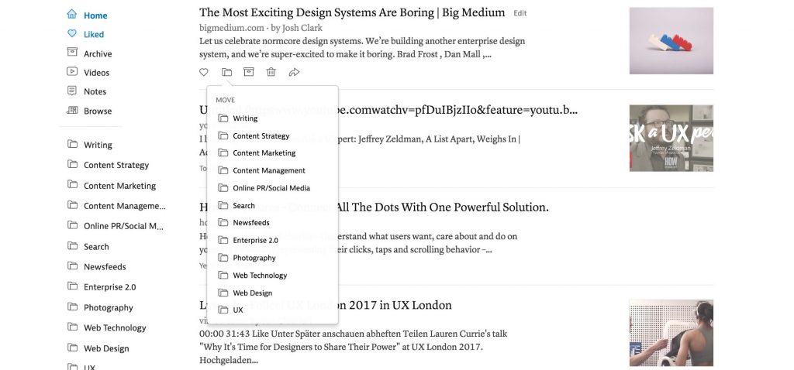

Instapaper-Screenshot

Seit ich die meisten aktuellen Informationen online bekomme, habe ich das Problem, zwischen ihnen auszuwählen und sie zu sortieren. Auch ein  
Informations-Junkie, der nur Gedrucktes liest, steht vor diesen Schwierigkeiten, aber bei Gedrucktem kann man nicht von einem Inhalt zum nächsten weiterklicken. Mehr Informationen zu erhalten, ist bei Printmedien aufwändig, selbst wenn man gerade in einer Bibliothek liest. Online steht man dagegen vor allem vor dem Problem, weniger (und die richtigen) Informationen zu bekommen.

  
Was sich in der Content-Strategie tut, erfahre ich vor allem durch Twitter, und zwar indem ich mich einmal täglich durch meine [Content-Strategie-Liste](https://twitter.com/heinz/lists/content-strategy) klicke und alles favorisiere, was mir wichtig erscheint. In der letzten Woche habe ich meinen Workflow verändert. Ich habe mir bei [Instapaper](https://www.instapaper.com/) eine Reihe zusätzlicher Ordner angelegt, in denen ich die favorisierten Texte abspeichere. Ich kann sie dann thematisch geordnet lesen. Dabei will ich vor allem dem [Ratschlag von Donald Knuth](http://www.informit.com/articles/article.aspx?p=1193856) folgen, erst mit dem Lesen anzufangen, wenn man genug Material zu einem Thema zusammenhat.  
Ich bin in der letzten Woche mit dem Lesen nicht nachgekommen. Aber hier wenigstens eine Momentaufnahme zu einigen der Themen, die ich für relevant halte. Es sind nicht unbedingt die wichtigsten der Links, auf ich gestoßen bin — einiges kann ich hoffentlich noch nachholen.

## Suche​ und Relevanz

### SEO-Erfolg durch Konzentration (James Mathewson)

[What does SEO success look  
like?](https://biznology.com/2017/07/what-does-seo-success-look-like/)  
[James Mathewson](https://twitter.com/james_mathewson?lang=de), einer der intelligentesten Köpfe in der Content-Strategie-Szene, betreibt in einem kurzen Aufsatz Erwartungsmanagement hinsichtlich der Resultate von Website-Relaunches. Die Kernaussage: Es gibt eine Grenze für die Steigerung von Traffic und Engagement, und diese Grenze wird vom Interesse der Zielgruppe am Thema bestimmt. Designorientierte Relaunches sind fast ausnahmslos sinnlos und dienen nur der Befriedigung der Eitelkeit neuer Manager.

> I have never seen a redesign of this nature improve results. Typically, results crater. The executive panics. We have meetings on how to improve results. I come in and show case after case of what worked in the past:…

Relaunches bringen nur etwas, wenn sie die Struktur einer Site vereinfachen und wenn deutlich weniger Inhalte übrig bleiben.

> Sure, there are legitimate reasons to redesign a site — most notably, to clean up and scale down.

Ist eine Seite einmal optimiert, dann ist es riskant oder kontraproduktiv, in zusätzliche Themen oder ein neues Design zu investieren. Stattdessen sollte man mehr Besucher dazu bringen, die nächsten Schritte der Customer Journey zu wagen.

> That kind of growth is much more valuable, as you can attribute it to revenue. But if you have hit the traffic plateau, don’t redesign.

Wie alle Texte von Mathewson ist dieser Artikel so stringent geschrieben, dass er sich kaum zusammenfassen lässt. Dringende Leseempfehlung, nicht zuletzt wegen der resigniert-ironischen Bemerkungen zur Veränderungssucht neuer Management-Garnituren:

> I have often wondered why executives don’t recognize success when they see it. One reason is that they don’t know what success looks like. Also, they are not judged well for keeping a good thing going.​

## Content und User Experience

### Wie lässt sich Nutzererfahrung managen? (Brandon Schauer)

[Just What is a UX Manager?](https://medium.com/capitalonedesign/just-what-is-a-ux-manager-de02566997e4)  
Dieser Text ist schon etwas älter, und man kann ihn durch die Content-Strategie-Brille auf verschiedene Weisen lesen: Als Beschreibung eines Jobs, der dem von Content-Strategen ähnelt, aber auch als Diskussionsbeitrag zu dem Thema, wie Inhalt und die anderen Komponenten der Nutzer-Erfahrung gemeinsam entwickelt werden können. Content-Strategie ist ein Teil des UX-Managements, aber Content-Strategen können sich auch selbst als UX-Manager verstehen.  
Wichtig ist es, den besonderen Charakter der Aufgabe von Content-Strategen wie von UX-Managern zur verstehen. Sie sind für die Qualität der Nutzererfahrung verantwortlich, durch die Geschäftsziele erreicht werden. Sie haben eine Design-Aufgabe, die sie aber nur indirekt lösen können, vergleichbar der eines Regisseurs oder Intendanten.

> So if you can press a button and find out if your work is done, you’re definitely not a UX manager.

UX-Manager wie Content-Strategen haben nur Erfolge, wenn sie verstehen, mit den Menschen in einer Organisation zu arbeiten. Peter Drucker erweist sich ein weiteres Mal als Stichwortgeber für ein Thema der _Digital Governance_.

> Much of being a UX manager is common to any manager. It’s about humans, and bringing humans to work together, as Peter Drucker would say, with common goals and joint values.

\[via [Brain Traffic](https://twitter.com/BrainTraffic)\]

### Gründerinformationen bei gov.uk (Jeni Street)

[Taking care of business on  
GOV.UK](https://gds.blog.gov.uk/2017/07/18/taking-care-of-business-on-gov-uk/)  
Die GDS-Leute publizieren Massen von Material dazu, wie sie arbeiten, und was dabei herauskommt. Sie geben laufend einen Echtzeit-Kurs in userbezogenem Inhalts-Design.  
Im Mittelpunkt dieses Posts über die Angebote für Firmengründer steht die Informationsarchitektur. Die Zahl der Seiten wurde drastisch reduziert, um die Wege zur gesuchten Information zu verkürzen.

> In a recent project to improve guidance for new businesses, we reduced that number of 50 down to 16 pages.

​Die GDS-Content-Designer haben außerdem herausgefunden, welche Informationen die Gründerinnen und Gründer tatsächlich auf einer Regierungsseite erwarten. Nicht Wissen jeder Art ist gefragt, sondern Wissen zu dem, wofür eine Regierung zuständig ist, zu den Regeln und Gesetzen, an die sich die die Unternehmen halten müssen.

> that their interactions with government were limited to compliance-driven needs.

​Weitere Stichworte: _experience maps_, um die Handlungsweisen, Gefühle und Probleme von Gründerinnen und Gründern zu erfassen; _cognitive walkthoughs_, um die Schmerzpunkte (_pain points_) bei der Benutzung der aktuellen Inhalte herauszufinden; Designen der Angebote ausgehend von echten Zitaten und Videos aus der Nutzerforschung; Zusammenarbeit mit den Service-Mitarbeitern, die sich täglich mit den Nutzer-Problemen beschäftigen.  
Die Erfolge des Redesigns lassen sich an den erhöhten Klickzahlen und den kürzeren Wegen zu den gesuchten Informationen ablesen. Entscheidend beim qualitativen Feedback: Die Nutzerinnen und Nutzer sind sich viel sicherer als vorher, die richtigen Entscheidundungen für den Aufbau ihrer Unternehmen getroffen zu haben:

> It’s clear and easy to use. I could have written that myself.

​\[via [Neil Williams](https://twitter.com/neillyneil)\]

### Noch einmal gov.uk: Neustrukturierung der internationalen Informationen (robertrankin and Lucy Hartley)

[Improvements to worldwide publishing](https://insidegovuk.blog.gov.uk/2017/06/30/improvements-to-worldwide-publishing/)  
Ein anderes Beispiel für die Anpassung vorhandener Inhalte: Die internationalen Inhalte von gov.uk, also die Inhalte zu den verschiedenen Staaten der Welt, insbesondere die Informationen für Reisende, wurden komplett neu strukturiert, so dass Nutzerinnen und Nutzer die relevanten Informationen zu jedem einzelnen Land so schnell wie möglich finden. Das Prinzip: Die Informationen werden nicht nach ihren Quellen und ihrer internen Logik, sondern nach Benutzungssituation und schneller Auffindbarkeit geordnet.

> In short, we’ve created new navigation pages to display the most commonly needed services and guidance. We’ve also repurposed the world location pages so they’re focussed on international events and diplomatic news. All the content is still there but it’s just found a new home.

​Durch eine eigene Navigationsseiten für jedes von über 200 Ländern soll vor allem der Kommunikationsaufwand der Botschaften reduziert werden.

> The intention is that embassy staff won’t have to handle as many calls.

​Wichtig bei diesem Redesign: Es ging kein Inhalt verloren, aber der Zugang zur Information wurde grundlegend über arbeitet.  
\[[https://twitter.com/escmum](<a href=)">via Sarah Richards\].

### Kanada gründet ein GDS-Pendant

[Canadian Digital Service](http://digital.canada.ca/)  
Kanada folgt wie Australien dem Beispiel der britischen Regierung und entwickelt die digitalen Regierungsdienste userbezogen und zentralisiert. Man hat erkannt, dass im Netz nicht die Sender, sondern die Empfänger darüber entscheiden, was wichtig ist, und das Design-Wissen nötig ist, um die Anforderungen der User umzusetzen. Nach britischen Vorbild wurde ein _Canadian Digital Service_ gegründet.

> The Canadian Digital Service (CDS) is bringing together the skills and expertise needed to accelerate this change.

Die Kanadier kopieren das britische Vorbild nicht, sondern befragen landesweit kanadische Nutzerinnen und Nutzer, um einen _Made-in-Canada Approach to Digital government_ zu schaffen.

> Over the past year, we met with people from coast to coast to coast, including from start-ups, civic tech organizations, academia, and municipal and provincial governments. We welcome your feedback as we continue our digital journey here in Canada.

Kanada steht noch am Anfang der Entwicklung, die im UK zu gov.uk geführt hat. Auf der CDS-Website finden sich die Ergebnisse der ersten Research-Phase  
\[via [Stevie Thuy  
Anh](https://twitter.com/StevieNguyenyvr)\].

### Kim Goodwin zu Szenarios

[Designing with Scenarios: Putting Personas to Work](http://medium.com/user-interface-22/designing-with-scenarios-putting-personas-to-work-3c96a3c52614)  
Ein Ausschnitt aus einem Podcast mit [Kim Goodwin](https://twitter.com/kimgoodwin?lang=de) zu Szenarios, einem der wichtigsten und ältesten  
Instrumente des UX-Design (mit Links zum Podcast und dem kompletten Transkript). Zwei wichtige Punkte:

- Man kann mit Szenarios auch arbeiten, wenn noch keine datenbasierten User-Personas erstellt werden konnten; es ist besser, mit adhoc-Personas zu arbeiten, als ganz auf Szenarios zu verzichten.
- Szenarios und Storyboards sind komplementäre und gleich wichtige Werkzeuge des UX- und Service-Designs. Ein Szenario ist eine verbale Beschreibung der Handlungen, die in einem Storyboard visuell wiedergegeben werden

> A scenario is the story, it’s the script. It’s the words that describe the action. A storyboard, on the other hand, is the graphic depiction of that action.

\[via [Jared Spool](https://twitter.com/jmspool)\]

### User Experience Design für AR

[The Essential Guide to UX for AR](https://www.webdesignerdepot.com/2017/07/the-essential-guide-to-ux-for-ar/)  
Augemented Reality und Conversational Interfaces haben gemeinsam, dass man keine Computer-spezifische Geräte wie eine Maus oder eine Tastatur mehr benutzen muss, um digitale Inhalte wahrzunehmen oder mit ihnen zu interagieren. Für die Content-Strategie ist beides Neuland.  
Conversational Interfaces werden von Content-Strateginnen und -Strategen bereits intensiv diskutiert. AR ist ein nicht weniger relevantes Thema, wenn die Publikation von Apples AR-Kit, wie [Marcel Weiß vermutet](https://www.instapaper.com/read/927160714), ein ähnlich großer Schritt für das Interface-Design ist wie Multitouch-Oberflächen, die durch das iPhone populär wurden.  
Dieses Post gibt einen Überblick und behandelt typische Nutzungsszenarien. Augmented Reality ist ein _non-command-interface_. Optimal ist so wenig physische Interaktion wie möglich — auch hier wird Input über die Stimme entscheidend:

> The whole idea of a non-command interface is that it operates alone. Augmented Reality experiences should be designed to need as little physical input from users as possible. This makes sense, because if users are looking through the device screen at an augmented picture, it’s going to be hard for them to use gestures at the same time. Voice control is the obvious answer to this, and UX designers will have to start designing more voice interaction flows, as with Siri or Alexa.

Wichtig ist, dass AR nicht einfach ein neues Themengebiet für das UX-Design ist, sondern dass sie verspricht alte Probleme der Human Computer Interaction (und damit auch der Interaktion mit Inhalten) besser zu lösen:

> AR decreases interaction costs, reduces a user’s cognitive load, combines multiple sources of information, and minimizes attention switches. Pretty much the Holy Grail of UX.

\[via [Arya Patnaik](https://twitter.com/aryap)\]

### Markup und Metadaten

### Was ist Elastic Content? (Michael Andrews)

[Landscape of Content  
Variation](http://storyneedle.com/landscape-of-content-variation/)  
​[Michael Andrews](http://storyneedle.com/about-me/)’ Konzept des elastischen Inhalts (_elastic content_) geht über das gewohnte Verständnis der Wiederbenutzung von Inhalten deutlich hinaus. Bei diesem üblichen Verständnis werden Inhalte an  
Situationen angepasst, indem man feststehende Schemata mit verschiedenen Komponenten füllt, also z.B. bei einem Rezept die Zutaten oder Kochverfahren verändert. Bei elastischem Inhalt bleibt dagegen der Kern der Information gleich, während der _Ausdruck_ neu generiert werden kann.

> Elastic content is content that can be expressed in a multitude of ways. With elastic content, the core informational details stay constant, but how these details are expressed will change. None of the content is fixed, except for the details.

Elastischer Inhalt ist gefragt, wo Kommunikationssituationen nicht standardisiert werden können.

> Standardized communications lend themselves to templates, while communications that require customization lend themselves to compositional approaches using different structural components.

Bei elastischen Inhalt lässt sich eine Tiefen- und eine Oberflächen-Ebene unterscheiden. Die Substanz bleibt in unterschiedlichen Verwendunssituationen gleich, aber die Oberfläche passt sich je nach Kommunikationssituation an.

> Any approach that relies on a fixed expression of content can be rendered ineffective when the essence of the communication needs to change.

Um die Tiefen-Inhalte zu beschreiben, sind Metadaten nötig. Diese Metadaten bleiben gleich, auch wenn sich die Inhalte auf der Oberflächen- oder Ausdrucksebene stark unterscheiden.

> Information details that don’t change often, or may be needed in the future, should be characterized with metadata. In contrast, frequently changing and ephemeral details could be handled by a feed.

Der Bedarf nach elastischen Inhalten wird häufig unterschätzt — vielleicht, weil oft nicht die Userbedüfnisse, sondern die Bedürfnisse der Publisher bestimmen, was veröffentlich wird.

> Sometimes publishers over-estimate how much of their content will stay consistent, because they don’t anticipate the circumstantial need for variation.

Vor allem bei Inhalten, die in Arbeitssituationen verwenden werden, können für unterschiedliche Nutzungen verschiedene Ausdrucksformen desselben Inhalts relevant sein, z.B. als Tabelle, in einer Infografik und in einer narrativen Form.

> As real time information becomes more important in the workplace, individuals are discovering they want that information in different ways. Some people want spreadsheet-like tools they can use to process and refine the raw alphanumeric values. Others want data summarized in graphic dashboards. And a growing number want the numbers and facts translated into narrative reports that highlight, in sentences, what is significant about the information.

Noch relevanter wird die Unterscheidung der beiden Inhaltsebenen und die Elastizität der Oberflächenebene durch _conversational interfaces_  
werden. Die Inhalte müssen automatisch den Äußerungen der User in einem schriftlichen oder mündlichen Chat angepasst werden. Dazu muss der  
Informationskern entsprechend beschrieben sein.

> The next frontier in elastic content will be conversational interfaces, where natural language generation software will use informational details described with metadata, to generate a range of expressive statements on topics. The success of conversational nterfaces will depend on the ability of machines to break free from robotic, canned, template-based speech, and toward more spontaneous and natural sounding language that adapts to the context.

### Eine Implementierung von Webmentions (Perch Docs)

[Webmentions mit Perch](https://docs.grabaperch.com/addons/blog/webmentions/?utm_campaign=buffer&utm_content=buffer53425&utm_medium=social&utm_source=twitter.com)  
[Webmention](https://webmention.net/draft/) ist ein Web-Standard, um automatisiert darauf hinzuweisen, dass man ein Blogpost oder eine andere Quelle verlinkt hat.  
Man kann auch sagen: Sie sind ein Standard für die Pingbacks, die man von vielen Blog-Systemen her kennt. In diesem Post wird erklärt, wie sie mit dem CMS [Perch](https://grabaperch.com/) umgesetzt werden. Entscheidend dabei ist, dass für  
die Posts die Microformats [h-entry](http://microformats.org/wiki/h-entry) und [h-card](http://microformats.org/wiki/h-card) benutzt werden.

> For this to work well, you should use microformats to mark up your posts. Particularly h-entry for the post and h-card for the author information.  
> There are two sides to implementing webmentions — sending, where you can respond to a post on someone else’s site, and receiving, where others can respond to you.  
> Make sure your posts are marked up with microformats classes (see below)

## Content-Marketing

### Adidas: Kultur als bestimmender Faktor im Content Marketing (Frank Thomas)

[How Adidas Creates Moments of  
Relevance](http://contentmarketinginstitute.com/2017/07/adidas-moments-relevance/)  
Auch von diesem Post führt eine Linie zur Frage der Relevanz für die Nutzerinnen und Nutzer. Wann sind Nutzerinnen überhaupt an Firmenbotschaften interessiert, die über die direkte Information zu einem Produkt hinausgehen? Hier benutzt [Frank  
Thomas](http://contentmarketinginstitute.com/author/fthomas/) den Begriff der _Kultur_, um ausgehend vom Adidas content hub [GamePlan A](https://www.gameplan-a.com/) zu beschreiben, wie Adidas unabhängig von bestimmten Produkten eine Bedeutung für die Zielgruppe behält.

> If you take just one lesson from this article, I hope it will be the following: Culture is the one factor able to sustain the groundswell of relevance necessary to build long-lasting relationships.

Kultur ist dabei das Bindeglied zwischen den Adidas-Zielgruppen und der internen Firmen-Kultur, und sie dient auch dazu, über die Kundinnen und Kunden hinaus an derselben Kultur interessierte Gruppen anzusprechen.  
Wie viele Artikel zu diesem Thema, dient dieser Artikel dem Content Marketing für das Content Marketing allgemein und das der eigenen Firma im besonderen. Unabhängig davon eignet sich der Begriff der Kultur gut um zu beschreiben, was eine Organisation und ihre Zielgruppe jenseits der Ebene des bloßen Produktnutzens verbindet — besser vielleicht als der Begriff des Storytelling, der oft ähnliche Aufgaben hat. Was hier als Kultur bezeichnet wird, entspricht z.T. der Botschaftsarchitektur, wie sie [Margot Bloomstein](http://appropriateinc.com/) versteht.

> As soon as you know which attitudes, behaviors, ideas, and values you want to convey, apply this cultural filter to every piece of content you distribute.

Der Kulturbegriff (der aber gefüllt werden muss) passt auch zu Konzepten der _digitalen Transformation_, die notwendig ist, um in einer Firma die Voraussetzungen für erfolgreiches Content Marketing und erfolgreiche Content-Strategien zu schaffen. Frank Thomas beruft sich auf Lou Gerstner:

> Louis Gerstner, former chairman of the board of IBM, shares one of the key things he learned in his career: “I came to see … that culture isn’t just one aspect of the game — it is THE game.”

\[via [Vinish Garg](https://twitter.com/vingar)\] ​

### Digitale Strategie​

### Digitale IQ-Studie 2017: Human Experience und digitale Transformation

[How the Meaning of Digital Transformation Has Evolved](https://hbr.org/2017/05/how-the-meaning-of-digital-transformation-has-evolved)  
Dieser Artikel fasst die Ergebnisse der letzten [Digital IQ](https://www.pwc.com/us/en/advisory-services/digital-iq.html)\-Studie von PwC zusammen. Das Bild ist ambivalent: In den großen Unternehmen ist angekommen, wie wichtig digitale Strategien sind, und meist wird mit Hochdruck daran gearbeitet. Die Bedeutung der Verantwortlichen für digitale Geschäfte und digitale Technologien ist  
weiter gewachsen.

> Nowadays, a company’s digital strategy practically drives the roadmap and goals of many departments, from marketing to sales to HR.

Gesunken ist aber gleichzeitig das Vertrauen der Top-Manager in die digitalen Fähigkeiten der eigenen Firma; es war noch nie so gering, seit diese Studie durchgeführt wird.

> Our latest survey, which polled 2,216 executives at companies with annual revenue of more than $500 million, found executives’ confidence in their organization’s digital abilities is actually at the lowest it has been since we started tracking.

Ein Grund dafür ist die weitere Beschleunigung der Digitalisierung, die die Unsicherheit im Management vergrößert hat.

> In our most recent survey, executives say they look to digital initiatives primarily to increase revenue and reduce costs. These are worthy goals, of course, but it also means there’s less priority being placed on innovating and implementing the latest technologies into their products.

Das interessanteste Ergebnis der Studie ist aber, dass die Unternehmen, die sich auf die _human experience_ konzentrieren, die also nicht nicht nur von finanziellen Geschäftsergebnissen getrieben agieren, und die auch nicht technische Innovation um der technischen Innovation willen betreiben, am erfolgreichsten digitale Technologien verwenden. ​

> Top performers in our survey — those reporting revenue growth and profit margin increases above 5% for the past three years and expected revenue growth of at least 5% for the next three years — have a better understanding of the human experience that surrounds digital technology.

Dieses Ergebnis liefert der Content-Strategie wichtige Argumente. Es zeigt, wie eng die Themen _Inhalt_, _User Experience_ und _Digitale Transformation_ miteinander verbunden sind.  
\[via [Kristina  
Halvorson](https://twitter.com/halvorson)\].

### Academic Publishing

### Editoria — Open Source Framework für digitales Publizieren

[Editoria](https://editoria.pub/)  
Wir sind im [Studiengang](https://fh-joanneum.at/content-strategie-und-digitale-kommunikation/master/) noch auf der Suche nach den besten Wegen, unsere Inhalte zu publizieren — Masterarbeiten, aber auch andere Lehrinhalte. Editoria ist ein neues Open-Source-Projekt für alle Aspekte des Buch-orientierten akademischen Publishing.

> Editoria™ is a web-based open source, end-to-end, authoring, editing and workflow tool that presses and library publishers can leverage to  
> create modern, format-flexible, standards compliant, book-length works. Funded by the Mellon Foundation, Editoria™ is a project of the University of California Press and the California Digital Library.

[Adam Hyde](https://www.adamhyde.net/), einer der Köpfe hinter Editoria, hat mit den vorhandenen Versionen der Tools bereit ein Buch publiziert, das [Cabbage Tree Method](https://www.adamhyde.net/cabbage-tree-method-released/)\-Buch, das in einer Web-Version, aber auch als ePub und PDF vorliegt.  
Editoria wurde auf der Basis eines Frameworks entwickelt:

> Editoria is built on the PubSweet framework, in partnership with the Collaborative Knowledge Foundation.

Als Werkzeugkästen für offenes akademisches Publizieren sind Editoria und Pubsweet für uns interessant. Ich hoffe, dass wir sie am Studiengang ausprobieren können.  
​
