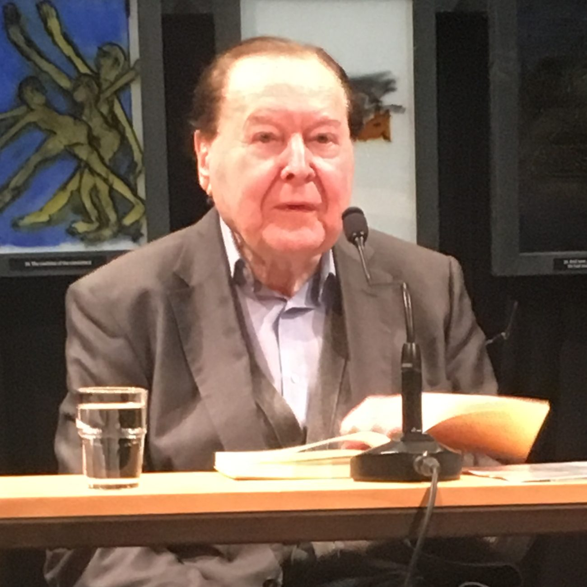
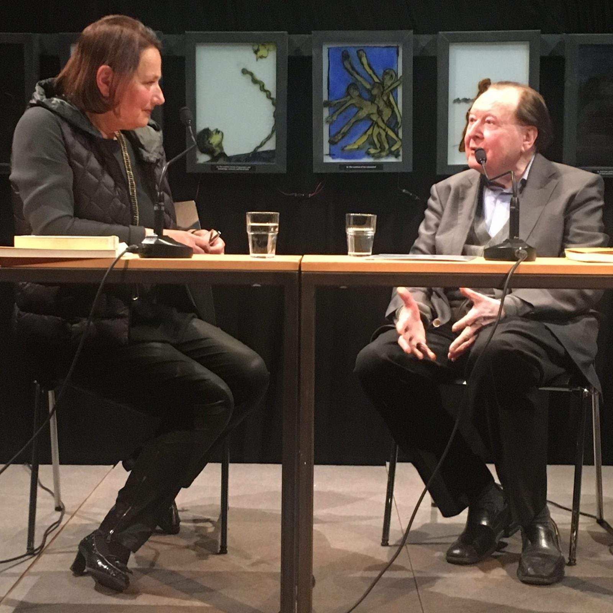

Gerhard Rühm hat gestern [im Kulturzentrum bei den Minoriten gelesen](https://www.katholische-kirche-steiermark.at/?d=gerhard-ruehm-drei-personen-wollen-guter-laune-sein-minidramen#.WrSfpYIxk1I). Für mich war es ein seltsames Wiedersehen. In den 70er Jahren bin ich durch eine Vorlesung von Gerhard Rühm bei den Germanisten in Köln auf die experimentelle deutsche Literatur gestoßen. Einige Passagen gestern waren, wenn ich mich richtig erinnere, wie aus seinem Vortrag damals übernommen. Was mir gestern aufgegangen ist: Die Rolle der Simultaneität bei Rühm, das Erzeugen von Konstellationen.

Auf dem Bild oben: Gerhard Rühm, [Monika Lichtenfeld](http://www.literaturhaus-graz.at/autor/monika-lichtenfeld/) und [Paul Pechmann](https://germanistik.univie.ac.at/personen/schuster-marc-oliver/internationale-hc-artmann-konferenz/pechmann/) lesen das Minidrama "Zwei Personen wollen guter Laune sein".  

- 
    
    Gerhard Rühm, Kulturzentrum bei den Minoriten, Graz, 22.3.2018
    
- 
    
    Gerhard Rühm und Evelyn Deutsch-Schreiner, Kulturzentrum bei den Minoriten, Graz, 22.3.2018
