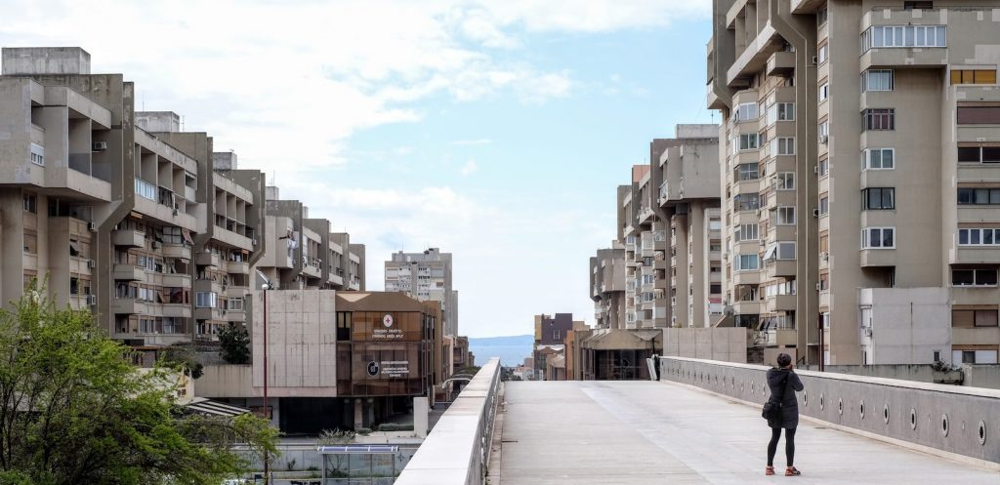
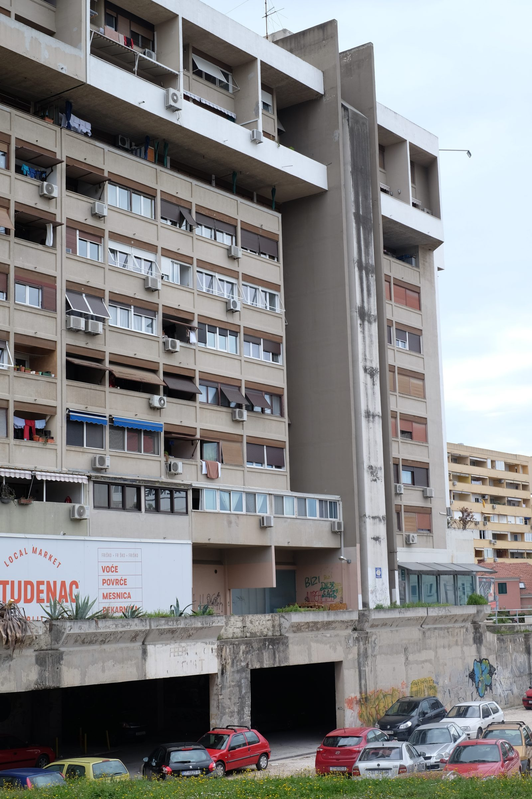
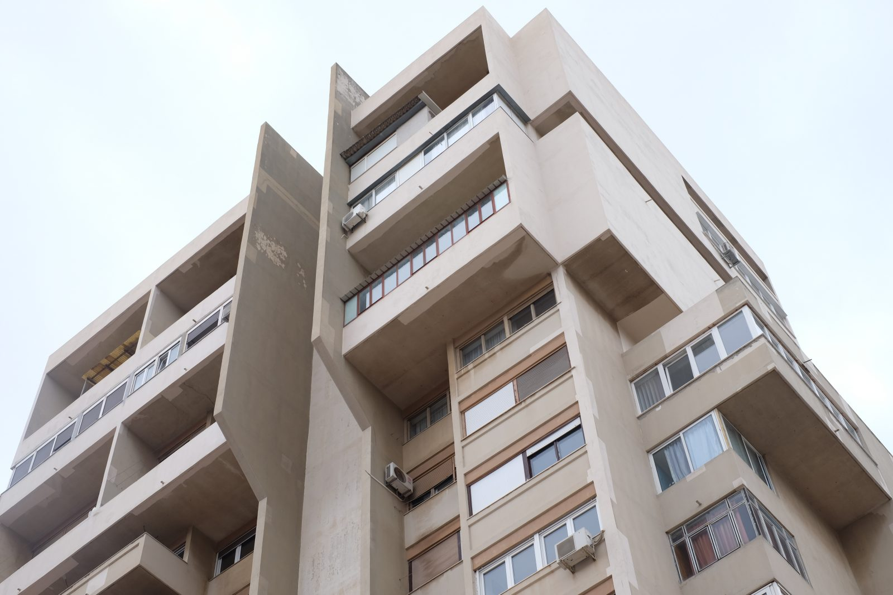
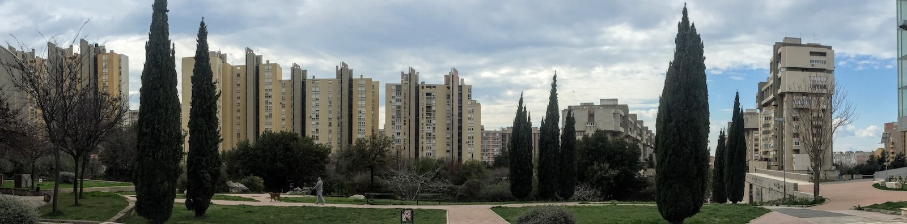
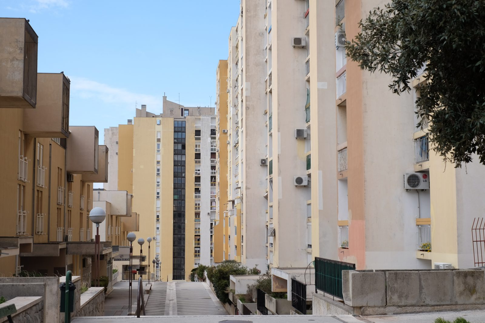
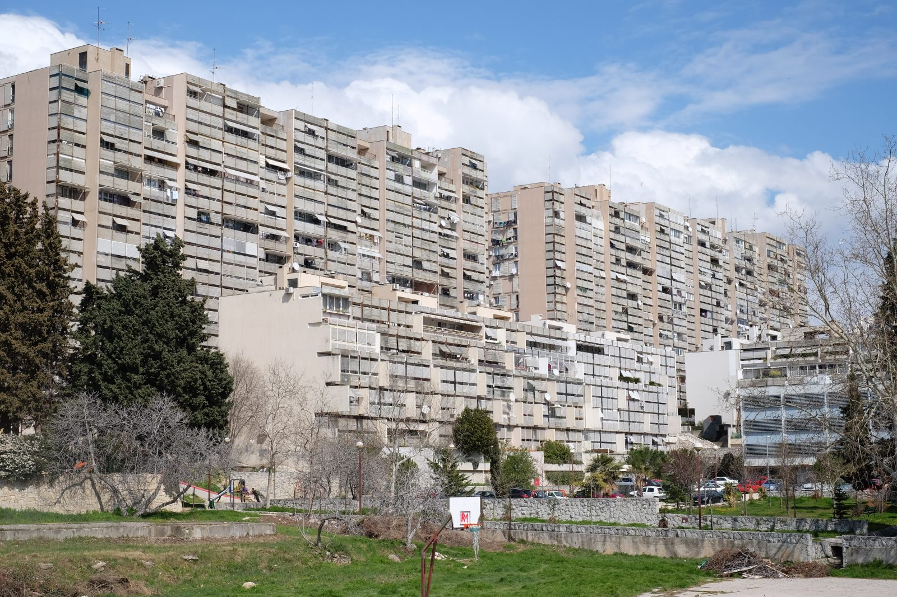

Spaziergang durch eine Utopie

Split 3: Wohnsiedlung von Vladimir Mušič und Marjan Bežan

Auf dem Weg nach Dubrovnik haben wir am Wochenende für zwei Nächte in Split haltgemacht. Wir hatten uns auf diesen Besuch nicht vorbereitet. Wir wussten vorher nur, dass wir noch etwas anderes sehen wollten als den Stadtkern. An ersten Abend habe ich das beklemmende Gefühl gehabt, dass man in einer Altstadt wie der von Split kaum noch selbst bestimmen kann, wie man sie sehen möchte—so konsequent ist sie als museales Kulturdenkmal aufbereitet und mit den Institutionen der Tourismus-Branche verzahnt.

Über Google sind wir auf [ein Blogpost mit Fotos des Stadtteils Split 3](https://www.calvertjournal.com/photography/show/8659/modernist-architecture-croatia-split) gestoßen, und dann haben wir dazu noch etwas in einem Buch über moderne jugoslawische Architektur[1](#fn1-3137) gefunden, das wir vor der Abfahrt eingepackt hatten. Split 3 ist ein Stadtteil, der seit den 70er Jahren komplett neu errichtet wurde. Geplant wurde in den 60ern für 50000 Menschen. Heute wohnen wohl 12000 bis 13000 Menschen dort.

Jugoslawien, 60er Jahre, Industrialisierung: Man denkt sofort an Plattenbauten und sozialistische Monotonie. Aber dieser Stadtteil hat nicht viel von der Tristesse des Realsozialismus, sieht man davon ab, dass ihn große, hohe Gebäude beherrschen, die teilweise heruntergekommen sind wie viele ältere Bauten in Kroatien. Split 3 war ein ambitioniertes urbanistisches Projekt, das eher an das Barbican-Viertel in London erinnert als an die Wohnsiedlungen in Ost-Berlin.

Wir sind von unserem Hotel aus der Altstadt zu Fuß gegangen. Man braucht eine knappe halbe Stunde, meist entlang an modernen Gebäuden, von denen einige mehr Aufmerksamkeit verdient hätten. Split ist nach dem zweiten Weltkrieg sehr schnell gewachsen, und man hat den größten Teil der Bevölkerung in vielgeschossigen Bauten untergebracht. Split 3 steht in dieser Tradition, setzt sich aber durch seinen urbanistischen Ehrgeiz auch von ihr ab.

- 
    
    Split 3: Wohngebäude von Vladimir Mušič und Marjan Bežan
    
- 
    
    Split 3: Wohngebäude von Vladimir Mušič und Marjan Bežan
    

Auf unserem Weg von der Stadt aus haben wir als erstes die monumentalen Bauten von Vladimir Mušič und [Marjan Bežan](https://sl.wikipedia.org/wiki/Marjan_Be%C5%BEan) bemerkt. Charakteristisch für sie sind vorkragende Obergeschoss-Bereiche, die Teil des betonten Außenrahmens der Gebäude sind. Die Fassaden innerhalb dieses Rahmens sind dreidimensional gestaltet. Ich habe gelesen, dass die Planer von Split 3 sich am Diokletianspalast orientiert haben, bei dem die mittelalterlichen und neuzeitlichen kleinen Gebäude in das riesenhaften Skelett des Alten Palasts hineingebaut wurden, so dass kleinteilige Strukturen einen einfachen, geometrischen Rahmen ausfüllen. Mušič' und Bežans Bauten entsprechen diesem Muster am meisten.

Blick auf Split 3

Von einer Fußgängerbrücke oberhalb dieses Teils und der hinter ihr liegenden neuen Universität aus hat man einen guten Gesamteindruck des Viertels. An Mušič' und Bežans Bauten vorbei führt eine Fußgängerzone mit niedriger Bebauung zum Meer hinunter.

Split 3: Wohnhäuser von Dinko Kovačić

Links davon schaut man auf Bauten von [Dinko Kovačić](http://dinkokovacic.net/), bei denen vor allem die Vertikalen betont sind, während bei Mušič und Bežan am meisten die schweren horizontalen Elemente auffallen. Die nach unten rund auslaufenden Betonstützen der Häuser von Kovačić erinnern entfernt an gotische Pfeiler mit ihren Diensten. Wir sind an diesen Gebäuden entlanggegangen und zu großzügigen niedrigen Bereichen zwischen ihnen gekommen, die als Treffpunkte und für soziale Einrichtungen angelegt sind. Aus der Nähe wirken die großen Bauten durch die dreidimensionalen Fassaden-Elemente und auch durch die Farbigkeit nicht übermächtig, während sie aus der Ferne gesehen die Formen des Gebirges hinter ihnen aufnehmen.

Split 3: Wohnsiedlung von Ivo Radić

Wenn man weiter hinunter zum das Meer geht, das etwa 10 Minuten von Split 3 entfernt ist, schaut man auf die Gebäude von [Ivo Radić](http://www.enciklopedija.hr/Natuknica.aspx?ID=51439) zurück, die genauso dimensioniert sind wie die übrigen Komplexe, aber noch stärker miteinander verbunden sind. Bei ihnen löste sich die große Fläche in eine riesige Zahl kleiner rechteckiger Formen auf, die von den Fenstern und ihren Sonnenblenden bestimmt werden.

Der ganze Stadtteil hat etwas Monumentales. Die Siedlungen sind auf die ansteigende Landschaft bezogen. Die Gebäude sind stufenförmig so angeordnet, dass sie ein Maximum an Sicht bieten. Man hat nirgendwo den Eindruck von Enge.

Mir fehlt das planerische Wissen, um die praktische urbanistische Qualität des Viertels beurteilen zu können. Deutlich ist das Bemühen um den individuellen Charakter der verschiedenen Komplexe, um große Ruhe- und Begegnungszonen und um die Trennung von Autoverkehr und Fußgängerbereichen. Die Dimensionen der Gebäude und ihr Bezug zur Landschaft werden inszeniert. Betonte Vertikalen unterstreichen die Höhe der Bebauung. So kommt es zu einer skulpturalen Wirkung, die ich bei Wohngebäuden dieser Größe noch nie so wahrgenommen habe. Jetzt, beim Betrachten unserer Fotos und der Bilder, die man im Web von Split 3 findet (zb bei [ostarchitektur](http://www.ostarchitektur.com/buildings/croatia/split/)), fällt sie mir noch mehr auf.

Ana war von Split 3 weniger begeistert als ich. Sie hat noch mehr als ich bemerkt, wie heruntergekommen die Gebäude zum Teil sind, und wie ungepflegt, fast sich selbst überlassen, die Zonen zwischen ihnen sind. Mich hat der utopische und monumentale Charakter der Architektur angesprochen. Sie sind in einer Zeit geplant worden, in der ich mich für den jugoslawischen Selbstverwaltungs-Sozialismus interessiert habe und in der mich Stojanovic' _Kritik und Zukunft des Sozialismus_[2](#fn2-3137) begeistert hat. Für mich drücken die Gebäude etwas von den Utopien und den Ambitionen, vielleicht auch dem Größenwahn jener Jahre aus—in einer mediterran-mitteleuropäischen, menschenfreundlichen Weise. Durch diesen Ehrgeiz wirken die Gebäude im Kroatien von 2018 wie Fremdkörper aus einer anderen Epoche.

Am Montag sind wir nach Dubrovnik weitergefahren. Kurz haben wir uns das [Stadion Poljud](https://de.wikipedia.org/wiki/Stadion_Poljud) angeschaut, ein weiteres spektakuläres Projekt der jugoslawischen Moderne. Auf dem Weg nach Omiš, 20 km südlich von Split, fährt man fast immer an zwei- bis dreigeschossigen Häusern vorbei, die wohl vor allem gebaut wurden, um um so viele Touristen wie möglich in Privatquartieren nah am Meer unterbringen zu können. Wenn man Split 3 zum ersten Mal sieht, erschrickt man über die Dimensionen von Gebäuden, die nicht verstecken, dass sie für eine Masse von Menschen errichtet wurden, die in einer modernen, industriellen Stadt leben. Aber diese Gebäude lassen der Natur und auch der Individualität mehr Raum als die umambitionierten, monotonen Billigbauten, die nach dem Ende Jugoslawiens entstanden sind.

* * *

1. Kulić, V., Mrduljaš, M., & Thaler, W. (2012). Modernism in-between: the mediatory architectures of Socialist Yugoslavia. Berlin: Jovis Verlag GmbH. [↩︎](#fnr1-3137)
2. Stojanovic, S. (1972). Kritik und Zukunft des Sozialismus. Frankfurt a.M.: Fischer-Taschenbuch-Verl. [↩︎](#fnr2-3137)
