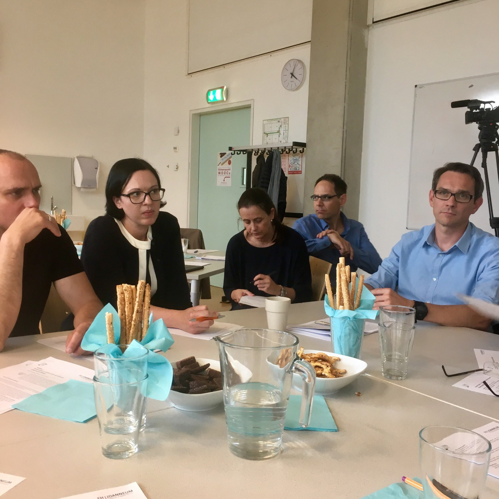

Darf endlich mal wieder an der FH über MOOCs diskutieren: [Online-Lehre der Zukunft: Schwerpunkt MOOCs](https://www.fh-joanneum.at/veranstaltung/round-table-ii-online-lehre-der-zukunft/). Ein Punkt war einfach: Über MOOCs gelernt habe ich am meisten von @mons7 und @diegorelebt.

