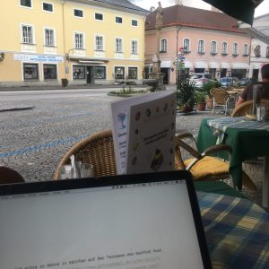

\[caption id="attachment\_6527" align="alignleft" width="300"\] Gmünd, 25.5.18.\[/caption\]Ich sitze in Gmünd in Kärnten auf der Terrasse des Gasthof Post und warte auf [Jochen](http://www.schneeengel.de/ueber-mich/), der mich mit auf die Hütte zum [AlmCamp](http://almcamp.org/) nimmt. Bin gespannt. Es wird ein kleines Camp, aber das stört mich nicht—im Gegenteil. Ich freue mich auf die Leute, die ich treffen werde, und ich freue mich auf den Input. Ich war in der letzten Zeit so absorbiert, dass ich nicht sehr viel mitbekommen habe außerhalb der Hardcore-Contentstrategie-Szene.

Ich überlege mir, wer beim ersten [AlmCamp](https://www.barcamp.at/AlmCamp_09) dabei war und jetzt nicht kommt, aus welchen Gründen auch immer. Damals gab es in Österreich so etwas wie eine Social Media-Szene, in der sich alle gekannt haben, die etwas aktiver waren. Nicht einmal 10 Jahre später haben alle die _Digitalisierung_ entdeckt. Das ist schade. Irgendwie haben wir uns alle aufsaugen lassen, von Firmen, Hochschulen, Medien, von der Politik. Der Mainstream ist nicht weiter, als er damals war, und außerhalb des Mainstream gibt es Gruppen, aber keine Szene mehr. So kommt es mir jedenfalls vor.

Was ich vortragen? [Monika](https://twitter.com/DieMeurers) hat mich um eine Session _Contentstrategie in einfacher Sprache_ gebeten. Ich werde mein Möglichstes tun, aber einfache Sprache ist nicht meine Stärke. Beim ersten Almcamp habe ich etwas über [PubSubHubbub](https://github.com/pubsubhubbub) erzählt, selbst dort damals eher ein Außenseiter-Thema. Vergessen habe ich es nicht. Vielleicht können wir diesmal über das [IndieWeb](https://indieweb.org/) sprechen, über Vernetzung mit Web-Standards ohne zentrale Plattformen. [WebSub](https://indieweb.org/WebSub), das Nachfolgeformat von PubSubHubbub spielt dort noch eine Rolle ...
