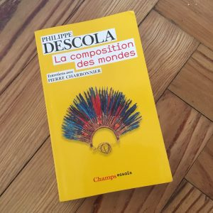

Seit gut zwei Wochen mache ich Urlaub in Frankreich. In der ersten Woche habe ich in Paris zum ersten Mal seit fast 40 Jahren bei Gibert Jeune wieder die Regale für Humanwissenschaften gescannt. Gekauft habe ich mir schließlich [La composition des mondes](https://editions.flammarion.com/Catalogue/champs-essais/la-composition-des-mondes "Verlagsseite zum Buch") von Philippe Descola. \[caption id="attachment\_6720" align="alignleft" width="300"\] Cover von Philippe Descolas 'La composition des mondes'\[/caption\]Das Buch führt in Gesprächsform in das Werk Descolas ein. Der Gesprächspartner Pierre Charbonnier greift dabei nur als Stichwortgeber in den Gesprächsverlauf ein. Der Text ist so genau redigiert, dass sich einige Passagen fast wõrtlich in einem [Aufsatz Descolas über sein Verhältnis zu seinem Lehrer Claude Lévi-Strauss und zum Strukturalismus](https://doi.org/10.14318/hau6.3.005 "Transformation transformed") wiederfinden. (Auf Deutsch sind von Descola [Die Ökologie der Anderen](https://www.matthes-seitz-berlin.de/buch/die-okologie-der-anderen.html?lid=1 "Verlagsseite zum Buch") und sein Hauptwerk [Jenseits von Kultur und Natur](https://www.suhrkamp.de/buecher/jenseits_von_natur_und_kultur-philippe_descola_58568.htm "Verlagsseite zum Buch") erschienen.)

_La composition des mondes_ ist das erste Buch Descolas, das ich gelesen habe. Es fasziniert mich so sehr wie die Bücher der französischen Intelkektuellen, die Descola geprägt haben, und von denen ich einige, auch Claude Lévi-Strauss, während meines Studienjahrs in Paris hören konnte. Wie Bruno Latour, auf den ich schon vor einiger Zeit aufmerksam geworden bin, erscheint mir Descola als ein Theoretiker, der französische intellektuelle Traditionen in einer Weise fortsetzt, die für uns heute so interessant und wichtig ist, wie es die Arbeiten der Generation Foucaults in den 70er und 80er Jahren waren. Nach der Lektüre dieser Einführung verstehe ich Descola als einen Vertreter des _practical turn_, der thematisiert und reflektiert, wie Wissen in Praxis eingebunden ist. Und ich sehe ihn als einen Protagonisten einer ökologischen Haltung und eines ökologischen Denkens, das sich den Herausforderungen des _Anthropozän_ stellt, indem es die gewohnten Unterscheidungen von Natur einerseits und Gesellschaft andererseits in Frage stellt. Ich sehe aber auch ganz konkrete Bezüge zu den Themen, mit denen ich mich sonst beschäftige, zu medialen Praktiken.

Lateinisch-französisch und nachahmenswert ist eine Eigenheit, die Descola am Rand der Gespräche erwähnt: Er vermeide Neologismen und ziehe es stattdessen vor, gewohnte Ausdrücke - wie die Bezeichnung "Animismus" - mit verschobenen Bedeutungen zu verwenden. Das erleichtere das Verständnis, lasse aber auch das Neuartige in einem Gedanken deutlicher und wirkungsvoller hervortreten als ein selbstgeprägter und damit willkürlicher Ausdruck. Dieser äußerliche Konservativismus, der radikale Umdeutungen ermöglicht, ist typisch für Descolas Haltung. Descola schließt an die Tradition der französischen Ethnologie und Philosophie des 20. Jahrhunderts an und vollzieht zugleich ein konsequentes Aggiornamento, das die übernommenen Begriffe flüssig und anschlußfähig macht. An seinem Doktorvater Lévi-Strauss, dessen Nachfolger er am Collège de France ist, bewundert Descola seine Weigerung, Epigonen heranzuziehen. (Descola setzt viele Traditionen fort, auch solche der deutschen Philosophie. Er ist ein universal gebildeter Intellektueller - mich erinnert er an Gelehrte wie Ernst Cassirer und Hans Blumenberg.)

Auf Descolas Vorgehen passt Arnold Gehlens Ausdruck _empirische Philosophie_. Descola beschäftigt sich mit Themen der Philosophie, aber er tut es als Ethnologe. Er untersucht das Denken von Gesellschaften ethnologisch, und damit geht er, wie er immer wieder betont, empirisch vor. Jeder seiner Begriffe steht in einem Forschungskontext, dient dazu, beobachtbare Phänomene zu erfassen und wird durch weitere Forschung revidiert werden. Andererseits ist diese Forschung notwendig philosophisch, weil sie nicht direkt andere Gesellschaften thematisiert, sondern den Prozess dieser Thematisierung selbst reflektiert und untersucht. Die anderen Gesellschaften oder Kulturen sind nicht einfach gegeben, sondern gegeben sind die Schwierigkeiten, mit unseren modernen oder westlichen Begriffen das Denken und die Praktiken der anderen zu verstehen. Im Erfassen dieser Gegenüberstellungen besteht der Kern der ethnologischen und damit, weil es um unsere eigenen Begriffe, Ontologien und Kosmologien geht, philosophischen Arbeit.

Der zentrale Begriff für den ethnologischen und philosophischen Ansatz von Descola ist _Identifikationsweise_ (_mode d'identification_). Descola unterscheidet vier Typen der Identifikation, die für Gesellschaften charakteristisch sind:

- die _animistische Identifikation_, bei der alle Wesen (êtres) mit einer Innerlichkeit ausgestattet sind, aber bei denen äußerliche Diskontinuitäten zwischen den Wesen bestehen;
- die _naturalistische Identifikation_, bei der alle Wesen zu einer Natur gehören (so dass Kontinuität zwischen ihnen besteht), aber nur bestimmte Wesen, nämlich die Menschen, über eine Innerlichkeit verfügen, so dass zwischen ihnen und den anderen eine Diskontiniuität vorliegt;
- die _totemistische Identifikation_ bei der Wesen unabhängig davon, ob sie über eine Innerlichkeit verfügen oder nicht, zu bestimmten Gruppen oder Klassen gehören, die von den übrigen durch Diskontinuitäten unterschieden sind;
- schließlich die _analogistische Identifikation_, bei der sich alle Wesen voneinander unterscheiden, aber durch Ähnlichkeiten aufeinander verweisen.

Diese Identifikationsweisen sind nicht intellektuelle Konstruktionen, verschiedene Sichten auf dieselbe Welt oder Weltanschauungen. Es handelt sich eher um verschiedene Welten oder Weisen, Welten zu "komponieren", indem Menschen mit anderen Wesen interagieren und sie praktisch beeinflussen. Sie gehören zu verschiedenen Formen der Praxis. Das, was wir unter _Natur_ verstehen, ist nicht eine gemeinsame selbstverständlicher Basis dieser Praktiken, sondern ein Teil _eines_ Typs dieser Praktiken, in der streng zwischen den Menschen und den nicht menschlichen Wesen unterschieden wird.

Der entscheidende Punkt bei diesem Ansatz ist, dass hier nicht Kulturen oder Gesellschaften der Natur gegenüber gestellt werden, sondern dass Gesellschaften als Komposita von menschlichen und nicht menschlichen Wesen und ihren Beziehungen verstanden werden. Es gibt also in Descolas Denken nicht _die Natur_, sondern Natur konstituiert sich erst in einer bestimmten Praxis, aber sie konstituiert diese Praxis dabei mit. In diesem Punkt sind Descola und die Akteur-Netzwerk-Theorie, die Bruno Latour mitformuliert hat, sehr ähnlich. Sie unterscheiden sich aber, wie Descola auch mehrfach betont, darin, ob man die "Moderne" - die Formation, die nach einigen Vorläufern zur Zeit Galileis begann - tatsächlich als naturalistisch, so wie es Descola versteht, definieren kann, oder ob dieser Naturalismus ein Selbstverständnis einer Gesellschaft ist, die in Wirklichkeit nie nur modern war, sondern in der wie in anderen Gesellschaften auch Netzwerke von menschlichen und nichtmenschlichen Wesen miteinander agieren.

Descola und Latour unterscheiden sich in ihrem Verständnis von Natur und Moderne vielleicht weniger, als es scheint, weil einerseits Descola selbst nicht von geschlossenen Gesellschaften ausgeht, sondern von sich verändernden Praktiken, die er in seinem Konzept der Identifikationsweisen nur idealtypisch beschreibt, und weil es andererseits in der Konsequenz seines Ansatzes liegt, dass auch in den naturalistischen Praktiken nicht Menschen die passive Natur bearbeiten oder beeinflussen, sondern Hybride aus Menschen und nichtmenschlichen Akteuren aktiv sind.

Descolas Reflexion und Kritik der eigenen, westlichen Kategorien hat einen politischen und einen ethischen Aspekt. Im Umgang mit den anderen können unsere Kategorien immer als Kategorien der Unterwerfung dienen, sie verbergen die Eigenart der anderen und sind, ohne dass man sie reflektiert, nicht dazu in der Lage, die anderen zu begreifen. Am Ende seines Buches spricht Descola davon, dass die Verschiedenheit ein unbedingter Wert ist. Seine eigene Praxis ist von diesem Wert nicht zu trennen und deshalb implizit auch eine ethische Praxis. Praktisch hat sich Descola für die Rechte der autochthonen Einwohner des Amazonas Becken eingesetzt, und er bezieht jetzt ökologische Positionen. Diese politische Aktivität ergibt sich nicht aus einem abstrakten Ideal, aus dem, was bei uns oft abwertend als Gutmenschentum bezeichnet wird, sondern aus einer wissenschaftlichen oder reflektierenden Praxis, die versucht, etwas zu erklären, das sich nur erklären lässt, wenn wir unsere eigenen Begriffe in Frage stellen.

Mich interessiert an Descola am meisten die Beziehung von Denken und Praxis in einem doppelten Sinn. Einmal: Fur Descola ist Praxis nicht Anwendung des Denkens, sondern das Denken, die Theorie, lässt sich bis in ihren Kern, die Identifikationsweisen, nicht aus Praktiken (Descola spricht mehrfach von Communities of Practice) herauslösen, das savoir-être (wissen, was ist) nicht aus dem savoir-faire (können, wissen zu handeln). Und zum anderen: Die theoretische Arbeit in der Wissenschaft ist nicht ethisch neutral und wohl auch nie apolitisch, sie ist vom praktischen Engagement wie dem für die Diversität nicht zu lösen. Die Erkenntnisse der Ethnologie sind in ein Feld aus kolonialistischen und antikolonialistischen Praktiken eingebunden.

Descola selbst hat sich viel mit Bildern beschäftigt, und er erwähnt in den Gesprächen in _La composition des mondes_ die Schrift und andere Techniken, Erinnerungen zu bewahren. Merkwürdigerweise bezeichnet er die Malerei des 16. Jahrhunderts als eine der Voraussetzungen der Durchsetzung des Naturalismus, erwähnt aber die Druckerpresse nicht. Wie auch immer: Zu den Praktiken der Kommunikation in einer digitalisierten Umgebung gehören vielleicht nicht neue Identifikationsweisen, aber unterhalb dieser Ebene doch neue Weisen, Dinge und Wesen in Beziehung zueinander zu setzen, die man mit einem ethnologischen Blick wie dem Descolas und mit seinen Kategorien vielleicht neu verstehen kann.
