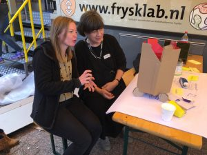
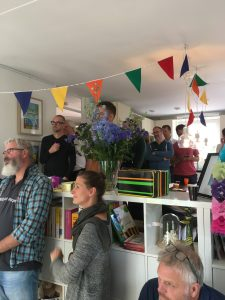
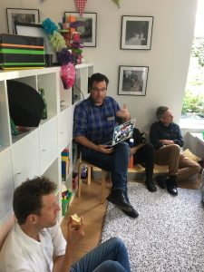

\[caption id="attachment\_6734" align="alignleft" width="300"\] Gabriela Avram präsentiert Elmine Wijnia den Bottle Bot.\[/caption\]Begonnen habe ich dieses Post in einem Café am Markt in Amersfoort. In der letzten Woche war ich bei der [Smart Stuff that Matters Unconference](https://www.zylstra.org/blog/stuff-that-matters-unconference-2018-smart-home-edition/), die [Elmine Wijnia](http://storymin.es/en/) und [Ton Zijlstra](https://www.zylstra.org/blog/) in ihrem neuen Haus durchgeführt haben. Am folgenden Tag haben sie alle Teilnehmerinnen und Teilnehmer zu einem Grillfest eingeladen. Anlass war der 40. Geburtstag von Elmine. Vor ein paar Jahren war ich bei einer ähnlichen Veranstaltung, damals zu Tons 40. Geburtstag. Andere Unkonferenzen bei Ton und Elmine, alle unter dem Obertitel _Stuff that Matters_, habe ich leider verpasst.

Seit ich Ton kennengelernt habe, beim [BarCamp 2006](https://wittenbrink.net/lostandfound/people_centered/) in Wien, ist er für mich so etwas wie ein Rollenmodell für das Arbeiten und auch das Leben in der digitalen Welt. (Wobei mir der Ausdruck _digitale Welt_ inzwischen nicht mehr ganz passend erscheint). Ton beschäftigt sich sehr praktisch mit dem Möglichkeiten, das persönliche Leben und die persönlichen Beziehungen mit den weiteren Zusammenhängen zu verbinden, in denen man lebt, von der Gemeinde bis hin zu weltweiten Entwicklungen. Dabei hat er einen technischen und pragmatischen oder praktischen Ansatz, den ich bewundere. Vorbildlich finde ich auch, wie er Leuten, die nicht zu einer digitalen Avantgarde gehören, verständlich machen, kann was er tut.

\[caption id="attachment\_6733" align="alignleft" width="225"\] Bei der Einleitung von #STM2018\[/caption\]Die Unkonferenz in der letzten Woche ist ein Beispiel dafür, wie man Dinge aus einer ganz persönlichen Motivation heraus tut—z.B.: Freude treffen, sich über Dinge zu unterhalten, die einen interessieren, zu überlegen wie man den Alltag nach einem Umzug gestaltet—und dabei für andere anschlussfähig ist. Was man herausfindet oder entwickelt, behält man nicht für sich, sondern macht es für andere brauchbar und baut umgekehrt auf dem auf, was die anderen tun. Es geht also nicht darum im Kleinen so etwas wie einen übergreifenden moralischen Anspruch zu realisieren sondern umgekehrt darum, sein persönliches Leben so zu gestalten und zu vernetzen, dass man gemeinsam die Handlungsfähigkeiten erweitert. Ton spricht von [Networked Agency](https://www.zylstra.org/blog/networked-agency/) und hat dieses Konzept in einigen Posts ausgearbeitet. Digitale Vernetzung ist eine Komponente dieser Handlungsmöglichkeiten, aber nur eingebettet in Netzwerke, zu denen Personen und andere Akteure wie Orte und technische Objekte gehören.

Das Treffen am Freitag wurde mit einer Art Spiel eingeleitet. Wir haben uns in Gruppen von vier bis fünf Leuten zusammengesetzt, die sich vorher nicht kannten, und von unserem letzten Umzug erzählt—davon, wie wir mit unserer Umgebung in Verbindung gekommen sind und darüber, was uns dabei besonders gefreut und was uns besonders enttäuscht hat. Diese Runde mündete in ein Event ein, das in Vielem den BarCamp-Regeln folgte, ohne dass der Ausdruck _BarCamp_ je benutzt wurde. In verschiedenen Sessions haben wir uns mit Themen beschäftigt, die in einem mehr oder weniger direkten Bezug zu der Anfangsfrage des intelligenten Umgangs mit seiner Umgebung stehen. Es war aber kein Thema vorgegeben. Der wichtigste Unterschied zu den BarCamps, die ich besucht habe, lag wohl darin, dass das Event noch deutlicher von den Teilnehmern für die Teilnehmer organisiert wurde, dass die Kommunikation von Ergebnissen oder Wissen nach außen nur ein Nebeneffekt ist, während das Öffentlichmachen ([You do blog about BarCamp](http://barcamp.org/w/page/405173/TheRulesOfBarCamp)) zu den Kernbestandteilen der BarCamp-Regeln gehört. Auch die Länge der Sessions wurde frei vereinbart, wir haben uns nicht an das strikte BarCamp-Schema gehalten.

In verschiedenen Gruppen habe ich mich Freitag

- darüber unterhalten, wie man neue Freunde in einer neuen Umgebung findet,
- damit beschäftigt, wie man Roboter so gestaltet, dass sie sich in das Leben in einer Stadt einfügen,
- die Messung der Wirkung und die Sicherung der Ergebniss von vernetzten Aktivitäten und vernetzter Kommunikation besprochen,
- eine [Präsentation über das Indieweb](https://diggingthedigital.com/files/SmartStuffThatMattersIndieweb.pdf) verfolgt und darüber diskutiert.

Die Themen so aufzuzählen verfehlt, was das Besondere an der Unkonferenz war, nämlich dass man Leute kennenlernt oder wiedertrifft, für die diese Themen persönliche Themen sind, so dass sie über ihr Leben berichten, wenn sie sich über sie unterhalten. Es geht bei einer Unkonferenz wie dieser nicht darum, zu Ergebnissen zu gelangen, die man dann in Form abstrakter Formulierungen weitergeben kann, sondern darum, durch verschiedene Praktiken, die man kennenlernt und über die man sich austauscht, die eigene Lebenspraxis zu erweitern und mit neuen Perspektiven anzugehen. Dabei lassen sich diese Praktiken oder Lebensformen nicht von den Beziehungen trennen, in denen und mit denen man lebt und die man bei einem Event wie diesem knüpft oder verändert. Die Unkonferenz bei Ton hat mich in vielem, auch in ihrer Intensität, an das letzte [AlmCamp](https://wittenbrink.net/lostandfound/no-tourists-barcampen-auf-1600-meter-hoehe/) erinnert, an dem ich im Frühjahr teilgenommen habe. Sie bringt mich aber, das liegt vielleicht an diesem besonderen Format, noch mehr dazu darüber nachzudenken, wie ich selbst vernetzt lebe—oder eben vielleicht auch nicht lebe, weil für mich das vernetzte Leben in einer Online- und Social Media-Welt und mein persönliches Alltagsleben deutlicher voneinander getrennt sind als bei einigen Teilnehmerinnen der Unkonferenz, die mich besonders beeindruckt haben.

Zu der _Agency_ einer Unkonferenz wie dieser gehört der Ort, an dem sie stattfindet, also in diesem Fall das Privathaus von Ton und Elmine. Am Freitag wurde es durch ein [mobiles FabLab aus Friesland](https://www.fablabs.io/labs/frysklab) erweitert, das vor dem Haus stand und auch bei den Sessions genutzt wurde. Ich war außer zu den Besuchen bei Ton und Elmine noch nie in den Niederlanden und nehme dieses Haus und die ganze Atmosphäre als typisch holländisch wahr. So, wie ich mir die Niederlande ausmale—offen, liberal, unprätentiös—so behalte ich dieses Haus in Erinnerung, und so ist mir in der letzten Woche auch die Architektur in den moderneren Teilen von Amersfoort erschienen, die ich mir gerne noch länger ansehen möchte.

\[caption id="attachment\_6735" align="alignright" width="225"\] Frank Meeuwsen bei seiner Präsentation während der #STM2018\[/caption\] Es war sicher keinein Zufall, dass die Leute, mit denen ich mich am intensivsten unterhalten habe, bloggen, und das seit langer Zeit. Ton und [Gerrit](https://eicker.digital/trends/) verfolge ich schon lange. [Peter](http://ruk.ca/) habe ich in der letzten Woche kennengelernt und werde ihm in Zukunft genauso folgen wie [Elija](https://www.eljadaae.nl/) und [Frank](https://diggingthedigital.com/), deren niederländische Blogs ich nur mit einer automatischen Übersetzung lesen kann. Sie alle bleiben der ursprünglichen Inspiration des Bloggens treu. Frank nannte sie in seinem Vortrag: _seine Stimme unredigiert veröffentlichen_. Die Offenheit, aber auch der Individualismus, der sich in dieser Formulierung ausdrückt, hat dieses ganze Unkonferenz geprägt. Ich hoffe, dass ich vor allem durch das Bloggen mit den Teilnehmern verbunden bleibe.

## People Centered Navigation jenseits massenmedialer Netze

Als ich Ton 2006 kennengelernt habe, war das Bloggen ein Megatrend, der seinen Höhepunkt wahrscheinlich gerade überschritten hatte. Damals entstand das, was heute jeder als Social Media bezeichnet, und viele glaubten lange, dass sich Blogs und individuelle Websites darin auflösen würden. Die Stimmung war, jedenfalls bei mir, aber ich glaube bei den meisten, die aktiv an dieser Szene teilnahmen, utopistisch. Wir haben irgendwie geglaubt, dass wir eine historische Entwicklung verstanden hatten, von der die Gesellschaft früher oder später profitieren müsste.

Die Atmosphäre bei der Unkonferenz in Amersfoort war völlig anders. Von den Gewissheiten der Jahre kurz nach 2000 ist nicht viel geblieben, von den Impulsen, die hinter der Begeisterung damals standen, schon. Es geht nicht mehr oder noch viel weniger als damals um Technik, es geht um intelligentes, wie Ton und Elmine es nennen, um _smartes_ Handelns im Einzelnen, und im Kern um das Leben unter den gegenwärtigen Bedingungen. Es geht eher darum, in Frage zu stellen, was uns als unausweislich vorgestellt wird als darum, selbst Unausweichlichkeit zu produzieren.

Heute glaube ich, dass ich damals die _Digitalisierung_ technodeterministisch missverstanden habe, so als gäbe es lineare technische Entwicklungen oder Fortschritte, die man nur verstehen und so gut wie möglich ausnutzen muss. Erst allmählich begreife ich, dass die Techniken viel tiefer in soziale Praktiken eingebettet und von ihnen nicht zu lösen sind. Damals habe ich von Ton den Begriff der _people centered navigation_ übernommen. Durch das Event in der letzten Woche ist mir klarer geworden, was dieses Konzept meint: nicht nur eine richtige, effiziente Verwendung von Tools, sondern eine Praxis, die für konkrete Bedürfnisse gezielt auf Tools zurückgreift und sie dabei immer anpasst. Tatsächlich sind die Social Media Tools, die damals entstanden sind, vor allem für massenmediale Praktiken verwendet worden. People Centered Navigation ist nicht eine Komponente besserer, weil effizienterer Massenmedien sondern eine Navigation in Informationen, die sich an den Bedürfnissen und Möglichkeiten von Personen in lokalisierten Netzwerken orientiert, und dabei ist vor allem die Produktion von Medien und Inhalten im Dialog mit wenigen anderen Teilnehmern relevant, nicht ihre Rezeption in Massen. Die _Network Literacies_ sind die Fähigkeiten, in diesen Netzwerken produktiv mitzuwirken.

Mich hat dieser Versuch, die lokale Umgebung intelligent zu gestalten und zu überlegen, wie man sie mehrdimensional vernetzen kann, an die lokalisierte Politik in fragilen Netzwerken erinnert, die Bruno Latour z. B. in seinem [terrestrischen Manifest](https://www.suhrkamp.de/buecher/das_terrestrische_manifest-bruno_latour_7362.html) als Alternative zu den Utopien und Anti-Utopien der Globalisierung und der geschlossenen nationalen Gesellschaften formuliert. Latour spricht von der Erde als einem dünnen _Film_, in dem man leben kann, weil man die richtigen Verbindungen herstellt und pflegt. Die Unkonferenz bei Ton und Elmine war ein Experiment, um solche Verbindungen zu entdecken und zu entwickeln.

## Blogposts zu #STM18:

Ton Zilstra hat das Event in seinem Blog ausführlich vorbereitet, begleitet und nachbereitet. Man findet die Posts unter dem Tag [stm18](https://www.zylstra.org/blog/tag/stm18/). Weitere Posts: [all the friends I've not yet met](https://ruk.ca/content/all-friends-ive-not-yet-met) (Peter Rujavina), [Another epic birthday party](http://storymin.es/en/2018/09/another-epic-birthday-party/) (Elmine Wijnia), [Het Oh Shit! Moment en waarom wij afwijzing vermijden](https://www.eljadaae.nl/het-oh-shit-moment-en-waarom-wij-afwijzing-vermijden/) (Elja Daae), [De unconference blijft het beste format](https://diggingthedigital.com/Smart-Stuff-Unconference-2018/) (Frank Meeuwsen), [Target\_is\_New - Issue #69](https://www.getrevue.co/profile/iskandr/issues/target_is_new-issue-69-131688) (Iskander Smit).
