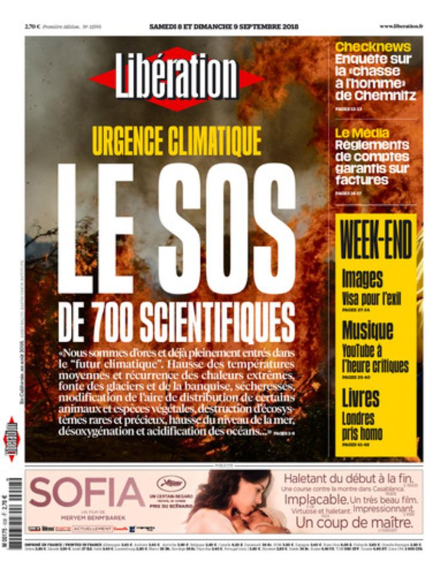

In dieser Woche sind in Frankreich zwei Appelle zu einer radikalen klimapolitischen Wende erschienen, einer in der Zeitung Le Monde ([« The greatest challenge in the history of humanity » : a call to save the earth by 200 personalities](https://www.lemonde.fr/idees/article/2018/09/03/the-greatest-challenge-in-the-history-of-humanity-a-call-to-save-the-earth-by-200-personalities_5349631_3232.html)), der andere in der Libération ([Réchauffement climatique: «Nous en appelons aux décideurs politiques»](http://www.liberation.fr/planete/2018/09/07/rechauffement-climatique-nous-en-appelons-aux-decideurs-politiques_1677176)). \[caption id="attachment\_6768" align="alignleft" width="750"\] Titelseite der Libération vom 8.9.2018\[/caption\]Beide fordern dazu auf, die Zerstörung der Lebensgrundlagen, die Vernichtung von Biotopen und die Reduzierung der Biodiversität umgehend zu beenden. Den ersten haben 200 Prominente, darunter Schauspieler und Gelehrte, unterzeichnet, den anderen 700 Wissenschaftlerinnen und Wissenschaftler. Ein Anlass für beide ist sicher der Rücktritt des französischen _Ministers für den ökologischen Wandel_. Nicolas Hulot, die Nummer 3 in der Hierarchie der französischen Regierung, [hat auf sein Amt verzichtet](http://www.liberation.fr/direct/element/je-prends-la-decision-de-quitter-le-gouvernement-annonce-nicolas-hulot_86491/), weil er beim Präsident und in der Exekutive die Entschlossenheit vermisst, die Wirtschaft konsequent auf Kohlendioxid-Freiheit und Schonung der natürlichen Ressourcen umzustellen.

Ich frage mich immer mehr, welche Folgen die katastrophale ökologische Situation für Content-Strategie und Content Marketing haben muss, also für das, was ich unterrichte. Ich habe den [Studiengang](https://www.fh-joanneum.at/cos), an dem ich arbeite und den ich mit ins Leben gerufen habe, immer als wirtschaftsnah verstanden. Ich bin davon ausgegangen, dass qualitätsvolle, nutzerfreundliche Inhalte Unternehmen ökonomisch nutzen. Ich habe noch vor relativ kurzer Zeit nicht in Frage gestellt, dass dieser wirtschaftliche Nutzen auch menschlich und sozial sinnvoll ist. Inzwischen bin ich überzeugt, dass wir ethisch verpflichtet sind, an der ökologischen Transformation der Wirtschaft und der Gesellschaft mitzuarbeiten. Das bedeutet aber, dass man das ökonomistische Effizienzdenken, den Primat von Wachstum und finanziellem Gewinn bei der Bewertung jeder Art von Aktivität, in Frage stellen muss. Eine ressourcenschonende Wirtschaft kommt nicht dadurch zustande, dass man in allem weiterhin versucht, den Return of Investment so groß wie möglich zu halten, denn dieses Prinzip der fortlaufenden Steigerung und Optimierung führt mehr oder weniger automatisch dazu, dass mehr Ressourcen verbraucht werden und soziale und biologische Diversität reduziert wird. Wenn man tatsächlich eine ökologische Wende will, dann muss man die (Betriebs-)Wirtschaftlichkeit als Steuerungsfaktor konsequent anderen Aspekten unterordnen oder sie anders, im Sinne der [buddhistischen Ökonomie Schumachers](https://wittenbrink.net/lostandfound/social-media-und-buddhistische-okonomie/) verstehen.

Das bedeutet konkret, dass man es nur sehr eingeschränkt als eine Qualität von Inhalten ansehen kann, wenn sie für die Unternehmen, die sie publizieren, den Gewinn erhöhen. Relevant ist stattdessen in erster Linie, ob die Inhalte dazu beitragen, dass keine natürlichen und menschlichen Ressourcen, die sich nicht regenerieren können, verbraucht werden. Man könnte auch sagen, dass eine andere wirtschaftliche Bewertung von Inhalten nötig ist—nicht in Hinsicht auf Profite sondern in Hinsicht auf ökologische Wirtschaftlichkeit der Services und Aktivitäten, zu denen sie gehören.

Ich sehe die Gefahr, dass eine solche Orientierung von konkreten Aktivitäten an einem allgemeinen und ethischen Ziel zu einer Ideologie wird. Andererseits denke ich, dass die bildhafte und emotionale (_ideologische_) Komponente einer umfassenden ökologischen Orientierung erhellend sein kann, wenn sie unsere Fähigkeit zur Kritik linearer, quantitativ verstandener Fortschrittsmodelle fördert. Das Gebiet der digitalen Kommunikation ist sehr stark von einer technischen Fortschrittsideologie geprägt. Wir orientieren uns an ihr ebenso sehr wie am Prinzip des Return of Investment. Viele, ich selbst ganz sicher, sind implizit davon ausgegangen, dass zur digitalen Wirtschaft so etwas wie eine geradlinige Steigerung und Verbesserung gehört. Die Hardware wird immer besser, Software hat immer mehr Möglichkeiten, und die Fähigkeiten, Software zu produzieren werden immer größer. Gleichzeitig entstehen immer mehr Unternehmen, die diese Entwicklung vorantreiben, so dass man insgesamt nicht nur von permanenter Innovation sondern auch von einem immer rasanterem Fortschritt sprechen kann. Die ökologische Katastrophe, die erkennbar macht, dass quantitativer wirtschaftlicher Fortschritt tatsächlich in den Untergang führt, kann dazu führen, dieses lineare Fortschrittsdenken auch in Bezug auf digitale Technologien in Frage zu stellen. Im Grunde hat sich im Netz schon in den letzten zehn Jahren gezeigt, dass das, was neuer und effizienter ist, nicht zwangsläufig qualitativ besser ist. Die Social Media-Realität heute ist, wenn man von den Zielen ausgeht, die man mit sozialen Medien erreichen wollte, nicht besser als die kurz nach der Jahrtausendwende.

Mir geht immer öfter die Waffenentwicklung als Analogie durch den Kopf. Die quantitative Steigerung der Zerstörungskraft von Waffen ist auf ihre Weise auch ein linearer Fortschritt, aber sie ist ein Rückschritt in Bezug auf die Möglichkeiten menschlicher Kontrolle und menschlichen Zusammenlebens.

Ich bin kein Anhänger einer Öko-Ideologie, die wie ein verdrehter Marxismus jede einzelne Frage auf ein übergreifendes Problem, einen _Grundwiderspruch_, zurückbezieht. Ich glaube aber, dass ein Denken in kleineren oder verschiedenen Maßstäben und vor allem eine Ausrichtung am Prinzip der [Diversität](https://wittenbrink.net/lostandfound/eine-entdeckung-philippe-descolas-buch-la-composition-des-mondes/) inhaltliche Brücken zwischen Ökologie und sozialen Technologien schlagen kann.
