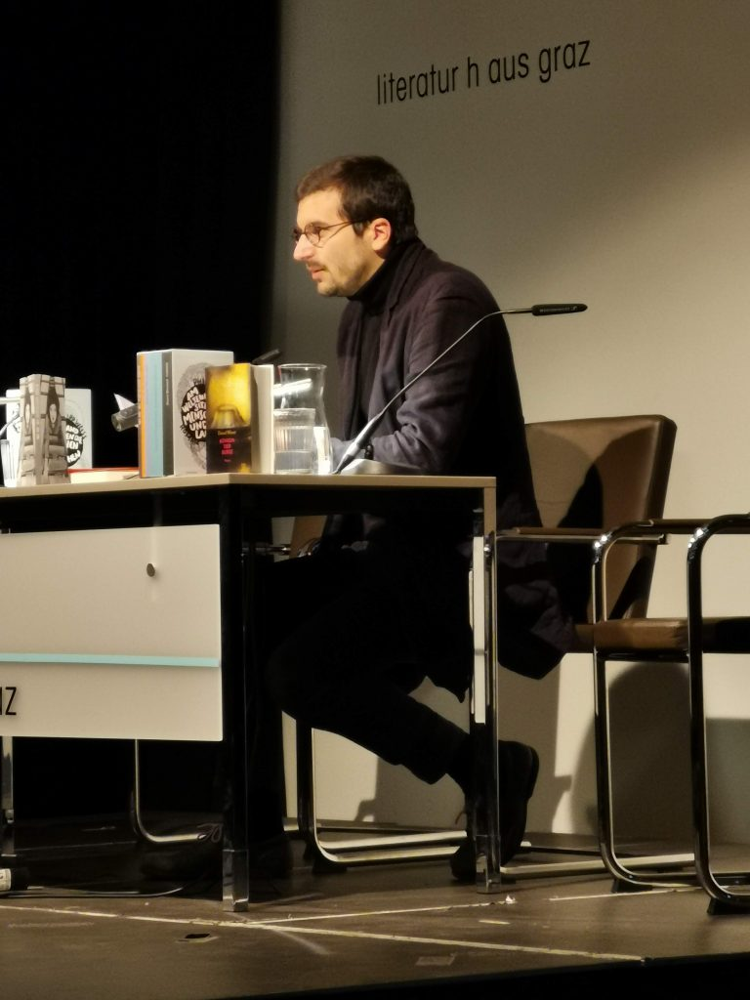
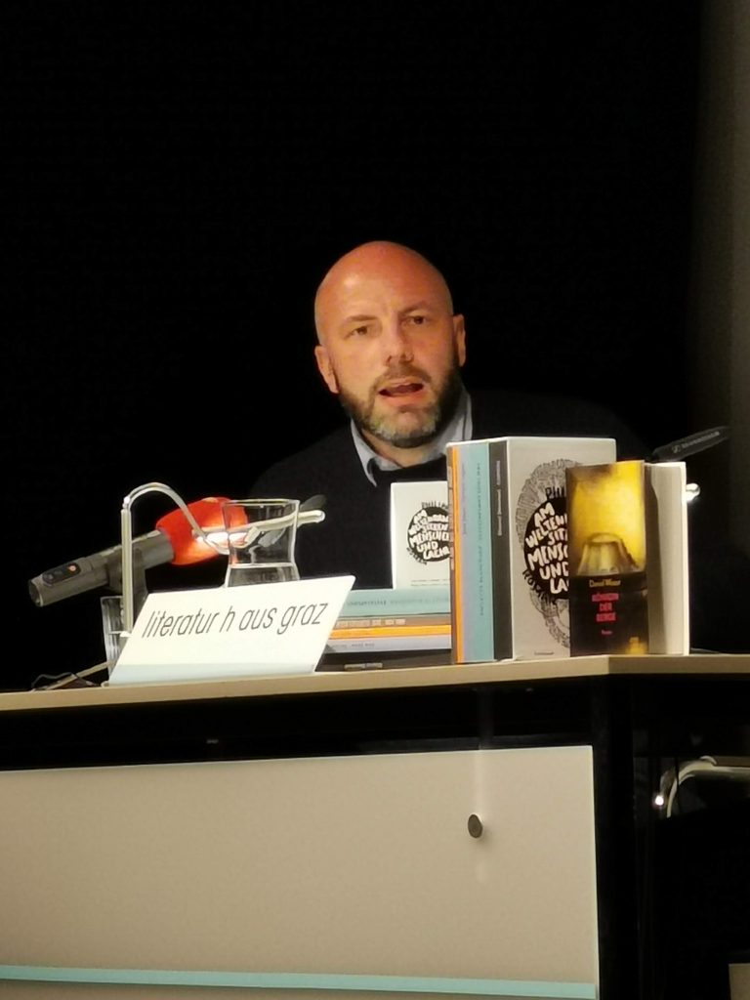
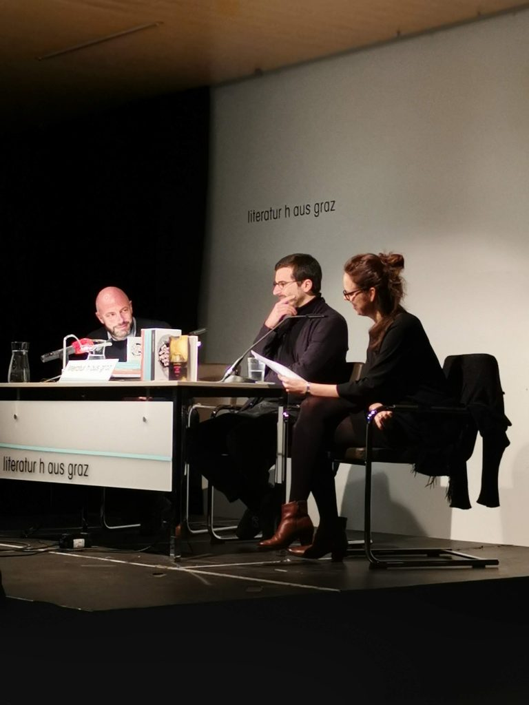

- 
    
    Philipp Weiss im Literaturhaus Graz, 8.1.2019 (Foto: A. Georgi)
    
- 
    
    _Daniel Wisser im Literaturhaus Graz, 8.1.2019 (Foto: A. Georgi)_
    
- 
    
    _Daniel Wisser und Philipp Weiss im Gepräch mit Zita Bereuter, 8.1.2019 (Foto: A. Georgi)_
    

Am Dienstag waren Ana und ich im Literaturhaus bei einer [Lesung von Daniel Wisser und Philipp Weiss](http://www.literaturhaus-graz.at/veranstaltung/neue-buecher-von-philipp-weiss-und-daniel-wisser/ "Neue Bücher von Philipp Weiss und Daniel Wisser"), moderiert von [Zita Bereuter](https://fm4v3.orf.at/zita/index.html "Zita Bereuter bei fm4"). Die Bücher, die [Weiss](http://www.philippweiss.at/index.html "Website des Autors") und [Wisser](https://www.danielwisser.net/ "Website von Daniel Wisser") vorgestellt haben—[Am Weltenrand sitzen die Menschen und lachen](https://www.suhrkamp.de/buecher/am_weltenrand_sitzen_die_menschen_und_lachen-philipp_weiss_42817.html "Seite des Verlags zum Buch") und [Die Königin der Berge](http://jungundjung.at/content.php?id=2&b_id=272 "Verlagsseite zum Buch")— sind sehr unterschiedlich. Jedes von ihnen hätte einen eigenen Abend verdient. (Ich werde hier Wissers Erzählung über einen MS-Patienten nicht gerecht—das liegt an meinen Interessen, nicht an der Qualität seines Texts. Eine gute Rezension gibt es im [Falter](https://www.falter.at/falter/rezensionen/buch/752/9783990272244/konigin-der-berge "'Königin der Berge' von Daniel Wisser - FALTER Buch-Rezension - falter.at").)

Mich hat vor allem Philipp Weiss interessiert, über dessen fünfbändigen Roman ich schon mehrfach gehört hatte, dass er eines der wichtigsten österreichischen Werke der letzten Jahre darstellt. Weiss hat im Literaturhaus, wie er selbst sagte, ein Medley aus einzelnen Abschnitten der fünf Bände vorgetragen, wobei er zwischen den Büchern hin und her wechselte. Mich hat die sprachliche Präzision und Artifizialität ebenso fasziniert wie die Thematik. Weiss selbst verwendete den Ausdruck _Anthropozän_. Sein Werk experimentiert mit den Sprach- und Lebensmöglichkeiten in der Situation, die Bruno Latour als [Konfrontation mit Gaia](http://www.bruno-latour.fr/node/731 "Kampf Um Gaia – Acht Vorträge über Neue Klimaregime | bruno-latour.fr") beschreibt. Er hat am Dienstag routiniert und vielleicht etwas zu glatt gelesen und interpretiert, es den Zuhörern und Lesen leicht gemacht, während die Texte selbst ihre eigene Konstruiertheit vorführen, ihre _techne_, und damit intransparent sind, nicht einfach auf eine Botschaft durchsichtig werden.

Mich interessiert das Verhältnis dieses Werks zur avangardistischen Tradition. Ich habe in den letzten Wochen (angeregt durch die [Georgescu-Roegen-Lektüre](digitale-decroissance-statt-digitalisierung/ "Digitale Décroissance statt Digitalisierung – Lost and Found")) oft darüber nachgedacht, welche Verbindungen es zwischen den Avantgarden des 20. Jahrhunderts, der Industrialisierung und der enormen Intensivierung der Verwendung von Energie gibt. In einem Text wie dem ersten _Futuristischen Manifest_ ([pdf](http://www.nanoaesthetik.de/texte/marinetti.pdf "PDF der deutschen Übersetzung des ersten futuristischen Manifests")) steht die Steigerung des Energieverbrauchs, durch die Tempo und Beschleunigung möglich werden, in einer engen Beziehung zur Fortschrittsorientierung in der Kunst.

Ich vermute, dass Weiss in seinem Werk diese Tradition aufgreift, aber nicht mit einem avantgardistischen Anspruch. Sein Roman ist eher umgekehrt am Ende des industriellen Fortschritts angesiedelt. Das Japan nach Fukushima spielt eine wichtige Rolle. Weiss hat in der Einleitung seiner Lesung darüber gesprochen, dass Japan die westlichen Fortschritts- und Industrialisierungskonzepte extrem schnell adaptiert hat, mit dem Anspruch, sie zu übertreffen. Japan dient in dem Roman wohl zugleich als Metapher für den industriellen Fortschritt wie für sein Gegenteil. Ich habe den Roman während der Lesung nicht als Gegenerzählung zur Fortschrittserzählung verstanden, sondern als Dekonstruktionsversuch in unterschiedlichen Gattungen, von der Lexikonparodie bis zum Manga. Er könnte zu einer negativen Avantgarde gehören, einen Versuch bilden, aus der Intensivierung der Eneregieerzeugung und des Energieverbrauchs der Moderne herauszukommen und ein _Außen_ vorstellbar zu machen. Ich habe mir die Kassette mit den fünf Bänden aber Ende des Abends gekauft.
