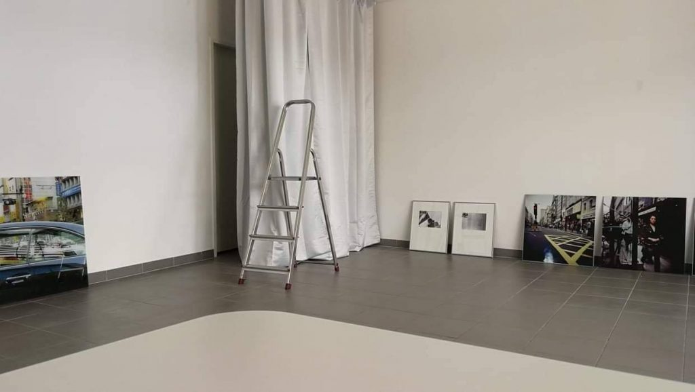

Off\_gallery, Griesgasse 31, Foto: Erika Petrić

Wir haben heute die erste Veranstaltung in der [Off\_gallery](https://www.facebook.com/offgallerygraz/ "Off_gallery graz - Startseite") in der Griesgasse. Wir sind Gastgeber für [Kinga Tóth](https://www.facebook.com/events/2528774083817110/ "Veranstaltungseinladung bei Facebook"). Mit unserem eigenem Programm starten wir im Mai.

Ich mache bei diesem Projekt mit, weil ich etwas lernen möchte. Meine beiden Partnerinnen [Erika Petrić](https://erikapetric.com/ "| architecture . photography . research") und [Anastasija Georgi](http://anastasijageorgi.com/ "- Anastasija Georgi") beschäftigen sich professionell mit Architektur und Photographie. Wir wollen Architekturfotografie im weitesten Sinn ausstellen, Arbeiten, die sich mit der Erforschung von Räumen und räumlichen Situationen beschäftigen.

Was interessiert mich an diesem Projekt? Für mich gibt es zwei Ausgangspunkte: Die [Lewis Baltz-Ausstellung in der Albertina](https://www.albertina.at/ausstellungen/lewis-baltz/ "Lewis Baltz « Albertina Wien") vor ein paar Jahren, und die Idee des _Terrestrischen_, auf die ich in Bruno Latours [Terrestrischem Manifest](https://www.suhrkamp.de/buecher/das_terrestrische_manifest-bruno_latour_7362.html "Das terrestrische Manifest von Bruno Latour - Suhrkamp Insel Bücher Buchdetail") gefunden habe.

Von der Baltz-Ausstellung sind mir am intensivsten die Serien zu kalifornischen Vorstädten im Gedächtnis geblieben: Präzise Fotografien von sich endlos identisch wiederholenden weißen Eigenheimen. Behalten habe ich auch den Audruck _New Topographers_, das Konzept der Erfassung von Orten, dessen was jetzt so ist. Vor ein paar Jahren habe ich hier in Graz zum ersten Mal [Bilder von Zita Oberwalder gesehen](https://wittenbrink.net/lostandfound/nichtretinale-fotografie-zita-oberwalder-im-kuenstlerhaus/ "Nichtretinale Fotografie: Zita Oberwalder im Künstlerhaus – Lost and Found"). Auch bei ihr hat mich fasziniert, wie sie Orte abbildet, wobei die Orte auf etwas verweisen, das sich gerade nicht abbilden lässt, das sich nicht von einem Projekt der oder des Fotografierenden trennen lassen.

Die Fotografien von Lewis Baltz, vielleicht auch von Zita Oberwalder, sind Gesellschaftsbilder, auch wenn man keine Menschen auf ihnen sieht. Sie zeigen Objekte, die zur Gesellschaft gehören, mit denen Gesellschaft stattfindet. Die Gesellschaft ist nicht einfach da, sie wird oder sie wurde gemacht. Das, was die Bilder zeigen, ist von ihr übergeblieben, ist vergangen oder auch zukünftig, weil darin und damit Gesellschaft stattfinden wird.

_Terrestrisch_, so verstehe ich den Begriff von Latour, ist eine Orientierung an Orten und Netzwerken, eine Vergesellschaftung, zu der nicht nur Menschen, sondern auch Objekte gehören, die Konstruktion von sozialen Beziehungen (die Beziehungen sind das Soziale), für die der Unterschied zwischen menschlichen und nichtmenschlichen Akteuren von untergeordneter Bedeutung ist. Im Terrestrischen sieht Latour eine Möglichkeit zu landen (_atterrir_), ohne auf ein Zurück zur fingierten Welt der geschlossenen lokalen Einheiten (Nationalstaaten, Gemeinschaften) hoffen oder noch auf den linearen Fortschritt hin zu einer globalen Moderne zu vertrauen. Latour ruft dazu auf, die Verbindungen und Netzwerke zu pflegen und zu entwickeln, von denen das Leben an einem Platz abhängt, unabhängig von den hergebrachten Regionen oder Nationen. Die Orte werden durch die Verbindungen mit anderen Orten definiert, nicht durch übergreifende Einheiten.

Von unserem Projekt, der off\_gallery, erhoffe ich mir, mich mit Orten aus dieser Perspektive des Terrestrischen beschäftigen zu können, etwas darüber zu erfahren, wie sie erfahren, hergestellt und —vorübergehend—gesehen werden können.
