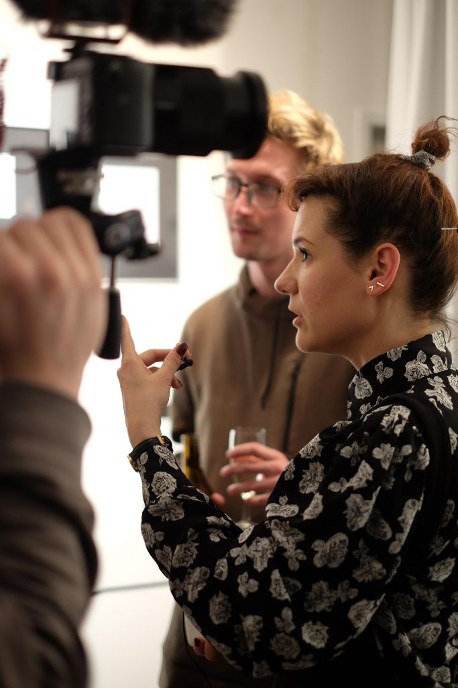

Gestern erste Ausstellungseröffnung in der Off\_gallery. Wir werden sie auf der [Website](https://offgallery.at/) dokumentieren, die jetzt auch online ist (aber noch nicht eröffnet, so wie der Raum in der Griesgasse vor dem Start gestern). Wir stellen für die erste Ausstellung vor allem den Ort zur Verfügung, gemacht haben sie [Kinga Tóth](http://tothkinga.blogspot.com/) selbst und die [Kulturvermittlung Steiermark](http://www.kulturvermittlung.org).

Kinga Tóth in der Off\_gallery Graz, 20.3.2019. Bild: Anstasija Georgi

Kinga Tóth hat den Abend auf mehreren Ebenenen und vielstimmig gestaltet, durch ihre Performance am Beginn, durch die ausgestellten Objekte—die zugleich Texte und Bilder sind—und diskursiv im Gespräch. Die Vielkanaligkeit (oder das Zurücklassen der Kanäle) und der Performance-Charakter—die Einmaligkeit der Aufführung oder Aktion—sind für ihre Art, Kunst zu machen, charakteristisch. Sie schreibt, gestaltet Sprache und gestaltet mit Sprache, und sie benutzt dabei alle medialen Dimensionen der Sprache und ein Kontinuum von der Geste und dem Laut bis zur fixierten Codierung und metasprachlichen Reflexion. Sie agiert vom spontanen Spielen mit gerade vorhandenen Objekten (z.B. der Leiter, die im Ausstellungsraum stand) bis zur politischen Aktion und Proklamation. (Zum ersten Mal gesehen habe ich Kinga Tóth bei der [60-Jahr-Feier des Forums Stadtpark](http://forumstadtpark.at/index.php?idcatside=1315&kat=diskurs), bei der sie die Situation in Österreich und in Ungarn aufeinander bezogen und präzise formuliert hat, worum es an diesem Abend ging.) Sie arbeitet auf allen Ebenen dialogisch, von der Improvisation (es waren einige Musiker da, mit denen sie zusammenarbeitet) bis zur Diskussion mit dem Publikum. Am ungewohntesten und faszinierendsten ist für mich das performative improvisierte oder situative Arbeiten mit der Sprache als Körper (sie spricht von _living text bodies_). Ich habe es bei ihren Vorgängern und Vorgängerinnen von den Dadaisten bis zur musique concrète nie so wahrgenommen, vielleicht weil bei Kinga Tóth die Performance-Tradition der Avantgarde mit der des Punk zusammenkommt.

Später am Abend hat Kinga Tóth Artificial Intelligence und die Sprache im Netz erwähnt. Ich finde es interessant zu überlegen, welche Beziehungen es zwischen ihrer Art eines entgrenzenden Umgangs der Sprache und den Hypertext-Konzepten z.B. von [Teodora Petkova](http://www.teodorapetkova.com/) gibt, die mit Begriffen von Bahtin und Julia Kristeva beschreibt, was im Semantic Web stattfindet. Vielleicht kommen wir dazu bei dem Künstlergespräch, das für den nächsten Donnerstag geplant ist.
