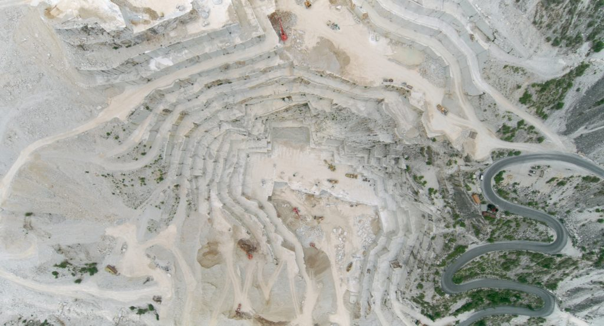
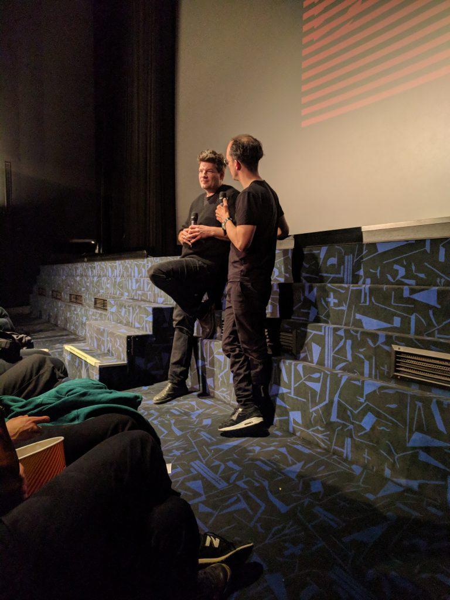

Im [KIZ RoyalKino](https://www.film.at/kino/kiz-royalkino "KIZ RoyalKino | film.at") haben wir uns gestern die [Diagonale](http://www.diagonale.at/ "Diagonale – Festival des österreichischen Films | 19.–24. März 2019")\-Vorführung von Nikolaus Geyrhalters [ERDE](http://erde-film.at/deutsch "ERDE / deutsch") angesehen. Die Vorstellung war vollbesetzt. Wir haben mit Mühe zwei Plätze in der ersten Reihe bekommen.

https://youtu.be/1RQ3yFmDz-E

ERDE ist ein Film über das Anthropozän, die Epoche, in der die menschlichen Einwirkungen auf den Planeten geologische Dimensionen erreichen. In sieben Episoden zeigt Geyrhalter, wie mit Technik Erde im größtmöglichen Ausmaß bewegt wird. Luft- und—animierte—Satellitenaufnahmen der Gebiete, lange Totalen mit Baggern und Fahrzeugen in den gigantischen Abbau- und Bauzonen, und Interviews mit Menschen, die dort arbeiten, geben dem Film seinen Rhythmus. _ERDE_ dauert zwei Stunden, die meisten Einstellungen sind ruhig, einige Aussagen der Protagonisten wiederholen sich: Baggerfahrer, Bergleute, Ingenieure und Wissenschaftler reflektieren über die Zerstörung der Erde und über die Lust, die es erregt, in sie einzudringen. Nur in der letzten Episode, die ein kanadisches Ölsand-Abbaugebiet in Alberta darstellt, sprechen Opfer der Erdbewegungen: Indigene, deren Lebensgrundlagen vernichtet wurden. Den Ölsand-Abbau selbst durfte Geyrhalter nicht filmen.

Marmorbruch bei Carrara. Still aus "Die Erde". © Nikolaus Geyrhalter Filmproduktion GmbH

Die Haltung des Films erinnert mich an einen [buddhistischen Wunsch](https://tricycle.org/magazine/cultivating-compassion/ "Thich Nhat Hanh Lovingkindness Instructions: Tricycle"):

> May I be free from attachment and aversion, but not be indifferent.

Als Zuschauer ist man fasziniert und abgeschreckt, aber man verliert nicht die Distanz zum Gezeigten. Der Film dokumentiert, was ist. Er schreibt keine Interpretation vor, aber er ist nicht kalt. Er konfrontiert mit etwas, das normalerweise verborgen, aber nah und unheimlich ist—die Apparatur des monumentalen Films funktioniert ähnlich wie die riesigen langsamen Bagger, die in die Erde eindringen und Dinge an die Oberfläche bringen, die noch nie jemand gesehen hat.

Nikolaus Geyrhalter nach der Vorstellung gestern im KIZ Royal

In dem Gespräch nach dem Film hat Geyrhalter gesagt, dass er einen Film machen wollte, der noch in 100 Jahren angesehen werden kann. Er zeigt, was er zeigt, _sub specie aeternitatis_. In einem ausführlichen Interview beschreibt Geyrhalter seine Absichten und Erfahrungen beim Machen des Films: [«Die Erdkruste als Haut ist das filigranste Organ.»](http://www.austrianfilms.com/Interview/nikolaus_geyrhalter/erde_DE). ERDE ist ein Film über [Gaia](/wo-lande-ich-zu-einem-vortrag-von-bruno-latour/ "Wo lande ich?—Zu einem Vortrag von Bruno Latour – Lost and Found") im Sinne Lovelocks und Latours, über die _kritische Zone_, in der das Leben möglich wird.

Mich interessiert, was diesen Film von den Fotografien der [New Topographics](https://en.wikipedia.org/wiki/New_Topographics "New Topographics - Wikipedia")\-Bewegung unterscheidet und was ihn mit ihr verbindet. Vielleicht hängt der besonderen Zugang des Films weniger von der Action und vom zeitlichen Rhythmus ab als von den Worten und Stimmen der Protagonisten: Er ist nicht stumm. Er zeigt menschliche Akteure, die das strukturieren, was passiert, auch wenn es gigantisch, monumental ist. Dadurch verstört er weniger als die Aufnahmen von Leuten wie [Baltz](https://www.icp.org/browse/archive/constituents/lewis-baltz?all/all/all/all/0 "Lewis Baltz | International Center of Photography"). Auch das Zeigen selbst, der dramaturgische Ablauf, ist fasslicher, auf eine Aufführungssituation bezogen. Wenn man über eine ökologische Ästhetik nachdenkt, ist der Geyrhalters Film ein guter Ausgangspunkt
