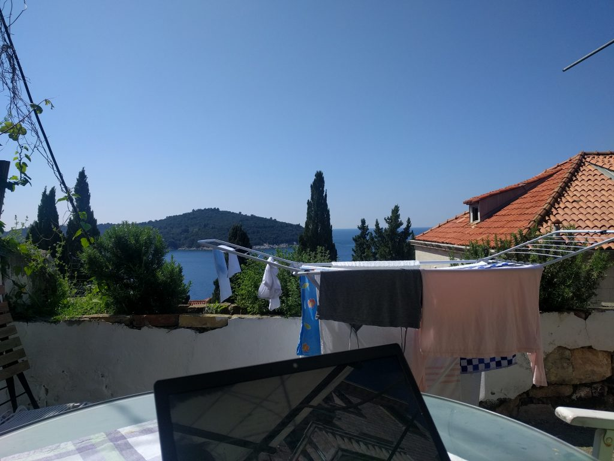

Dubrovnik, Karwoche 2019

Wir sind am Sonntag von Graz nach Dubrovnik gefahren und werden hier bis Ostern bleiben. Ich kenne die Strecke inzwischen gut: von der milden Landschaft Sloweniens über die menschenleere Ebene hinter dem Velebit, den grauen Karst zwischen Zadar und Split bis zu der feuchteren, weniger strengen und vielfältigen Insel- und Küstenregion zwischen dem Neretva-Delta und Dubrovnik. Seit ich zum ersten Mal hier in Süddalmatien war, möchte ich hier leben. Als ich [Ana](http://anastasijageorgi.com/ "- Anastasija Georgi") kennengelernt habe, habe ich zuerst versucht so wenig wie möglich daran zu denken, dass sie aus Dubrovnik kommt. Ich wollte nicht, dass meine Sympathie für diese Gegend unsere Beziehung beeinflusst. Später habe ich dann gemerkt, dass bei Menschen, die hier großgeworden sind, der Wunsch, der Enge dieser kleinen Stadt zu entkommen, größer sein kann als die Begeisterung für die mediterrane Landschaft.

Latour schreibt in [Où atterrir](http://www.bruno-latour.fr/node/761 "Das terrestrische Manifest | bruno-latour.fr") über die _terrains de vie_, die _Lebensterritorien_:

> Pour cela, il faut accepter de définir les terrains de vie comme ce dont un terrestre dépend pour sa survie et en se demandant quels sont les autres terrestres qui se trouvent dans sa dépendance. Il est peu probable que ce territoire recoupe une unité spatiale classique, juridique, administrative ou géographique. Au contraire, les configurations vont traverser toutes les échelles d’espace et de temps. (Um dies zu tun, müssen wir akzeptieren, Lebensterritorien als das zu definieren, wovon ein Erdbewohner für sein Überleben abhängt, und uns dabei fragen, welches die anderen Erdbewohner in seiner Abhängigkeit sind. Es ist unwahrscheinlich, dass sich dieses Gebiet mit einer traditionellen räumlichen, rechtlichen, administrativen oder geografischen Einheit überschneiden wird. Im Gegenteil, die Konfigurationen werden alle Skalen von Raum und Zeit durchdringen.)

Meine _terrains de vie_ gehören in dieses Gebiet zwischen Graz und Dubrovnik, das wir am Sonntag durchfahren haben. Wie Latour es sagt, ist es keine klassische administrative räumliche Einheit. Es ist mehr durch das Meer bestimmt als durch das Land dahinter, es besteht aus Randzonen verschiedener alter Monarchien und neuerer Blöcke, es ist sprachlich vielfältig und eher ein Netzwerk mit Knotenpunkten als ein Territorium. Ich habe mir dieses Gebiet nicht bewusst ausgesucht, sondern ich bin zufällig dorthin geraten, aber inzwischen reizen mich seine Uneindeutigkeit und Kleinteiligkeit, die Verbindungen von Archaischem und Unfertigem, die den Orten und auch den Landschaften hier einen anderen Charakter geben als ihn die selbstbewussteren westeuropäischen Regionen ausgebildet haben.

Latour sucht im Terrestrischen Manifest einen neuen politischen Akteur, einen, wie er es nennt, _dritten Attraktor_ jenseits von Globalisierung und Renationalisierung. Jetzt denke ich darüber nach, wie eine terrestrische oder Postwachstums-Politik in diesen _terrains de vie_ aussehen könnte, und darüber, was die Gegenden um Dubrovnik und Graz verbindet und was sie trennt. Wenn man versucht, diese Fragen konkret zu stellen, merkt man, wie schwierig es ist, sie zu beantworten—außer man fällt in die globalistische Perspektive einer gemeinsamen marktwirtschaftlichen Entwicklung oder die rückwärtsgewandte von geschlossenen Einheiten zurück.

Die Folgen der gierigen globalistischen Entwicklung der letzten 30 Jahre bekommt man in der Dubrovniker Altstadt wie in einer Satire vorgeführt: Sie ist zu einer Destination geworden, deren spektakuläre Lage und Natur billigst vermarktet wird, und die für die Menschen hier unbewohnbar geworden ist. Diese Entwicklung beschleunigt sich noch weiter. Im Augenblick hofft man vor allem auf chinesische Touristen und [China demonstriert sein Interesse an der Adriaregion immer deutlicher](https://www.dw.com/cda/de/161-gipfeltreffen-china-euphorie-in-dubrovnik/a-48313303 "16+1 Gipfeltreffen: China-Euphorie in Dubrovnik | Europa | DW | 13.04.2019"). Je öfter ich hier bin und je mehr ich über die wirtschaftliche Situation der Menschen hier erfahre, um so deutlicher wird mir, wie wenig Alternativen es für sie außerhalb der Tourismus-Industrie gibt. Wenn ich aus Graz hierhin komme, nehme ich als Konsument aus einem reichen europäischen Land an der Tourismus-Industrie teil. Für Menschen von hier, die nicht vom Tourismus leben können oder wollen, ist nach wie vor die Arbeitsmigration nach Norden oft die einzige Möglichkeit, wirtschaftlich zu überleben.

Graz und Dubrovnik haben heute wahrscheinlich weniger Verbinungen miteinander als früher. Zur internationalen Wirtschaft gehören die meisten Menschen in den beiden Städten in völlig verschiedenen Rollen. Diese unterschiedlichen Rollen entsprechen trotz dem Wohlstand einiger in Dubrovnik der gesamteuropäischen Teilung in Metropolen und marginalisierte Zonen.

Auf einer sehr abstrakten und allgemeinen Ebene kann ich mir vorstellen, was an die Stelle der wachsenden Wirtschaft hier in Dubrovnik und Graz treten müsste: Eine Orientierung an gemeinsamen Gütern (wie es die Initiative [Srđ je naš](http://www.srdjenas.com/srdj2/ "Srđ je naš") für den Berg oberhalb von Dubrovnik erzwungen hat) und eine Garantie dafür, z.B. durch ein Grundeinkommen, dass alle ohne aggressive Vermarktung überleben können. Eine Perspektive jenseits von _Entwicklung_, welche die natürliche und historische Diversität dieser Territorien ernst nimmt, statt z.B. Dubrovnik zu einer Art Selbstsimulation zu machen, [die die Kulissen aus _Game of Thrones_ fortsetzt](https://www.theguardian.com/tv-and-radio/gallery/2019/apr/10/dubrovnik-game-of-thrones-and-overtourism-in-pictures "Dubrovnik, Game of Thrones and overtourism – in pictures | Television & radio | The Guardian"). Konkrete Antworten auf meine Fragen habe ich nicht, und ich suche in meinen _terrains de vie_ Gelegenheiten, Lebenssituationen und soziale Perspektiven kennenzulernen, die sich von denen in einem reichen mitteleuropäischen Land viel mehr unterscheiden, als ich es mir lange vorstellen konnte.
