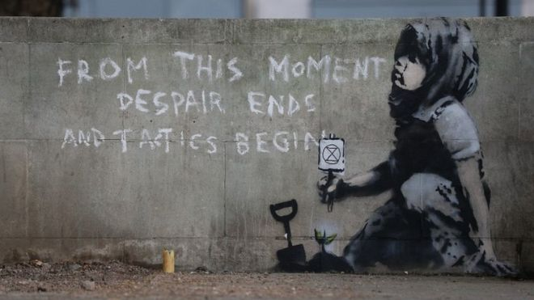

Street art mit dem Symbol von Extinction Rebellion, wahrscheinlich von Banksy

Die New York Times hat im März darüber berichtet, dass die Stadt Kopenhagen bis 2025 CO2-neutral werden will: [Copenhagen Wants to Show How Cities Can Fight Climate Change](https://www.nytimes.com/2019/03/25/climate/copenhagen-climate-change.html "Copenhagen Wants to Show How Cities Can Fight Climate Change - The New York Times"). In dem Artikel werden viele kritische Fragen formuliert—die ehrgeizige Zielsetzung könnte verdecken, dass wichtige Ursachen des CO2-Ausstoßes ignoriert werden. Der Ausgangspunkt für den Plan leuchtet aber ein: Das meiste CO2 wird in Städten produziert. Also müssen vor allem die Städte ihre Wirtschaft umstellen, wenn der CO2-Gehalt der Atmosphäre reduziert werden soll.

Lässt sich das Vorhaben auf Graz übertragen? Ist es möglich, Graz bis 2025 CO2-neutral zu machen?

Wenn man versucht, diese Frage zu beantworten, merkt man, wie radikal sich das Leben in einer Stadt wie Graz verändern muss, wenn sie ein Teil der Lösung statt ein Teil des Problems Klimawandel werden will. Was muss passieren, damit in Graz keine Treibhausgase mehr freigesetzt werden und damit die Grazer Wirtschaft auch nicht an anderen Stellen der Welt am Klimawandel mitwirkt?

## Wir würde ein klimaneutrales Graz aussehen?

Ohne Recherche vermute ich, dass die folgenden Veränderungen—und weitere—notwendig sind, um die Stadt klimaneutral zu machen:

- Autos mit Verbrennungsmotor müssen aus der Stadt verbannt werden.
- Beim Individualverkehr mit Elektoautos muss geprüft werden, ob damit tatsächlich CO2 eingespart wird.
- Wer nicht in Graz wohnt, aber für Grazer Betriebe arbeitet, wird dies von zu Hause aus online tun.
- Der Flughafen muss seinen Betrieb einstellen, solange Flugzeuge fossile Brennstoffe verbrauchen, also auf unabsehbare Zeit.
- Für den Energieverbrauch in den Wohnungen und für die Industrie darf nur nicht-fossile Energie verwendet werden.
- Wichtige Teile der Industrie müssen ihre Produktion (z.B. die Produktion von Fahrzeugen mit Benzin- und Dieselmotoren) großenteils einstellen oder umstellen.
- Die Bevölkerung muss ihre Lebensmittel fast ausschließlich aus der Nähe beziehen; auf industriell produziertes Fleisch, vor allem auf Rindfleisch, muss verzichtet werden.
- Neubauten sind nur noch möglich, wenn die Baustoffe und der Bauvorgang klimaneutral sind.
- Die Treibhausgase, die trotz aller dieser Maßnahmen noch frei werden, müssen durch Aufforstungen—im Stadtgebiet oder wenigstens von der Stadt initiiert—kompensiert werden.

Die Veränderungen die notwendig sind, um eine Stadt wie Graz klimaneutral zu machen, entsprechen in den Dimensionen den Veränderungen nach den beiden Weltkriegen. Das macht sie nicht unmöglich, sondern es zeigt, dass es nicht unrealistisch ist, solche Veränderungen zu fordern. Gerade dass die Veränderungen so groß sind, spricht dafür, sie jetzt zu fordern und zu versuchen, sie so schnell wie möglich durchzusetzen. Auf Zeitgewinn zu setzen, statt die Wirtschaft und die Lebensweise entschlossen zu verändern, vergrößert die Risiken und macht es viel schwerer, die Veränderungsprozesse zu beherrschen.

## Warum muss Graz allein etwas gegen den Klimawandel tun? Haben wir nicht viel länger Zeit?

Das Datum 2025 wirkt willkürlich. Ist es nicht schon schwierig, das [Pariser Klimaabkommen](https://ec.europa.eu/clima/policies/international/negotiations/paris_de "Pariser Übereinkommen | Klimapolitik") einzuhalten, also [in der EU den CO2-Ausstoß bis 2030 um 40% zu reduzieren und bis 2050 annähernd C02-neutral zu werden](https://ec.europa.eu/clima/citizens/eu_de "EU climate action | Klimapolitik")? Können wir nicht viel langsamer vorgehen? Ich würde antworten: Wir hätten mehr Zeit, wenn das Pariser Abkommen weltweit akzeptiert und vor allem umgesetzt würde (abgesehen von der Frage, ob es ausreicht, um die globale Erhitzung zu stoppen). Davon, dass dieses Abkommen eingehalten wird, sind wie aber noch weit entfernt. Deshalb muss man individuell und auf lokaler Ebene so konsequent wir möglich an einer Transformation der Wirtschaft arbeiten. Dafür sprechen einerseits (und vor allem) ethische Argumente: Solange wir mehr CO2 produzieren, als global verträglich ist, reduzieren wir die Lebensmöglichkeiten der Menschen, die jetzt in ärmeren Ländern leben und die Lebenschancen der Menschen in der Zukunft. Und dafür sprechen andererseits politische Argumente: Wenn nicht einige Regionen—und vor allem die, denen es am besten geht—mit der Umstellung beginnen, dann werden alle anderen passiv bleiben und sich—wie wir jetzt—darauf berufen, dass sie allein nichts tun können.

## Zu Schluss

Ich habe hier nur versucht, eine erste Überlegung zu formulieren—ohne Rücksicht darauf, welche Initiativen und Projekte zum Klimawandel es in Graz bereits gibt. Diese Überlegung ist ein allererstes Gedankenexperiment, um zu erkennen, welche Schritte jetzt sinnvoll sind. Ich lerne selbst daraus, dass man konkrete Maßnahmen gegen den Klimawandel (und die [weiteren Bedrohungen der Biosphäre](https://www.stockholmresilience.org/research/planetary-boundaries/planetary-boundaries/about-the-research/the-nine-planetary-boundaries.html "The nine planetary boundaries - Stockholm Resilience Centre")) zugespitzt auf lokale Bedingungen formulieren muss, um über einen Zustand hinauszukommen, in der alle nur bereit sind so viel zu tun, wie die anderen tun.
